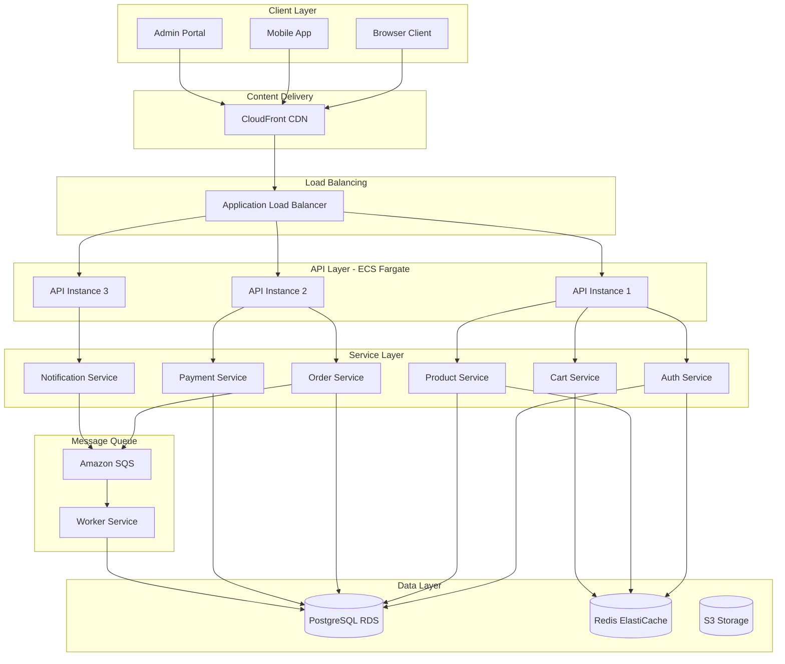

# ShopFlow E-commerce - System Architecture Overview

## Executive Summary

ShopFlow is a full-stack e-commerce platform built with React frontend and Node.js backend, designed for scalability, performance, and developer experience.

## High-Level Architecture

### ASCII System Diagram

```
┌─────────────────────────────────────────────────────────────────────────────────┐
│                              SHOPFLOW ARCHITECTURE                               │
└─────────────────────────────────────────────────────────────────────────────────┘

    ┌──────────┐     ┌──────────┐     ┌──────────┐
    │  Mobile  │     │  Browser │     │  Admin   │
    │   App    │     │  Client  │     │  Portal  │
    └────┬─────┘     └────┬─────┘     └────┬─────┘
         │                │                │
         └────────────────┼────────────────┘
                          │
                          ▼
              ┌───────────────────────┐
              │     CloudFront CDN    │
              │   (Static Assets)     │
              └───────────┬───────────┘
                          │
                          ▼
              ┌───────────────────────┐
              │   Application Load    │
              │      Balancer         │
              └───────────┬───────────┘
                          │
         ┌────────────────┼────────────────┐
         │                │                │
         ▼                ▼                ▼
    ┌─────────┐     ┌─────────┐     ┌─────────┐
    │ API Pod │     │ API Pod │     │ API Pod │
    │  (ECS)  │     │  (ECS)  │     │  (ECS)  │
    └────┬────┘     └────┬────┘     └────┬────┘
         │                │                │
         └────────────────┼────────────────┘
                          │
    ┌─────────────────────┼─────────────────────┐
    │                     │                     │
    ▼                     ▼                     ▼
┌─────────┐        ┌───────────┐        ┌───────────┐
│PostgreSQL│        │   Redis   │        │    SQS    │
│  (RDS)  │        │  Cache    │        │  Queue    │
└─────────┘        └───────────┘        └───────────┘
                                               │
                                               ▼
                                        ┌───────────┐
                                        │  Worker   │
                                        │  Service  │
                                        └───────────┘
```

### Mermaid Architecture Diagram



## Component Overview

### Frontend (React)
- **Framework**: React 18 with TypeScript
- **State Management**: React Query + Zustand
- **Styling**: Tailwind CSS + Headless UI
- **Build Tool**: Vite

### Backend (Node.js)
- **Framework**: Express.js with TypeScript
- **ORM**: Prisma
- **Authentication**: Passport.js + JWT
- **Validation**: Zod

### Database
- **Primary**: PostgreSQL 15 (RDS)
- **Cache**: Redis 7 (ElastiCache)
- **Search**: PostgreSQL Full-Text Search

### Infrastructure
- **Container**: Docker + ECS Fargate
- **CDN**: CloudFront
- **Storage**: S3
- **Queue**: SQS

## Data Flow

```
┌─────────┐    ┌─────────┐    ┌─────────┐    ┌─────────┐    ┌─────────┐
│ Request │───▶│   CDN   │───▶│   ALB   │───▶│   API   │───▶│ Service │
└─────────┘    └─────────┘    └─────────┘    └─────────┘    └────┬────┘
                                                                  │
    ┌─────────────────────────────────────────────────────────────┘
    │
    ▼
┌─────────┐    ┌─────────┐    ┌─────────┐
│  Cache  │◀──▶│   DB    │◀──▶│  Queue  │
└─────────┘    └─────────┘    └─────────┘
```

## Scalability Considerations

| Component | Scaling Strategy | Max Capacity |
|-----------|-----------------|--------------|
| API | Horizontal (ECS) | 20 instances |
| Database | Vertical + Read Replicas | 64 vCPU |
| Cache | Cluster Mode | 6 nodes |
| CDN | Global Edge | Unlimited |

## Security Layers

1. **Edge**: CloudFront WAF
2. **Network**: VPC + Security Groups
3. **Application**: JWT + Rate Limiting
4. **Data**: Encryption at rest + in transit
