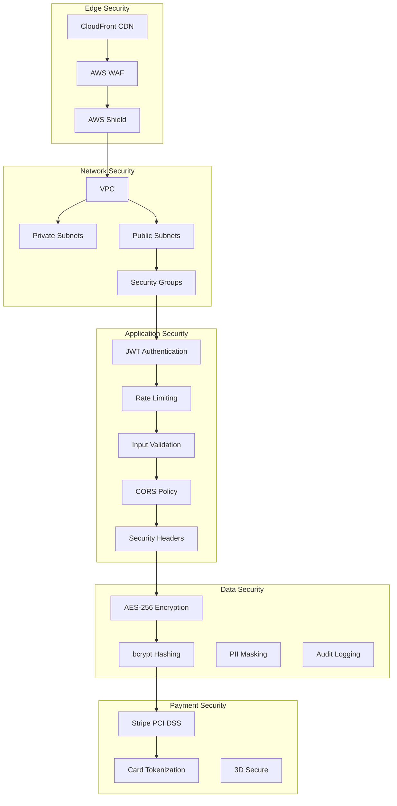
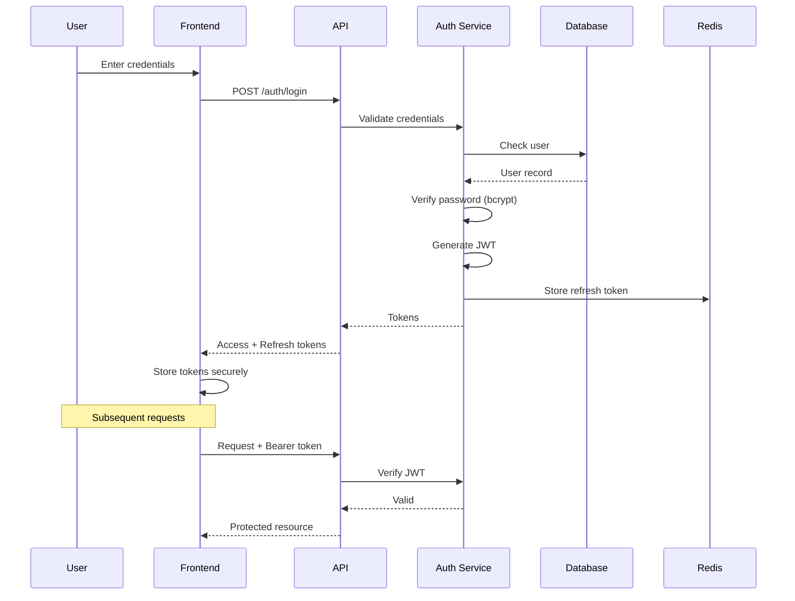
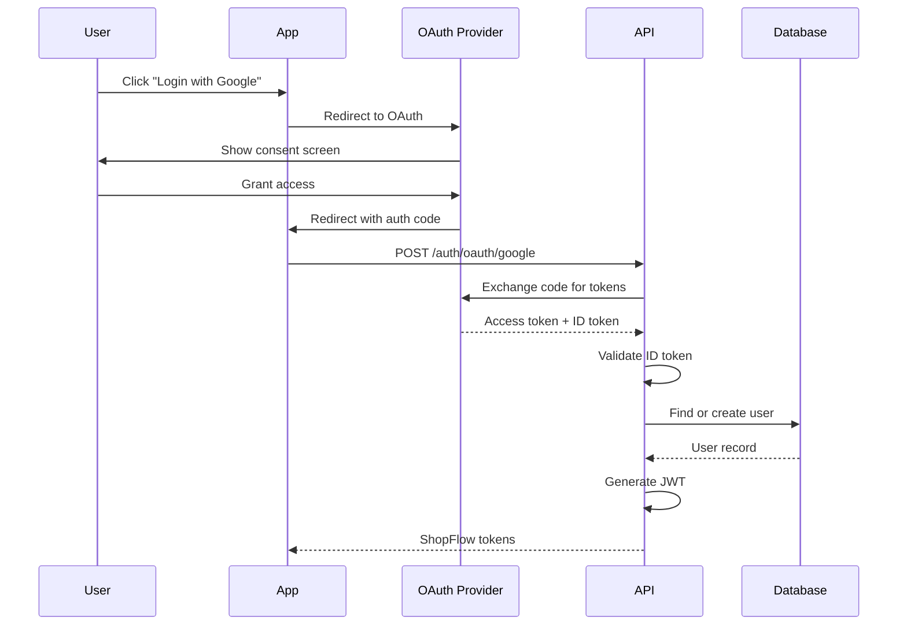
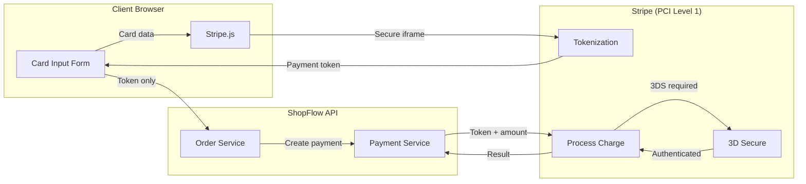
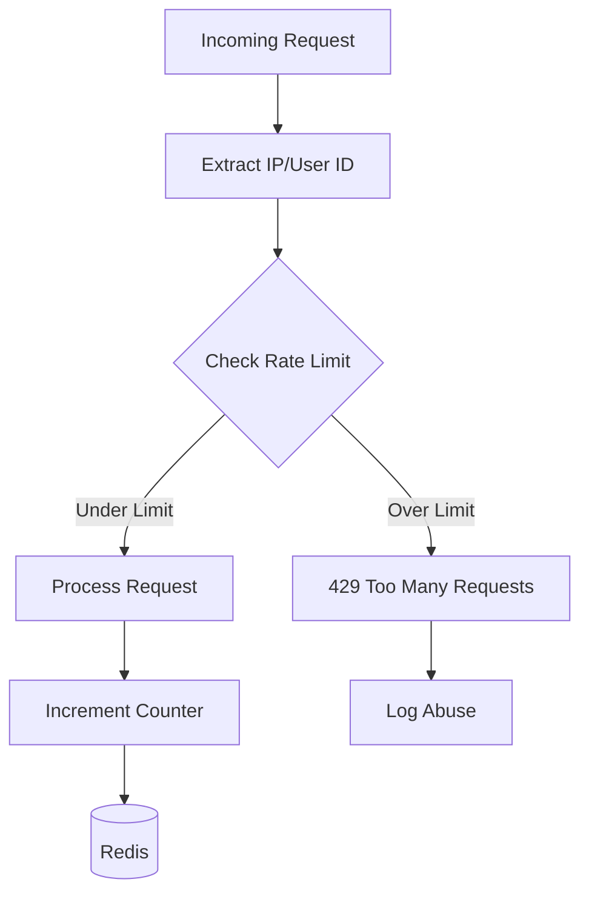
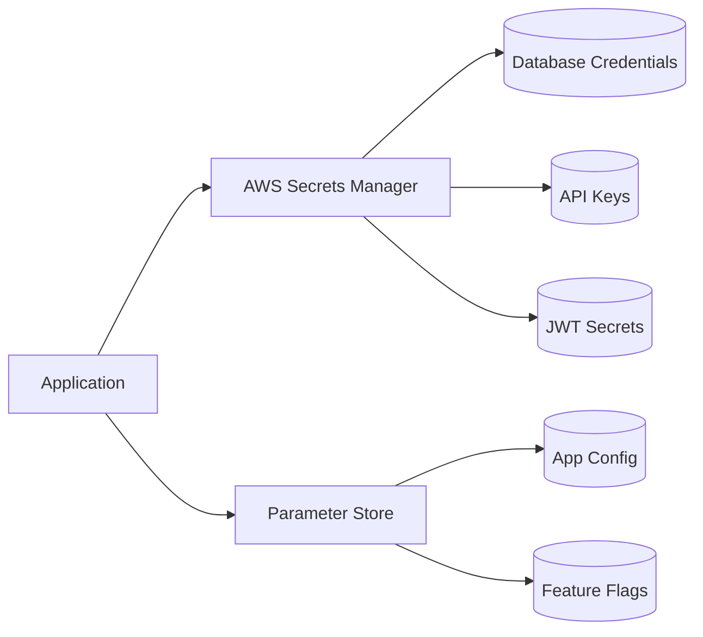

# ShopFlow Security Architecture

## Security Overview

ShopFlow implements defense-in-depth security across all layers of the application stack.

### ASCII Security Layers

```
┌─────────────────────────────────────────────────────────────────────────────┐
│                          SECURITY ARCHITECTURE                               │
└─────────────────────────────────────────────────────────────────────────────┘

┌─────────────────────────────────────────────────────────────────────────────┐
│  EDGE LAYER                                                                  │
│  ┌─────────────┐  ┌─────────────┐  ┌─────────────┐  ┌─────────────┐         │
│  │ CloudFront  │  │     WAF     │  │   Shield    │  │     ACM     │         │
│  │     CDN     │  │   Rules     │  │    DDoS     │  │    TLS      │         │
│  └─────────────┘  └─────────────┘  └─────────────┘  └─────────────┘         │
└─────────────────────────────────────────────────────────────────────────────┘
                                      │
                                      ▼
┌─────────────────────────────────────────────────────────────────────────────┐
│  NETWORK LAYER                                                               │
│  ┌─────────────┐  ┌─────────────┐  ┌─────────────┐  ┌─────────────┐         │
│  │     VPC     │  │   Security  │  │   Private   │  │    NAT      │         │
│  │   Isolation │  │   Groups    │  │   Subnets   │  │  Gateway    │         │
│  └─────────────┘  └─────────────┘  └─────────────┘  └─────────────┘         │
└─────────────────────────────────────────────────────────────────────────────┘
                                      │
                                      ▼
┌─────────────────────────────────────────────────────────────────────────────┐
│  APPLICATION LAYER                                                           │
│  ┌─────────────┐  ┌─────────────┐  ┌─────────────┐  ┌─────────────┐         │
│  │    JWT      │  │    Rate     │  │   Input     │  │    CORS     │         │
│  │    Auth     │  │  Limiting   │  │ Validation  │  │   Policy    │         │
│  └─────────────┘  └─────────────┘  └─────────────┘  └─────────────┘         │
└─────────────────────────────────────────────────────────────────────────────┘
                                      │
                                      ▼
┌─────────────────────────────────────────────────────────────────────────────┐
│  DATA LAYER                                                                  │
│  ┌─────────────┐  ┌─────────────┐  ┌─────────────┐  ┌─────────────┐         │
│  │ Encryption  │  │   Password  │  │    PII      │  │   Audit     │         │
│  │  at Rest    │  │   Hashing   │  │  Masking    │  │    Logs     │         │
│  └─────────────┘  └─────────────┘  └─────────────┘  └─────────────┘         │
└─────────────────────────────────────────────────────────────────────────────┘
```

### Mermaid Security Architecture



## Authentication Flow

### ASCII Auth Flow

```
┌──────────┐     ┌──────────┐     ┌──────────┐     ┌──────────┐
│  Client  │────▶│  Login   │────▶│ Validate │────▶│  Issue   │
│          │     │ Request  │     │  Creds   │     │   JWT    │
└──────────┘     └──────────┘     └──────────┘     └──────────┘
                                                         │
                                                         ▼
┌──────────┐     ┌──────────┐     ┌──────────┐     ┌──────────┐
│Protected │◀────│  Attach  │◀────│  Verify  │◀────│  Store   │
│   API    │     │  Bearer  │     │   JWT    │     │  Token   │
└──────────┘     └──────────┘     └──────────┘     └──────────┘
```

### Mermaid Auth Sequence



## OAuth2 Social Login



## Payment Security (PCI DSS)

### ASCII Payment Flow

```
┌─────────────────────────────────────────────────────────────────┐
│                      PCI DSS COMPLIANT FLOW                      │
└─────────────────────────────────────────────────────────────────┘

  Browser                 ShopFlow API              Stripe
     │                         │                      │
     │   Card Details          │                      │
     │ ───────────────────────────────────────────▶   │
     │   (Direct to Stripe)    │                      │
     │                         │                      │
     │   ◀─────────────────────────────────────────   │
     │   Payment Token         │                      │
     │                         │                      │
     │   Token + Order         │                      │
     │ ───────────────────────▶│                      │
     │                         │                      │
     │                         │   Create Charge      │
     │                         │─────────────────────▶│
     │                         │                      │
     │                         │◀─────────────────────│
     │                         │   Charge Result      │
     │                         │                      │
     │◀────────────────────────│                      │
     │   Order Confirmation    │                      │
```

### Mermaid Payment Security



## OWASP Top 10 Checklist

| Risk | Mitigation | Status |
|------|-----------|--------|
| A01:2021 Broken Access Control | Role-based access, JWT validation | Implemented |
| A02:2021 Cryptographic Failures | TLS 1.3, AES-256, bcrypt | Implemented |
| A03:2021 Injection | Prisma ORM, parameterized queries | Implemented |
| A04:2021 Insecure Design | Security architecture review | Implemented |
| A05:2021 Security Misconfiguration | Helmet.js, CSP headers | Implemented |
| A06:2021 Vulnerable Components | npm audit, Dependabot | Implemented |
| A07:2021 Auth Failures | JWT + refresh tokens, MFA | Implemented |
| A08:2021 Data Integrity | HMAC signatures, input validation | Implemented |
| A09:2021 Logging Failures | Structured logging, audit trails | Implemented |
| A10:2021 SSRF | URL validation, allowlist | Implemented |

## Security Headers

```typescript
// Helmet.js configuration
app.use(helmet({
  contentSecurityPolicy: {
    directives: {
      defaultSrc: ["'self'"],
      scriptSrc: ["'self'", "https://js.stripe.com"],
      styleSrc: ["'self'", "'unsafe-inline'"],
      imgSrc: ["'self'", "data:", "https:"],
      frameSrc: ["https://js.stripe.com", "https://hooks.stripe.com"],
      connectSrc: ["'self'", "https://api.stripe.com"],
    },
  },
  hsts: {
    maxAge: 31536000,
    includeSubDomains: true,
    preload: true,
  },
  referrerPolicy: { policy: "strict-origin-when-cross-origin" },
}));
```

## Rate Limiting



### Rate Limit Configuration

| Endpoint | Limit | Window | By |
|----------|-------|--------|-----|
| /auth/login | 5 | 15 min | IP |
| /auth/register | 3 | 1 hour | IP |
| /api/products | 100 | 1 min | User |
| /api/orders | 30 | 1 min | User |
| /api/payments | 10 | 1 min | User |

## Input Validation

```typescript
// Zod schema for order creation
const createOrderSchema = z.object({
  items: z.array(z.object({
    productId: z.string().uuid(),
    quantity: z.number().int().min(1).max(100),
  })).min(1).max(50),
  shippingAddressId: z.string().uuid(),
  billingAddressId: z.string().uuid(),
  paymentMethodId: z.string().min(1).max(255),
});

// XSS prevention
const sanitizeInput = (input: string): string => {
  return DOMPurify.sanitize(input, { ALLOWED_TAGS: [] });
};
```

## Audit Logging

```typescript
interface AuditLog {
  timestamp: Date;
  userId: string;
  action: string;
  resource: string;
  resourceId: string;
  ipAddress: string;
  userAgent: string;
  changes?: Record<string, { old: any; new: any }>;
  success: boolean;
}

// Example audit log
{
  "timestamp": "2024-01-15T10:30:00Z",
  "userId": "user_123",
  "action": "ORDER_CREATED",
  "resource": "orders",
  "resourceId": "order_456",
  "ipAddress": "192.168.1.1",
  "userAgent": "Mozilla/5.0...",
  "success": true
}
```

## Secrets Management



| Secret Type | Storage | Rotation |
|------------|---------|----------|
| Database credentials | Secrets Manager | 30 days |
| JWT signing key | Secrets Manager | 90 days |
| Stripe API keys | Secrets Manager | Manual |
| OAuth client secrets | Secrets Manager | Annual |
