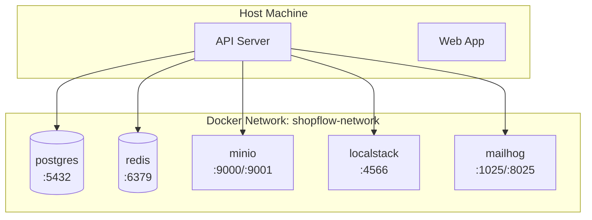

# ShopFlow Docker Configuration

## Overview

Docker configuration for local development and testing of the ShopFlow e-commerce platform.

---

## Service Architecture



---

## Docker Compose Configuration

```yaml
# docker-compose.yml
version: '3.8'

services:
  postgres:
    image: postgres:15-alpine
    container_name: shopflow-postgres
    environment:
      POSTGRES_USER: shopflow
      POSTGRES_PASSWORD: shopflow_dev
      POSTGRES_DB: shopflow_dev
    ports:
      - "5432:5432"
    volumes:
      - postgres_data:/var/lib/postgresql/data
      - ./docker/postgres/init.sql:/docker-entrypoint-initdb.d/init.sql
    healthcheck:
      test: ["CMD-SHELL", "pg_isready -U shopflow"]
      interval: 10s
      timeout: 5s
      retries: 5

  redis:
    image: redis:7-alpine
    container_name: shopflow-redis
    ports:
      - "6379:6379"
    volumes:
      - redis_data:/data
    command: redis-server --appendonly yes
    healthcheck:
      test: ["CMD", "redis-cli", "ping"]
      interval: 10s
      timeout: 5s
      retries: 5

  minio:
    image: minio/minio:latest
    container_name: shopflow-minio
    ports:
      - "9000:9000"
      - "9001:9001"
    environment:
      MINIO_ROOT_USER: minioadmin
      MINIO_ROOT_PASSWORD: minioadmin
    volumes:
      - minio_data:/data
    command: server /data --console-address ":9001"
    healthcheck:
      test: ["CMD", "curl", "-f", "http://localhost:9000/minio/health/live"]
      interval: 30s
      timeout: 20s
      retries: 3

  localstack:
    image: localstack/localstack:latest
    container_name: shopflow-localstack
    ports:
      - "4566:4566"
    environment:
      SERVICES: sqs,sns,ses
      DEBUG: 0
      DOCKER_HOST: unix:///var/run/docker.sock
    volumes:
      - localstack_data:/var/lib/localstack
      - ./docker/localstack/init.sh:/etc/localstack/init/ready.d/init.sh

  mailhog:
    image: mailhog/mailhog:latest
    container_name: shopflow-mailhog
    ports:
      - "1025:1025"
      - "8025:8025"

  elasticsearch:
    image: elasticsearch:8.11.3
    container_name: shopflow-elasticsearch
    environment:
      discovery.type: single-node
      xpack.security.enabled: false
      ES_JAVA_OPTS: "-Xms512m -Xmx512m"
    ports:
      - "9200:9200"
    volumes:
      - elasticsearch_data:/usr/share/elasticsearch/data
    healthcheck:
      test: ["CMD", "curl", "-f", "http://localhost:9200/_cluster/health"]
      interval: 30s
      timeout: 10s
      retries: 5

volumes:
  postgres_data:
  redis_data:
  minio_data:
  localstack_data:
  elasticsearch_data:

networks:
  default:
    name: shopflow-network
```

---

## Initialization Scripts

### PostgreSQL Init

```sql
-- docker/postgres/init.sql
-- Create additional databases for testing
CREATE DATABASE shopflow_test;
GRANT ALL PRIVILEGES ON DATABASE shopflow_test TO shopflow;
```

### LocalStack Init

```bash
#!/bin/bash
# docker/localstack/init.sh

# Create SQS queues
awslocal sqs create-queue --queue-name shopflow-orders-dev
awslocal sqs create-queue --queue-name shopflow-notifications-dev

# Create SNS topics
awslocal sns create-topic --name shopflow-events-dev
```

---

## Docker Commands

### Basic Operations

```bash
# Start all services
docker compose up -d

# Start specific service
docker compose up -d postgres redis

# View logs
docker compose logs -f

# View specific service logs
docker compose logs -f postgres

# Stop all services
docker compose down

# Stop and remove volumes
docker compose down -v

# Rebuild containers
docker compose build --no-cache
```

### Database Operations

```bash
# Connect to PostgreSQL
docker compose exec postgres psql -U shopflow -d shopflow_dev

# Export database
docker compose exec postgres pg_dump -U shopflow shopflow_dev > backup.sql

# Import database
docker compose exec -T postgres psql -U shopflow shopflow_dev < backup.sql

# Reset database
docker compose down -v postgres
docker compose up -d postgres
npm run db:migrate && npm run db:seed
```

### Redis Operations

```bash
# Connect to Redis CLI
docker compose exec redis redis-cli

# Flush all data
docker compose exec redis redis-cli FLUSHALL

# Monitor commands
docker compose exec redis redis-cli MONITOR
```

---

## Service Health Checks

```bash
# Check all services
docker compose ps

# Check PostgreSQL
docker compose exec postgres pg_isready -U shopflow

# Check Redis
docker compose exec redis redis-cli ping

# Check MinIO
curl http://localhost:9000/minio/health/live

# Check Elasticsearch
curl http://localhost:9200/_cluster/health

# Check LocalStack
curl http://localhost:4566/_localstack/health
```

---

## Production Docker Image

```dockerfile
# Dockerfile
FROM node:20-alpine AS base

# Install dependencies only
FROM base AS deps
WORKDIR /app
COPY package*.json ./
RUN npm ci --only=production

# Build the application
FROM base AS builder
WORKDIR /app
COPY package*.json ./
RUN npm ci
COPY . .
RUN npm run build

# Production image
FROM base AS runner
WORKDIR /app

ENV NODE_ENV=production

RUN addgroup --system --gid 1001 nodejs
RUN adduser --system --uid 1001 shopflow

COPY --from=deps /app/node_modules ./node_modules
COPY --from=builder /app/dist ./dist
COPY --from=builder /app/package.json ./

USER shopflow

EXPOSE 4000

CMD ["node", "dist/main.js"]
```

---

## Docker Compose for Testing

```yaml
# docker-compose.test.yml
version: '3.8'

services:
  postgres-test:
    image: postgres:15-alpine
    environment:
      POSTGRES_USER: test
      POSTGRES_PASSWORD: test
      POSTGRES_DB: shopflow_test
    ports:
      - "5433:5432"
    tmpfs:
      - /var/lib/postgresql/data

  redis-test:
    image: redis:7-alpine
    ports:
      - "6380:6379"
```

```bash
# Run tests with isolated services
docker compose -f docker-compose.test.yml up -d
npm run test:integration
docker compose -f docker-compose.test.yml down
```

---

## Related Documents

- [Development Environment](./development.md)
- [Environment Variables](./environment-variables.md)
- [Staging Environment](./staging.md)
