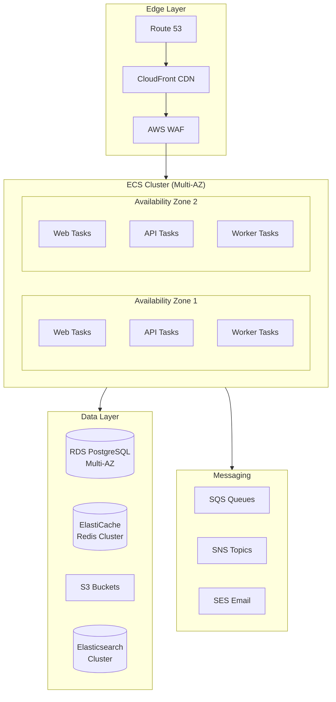
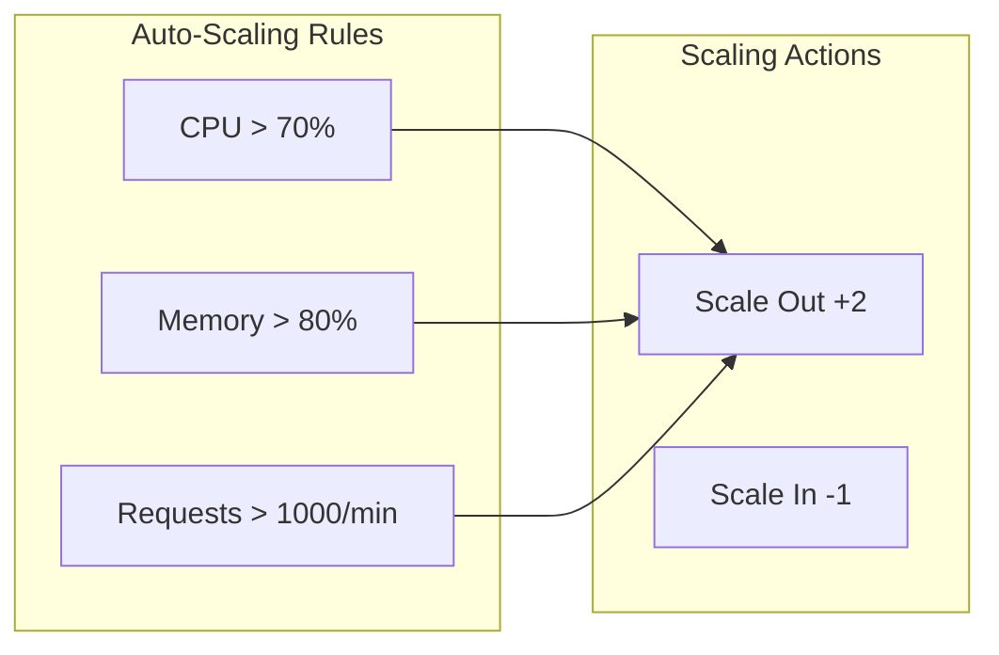
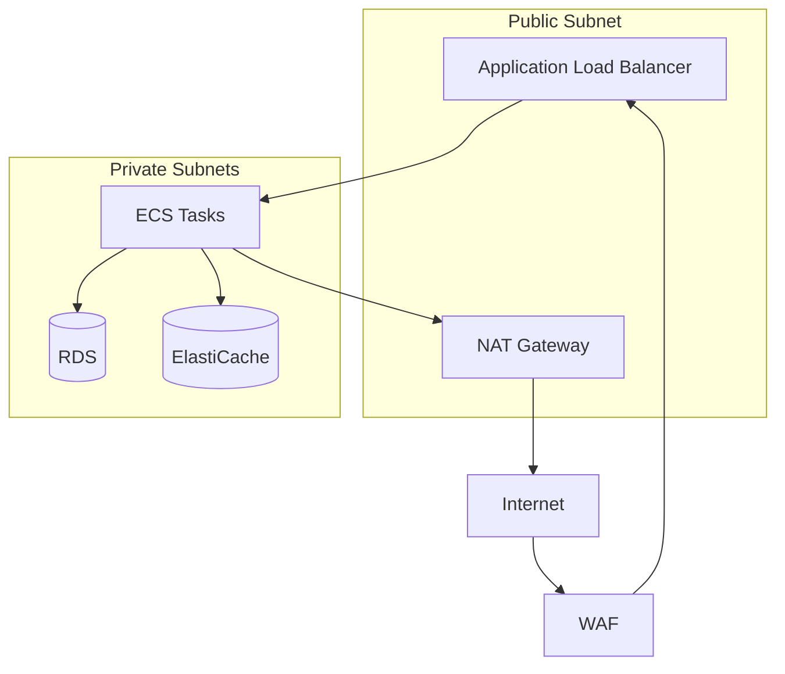
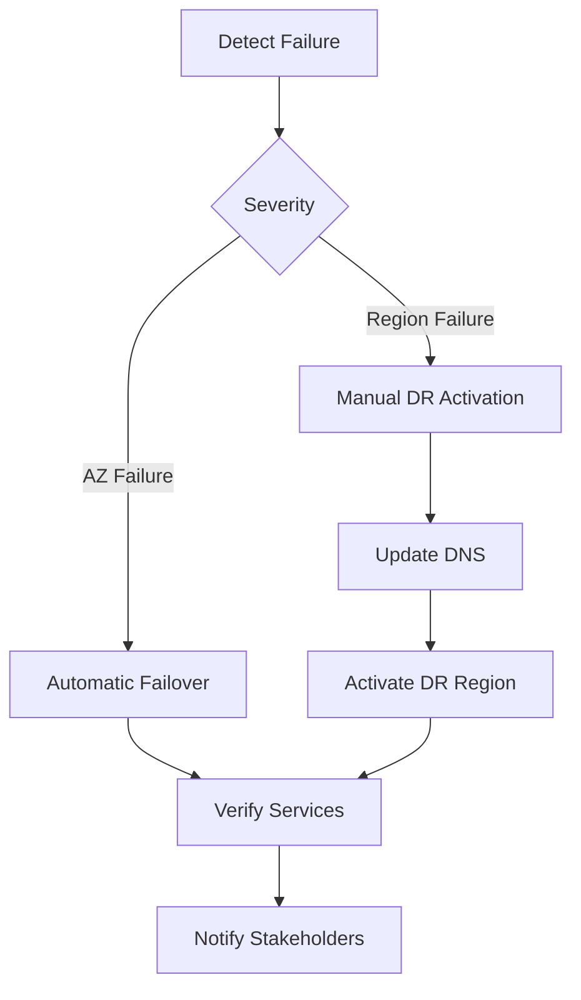

# ShopFlow Production Environment

## Overview

Production environment architecture and operations for the ShopFlow e-commerce platform.

---

## Architecture



---

## Environment Details

| Property | Value |
|----------|-------|
| URL | https://www.shopflow.io |
| Admin URL | https://admin.shopflow.io |
| API URL | https://api.shopflow.io |
| Primary Region | us-east-1 |
| DR Region | us-west-2 |
| Account | ShopFlow Production |

---

## Infrastructure Specifications

| Component | Specification | High Availability |
|-----------|---------------|-------------------|
| ECS Tasks (Web) | 6+ Fargate tasks | Multi-AZ |
| ECS Tasks (API) | 6+ Fargate tasks | Multi-AZ |
| ECS Tasks (Worker) | 3+ Fargate tasks | Multi-AZ |
| RDS | db.r6g.xlarge | Multi-AZ standby |
| ElastiCache | cache.r6g.large | 3-node cluster |
| Elasticsearch | 3 x r6g.large.search | 3-AZ deployment |
| S3 | Standard | Cross-region replication |

---

## Auto-Scaling Configuration



### ECS Service Auto-Scaling

```yaml
# Scaling policy
MinCapacity: 6
MaxCapacity: 50
TargetTrackingScaling:
  - MetricType: ECSServiceAverageCPUUtilization
    TargetValue: 70
  - MetricType: ECSServiceAverageMemoryUtilization
    TargetValue: 80
  - MetricType: ALBRequestCountPerTarget
    TargetValue: 1000
```

---

## SLA Targets

| Metric | Target | Alert Threshold |
|--------|--------|-----------------|
| Uptime | 99.99% | < 99.9% |
| P50 Latency | < 100ms | > 150ms |
| P95 Latency | < 300ms | > 500ms |
| P99 Latency | < 500ms | > 1000ms |
| Error Rate | < 0.1% | > 0.5% |
| Order Success Rate | > 99.5% | < 98% |

---

## Monitoring & Alerting

### Key Dashboards

| Dashboard | Purpose |
|-----------|---------|
| Executive Overview | High-level KPIs |
| API Performance | Latency, throughput |
| Order Pipeline | Order processing metrics |
| Infrastructure | Resource utilization |
| Error Tracking | Error rates, patterns |

### Alert Channels

| Severity | Response Time | Channel |
|----------|---------------|---------|
| Critical | < 5 min | PagerDuty + Slack |
| High | < 15 min | PagerDuty + Slack |
| Medium | < 1 hour | Slack |
| Low | < 24 hours | Email |

---

## Security Measures

### Network Security



### Security Controls

- AWS WAF with managed rule sets
- TLS 1.3 enforced
- VPC with private subnets
- Security groups (least privilege)
- Secrets Manager for credentials
- KMS encryption for data at rest
- PCI DSS compliance measures

---

## Incident Response

### Severity Levels

| Level | Description | Response | Example |
|-------|-------------|----------|---------|
| SEV1 | Site down | 5 min | Complete outage |
| SEV2 | Major feature broken | 15 min | Checkout failing |
| SEV3 | Degraded performance | 1 hour | Slow page loads |
| SEV4 | Minor issue | 24 hours | UI glitch |

### Incident Contacts

| Role | Contact |
|------|---------|
| Primary On-Call | PagerDuty rotation |
| Secondary On-Call | PagerDuty escalation |
| Incident Commander | #shopflow-incidents Slack |
| Executive Escalation | VP Engineering |

### Runbooks

- [Complete Outage](https://wiki.shopflow.io/runbooks/complete-outage)
- [Database Failover](https://wiki.shopflow.io/runbooks/db-failover)
- [High Error Rate](https://wiki.shopflow.io/runbooks/high-errors)
- [Performance Degradation](https://wiki.shopflow.io/runbooks/slow-response)

---

## Disaster Recovery

### RTO/RPO Targets

| Scenario | RTO | RPO |
|----------|-----|-----|
| Single AZ failure | 0 min | 0 |
| Region failure | 30 min | 5 min |
| Database corruption | 1 hour | Point-in-time |

### DR Procedures



---

## Deployment Windows

### Preferred Times

- **Standard Deploys:** Tuesday-Thursday, 10:00-14:00 UTC
- **Emergency Hotfixes:** Anytime with incident commander approval

### Freeze Periods

| Period | Dates | Reason |
|--------|-------|--------|
| Black Friday | Nov 25-30 | Peak traffic |
| Cyber Monday | Dec 1-3 | Peak traffic |
| Holiday Season | Dec 20-26 | High volume |
| End of Year | Dec 30-Jan 2 | Year-end close |

---

## Related Documents

- [Staging Environment](./staging.md)
- [Deployment Process](../workflows/deployment.md)
- [Environment Variables](./environment-variables.md)
