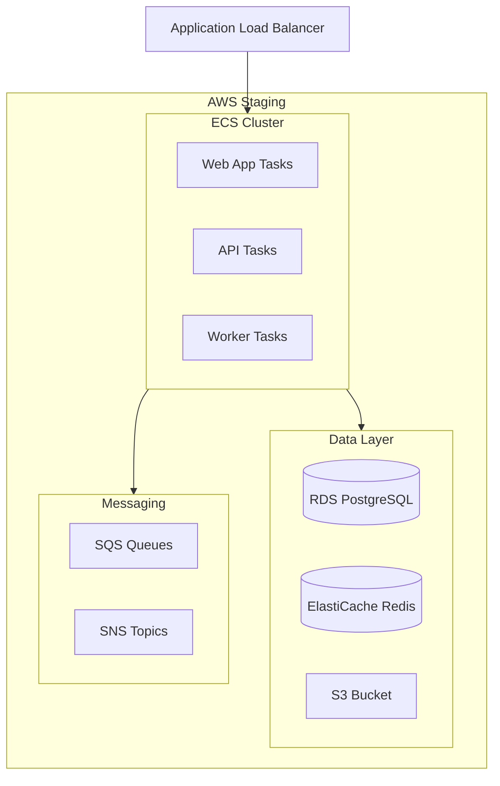
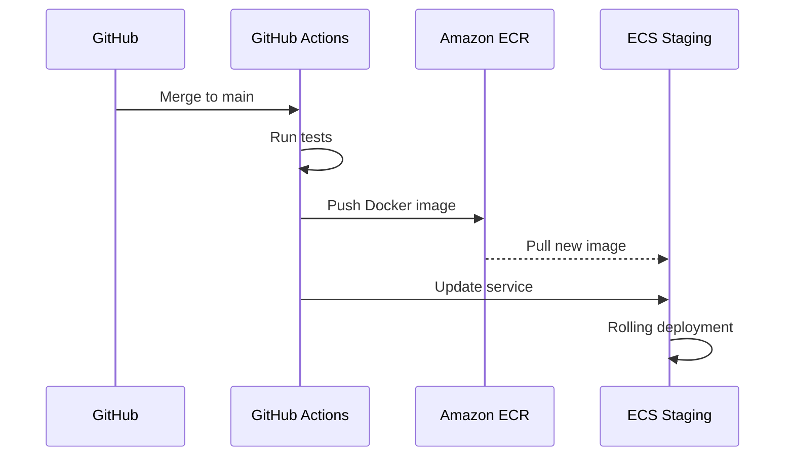

# ShopFlow Staging Environment

## Overview

The staging environment mirrors production for final testing of the ShopFlow e-commerce platform.

---

## Architecture



---

## Environment Details

| Property | Value |
|----------|-------|
| URL | https://staging.shopflow.io |
| Admin URL | https://staging-admin.shopflow.io |
| API URL | https://staging-api.shopflow.io |
| Region | us-east-1 |
| Account | ShopFlow Staging (123456789012) |

---

## Infrastructure Specifications

| Component | Staging | Production |
|-----------|---------|------------|
| ECS Tasks (Web) | 2 | 6+ |
| ECS Tasks (API) | 2 | 6+ |
| ECS Tasks (Worker) | 1 | 3+ |
| RDS Instance | db.t3.medium | db.r6g.xlarge |
| ElastiCache | cache.t3.micro | cache.r6g.large |
| S3 | Single bucket | Multi-region |

---

## Deployment Pipeline



---

## Access Configuration

### VPN Access

```bash
# Connect to staging VPN
sudo openvpn --config staging.ovpn

# Verify connection
ping staging-internal.shopflow.io
```

### AWS CLI Access

```bash
# Configure AWS profile
aws configure --profile shopflow-staging

# Verify access
aws sts get-caller-identity --profile shopflow-staging

# Set as default for session
export AWS_PROFILE=shopflow-staging
```

### Database Access

```bash
# Connect via bastion host
ssh -L 5432:staging-db.xxx.us-east-1.rds.amazonaws.com:5432 \
    bastion@staging-bastion.shopflow.io

# Then connect locally
psql -h localhost -U shopflow -d shopflow_staging
```

---

## Testing in Staging

### Manual Testing

```bash
# Health check
curl https://staging-api.shopflow.io/health

# Test with staging credentials
curl https://staging-api.shopflow.io/api/products \
  -H "Authorization: Bearer $STAGING_TOKEN"
```

### Automated E2E Tests

```bash
# Run E2E tests against staging
E2E_BASE_URL=https://staging.shopflow.io npm run test:e2e

# Run specific test suite
npm run test:e2e -- --grep "checkout"
```

### Load Testing

```bash
# Run load test against staging
k6 run \
  --env BASE_URL=https://staging-api.shopflow.io \
  tests/load/checkout-flow.js
```

---

## Test Data Management

### Seeding Staging Data

```bash
# Connect to staging and seed
DATABASE_URL=$STAGING_DATABASE_URL npm run db:seed

# Seed specific data
DATABASE_URL=$STAGING_DATABASE_URL npm run db:seed -- --only products
```

### Test Payment Cards

| Card Number | Behavior |
|-------------|----------|
| 4242 4242 4242 4242 | Successful payment |
| 4000 0000 0000 9995 | Decline (insufficient funds) |
| 4000 0000 0000 0002 | Decline (generic) |
| 4000 0025 0000 3155 | Requires 3DS authentication |

---

## Monitoring

### CloudWatch Dashboards

- [Staging Overview](https://console.aws.amazon.com/cloudwatch)
- [API Metrics](https://console.aws.amazon.com/cloudwatch/home?dashboards:name=shopflow-staging-api)
- [ECS Metrics](https://console.aws.amazon.com/ecs/home#/clusters/shopflow-staging)

### Log Groups

| Service | Log Group |
|---------|-----------|
| Web App | /ecs/shopflow-staging-web |
| API | /ecs/shopflow-staging-api |
| Worker | /ecs/shopflow-staging-worker |

### View Logs

```bash
# View recent API logs
aws logs tail /ecs/shopflow-staging-api --follow

# Filter error logs
aws logs filter-log-events \
  --log-group-name /ecs/shopflow-staging-api \
  --filter-pattern "ERROR"
```

---

## Troubleshooting

### Common Issues

**Issue: Deployment stuck**
```bash
# Check ECS service events
aws ecs describe-services \
  --cluster shopflow-staging \
  --services shopflow-api \
  --query 'services[0].events[:5]'
```

**Issue: Database connection timeout**
```bash
# Check security groups
aws ec2 describe-security-groups \
  --filters Name=group-name,Values=shopflow-staging-api

# Verify RDS status
aws rds describe-db-instances \
  --db-instance-identifier shopflow-staging
```

**Issue: High memory usage**
```bash
# Check task memory
aws ecs describe-tasks \
  --cluster shopflow-staging \
  --tasks $(aws ecs list-tasks --cluster shopflow-staging --service shopflow-api --query 'taskArns[0]' --output text)
```

---

## Staging Reset Procedure

```bash
# 1. Stop all ECS services
aws ecs update-service --cluster shopflow-staging --service shopflow-api --desired-count 0
aws ecs update-service --cluster shopflow-staging --service shopflow-web --desired-count 0

# 2. Reset database
psql $STAGING_DATABASE_URL -c "DROP SCHEMA public CASCADE; CREATE SCHEMA public;"
DATABASE_URL=$STAGING_DATABASE_URL npm run db:migrate
DATABASE_URL=$STAGING_DATABASE_URL npm run db:seed

# 3. Flush Redis
aws elasticache modify-replication-group \
  --replication-group-id shopflow-staging \
  --apply-immediately

# 4. Restart services
aws ecs update-service --cluster shopflow-staging --service shopflow-api --desired-count 2
aws ecs update-service --cluster shopflow-staging --service shopflow-web --desired-count 2
```

---

## Related Documents

- [Production Environment](./production.md)
- [Deployment Process](../workflows/deployment.md)
- [CI/CD Pipeline](../workflows/ci-cd-pipeline.md)
