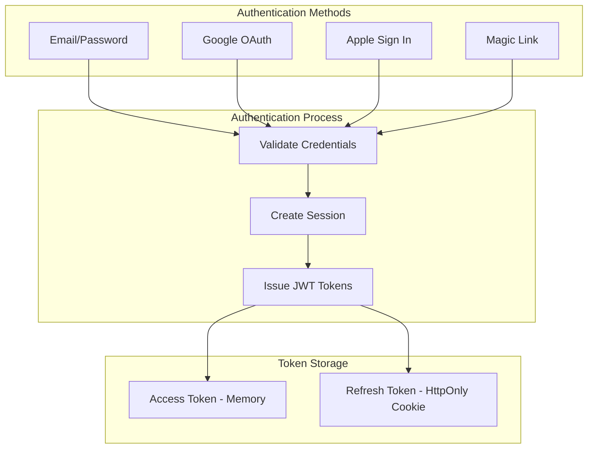
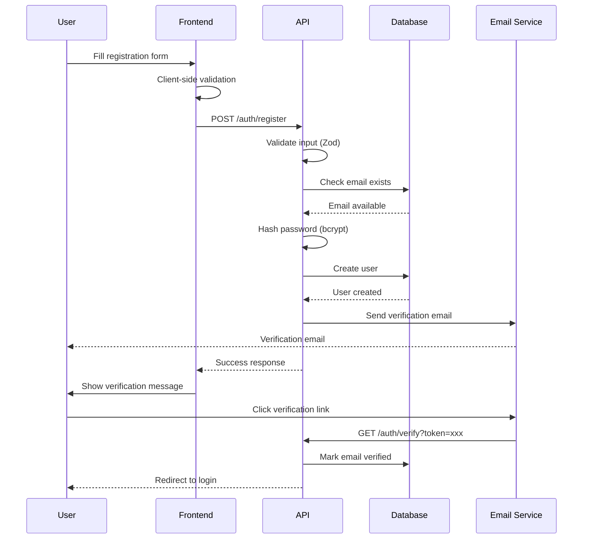
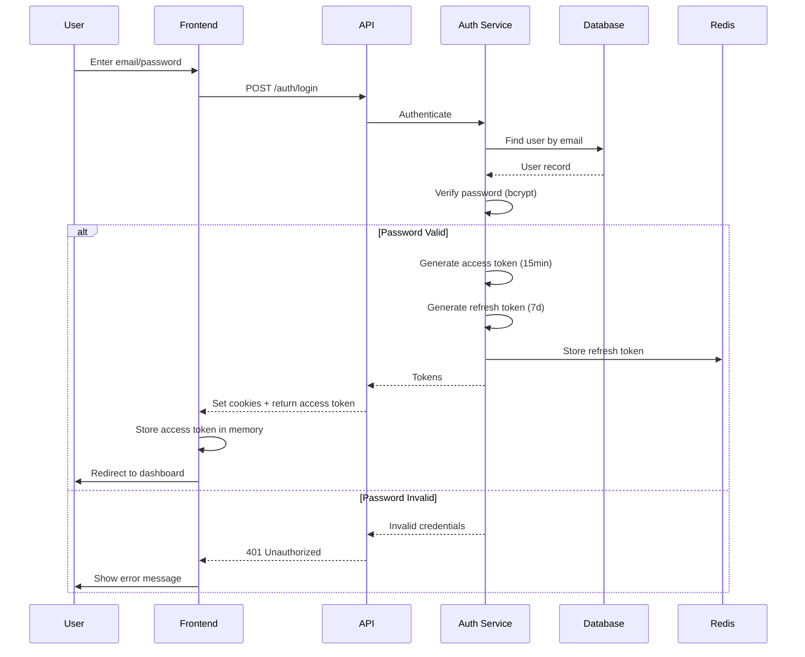
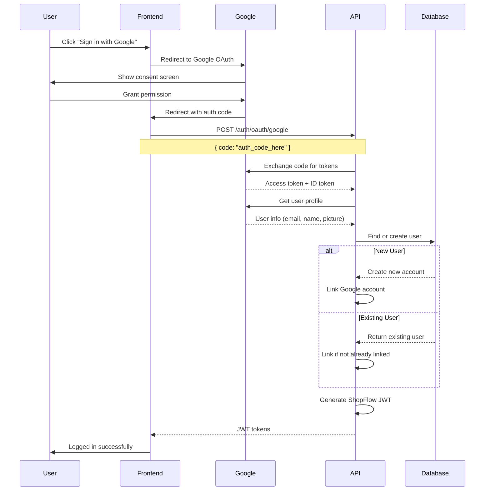
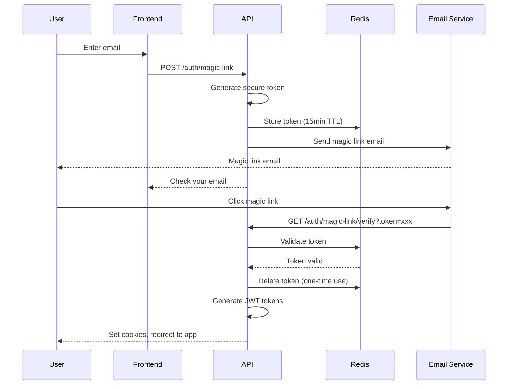
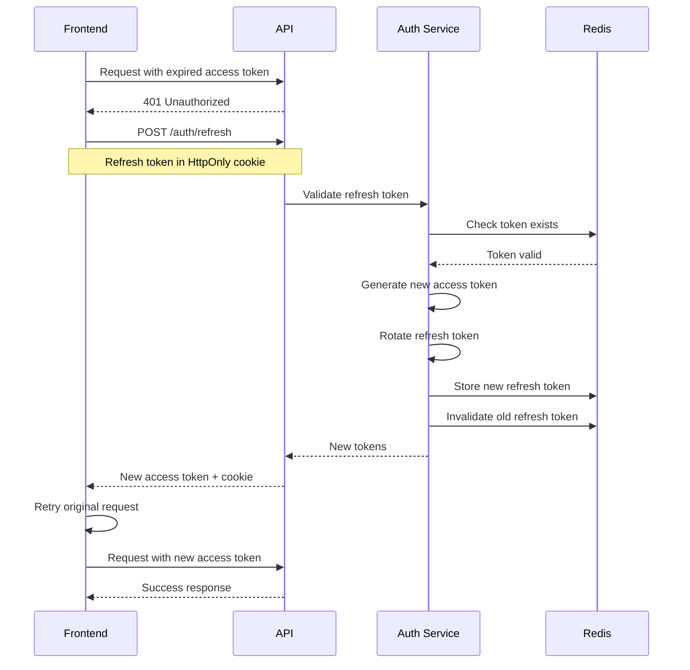
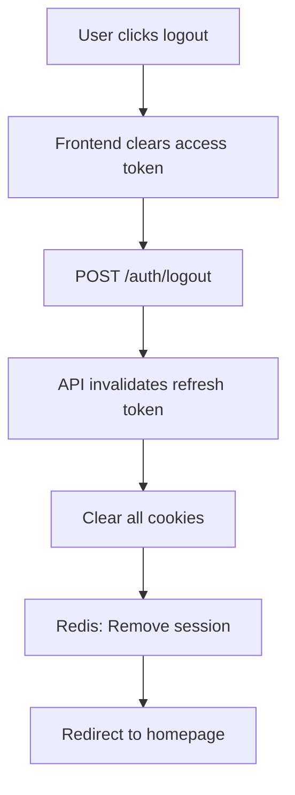
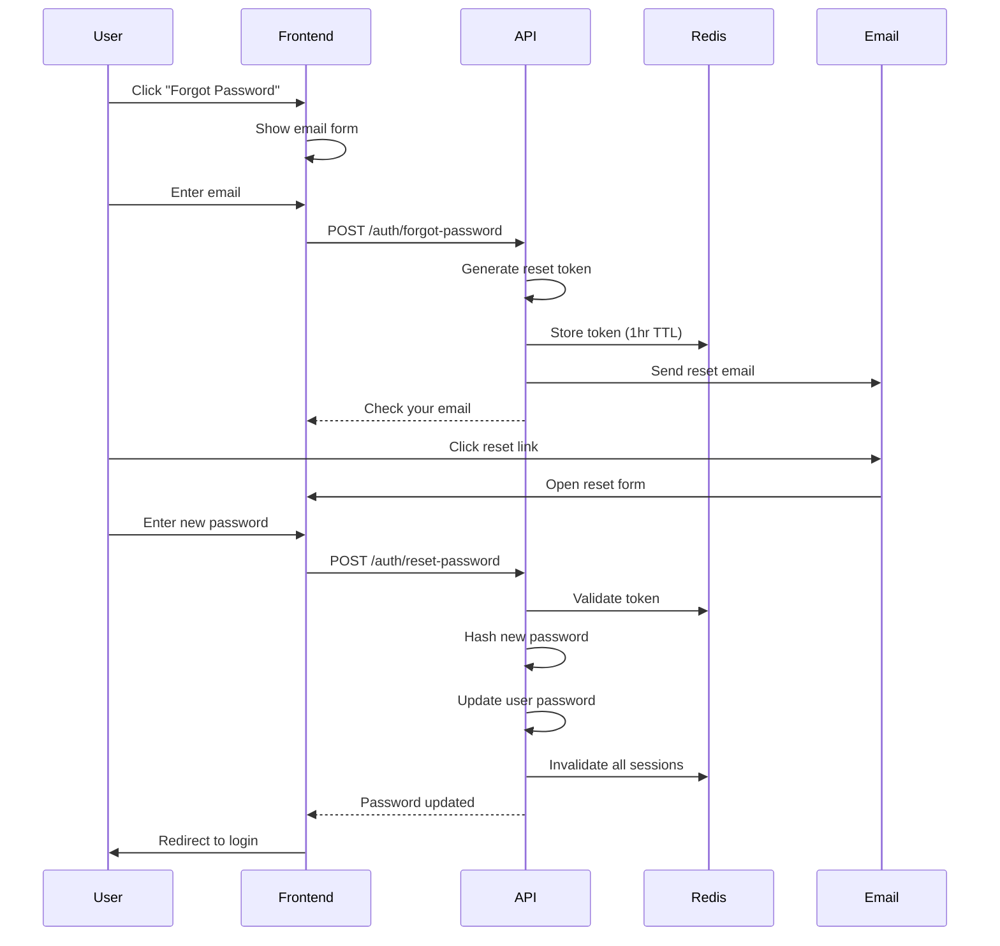
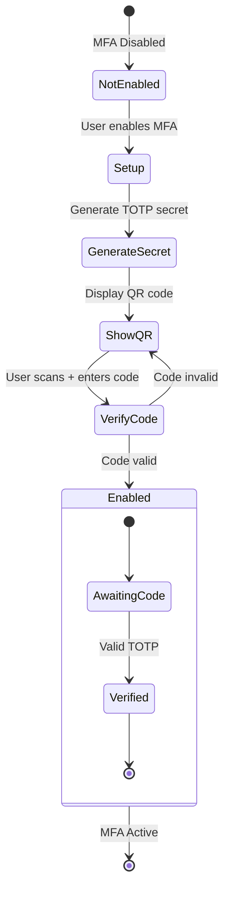

# ShopFlow Authentication Flow

## Overview

ShopFlow supports multiple authentication methods to provide a seamless user experience.

## Authentication Methods

### ASCII Auth Overview

```
┌─────────────────────────────────────────────────────────────────────────────┐
│                         AUTHENTICATION METHODS                               │
└─────────────────────────────────────────────────────────────────────────────┘

  ┌───────────────┐    ┌───────────────┐    ┌───────────────┐
  │   Email/      │    │    Social     │    │    Magic      │
  │   Password    │    │    Login      │    │    Link       │
  └───────┬───────┘    └───────┬───────┘    └───────┬───────┘
          │                    │                    │
          │    ┌───────────────┼───────────────┐    │
          │    │               │               │    │
          ▼    ▼               ▼               ▼    ▼
       ┌──────────┐     ┌──────────┐     ┌──────────┐
       │  Google  │     │  Apple   │     │ Facebook │
       └──────────┘     └──────────┘     └──────────┘
                               │
                               ▼
                    ┌─────────────────────┐
                    │   Unified Session   │
                    │     Management      │
                    └─────────────────────┘
```

### Mermaid Auth Methods



## Email/Password Authentication

### Registration Flow



### Login Flow



## Social Login (OAuth 2.0)

### ASCII OAuth Flow

```
┌─────────────────────────────────────────────────────────────────┐
│                      OAUTH 2.0 FLOW                              │
└─────────────────────────────────────────────────────────────────┘

  User          ShopFlow         OAuth Provider       ShopFlow API
   │               │                   │                   │
   │  Click        │                   │                   │
   │  Login        │                   │                   │
   │──────────────▶│                   │                   │
   │               │                   │                   │
   │               │    Redirect       │                   │
   │◀──────────────│──────────────────▶│                   │
   │                                   │                   │
   │          Consent Screen           │                   │
   │◀─────────────────────────────────▶│                   │
   │                                   │                   │
   │          Auth Code                │                   │
   │◀──────────────────────────────────│                   │
   │                                   │                   │
   │  Code                             │                   │
   │──────────────────────────────────────────────────────▶│
   │                                   │                   │
   │                                   │   Exchange Code   │
   │                                   │◀─────────────────▶│
   │                                   │                   │
   │                                   │   User Profile    │
   │                                   │◀─────────────────▶│
   │                                   │                   │
   │            JWT Tokens                                 │
   │◀──────────────────────────────────────────────────────│
```

### Mermaid Google OAuth



## Magic Link Authentication

### Flow Diagram



## Token Management

### ASCII Token Lifecycle

```
┌─────────────────────────────────────────────────────────────────┐
│                      TOKEN LIFECYCLE                             │
└─────────────────────────────────────────────────────────────────┘

  Access Token (15min)                 Refresh Token (7 days)
  ┌─────────────────┐                 ┌─────────────────┐
  │  Short-lived    │                 │  Long-lived     │
  │  In memory      │                 │  HttpOnly cookie│
  │  API requests   │                 │  Token rotation │
  └────────┬────────┘                 └────────┬────────┘
           │                                   │
           │         Expired?                  │
           ▼                                   │
  ┌─────────────────┐                          │
  │   API returns   │                          │
  │      401        │──────────────────────────┘
  └────────┬────────┘                          │
           │                                   │
           │      Use refresh token            │
           ▼                                   ▼
  ┌─────────────────────────────────────────────────────────────┐
  │              POST /auth/refresh                              │
  │              Get new access token                            │
  └─────────────────────────────────────────────────────────────┘
```

### Mermaid Token Refresh



## Logout Flow



## Password Reset



## Multi-Factor Authentication (MFA)

### MFA Setup Flow



## Security Headers

```typescript
// Authentication response headers
{
  "Set-Cookie": "refresh_token=xxx; HttpOnly; Secure; SameSite=Strict; Path=/api/auth",
  "X-Content-Type-Options": "nosniff",
  "X-Frame-Options": "DENY",
  "Strict-Transport-Security": "max-age=31536000; includeSubDomains"
}
```

## Session Security

| Feature | Implementation |
|---------|---------------|
| Token Storage | Access in memory, refresh in HttpOnly cookie |
| Token Rotation | New refresh token on each use |
| Session Limit | Max 5 active sessions per user |
| Device Tracking | Track device/browser for sessions |
| Suspicious Activity | Flag unusual login locations |
| Brute Force Protection | Rate limit + account lockout |
