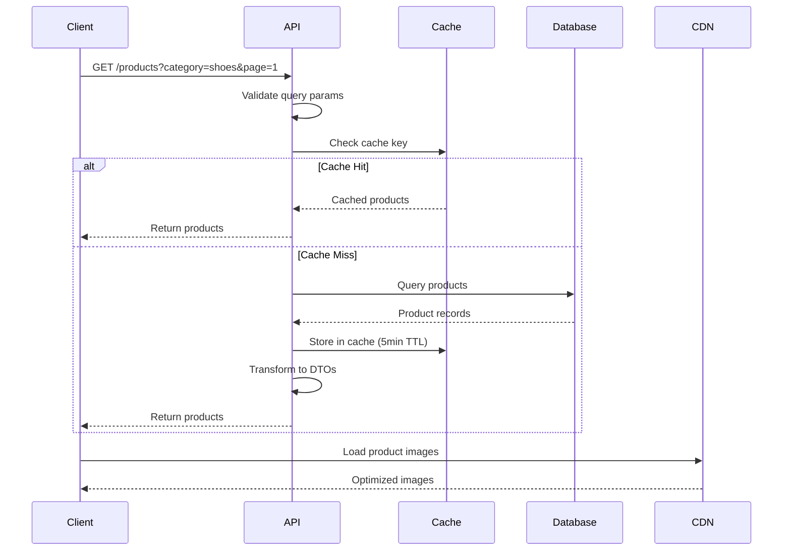
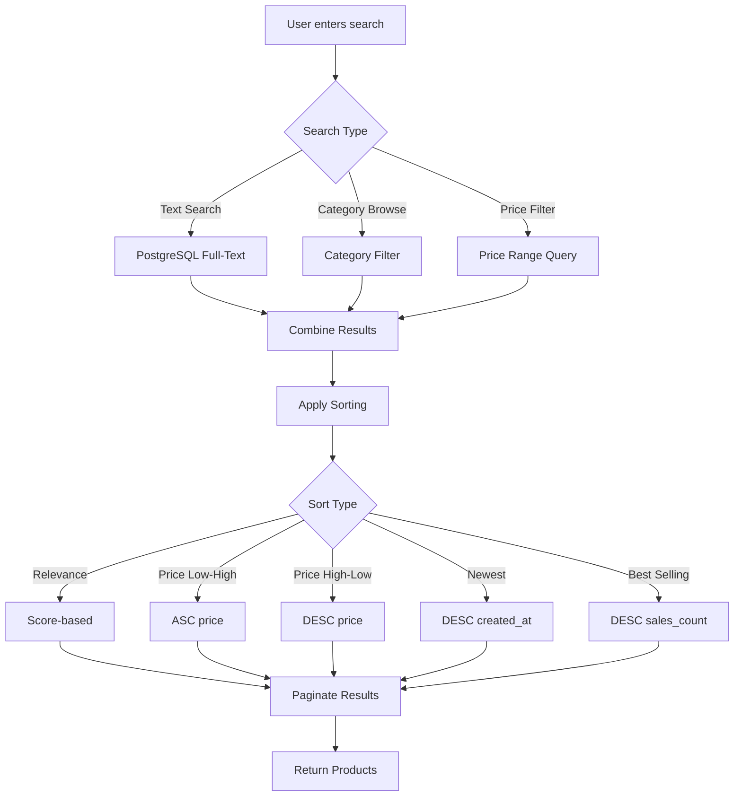
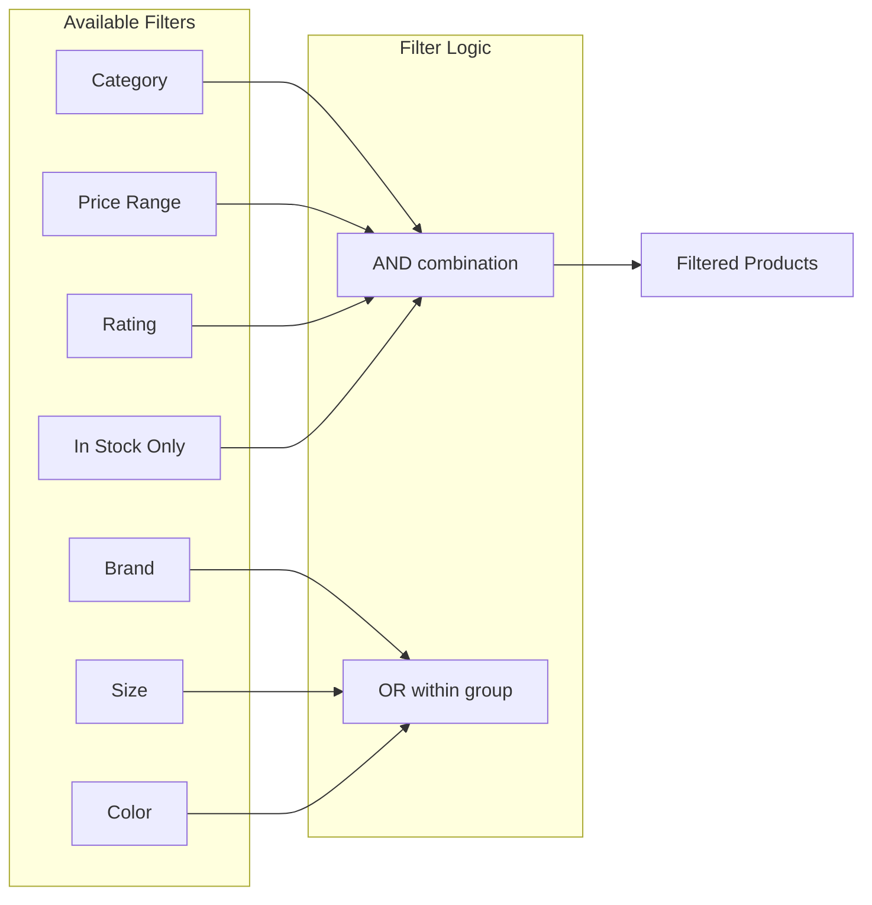
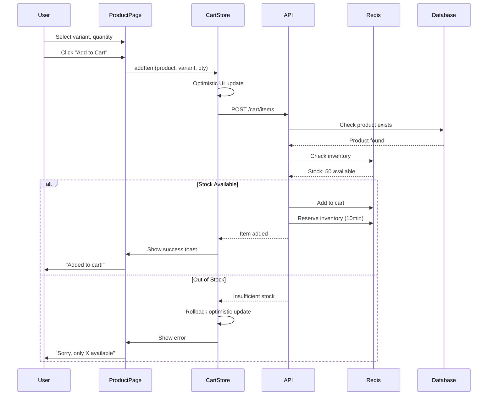
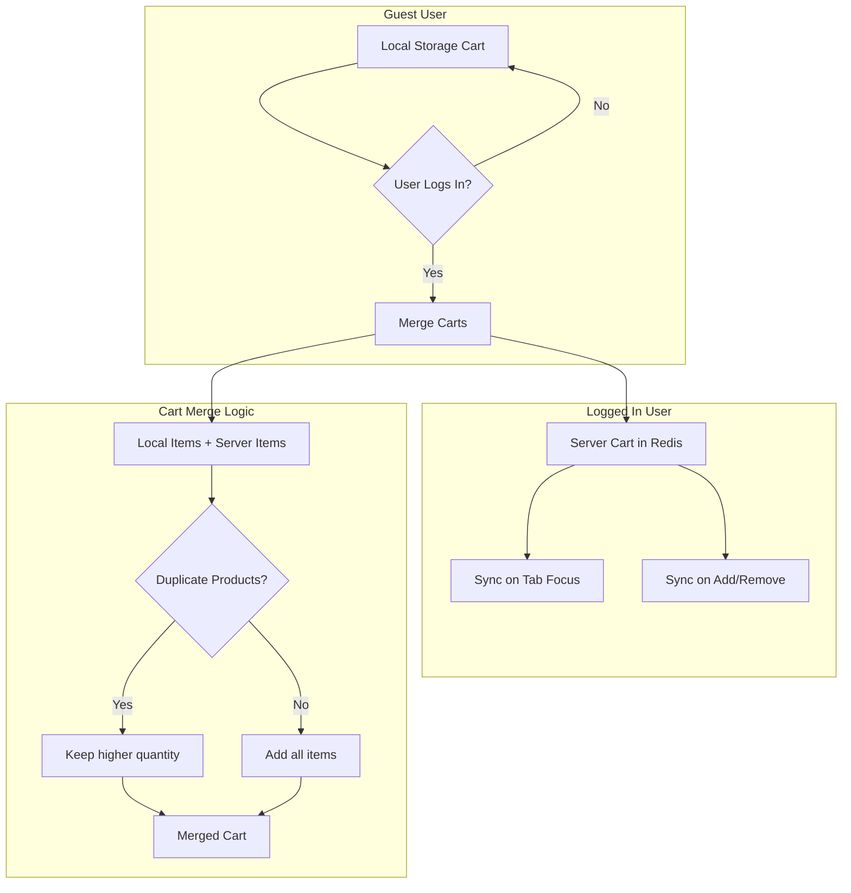
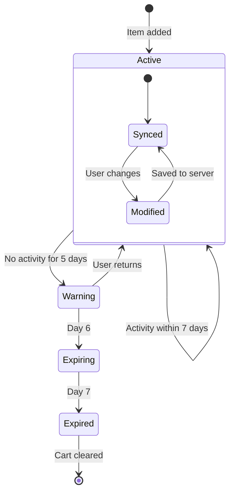
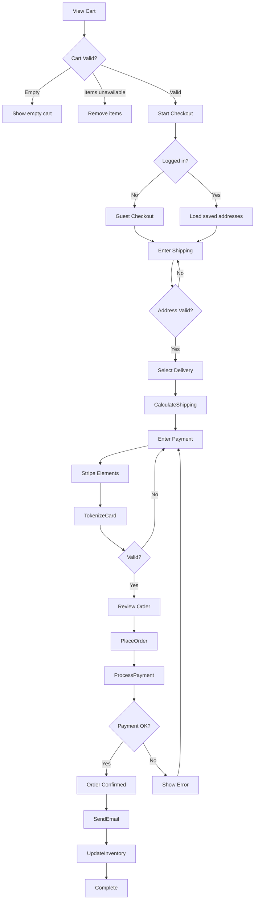
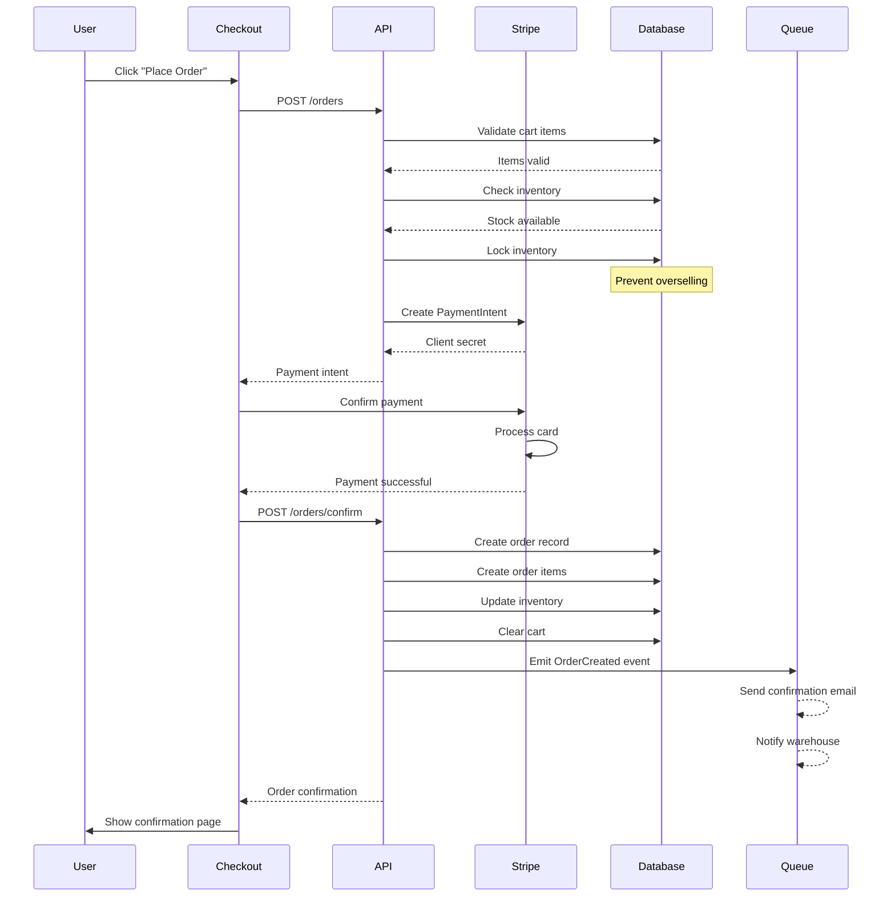
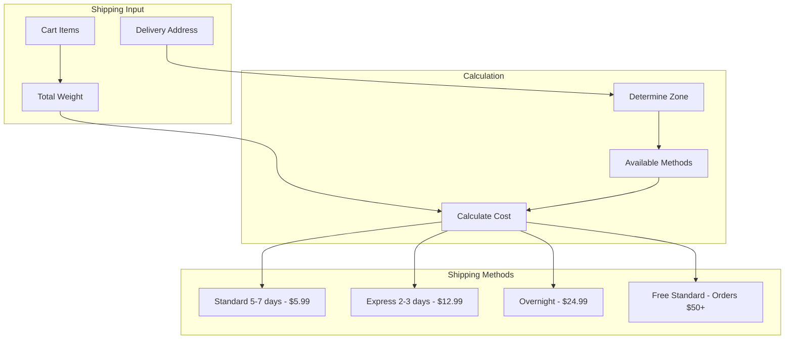
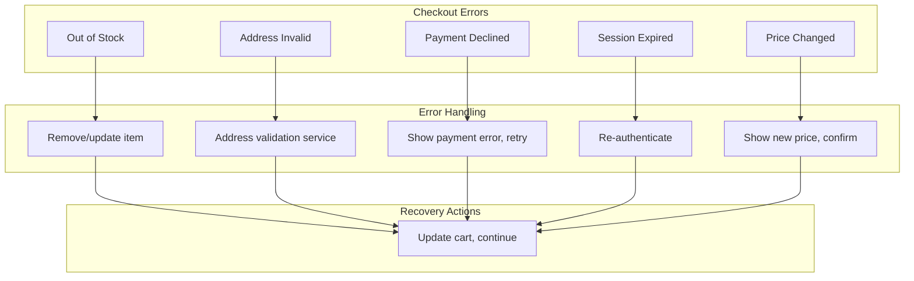

# ShopFlow Core Features Flow

## Overview

This document details the core e-commerce feature flows: Product Listing, Cart Management, and Checkout.

## Product Listing Flow

### ASCII Product Listing

```
┌─────────────────────────────────────────────────────────────────────────────┐
│                         PRODUCT LISTING FLOW                                 │
└─────────────────────────────────────────────────────────────────────────────┘

  Request             Cache Check          Database            Response
     │                    │                   │                   │
     ▼                    ▼                   ▼                   ▼
┌─────────┐         ┌─────────┐         ┌─────────┐         ┌─────────┐
│  User   │────────▶│  Redis  │────────▶│PostgreSQL────────▶│  JSON   │
│ Request │         │  Cache  │         │  Query  │         │Response │
└─────────┘         └─────────┘         └─────────┘         └─────────┘
     │                    │                   │                   │
     │  Filters:         │  Cache Hit?       │  Indexes:         │  Transform:
     │  - Category       │  - Return cached  │  - category_id    │  - Map to DTO
     │  - Price Range    │  - TTL: 5 min     │  - price          │  - Add images
     │  - Brand          │                   │  - is_active      │  - Pagination
     │  - Sort           │                   │                   │
```

### Mermaid Product Listing



### Product Search Flow



### Filter Combinations



## Cart Management Flow

### ASCII Cart Operations

```
┌─────────────────────────────────────────────────────────────────────────────┐
│                           CART OPERATIONS                                    │
└─────────────────────────────────────────────────────────────────────────────┘

  ADD TO CART                UPDATE QUANTITY              REMOVE ITEM
       │                           │                           │
       ▼                           ▼                           ▼
┌─────────────┐            ┌─────────────┐            ┌─────────────┐
│  Validate   │            │   Check     │            │  Remove     │
│  Product    │            │   Stock     │            │   Item      │
└──────┬──────┘            └──────┬──────┘            └──────┬──────┘
       │                          │                          │
       ▼                          ▼                          ▼
┌─────────────┐            ┌─────────────┐            ┌─────────────┐
│   Check     │            │  Update     │            │ Recalculate │
│   Stock     │            │  Quantity   │            │   Totals    │
└──────┬──────┘            └──────┬──────┘            └──────┬──────┘
       │                          │                          │
       ▼                          ▼                          ▼
┌─────────────┐            ┌─────────────┐            ┌─────────────┐
│    Add      │            │ Recalculate │            │   Update    │
│  to Cart    │            │   Totals    │            │    Cart     │
└──────┬──────┘            └──────┬──────┘            └──────┬──────┘
       │                          │                          │
       └──────────────────────────┴──────────────────────────┘
                                  │
                                  ▼
                         ┌─────────────────┐
                         │   Sync with     │
                         │   Redis Cache   │
                         └─────────────────┘
```

### Mermaid Add to Cart



### Cart Sync Strategy



### Cart Expiration



## Checkout Flow

### ASCII Checkout Steps

```
┌─────────────────────────────────────────────────────────────────────────────┐
│                           CHECKOUT PROCESS                                   │
└─────────────────────────────────────────────────────────────────────────────┘

  Step 1             Step 2            Step 3            Step 4
  SHIPPING           DELIVERY          PAYMENT           REVIEW
     │                  │                 │                 │
     ▼                  ▼                 ▼                 ▼
┌─────────────┐   ┌─────────────┐   ┌─────────────┐   ┌─────────────┐
│  Address    │──▶│   Method    │──▶│   Card      │──▶│   Summary   │
│   Form      │   │  Selection  │   │   Details   │   │  & Confirm  │
└─────────────┘   └─────────────┘   └─────────────┘   └─────────────┘
     │                  │                 │                 │
     │                  │                 │                 │
     ▼                  ▼                 ▼                 ▼
  Validate         Calculate          Tokenize          Process
  Address          Shipping           w/ Stripe         Order
```

### Mermaid Checkout Flow



### Checkout Sequence



### Shipping Calculation



### Order Total Calculation

```
┌─────────────────────────────────────────────────────────────────┐
│                    ORDER TOTAL CALCULATION                       │
└─────────────────────────────────────────────────────────────────┘

  Subtotal     = Σ (item.price × item.quantity)
  Discount     = Apply coupon code (% or fixed)
  Tax          = (Subtotal - Discount) × tax_rate
  Shipping     = Based on method and weight
  ─────────────────────────────────────────────
  Total        = Subtotal - Discount + Tax + Shipping

  Example:
  ┌────────────────────────────────────┐
  │  Subtotal:           $124.97       │
  │  Discount (10%):     -$12.50       │
  │  Tax (8.25%):         $9.28        │
  │  Shipping:            $5.99        │
  │  ────────────────────────────      │
  │  Total:             $127.74        │
  └────────────────────────────────────┘
```

## Error Handling


