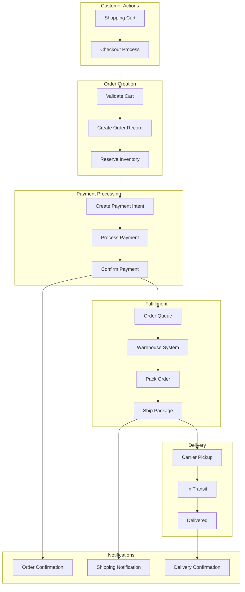
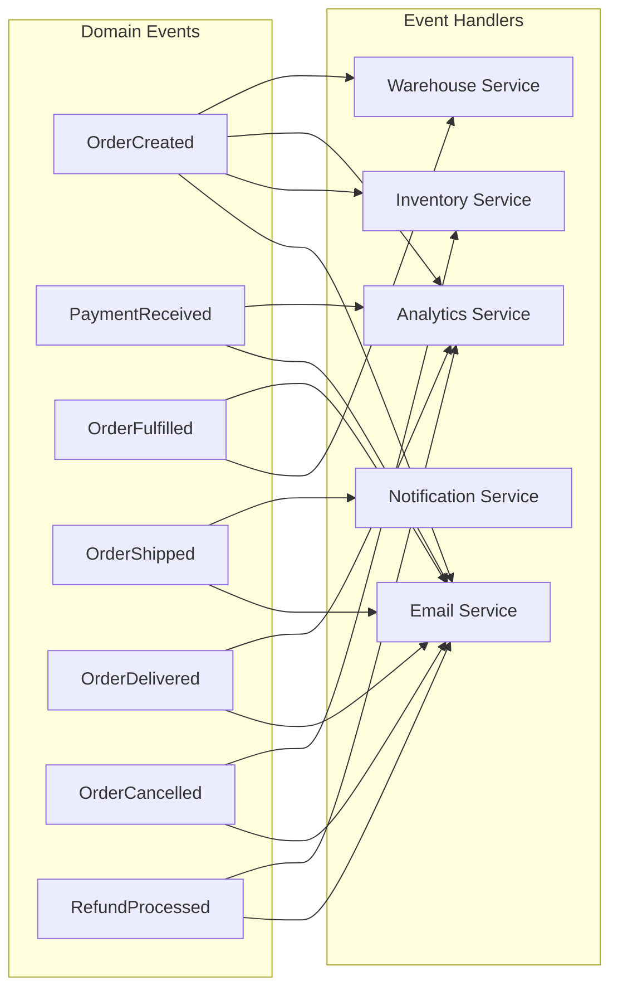
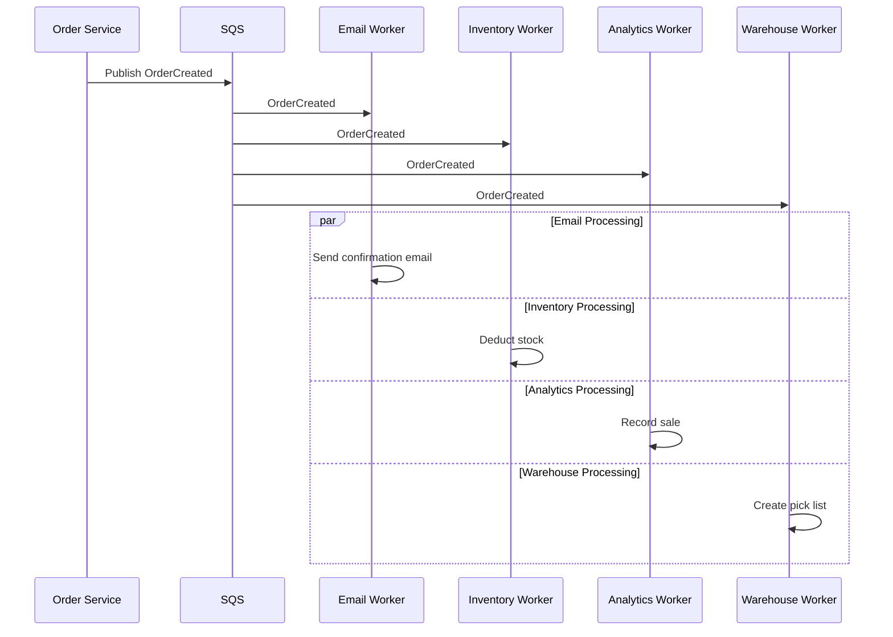
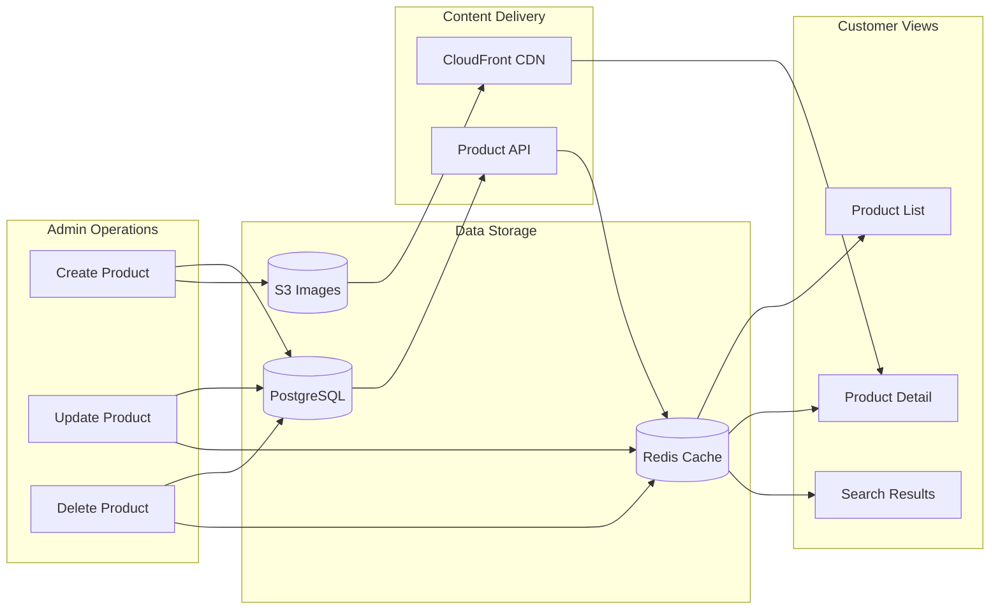
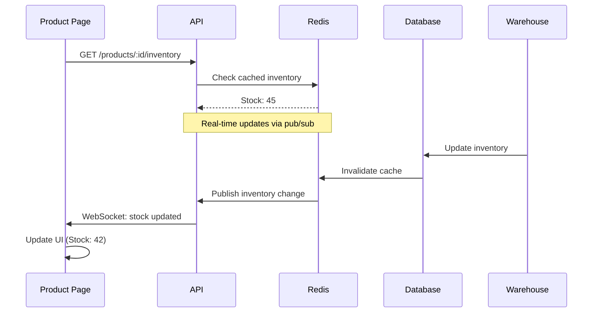
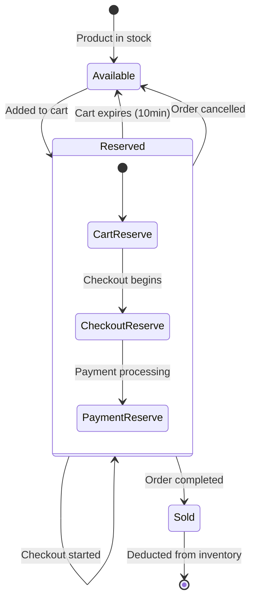
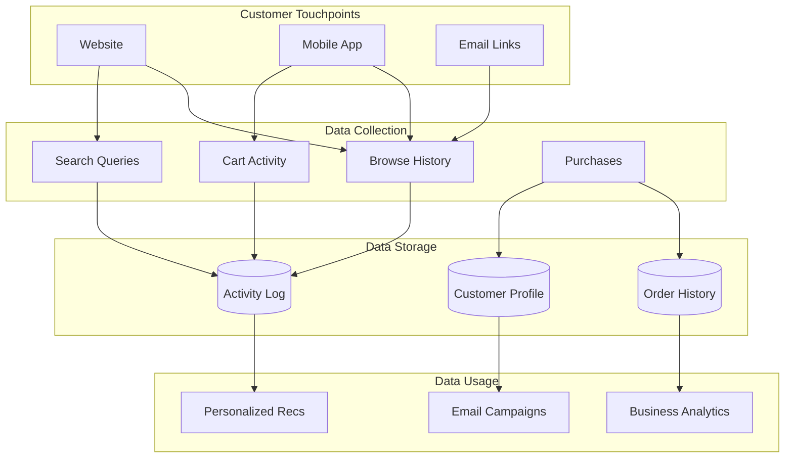
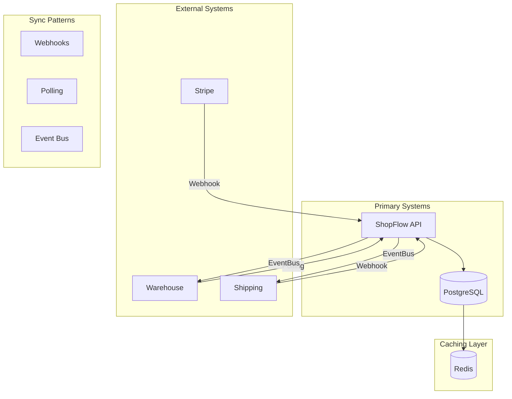

# ShopFlow Data Flow

## Overview

This document describes how data flows through the ShopFlow system from order creation to fulfillment.

## Order Data Flow

### ASCII Complete Data Flow

```
┌─────────────────────────────────────────────────────────────────────────────┐
│                          ORDER DATA FLOW                                     │
└─────────────────────────────────────────────────────────────────────────────┘

  CART              ORDER             PAYMENT           FULFILLMENT
    │                 │                  │                  │
    ▼                 ▼                  ▼                  ▼
┌─────────┐     ┌─────────┐       ┌─────────┐       ┌─────────┐
│ Redis   │────▶│PostgreSQL────▶│ Stripe  │──────▶│Warehouse│
│ Cache   │     │   DB    │       │   API   │       │  System │
└─────────┘     └─────────┘       └─────────┘       └─────────┘
    │                 │                  │                  │
    │                 │                  │                  │
    ▼                 ▼                  ▼                  ▼
┌─────────────────────────────────────────────────────────────────┐
│                         SQS MESSAGE QUEUE                        │
│  ┌───────────┐  ┌───────────┐  ┌───────────┐  ┌───────────┐    │
│  │OrderCreated  │PaymentDone│  │OrderShipped│  │Delivered │    │
│  └───────────┘  └───────────┘  └───────────┘  └───────────┘    │
└─────────────────────────────────────────────────────────────────┘
    │                 │                  │                  │
    ▼                 ▼                  ▼                  ▼
┌─────────┐     ┌─────────┐       ┌─────────┐       ┌─────────┐
│  Email  │     │Inventory│       │ Tracking│       │ Review  │
│ Service │     │ Update  │       │ Update  │       │ Request │
└─────────┘     └─────────┘       └─────────┘       └─────────┘
```

### Mermaid Order Flow



## Event-Driven Architecture

### Domain Events



### Event Sequence



## Product Data Flow

### ASCII Product Lifecycle

```
┌─────────────────────────────────────────────────────────────────────────────┐
│                         PRODUCT DATA LIFECYCLE                               │
└─────────────────────────────────────────────────────────────────────────────┘

  ADMIN CREATES          SYNCED TO           DISPLAYED TO
      │                      │                    │
      ▼                      ▼                    ▼
┌─────────────┐        ┌─────────────┐      ┌─────────────┐
│ Admin Portal│───────▶│   Primary   │─────▶│   Redis     │
│  (Create)   │        │   Database  │      │   Cache     │
└─────────────┘        └─────────────┘      └─────────────┘
      │                      │                    │
      ▼                      │                    ▼
┌─────────────┐              │              ┌─────────────┐
│   Image     │              │              │   Product   │
│   Upload    │──────────────┤              │   Listing   │
└─────────────┘              │              │    Page     │
      │                      │              └─────────────┘
      ▼                      │                    │
┌─────────────┐              │              ┌─────────────┐
│     S3      │              └─────────────▶│   Product   │
│   Bucket    │──────────────────────────▶  │   Detail    │
└─────────────┘                            │    Page     │
      │                                    └─────────────┘
      ▼
┌─────────────┐
│ CloudFront  │
│    CDN      │
└─────────────┘
```

### Mermaid Product Data Flow



## Inventory Data Flow

### Real-Time Inventory Sync



### Inventory Reservation



## Customer Data Flow

### ASCII Customer Data

```
┌─────────────────────────────────────────────────────────────────────────────┐
│                          CUSTOMER DATA FLOW                                  │
└─────────────────────────────────────────────────────────────────────────────┘

  Registration         Profile Data          Activity Data
       │                    │                      │
       ▼                    ▼                      ▼
  ┌─────────┐         ┌─────────┐           ┌─────────┐
  │  Email  │         │ Orders  │           │  Views  │
  │Password │         │Addresses│           │ Clicks  │
  │  Name   │         │ Reviews │           │  Cart   │
  └────┬────┘         └────┬────┘           └────┬────┘
       │                   │                      │
       └───────────────────┼──────────────────────┘
                           │
                           ▼
                   ┌─────────────────┐
                   │   PostgreSQL    │
                   │   (encrypted)   │
                   └────────┬────────┘
                            │
              ┌─────────────┼─────────────┐
              │             │             │
              ▼             ▼             ▼
       ┌───────────┐ ┌───────────┐ ┌───────────┐
       │   Auth    │ │  Order    │ │ Analytics │
       │  Service  │ │  Service  │ │  Service  │
       └───────────┘ └───────────┘ └───────────┘
```

### Mermaid Customer Journey Data



## Data Synchronization

### Cross-System Sync



## Data Retention

| Data Type | Retention | Storage | Archival |
|-----------|-----------|---------|----------|
| Orders | 7 years | PostgreSQL | S3 Glacier |
| Customer PII | Account lifetime + 30 days | PostgreSQL | Deleted |
| Activity Logs | 90 days | PostgreSQL | S3 |
| Cart Data | 30 days | Redis | None |
| Session Data | 24 hours | Redis | None |
| Product Images | Indefinite | S3 | None |
