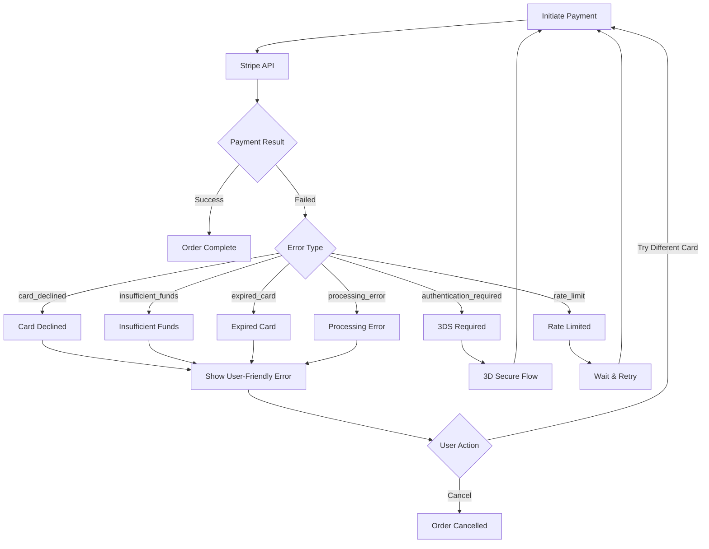
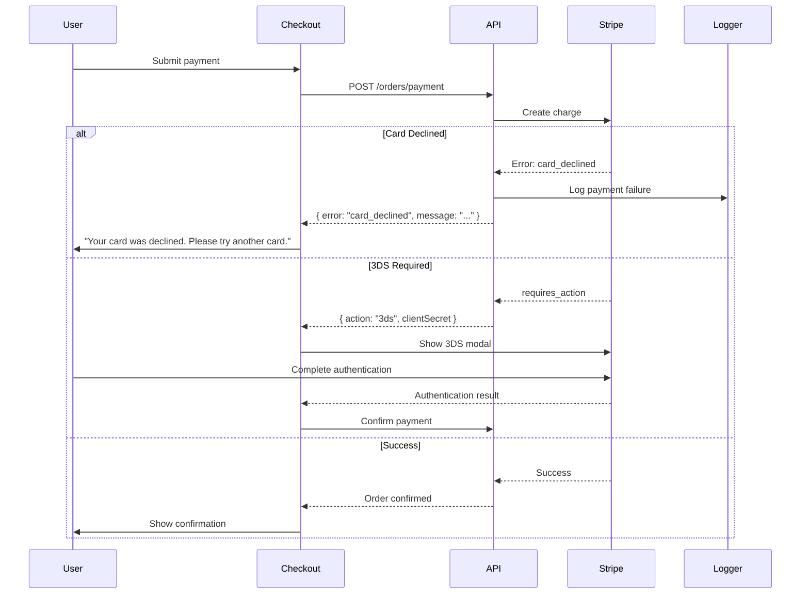
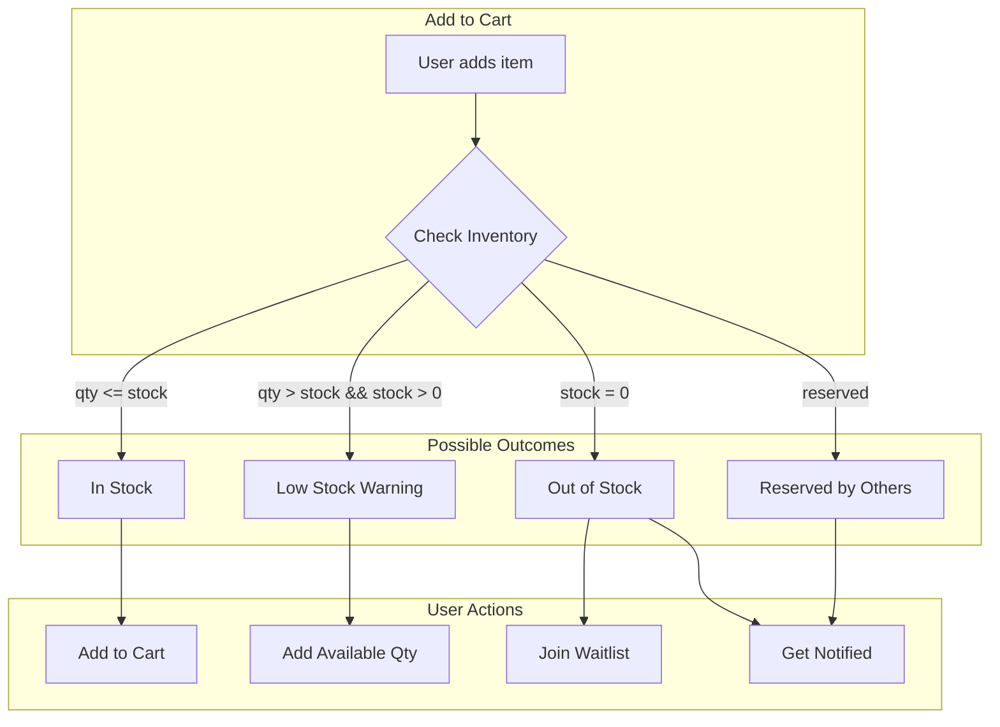
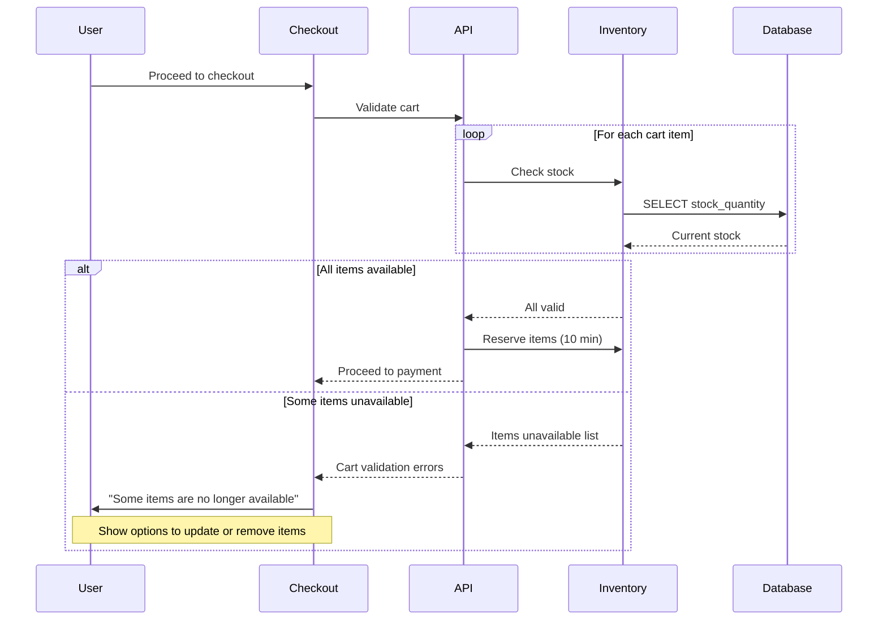
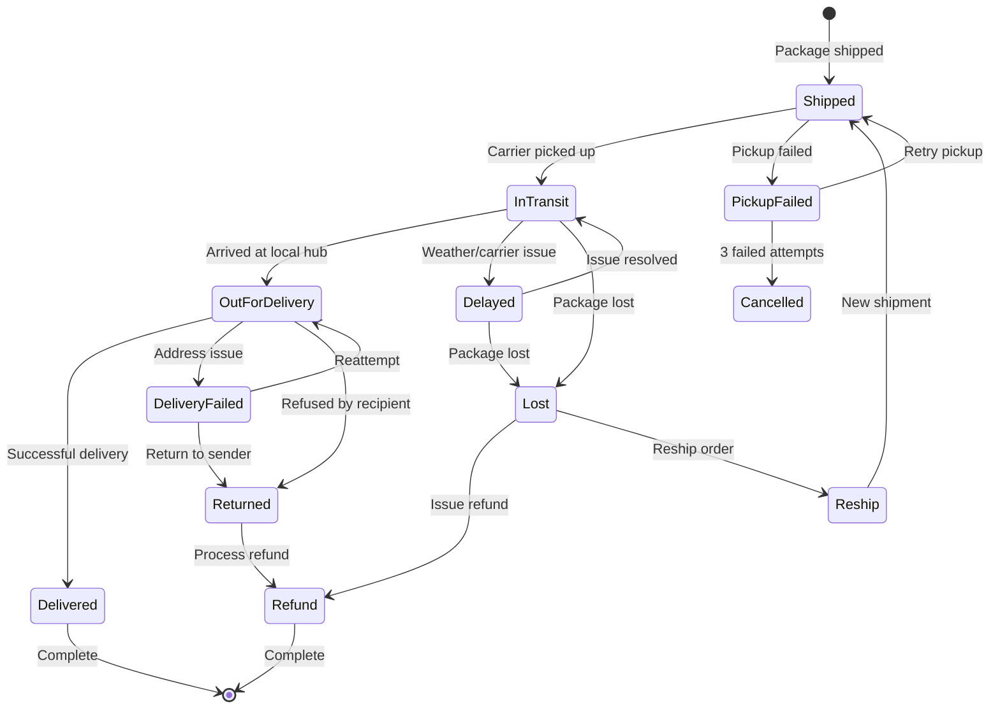
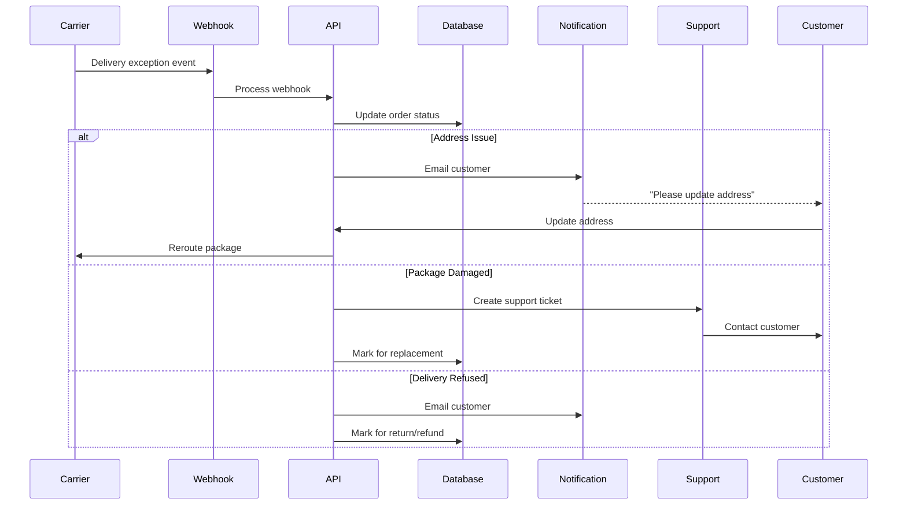
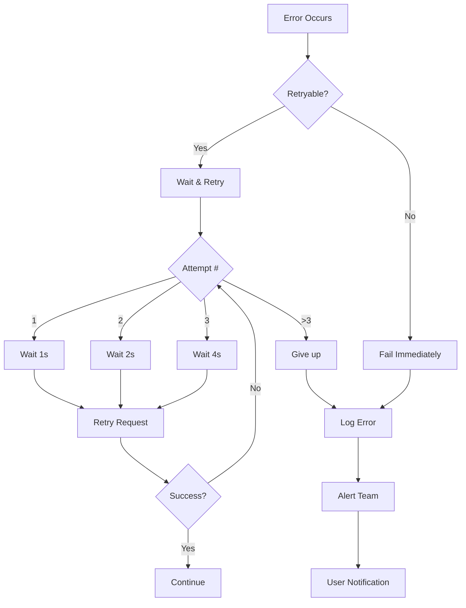
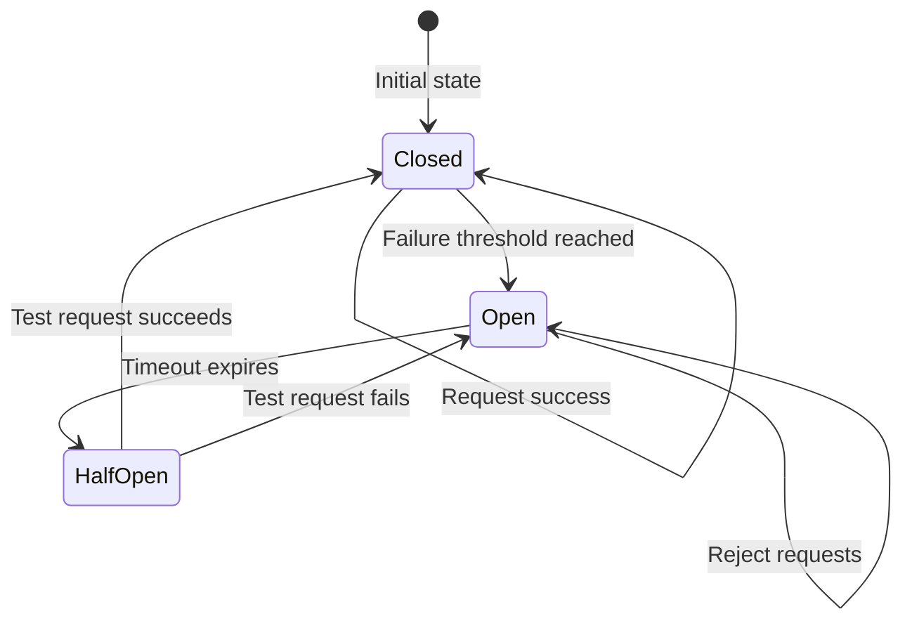

# ShopFlow Error Handling Flow

## Overview

This document describes how ShopFlow handles errors across payment failures, inventory issues, and delivery problems.

## Payment Failure Handling

### ASCII Payment Error Flow

```
┌─────────────────────────────────────────────────────────────────────────────┐
│                       PAYMENT FAILURE HANDLING                               │
└─────────────────────────────────────────────────────────────────────────────┘

  Payment Attempt          Error Type           Recovery Action
        │                      │                      │
        ▼                      ▼                      ▼
   ┌─────────┐          ┌───────────────┐      ┌─────────────┐
   │ Stripe  │─────────▶│ Card Declined │─────▶│  Retry with │
   │  API    │          │               │      │  diff card  │
   └─────────┘          └───────────────┘      └─────────────┘
        │                      │
        │               ┌───────────────┐      ┌─────────────┐
        └──────────────▶│ Insufficient  │─────▶│   Update    │
                        │    Funds      │      │   Amount    │
                        └───────────────┘      └─────────────┘
        │                      │
        │               ┌───────────────┐      ┌─────────────┐
        └──────────────▶│   Expired     │─────▶│ Enter new   │
                        │    Card       │      │    card     │
                        └───────────────┘      └─────────────┘
        │                      │
        │               ┌───────────────┐      ┌─────────────┐
        └──────────────▶│   3DS Auth    │─────▶│  Complete   │
                        │   Required    │      │  3DS flow   │
                        └───────────────┘      └─────────────┘
```

### Mermaid Payment Error Flow



### Payment Error Sequence



### Payment Error Codes

| Error Code | User Message | Recovery Action |
|------------|-------------|-----------------|
| card_declined | Your card was declined | Try a different card |
| insufficient_funds | Insufficient funds | Use a different card or reduce order |
| expired_card | Card has expired | Update card details |
| incorrect_cvc | Security code is incorrect | Re-enter CVC |
| processing_error | Processing error | Try again in a moment |
| authentication_required | Additional authentication needed | Complete 3D Secure |

## Inventory Error Handling

### ASCII Inventory Errors

```
┌─────────────────────────────────────────────────────────────────────────────┐
│                      INVENTORY ERROR HANDLING                                │
└─────────────────────────────────────────────────────────────────────────────┘

  Add to Cart              Check Stock              Handle Error
       │                       │                        │
       ▼                       ▼                        ▼
  ┌─────────┐           ┌───────────────┐        ┌─────────────┐
  │ Product │──────────▶│ Stock = 0     │───────▶│  Show "Out  │
  │ Request │           │               │        │  of Stock"  │
  └─────────┘           └───────────────┘        └─────────────┘
       │                       │                        │
       │                ┌───────────────┐        ┌─────────────┐
       └───────────────▶│ Stock < Qty   │───────▶│ Show "Only  │
                        │               │        │  X left"    │
                        └───────────────┘        └─────────────┘
       │                       │                        │
       │                ┌───────────────┐        ┌─────────────┐
       └───────────────▶│ Reserved by   │───────▶│  Waitlist   │
                        │ other user    │        │  Option     │
                        └───────────────┘        └─────────────┘
```

### Mermaid Inventory Flow



### Checkout Inventory Validation



## Delivery Error Handling

### ASCII Delivery Errors

```
┌─────────────────────────────────────────────────────────────────────────────┐
│                      DELIVERY ERROR HANDLING                                 │
└─────────────────────────────────────────────────────────────────────────────┘

  Shipping Stage          Error Type            Resolution
       │                      │                     │
       ▼                      ▼                     ▼
  ┌───────────┐        ┌───────────────┐     ┌─────────────┐
  │  Pickup   │───────▶│ Pickup Failed │────▶│  Reschedule │
  │           │        │               │     │   Pickup    │
  └───────────┘        └───────────────┘     └─────────────┘
       │                      │                     │
       ▼                      ▼                     ▼
  ┌───────────┐        ┌───────────────┐     ┌─────────────┐
  │ In Transit│───────▶│    Delayed    │────▶│   Update    │
  │           │        │               │     │   Customer  │
  └───────────┘        └───────────────┘     └─────────────┘
       │                      │                     │
       ▼                      ▼                     ▼
  ┌───────────┐        ┌───────────────┐     ┌─────────────┐
  │ Delivery  │───────▶│   Address     │────▶│  Contact    │
  │  Attempt  │        │   Invalid     │     │  Customer   │
  └───────────┘        └───────────────┘     └─────────────┘
       │                      │                     │
       ▼                      ▼                     ▼
  ┌───────────┐        ┌───────────────┐     ┌─────────────┐
  │ Delivered │───────▶│    Lost/      │────▶│  Reship or  │
  │           │        │   Damaged     │     │   Refund    │
  └───────────┘        └───────────────┘     └─────────────┘
```

### Mermaid Delivery Flow



### Delivery Exception Handling



## Error Recovery Patterns

### Retry Strategy



### Circuit Breaker



## Error Logging & Monitoring

### Error Event Structure

```typescript
interface ErrorEvent {
  timestamp: string;
  errorId: string;
  type: 'payment' | 'inventory' | 'delivery' | 'system';
  severity: 'low' | 'medium' | 'high' | 'critical';
  code: string;
  message: string;
  context: {
    userId?: string;
    orderId?: string;
    productId?: string;
    endpoint?: string;
    requestId?: string;
  };
  stack?: string;
  metadata?: Record<string, unknown>;
}
```

### Alert Thresholds

| Error Type | Threshold | Alert Channel |
|------------|-----------|---------------|
| Payment failures | > 5% in 5 min | PagerDuty |
| Out of stock | Trending product | Slack |
| Delivery exceptions | > 10/hour | Email |
| System errors | Any 500 | PagerDuty |
| API latency | > 2s p95 | Slack |
