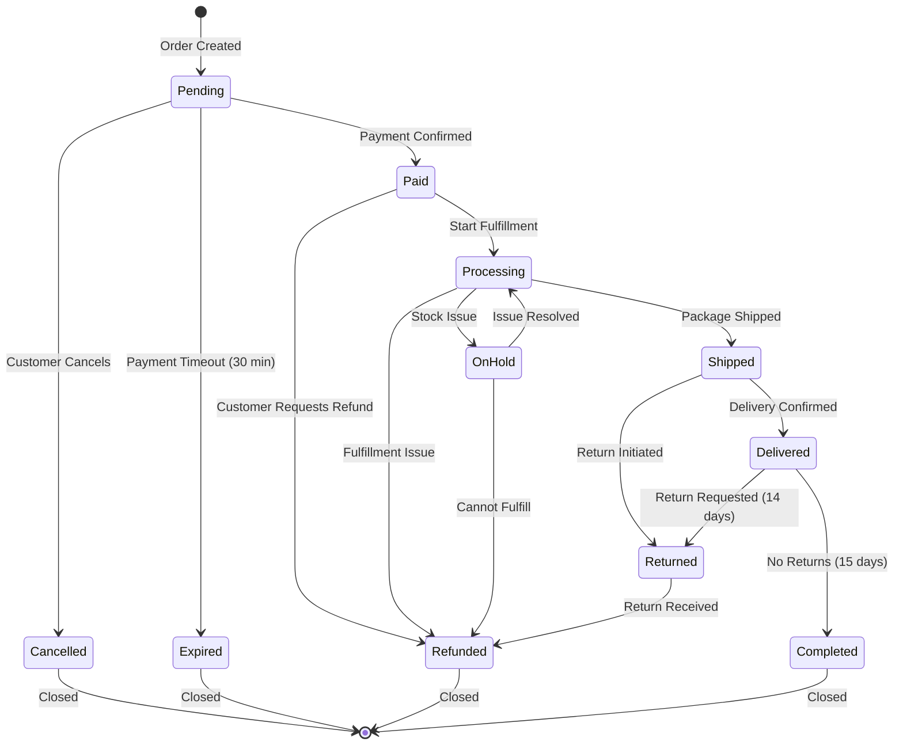
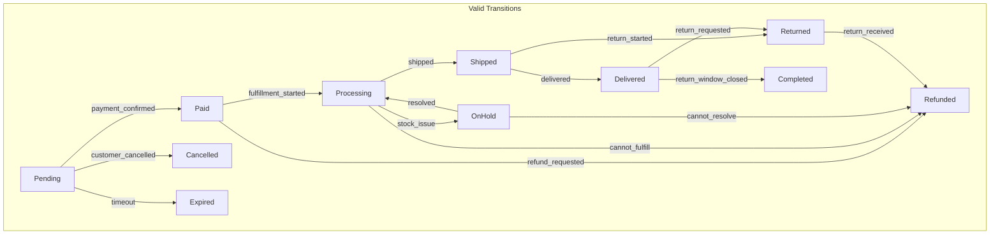
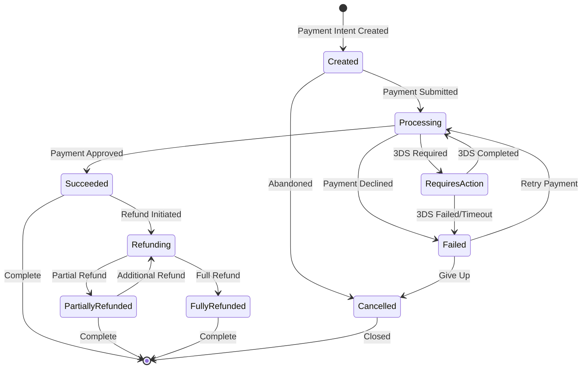
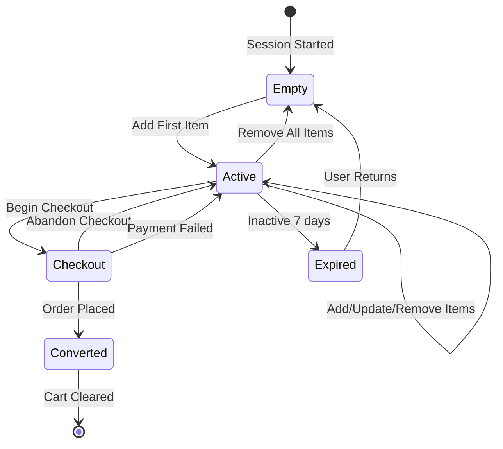
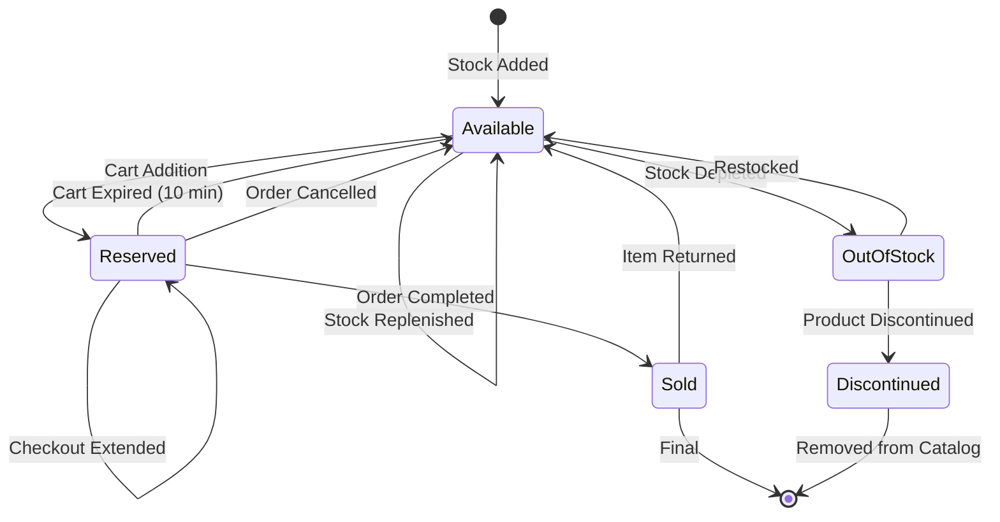
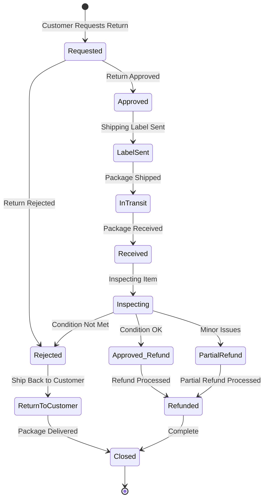
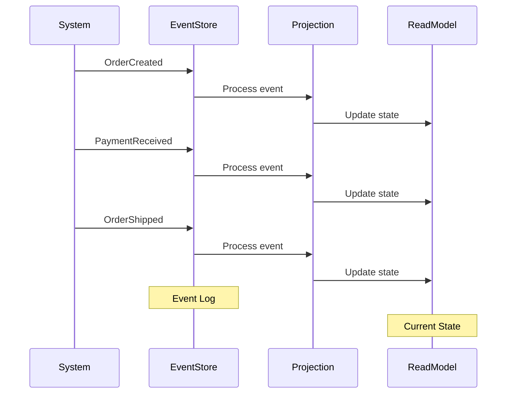

# ShopFlow State Transitions

## Order State Machine

### ASCII State Diagram

```
┌─────────────────────────────────────────────────────────────────────────────┐
│                          ORDER STATE MACHINE                                 │
└─────────────────────────────────────────────────────────────────────────────┘

                              ┌─────────────┐
                              │   PENDING   │
                              │  (Created)  │
                              └──────┬──────┘
                                     │
              ┌──────────────────────┼──────────────────────┐
              │                      │                      │
              ▼                      ▼                      ▼
       ┌─────────────┐        ┌─────────────┐        ┌─────────────┐
       │  CANCELLED  │        │    PAID     │        │   EXPIRED   │
       │ (By User)   │        │ (Payment OK)│        │ (Timeout)   │
       └─────────────┘        └──────┬──────┘        └─────────────┘
                                     │
                                     ▼
                              ┌─────────────┐
                              │ PROCESSING  │
                              │ (Warehouse) │
                              └──────┬──────┘
                                     │
              ┌──────────────────────┼──────────────────────┐
              │                      │                      │
              ▼                      ▼                      ▼
       ┌─────────────┐        ┌─────────────┐        ┌─────────────┐
       │  REFUNDED   │        │   SHIPPED   │        │ ON HOLD     │
       │(Issue Found)│        │(In Transit) │        │(Stock Issue)│
       └─────────────┘        └──────┬──────┘        └─────────────┘
                                     │
                                     ▼
                              ┌─────────────┐
                              │  DELIVERED  │
                              │ (Complete)  │
                              └──────┬──────┘
                                     │
              ┌──────────────────────┴──────────────────────┐
              │                                             │
              ▼                                             ▼
       ┌─────────────┐                               ┌─────────────┐
       │  RETURNED   │                               │  COMPLETED  │
       │(RMA Process)│                               │  (Final)    │
       └─────────────┘                               └─────────────┘
```

### Mermaid Order State Machine



## Order State Details

### State Definitions

| State | Description | Allowed Actions | Duration |
|-------|-------------|-----------------|----------|
| Pending | Order created, awaiting payment | Pay, Cancel | 30 min max |
| Paid | Payment received | Process, Refund | Until processed |
| Processing | Being prepared for shipment | Ship, Hold, Refund | 1-3 days |
| OnHold | Waiting for stock/issue | Resume, Refund | Until resolved |
| Shipped | Package in transit | Track, Return | 3-7 days |
| Delivered | Package delivered | Return, Review | 14 days |
| Completed | Order finalized | View History | Permanent |
| Cancelled | Cancelled before payment | None | Permanent |
| Expired | Payment timeout | None | Permanent |
| Returned | Return in progress | Track Return | 5-10 days |
| Refunded | Refund issued | None | Permanent |

### State Transitions



## Payment State Machine

### Mermaid Payment States



### Payment Transition Events

```typescript
enum PaymentEvent {
  PAYMENT_INTENT_CREATED = 'payment_intent.created',
  PAYMENT_SUBMITTED = 'payment_intent.processing',
  PAYMENT_REQUIRES_ACTION = 'payment_intent.requires_action',
  PAYMENT_SUCCEEDED = 'payment_intent.succeeded',
  PAYMENT_FAILED = 'payment_intent.payment_failed',
  CHARGE_REFUNDED = 'charge.refunded',
  CHARGE_DISPUTED = 'charge.dispute.created',
}
```

## Cart State Machine

### ASCII Cart States

```
┌─────────────────────────────────────────────────────────────────┐
│                      CART STATE MACHINE                          │
└─────────────────────────────────────────────────────────────────┘

  ┌───────────┐     add_item     ┌───────────┐
  │   EMPTY   │─────────────────▶│  ACTIVE   │
  └───────────┘                  └─────┬─────┘
                                       │
                    ┌──────────────────┼──────────────────┐
                    │                  │                  │
                    ▼                  ▼                  ▼
             remove_last        checkout_start      no_activity
                    │                  │                  │
                    ▼                  ▼                  ▼
             ┌───────────┐     ┌───────────┐     ┌───────────┐
             │   EMPTY   │     │ CHECKOUT  │     │  EXPIRED  │
             └───────────┘     └─────┬─────┘     └───────────┘
                                     │
                    ┌────────────────┼────────────────┐
                    │                │                │
                    ▼                ▼                ▼
            order_complete    checkout_abandon   payment_fail
                    │                │                │
                    ▼                ▼                ▼
             ┌───────────┐     ┌───────────┐     ┌───────────┐
             │ CONVERTED │     │  ACTIVE   │     │  ACTIVE   │
             └───────────┘     └───────────┘     └───────────┘
```

### Mermaid Cart States



## Inventory State Machine

### Mermaid Inventory States



### Inventory Transition Rules

```typescript
interface InventoryTransition {
  from: InventoryState;
  to: InventoryState;
  event: string;
  condition?: () => boolean;
  action?: () => void;
}

const transitions: InventoryTransition[] = [
  {
    from: 'AVAILABLE',
    to: 'RESERVED',
    event: 'ADD_TO_CART',
    condition: () => availableStock > 0,
    action: () => createReservation(10 * 60), // 10 min TTL
  },
  {
    from: 'RESERVED',
    to: 'AVAILABLE',
    event: 'RESERVATION_EXPIRED',
    action: () => releaseReservation(),
  },
  {
    from: 'RESERVED',
    to: 'SOLD',
    event: 'ORDER_COMPLETED',
    action: () => deductStock(),
  },
];
```

## Return/RMA State Machine

### Mermaid RMA States



## State Transition Events (Event Sourcing)



### Event Log Example

```json
[
  {
    "eventId": "evt_001",
    "aggregateId": "order_123",
    "type": "OrderCreated",
    "timestamp": "2024-01-15T10:00:00Z",
    "data": { "customerId": "cust_456", "items": [...] }
  },
  {
    "eventId": "evt_002",
    "aggregateId": "order_123",
    "type": "PaymentReceived",
    "timestamp": "2024-01-15T10:05:00Z",
    "data": { "paymentId": "pay_789", "amount": 99.99 }
  },
  {
    "eventId": "evt_003",
    "aggregateId": "order_123",
    "type": "OrderShipped",
    "timestamp": "2024-01-16T14:30:00Z",
    "data": { "trackingNumber": "1Z999AA10123456784", "carrier": "UPS" }
  }
]
```
