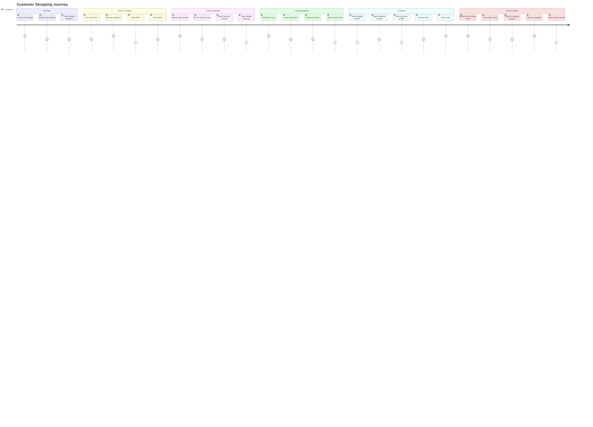
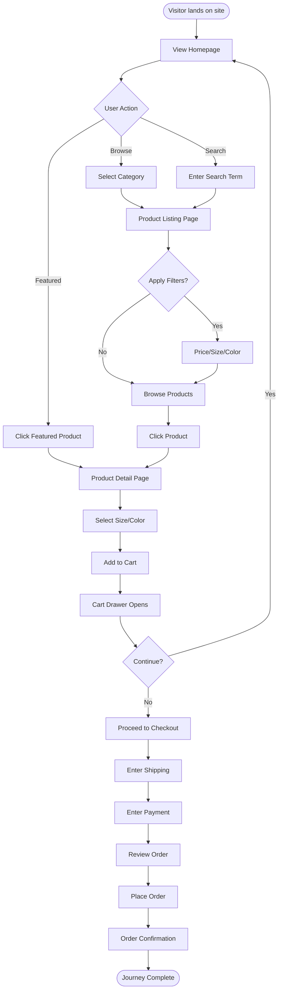
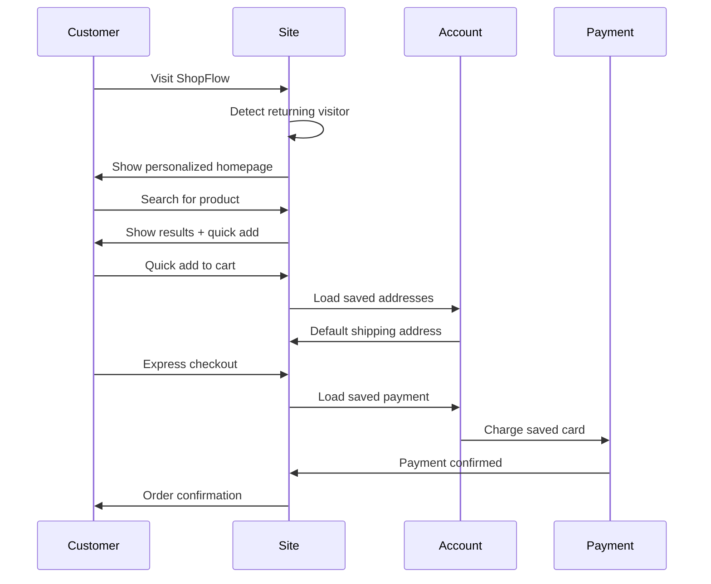
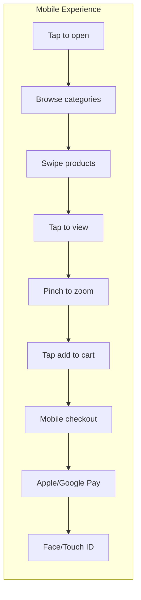
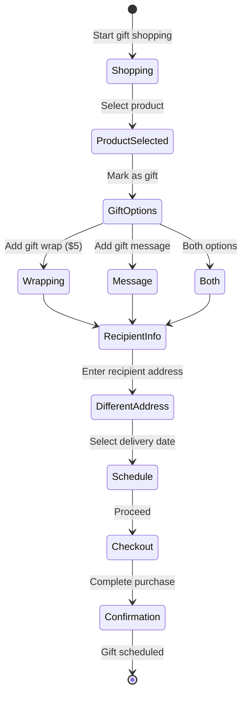
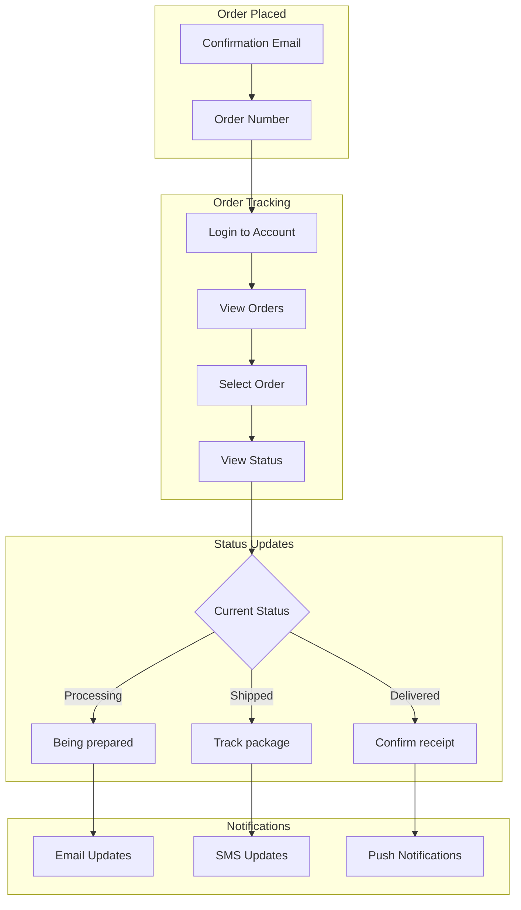
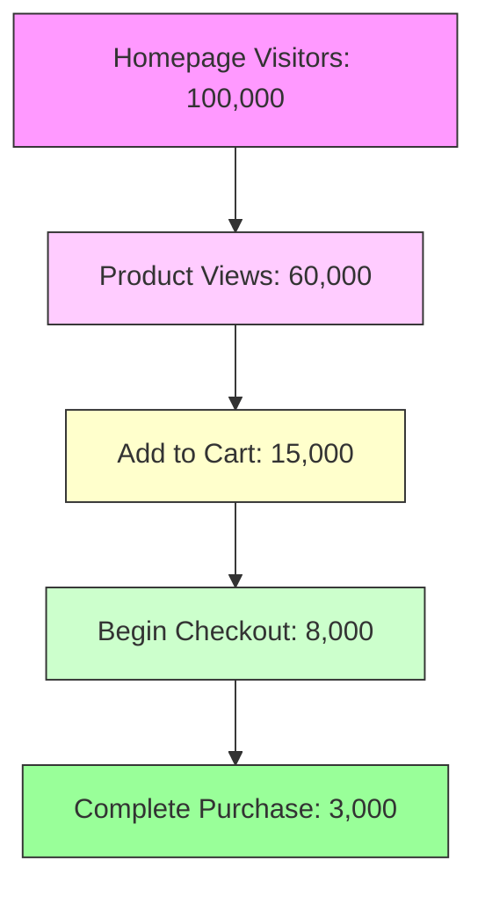

# ShopFlow User Journeys

## Overview

This document maps the complete user journeys through ShopFlow E-commerce platform.

## Primary Shopper Journey

### ASCII Journey Map

```
┌─────────────────────────────────────────────────────────────────────────────┐
│                        COMPLETE SHOPPING JOURNEY                             │
└─────────────────────────────────────────────────────────────────────────────┘

  DISCOVER          BROWSE           SELECT           PURCHASE         RECEIVE
     │                │                │                 │                │
     ▼                ▼                ▼                 ▼                ▼
┌─────────┐    ┌───────────┐    ┌───────────┐    ┌───────────┐    ┌───────────┐
│ Landing │───▶│  Search/  │───▶│  Product  │───▶│ Checkout  │───▶│  Order    │
│  Page   │    │  Browse   │    │  Detail   │    │   Flow    │    │ Tracking  │
└─────────┘    └───────────┘    └───────────┘    └───────────┘    └───────────┘
     │                │                │                 │                │
     │                │                │                 │                │
     ▼                ▼                ▼                 ▼                ▼
  • Hero          • Categories     • Images         • Shipping      • Status
  • Featured      • Filters        • Variants       • Payment       • Updates
  • Categories    • Sort           • Reviews        • Review        • Delivery
  • Search        • Pagination     • Add Cart       • Confirm       • Support
```

### Mermaid Journey Diagram



## Journey 1: Browse to Purchase

### User Story
As a new visitor, I want to browse products by category and purchase items.

### Flow



### Touchpoints

| Stage | Page | Key Elements | Success Metric |
|-------|------|--------------|----------------|
| Discover | Homepage | Hero, Categories, Search | Bounce Rate < 40% |
| Browse | PLP | Filters, Sort, Grid | Time on Page > 2min |
| Select | PDP | Images, Variants, Reviews | Add to Cart Rate > 15% |
| Purchase | Checkout | Forms, Summary, Pay | Conversion Rate > 3% |
| Receive | Tracking | Status, Updates | CSAT > 4.5 |

## Journey 2: Returning Customer Quick Purchase

### ASCII Quick Purchase Flow

```
┌─────────────────────────────────────────────────────────────────┐
│                 RETURNING CUSTOMER QUICK PURCHASE                │
└─────────────────────────────────────────────────────────────────┘

  Login            Search           Quick Add        Express Checkout
    │                │                 │                  │
    ▼                ▼                 ▼                  ▼
┌─────────┐    ┌───────────┐    ┌───────────┐    ┌───────────┐
│  Sign   │───▶│  Search   │───▶│   Add     │───▶│ One-Click │
│   In    │    │ Product   │    │ to Cart   │    │ Purchase  │
└─────────┘    └───────────┘    └───────────┘    └───────────┘
    │                │                 │                  │
    │                │                 │                  │
    ▼                ▼                 ▼                  ▼
  Saved            Recent           Saved              Saved
  Address          Orders           Payment            Method
```

### Mermaid Quick Purchase



## Journey 3: Mobile Shopping



### Mobile-Specific Considerations

| Feature | Desktop | Mobile |
|---------|---------|--------|
| Navigation | Top nav + sidebar | Bottom nav + hamburger |
| Product Grid | 4 columns | 2 columns |
| Image Gallery | Click to expand | Swipe carousel |
| Add to Cart | Button | Sticky bottom bar |
| Checkout | Form | Digital wallet priority |

## Journey 4: Gift Purchase

### ASCII Gift Flow

```
┌─────────────────────────────────────────────────────────────────┐
│                        GIFT PURCHASE JOURNEY                     │
└─────────────────────────────────────────────────────────────────┘

  Select Gift      Gift Options      Recipient         Gift Sent
      │                │                │                  │
      ▼                ▼                ▼                  ▼
┌───────────┐    ┌───────────┐    ┌───────────┐    ┌───────────┐
│  Browse   │───▶│   Gift    │───▶│  Enter    │───▶│ Schedule  │
│ Products  │    │  Wrapping │    │ Recipient │    │  Delivery │
└───────────┘    └───────────┘    └───────────┘    └───────────┘
                       │                │
                       ▼                ▼
                 Gift Message      Different
                 Added             Shipping Addr
```

### Mermaid Gift Journey



## Journey 5: Order Tracking



## Pain Points & Solutions

| Journey Stage | Pain Point | Solution |
|---------------|------------|----------|
| Search | No results | Smart suggestions, fuzzy search |
| Browse | Too many products | Better filters, AI recommendations |
| Product | Unclear sizing | Size guide, customer photos |
| Cart | Abandoned cart | Email reminders, exit intent popup |
| Checkout | Long forms | Autofill, address validation |
| Payment | Payment failure | Clear error, alternative methods |
| Tracking | No updates | Real-time tracking, push notifications |

## Conversion Funnel



### Funnel Metrics

| Stage | Count | Rate | Target |
|-------|-------|------|--------|
| Visitors | 100,000 | 100% | - |
| Product Views | 60,000 | 60% | 65% |
| Add to Cart | 15,000 | 25% | 30% |
| Begin Checkout | 8,000 | 53% | 60% |
| Purchase | 3,000 | 37% | 45% |
| **Overall Conversion** | - | **3%** | **4%** |
