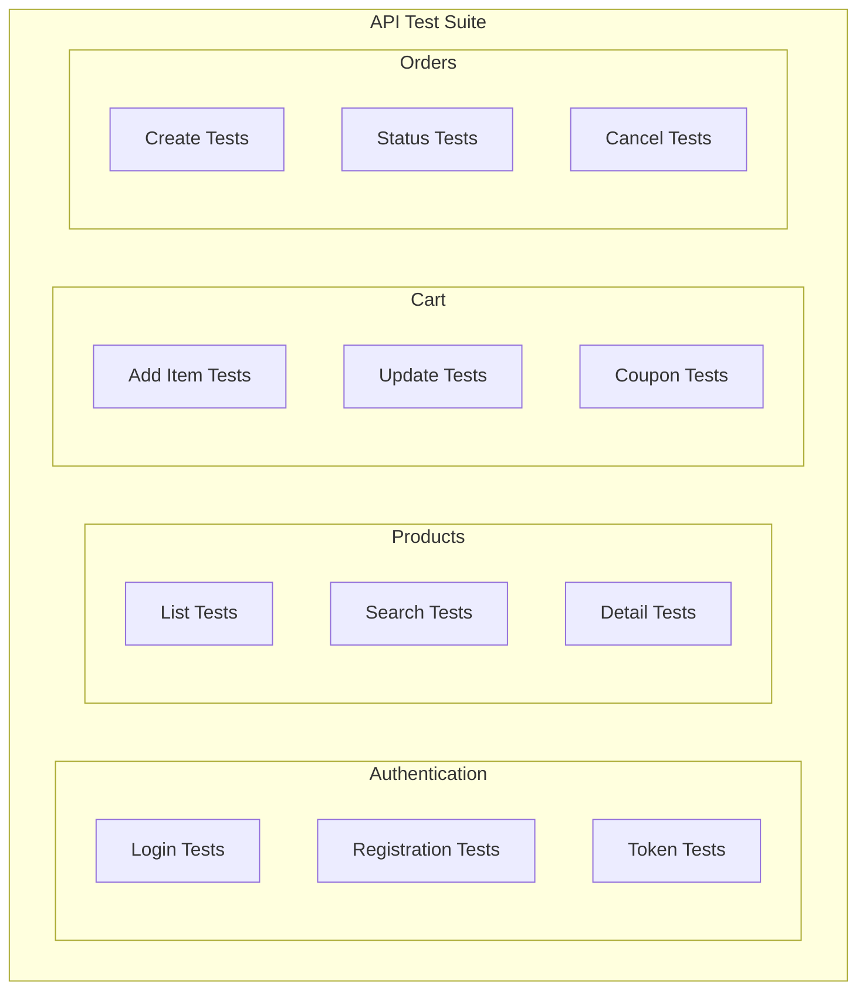

# ShopFlow API Test Suite

## Overview

Comprehensive API test suite for validating all ShopFlow e-commerce endpoints.

---

## Test Suite Architecture



---

## Authentication Tests

```typescript
// tests/api/auth.test.ts
import request from 'supertest';
import { app } from '@/app';

describe('Authentication API', () => {
  describe('POST /auth/register', () => {
    it('should register new user', async () => {
      const response = await request(app)
        .post('/auth/register')
        .send({
          email: 'newuser@test.com',
          password: 'SecureP@ss123',
          firstName: 'New',
          lastName: 'User',
          acceptTerms: true,
        })
        .expect(201);

      expect(response.body).toMatchObject({
        user: {
          email: 'newuser@test.com',
          firstName: 'New',
        },
        accessToken: expect.any(String),
        refreshToken: expect.any(String),
      });
    });

    it('should reject duplicate email', async () => {
      const response = await request(app)
        .post('/auth/register')
        .send({
          email: 'existing@test.com',
          password: 'SecureP@ss123',
          firstName: 'Test',
          lastName: 'User',
          acceptTerms: true,
        })
        .expect(409);

      expect(response.body.error.code).toBe('EMAIL_EXISTS');
    });

    it('should validate password strength', async () => {
      const response = await request(app)
        .post('/auth/register')
        .send({
          email: 'test@test.com',
          password: 'weak',
          firstName: 'Test',
          lastName: 'User',
          acceptTerms: true,
        })
        .expect(422);

      expect(response.body.error.details.fields).toContainEqual(
        expect.objectContaining({ field: 'password' })
      );
    });
  });

  describe('POST /auth/login', () => {
    it('should login with valid credentials', async () => {
      const response = await request(app)
        .post('/auth/login')
        .send({
          email: 'customer@test.com',
          password: 'password123',
        })
        .expect(200);

      expect(response.body).toMatchObject({
        accessToken: expect.any(String),
        refreshToken: expect.any(String),
        expiresIn: expect.any(Number),
      });
    });

    it('should reject invalid credentials', async () => {
      const response = await request(app)
        .post('/auth/login')
        .send({
          email: 'customer@test.com',
          password: 'wrongpassword',
        })
        .expect(401);

      expect(response.body.error.code).toBe('INVALID_CREDENTIALS');
    });

    it('should lock account after 5 failed attempts', async () => {
      for (let i = 0; i < 5; i++) {
        await request(app)
          .post('/auth/login')
          .send({ email: 'locktest@test.com', password: 'wrong' });
      }

      const response = await request(app)
        .post('/auth/login')
        .send({ email: 'locktest@test.com', password: 'correct' })
        .expect(401);

      expect(response.body.error.code).toBe('ACCOUNT_LOCKED');
    });
  });

  describe('POST /auth/refresh', () => {
    it('should refresh access token', async () => {
      const loginResponse = await request(app)
        .post('/auth/login')
        .send({ email: 'customer@test.com', password: 'password123' });

      const response = await request(app)
        .post('/auth/refresh')
        .send({ refreshToken: loginResponse.body.refreshToken })
        .expect(200);

      expect(response.body.accessToken).toBeDefined();
      expect(response.body.accessToken).not.toBe(loginResponse.body.accessToken);
    });
  });
});
```

---

## Products API Tests

```typescript
// tests/api/products.test.ts
describe('Products API', () => {
  let authToken: string;

  beforeAll(async () => {
    authToken = await getAuthToken();
  });

  describe('GET /api/products', () => {
    it('should return paginated products', async () => {
      const response = await request(app)
        .get('/api/products')
        .set('Authorization', `Bearer ${authToken}`)
        .query({ page: 1, limit: 10 })
        .expect(200);

      expect(response.body.data).toHaveLength(10);
      expect(response.body.pagination).toMatchObject({
        page: 1,
        limit: 10,
        total: expect.any(Number),
        pages: expect.any(Number),
      });
    });

    it('should filter by category', async () => {
      const response = await request(app)
        .get('/api/products')
        .set('Authorization', `Bearer ${authToken}`)
        .query({ category: 'clothing' })
        .expect(200);

      response.body.data.forEach((product: any) => {
        expect(product.category.slug).toBe('clothing');
      });
    });

    it('should filter by price range', async () => {
      const response = await request(app)
        .get('/api/products')
        .set('Authorization', `Bearer ${authToken}`)
        .query({ minPrice: 20, maxPrice: 50 })
        .expect(200);

      response.body.data.forEach((product: any) => {
        expect(product.price).toBeGreaterThanOrEqual(20);
        expect(product.price).toBeLessThanOrEqual(50);
      });
    });

    it('should sort by price ascending', async () => {
      const response = await request(app)
        .get('/api/products')
        .set('Authorization', `Bearer ${authToken}`)
        .query({ sort: 'price' })
        .expect(200);

      const prices = response.body.data.map((p: any) => p.price);
      expect(prices).toEqual([...prices].sort((a, b) => a - b));
    });
  });

  describe('GET /api/products/search', () => {
    it('should search products by query', async () => {
      const response = await request(app)
        .get('/api/products/search')
        .set('Authorization', `Bearer ${authToken}`)
        .query({ q: 'shirt' })
        .expect(200);

      expect(response.body.data.length).toBeGreaterThan(0);
    });
  });

  describe('GET /api/products/:id', () => {
    it('should return product details', async () => {
      const response = await request(app)
        .get('/api/products/prod_tshirt_test')
        .set('Authorization', `Bearer ${authToken}`)
        .expect(200);

      expect(response.body).toMatchObject({
        id: 'prod_tshirt_test',
        name: expect.any(String),
        price: expect.any(Number),
        variants: expect.any(Array),
      });
    });

    it('should return 404 for non-existent product', async () => {
      const response = await request(app)
        .get('/api/products/prod_nonexistent')
        .set('Authorization', `Bearer ${authToken}`)
        .expect(404);

      expect(response.body.error.code).toBe('PRODUCT_NOT_FOUND');
    });
  });
});
```

---

## Cart API Tests

```typescript
// tests/api/cart.test.ts
describe('Cart API', () => {
  let authToken: string;

  beforeAll(async () => {
    authToken = await getAuthToken();
  });

  beforeEach(async () => {
    await clearCart(authToken);
  });

  describe('POST /api/cart/items', () => {
    it('should add item to cart', async () => {
      const response = await request(app)
        .post('/api/cart/items')
        .set('Authorization', `Bearer ${authToken}`)
        .send({
          productId: 'prod_tshirt_test',
          variantId: 'var_tshirt_m',
          quantity: 2,
        })
        .expect(200);

      expect(response.body.items).toHaveLength(1);
      expect(response.body.items[0]).toMatchObject({
        productId: 'prod_tshirt_test',
        quantity: 2,
      });
    });

    it('should reject out of stock product', async () => {
      const response = await request(app)
        .post('/api/cart/items')
        .set('Authorization', `Bearer ${authToken}`)
        .send({
          productId: 'prod_oos_test',
          quantity: 1,
        })
        .expect(400);

      expect(response.body.error.code).toBe('OUT_OF_STOCK');
    });
  });

  describe('PATCH /api/cart/items/:id', () => {
    it('should update item quantity', async () => {
      // Add item first
      const addResponse = await request(app)
        .post('/api/cart/items')
        .set('Authorization', `Bearer ${authToken}`)
        .send({ productId: 'prod_tshirt_test', quantity: 1 });

      const itemId = addResponse.body.items[0].id;

      const response = await request(app)
        .patch(`/api/cart/items/${itemId}`)
        .set('Authorization', `Bearer ${authToken}`)
        .send({ quantity: 5 })
        .expect(200);

      expect(response.body.items[0].quantity).toBe(5);
    });
  });

  describe('POST /api/cart/coupon', () => {
    it('should apply valid coupon', async () => {
      await addItemToCart(authToken);

      const response = await request(app)
        .post('/api/cart/coupon')
        .set('Authorization', `Bearer ${authToken}`)
        .send({ code: 'SAVE10' })
        .expect(200);

      expect(response.body.discount).toBeGreaterThan(0);
      expect(response.body.coupon.code).toBe('SAVE10');
    });

    it('should reject invalid coupon', async () => {
      const response = await request(app)
        .post('/api/cart/coupon')
        .set('Authorization', `Bearer ${authToken}`)
        .send({ code: 'INVALID' })
        .expect(400);

      expect(response.body.error.code).toBe('INVALID_COUPON');
    });
  });
});
```

---

## Orders API Tests

```typescript
// tests/api/orders.test.ts
describe('Orders API', () => {
  let authToken: string;

  beforeAll(async () => {
    authToken = await getAuthToken();
  });

  describe('POST /api/orders', () => {
    beforeEach(async () => {
      await setupCartWithItems(authToken);
    });

    it('should create order', async () => {
      const response = await request(app)
        .post('/api/orders')
        .set('Authorization', `Bearer ${authToken}`)
        .send({
          shippingAddress: testAddress,
          paymentMethodId: 'pm_card_visa',
        })
        .expect(201);

      expect(response.body).toMatchObject({
        orderNumber: expect.stringMatching(/^SF-/),
        status: 'pending',
        items: expect.any(Array),
        total: expect.any(Number),
      });
    });

    it('should reject empty cart', async () => {
      await clearCart(authToken);

      const response = await request(app)
        .post('/api/orders')
        .set('Authorization', `Bearer ${authToken}`)
        .send({
          shippingAddress: testAddress,
          paymentMethodId: 'pm_card_visa',
        })
        .expect(400);

      expect(response.body.error.code).toBe('CART_EMPTY');
    });
  });

  describe('POST /api/orders/:id/cancel', () => {
    it('should cancel pending order', async () => {
      const order = await createTestOrder(authToken);

      const response = await request(app)
        .post(`/api/orders/${order.id}/cancel`)
        .set('Authorization', `Bearer ${authToken}`)
        .send({ reason: 'Changed my mind' })
        .expect(200);

      expect(response.body.status).toBe('cancelled');
    });

    it('should reject cancelling shipped order', async () => {
      const order = await createTestOrder(authToken, { status: 'shipped' });

      const response = await request(app)
        .post(`/api/orders/${order.id}/cancel`)
        .set('Authorization', `Bearer ${authToken}`)
        .send({ reason: 'Too late' })
        .expect(400);

      expect(response.body.error.code).toBe('ORDER_CANNOT_BE_CANCELLED');
    });
  });
});
```

---

## Running API Tests

```bash
# Run all API tests
npm run test:api

# Run specific test file
npm run test:api -- auth.test.ts

# Run with coverage
npm run test:api -- --coverage

# Run in watch mode
npm run test:api -- --watch
```

---

## Related Documents

- [Testing Strategy](./strategy.md)
- [API Reference](../api/reference.md)
- [cURL Examples](../api/curl-examples.md)
