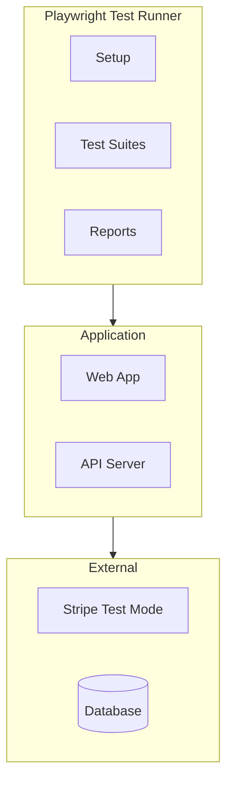

# ShopFlow E2E Tests

## Overview

End-to-end testing for the ShopFlow e-commerce platform using Playwright.

---

## E2E Test Architecture



---

## Configuration

```typescript
// playwright.config.ts
import { PlaywrightTestConfig, devices } from '@playwright/test';

const config: PlaywrightTestConfig = {
  testDir: './tests/e2e',
  timeout: 60000,
  retries: process.env.CI ? 2 : 0,
  workers: process.env.CI ? 2 : undefined,

  use: {
    baseURL: process.env.E2E_BASE_URL || 'http://localhost:3000',
    trace: 'on-first-retry',
    screenshot: 'only-on-failure',
    video: 'retain-on-failure',
  },

  projects: [
    {
      name: 'chromium',
      use: { ...devices['Desktop Chrome'] },
    },
    {
      name: 'firefox',
      use: { ...devices['Desktop Firefox'] },
    },
    {
      name: 'mobile-chrome',
      use: { ...devices['Pixel 5'] },
    },
  ],

  reporter: [
    ['list'],
    ['html', { outputFolder: 'test-results/html' }],
  ],
};

export default config;
```

---

## User Registration Flow

```typescript
// tests/e2e/auth/registration.spec.ts
import { test, expect } from '@playwright/test';
import { faker } from '@faker-js/faker';

test.describe('User Registration', () => {
  test('should register new user successfully', async ({ page }) => {
    const email = faker.internet.email();
    const password = 'SecureP@ss123';

    await page.goto('/register');

    // Fill registration form
    await page.fill('[name="firstName"]', 'John');
    await page.fill('[name="lastName"]', 'Doe');
    await page.fill('[name="email"]', email);
    await page.fill('[name="password"]', password);
    await page.fill('[name="confirmPassword"]', password);
    await page.check('[name="acceptTerms"]');

    // Submit
    await page.click('button[type="submit"]');

    // Verify redirect to dashboard
    await expect(page).toHaveURL('/account');
    await expect(page.locator('h1')).toContainText('Welcome, John');
  });

  test('should show validation errors', async ({ page }) => {
    await page.goto('/register');

    // Submit empty form
    await page.click('button[type="submit"]');

    // Check error messages
    await expect(page.locator('[data-error="email"]')).toBeVisible();
    await expect(page.locator('[data-error="password"]')).toBeVisible();
  });

  test('should show error for existing email', async ({ page }) => {
    await page.goto('/register');

    await page.fill('[name="email"]', 'existing@example.com');
    await page.fill('[name="password"]', 'SecureP@ss123');
    await page.click('button[type="submit"]');

    await expect(page.locator('.error-message')).toContainText(
      'Email already registered'
    );
  });
});
```

---

## Product Browse Flow

```typescript
// tests/e2e/products/browse.spec.ts
import { test, expect } from '@playwright/test';

test.describe('Product Browsing', () => {
  test('should display product listing', async ({ page }) => {
    await page.goto('/products');

    // Verify products are displayed
    const products = page.locator('[data-testid="product-card"]');
    await expect(products).toHaveCount(20); // Default page size

    // Verify product card content
    const firstProduct = products.first();
    await expect(firstProduct.locator('.product-name')).toBeVisible();
    await expect(firstProduct.locator('.product-price')).toBeVisible();
    await expect(firstProduct.locator('img')).toBeVisible();
  });

  test('should filter products by category', async ({ page }) => {
    await page.goto('/products');

    // Select category filter
    await page.click('[data-testid="category-filter"]');
    await page.click('text=Clothing');

    // Verify URL and results
    await expect(page).toHaveURL(/category=clothing/);
    await expect(page.locator('.active-filter')).toContainText('Clothing');
  });

  test('should search for products', async ({ page }) => {
    await page.goto('/products');

    // Enter search query
    await page.fill('[data-testid="search-input"]', 'blue shirt');
    await page.press('[data-testid="search-input"]', 'Enter');

    // Verify search results
    await expect(page).toHaveURL(/q=blue\+shirt/);
    await expect(page.locator('.search-results-count')).toBeVisible();
  });

  test('should navigate to product detail', async ({ page }) => {
    await page.goto('/products');

    // Click first product
    await page.click('[data-testid="product-card"]:first-child');

    // Verify product detail page
    await expect(page.locator('h1.product-title')).toBeVisible();
    await expect(page.locator('.product-price')).toBeVisible();
    await expect(page.locator('button:has-text("Add to Cart")')).toBeVisible();
  });
});
```

---

## Complete Checkout Flow

```typescript
// tests/e2e/checkout/complete-flow.spec.ts
import { test, expect } from '@playwright/test';

test.describe('Complete Checkout Flow', () => {
  test.beforeEach(async ({ page }) => {
    // Login as test user
    await page.goto('/login');
    await page.fill('[name="email"]', 'test@example.com');
    await page.fill('[name="password"]', 'password123');
    await page.click('button[type="submit"]');
    await expect(page).toHaveURL('/');
  });

  test('should complete purchase successfully', async ({ page }) => {
    // 1. Browse to product
    await page.goto('/products/classic-tshirt');

    // 2. Select variant and add to cart
    await page.click('button:has-text("M")'); // Select size
    await page.click('button:has-text("Add to Cart")');

    // Verify cart notification
    await expect(page.locator('.toast')).toContainText('Added to cart');

    // 3. Go to cart
    await page.click('[data-testid="cart-icon"]');
    await expect(page).toHaveURL('/cart');

    // Verify item in cart
    await expect(page.locator('.cart-item')).toHaveCount(1);

    // 4. Proceed to checkout
    await page.click('button:has-text("Checkout")');
    await expect(page).toHaveURL('/checkout');

    // 5. Fill shipping address
    await page.fill('[name="firstName"]', 'John');
    await page.fill('[name="lastName"]', 'Doe');
    await page.fill('[name="address1"]', '123 Main St');
    await page.fill('[name="city"]', 'New York');
    await page.selectOption('[name="state"]', 'NY');
    await page.fill('[name="postalCode"]', '10001');
    await page.fill('[name="phone"]', '2125551234');

    await page.click('button:has-text("Continue to Payment")');

    // 6. Enter payment (Stripe test card)
    const stripeFrame = page.frameLocator('iframe[name*="stripe"]').first();
    await stripeFrame.locator('[name="cardnumber"]').fill('4242424242424242');
    await stripeFrame.locator('[name="exp-date"]').fill('1230');
    await stripeFrame.locator('[name="cvc"]').fill('123');

    // 7. Place order
    await page.click('button:has-text("Place Order")');

    // 8. Verify order confirmation
    await expect(page).toHaveURL(/\/order-confirmation/);
    await expect(page.locator('h1')).toContainText('Thank you');
    await expect(page.locator('.order-number')).toBeVisible();
  });

  test('should show error for declined card', async ({ page }) => {
    // Add item and go to checkout
    await addItemToCart(page);
    await page.goto('/checkout');

    // Fill shipping
    await fillShippingAddress(page);
    await page.click('button:has-text("Continue to Payment")');

    // Enter declined card
    const stripeFrame = page.frameLocator('iframe[name*="stripe"]').first();
    await stripeFrame.locator('[name="cardnumber"]').fill('4000000000000002');
    await stripeFrame.locator('[name="exp-date"]').fill('1230');
    await stripeFrame.locator('[name="cvc"]').fill('123');

    await page.click('button:has-text("Place Order")');

    // Verify error message
    await expect(page.locator('.payment-error')).toContainText('declined');
  });
});
```

---

## Cart Operations

```typescript
// tests/e2e/cart/operations.spec.ts
test.describe('Cart Operations', () => {
  test('should update item quantity', async ({ page }) => {
    await addItemToCart(page);
    await page.goto('/cart');

    // Increase quantity
    await page.click('[data-testid="quantity-increase"]');

    // Verify quantity updated
    await expect(page.locator('[data-testid="quantity-input"]')).toHaveValue('2');

    // Verify total updated
    const total = await page.locator('.cart-total').textContent();
    expect(parseFloat(total!.replace('$', ''))).toBeGreaterThan(0);
  });

  test('should remove item from cart', async ({ page }) => {
    await addItemToCart(page);
    await page.goto('/cart');

    await page.click('[data-testid="remove-item"]');

    await expect(page.locator('.empty-cart')).toBeVisible();
    await expect(page.locator('.empty-cart')).toContainText('Your cart is empty');
  });

  test('should apply coupon code', async ({ page }) => {
    await addItemToCart(page);
    await page.goto('/cart');

    await page.fill('[data-testid="coupon-input"]', 'SAVE10');
    await page.click('button:has-text("Apply")');

    await expect(page.locator('.discount-applied')).toBeVisible();
    await expect(page.locator('.discount-amount')).toContainText('-');
  });
});
```

---

## Visual Testing

```typescript
// tests/e2e/visual/screenshots.spec.ts
test.describe('Visual Regression', () => {
  test('homepage should match snapshot', async ({ page }) => {
    await page.goto('/');
    await expect(page).toHaveScreenshot('homepage.png', {
      fullPage: true,
      maxDiffPixels: 100,
    });
  });

  test('product page should match snapshot', async ({ page }) => {
    await page.goto('/products/classic-tshirt');
    await expect(page).toHaveScreenshot('product-detail.png');
  });

  test('cart page should match snapshot', async ({ page }) => {
    await addItemToCart(page);
    await page.goto('/cart');
    await expect(page).toHaveScreenshot('cart-with-item.png');
  });
});
```

---

## Running E2E Tests

```bash
# Run all E2E tests
npm run test:e2e

# Run specific test file
npm run test:e2e -- checkout.spec.ts

# Run with UI mode
npm run test:e2e -- --ui

# Run specific browser
npm run test:e2e -- --project=chromium

# Run headed (visible browser)
npm run test:e2e -- --headed

# Debug mode
npm run test:e2e -- --debug

# Update snapshots
npm run test:e2e -- --update-snapshots
```

---

## Related Documents

- [Testing Strategy](./strategy.md)
- [Integration Tests](./integration-tests.md)
- [Test Data](./test-data.md)
