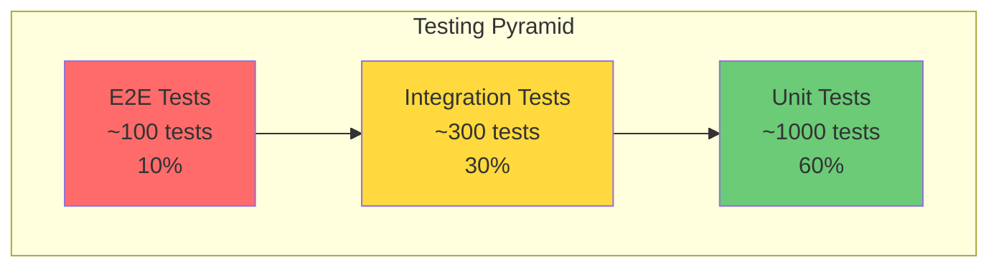
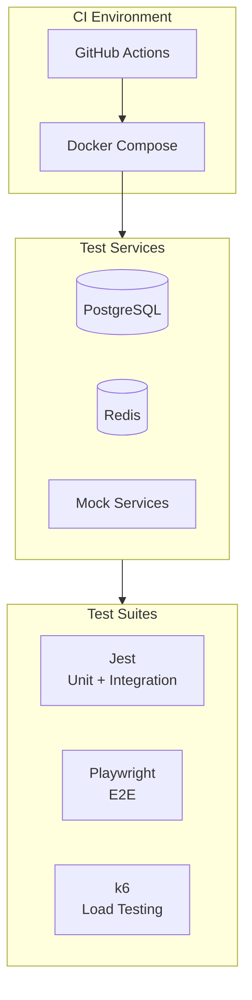
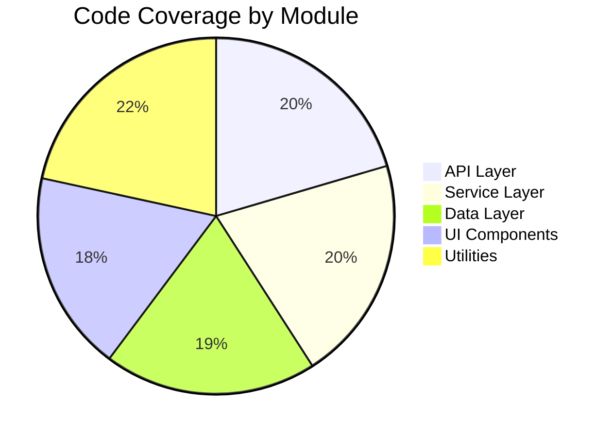
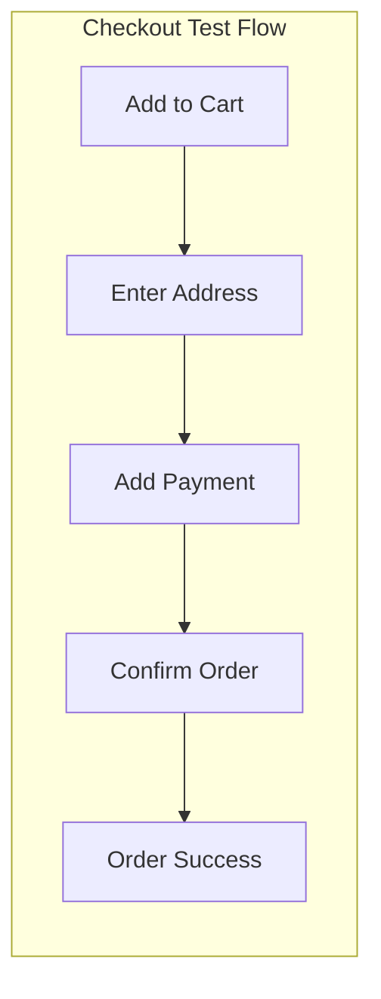
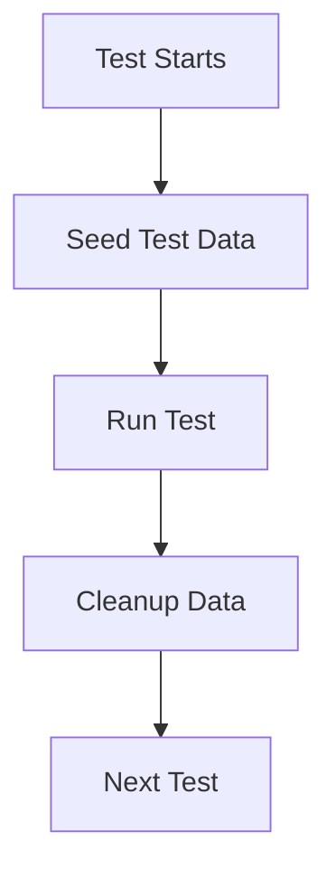
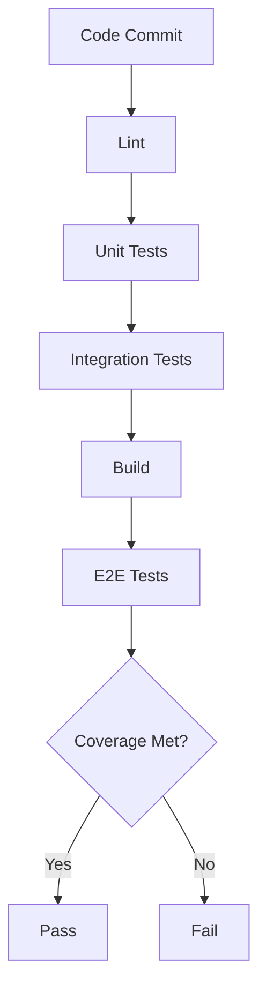

# ShopFlow Testing Strategy

## Overview

Comprehensive testing strategy for the ShopFlow e-commerce platform.

---

## Testing Pyramid



---

## Test Categories

### Unit Tests

| Area | Coverage Target | Description |
|------|-----------------|-------------|
| Services | 90% | Business logic |
| Utilities | 95% | Helper functions |
| Validators | 95% | Input validation |
| Models | 85% | Data models |
| Hooks (React) | 85% | Custom hooks |
| Components | 80% | UI components |

### Integration Tests

| Area | Coverage Target | Description |
|------|-----------------|-------------|
| API Endpoints | 90% | REST endpoints |
| Database Queries | 85% | Prisma operations |
| External Services | 80% | Stripe, AWS, etc. |
| Queue Workers | 85% | SQS message processing |

### End-to-End Tests

| Scenario | Priority | Description |
|----------|----------|-------------|
| User Registration | Critical | Sign up flow |
| Product Browse | Critical | Search and filter |
| Add to Cart | Critical | Shopping cart |
| Checkout | Critical | Order placement |
| Payment | Critical | Stripe payment |
| Order History | High | Past orders |
| Wishlist | Medium | Save for later |

---

## Test Infrastructure



---

## Coverage Requirements



### Coverage Thresholds

```javascript
// jest.config.js
module.exports = {
  coverageThreshold: {
    global: {
      branches: 80,
      functions: 85,
      lines: 85,
      statements: 85,
    },
    './src/services/': {
      branches: 90,
      functions: 90,
      lines: 90,
    },
    './src/api/': {
      branches: 85,
      functions: 90,
      lines: 90,
    },
  },
};
```

---

## Test Environments

| Environment | Purpose | Data |
|-------------|---------|------|
| Local | Development testing | Seeded test data |
| CI | Automated testing | Fresh DB per run |
| Staging | Pre-production | Sanitized production |

---

## Critical Test Flows

### Checkout Flow



### Payment Test Scenarios

| Scenario | Test Card | Expected |
|----------|-----------|----------|
| Success | 4242424242424242 | Order created |
| Decline | 4000000000000002 | Error shown |
| Insufficient | 4000000000009995 | Error shown |
| 3DS Required | 4000002500003155 | Auth modal |
| Network Error | Mock failure | Retry option |

---

## Test Data Strategy

### Data Categories

- **Static Fixtures**: Predefined test data
- **Factories**: Generated test objects
- **Snapshots**: UI component states
- **Mocks**: External service responses

### Data Isolation



---

## Performance Testing

### Load Test Scenarios

| Scenario | Users | Duration | Target |
|----------|-------|----------|--------|
| Normal Load | 100 | 5 min | P95 < 200ms |
| Peak Load | 500 | 10 min | P95 < 500ms |
| Stress Test | 1000 | 5 min | No crashes |
| Soak Test | 200 | 1 hour | Memory stable |

---

## Test Execution



---

## Test Commands

```bash
# Run all tests
npm test

# Unit tests only
npm run test:unit

# Integration tests
npm run test:integration

# E2E tests
npm run test:e2e

# With coverage
npm run test:coverage

# Watch mode
npm run test:watch

# Load tests
npm run test:load
```

---

## Related Documents

- [Unit Tests](./unit-tests.md)
- [Integration Tests](./integration-tests.md)
- [E2E Tests](./e2e-tests.md)
- [Test Data](./test-data.md)
