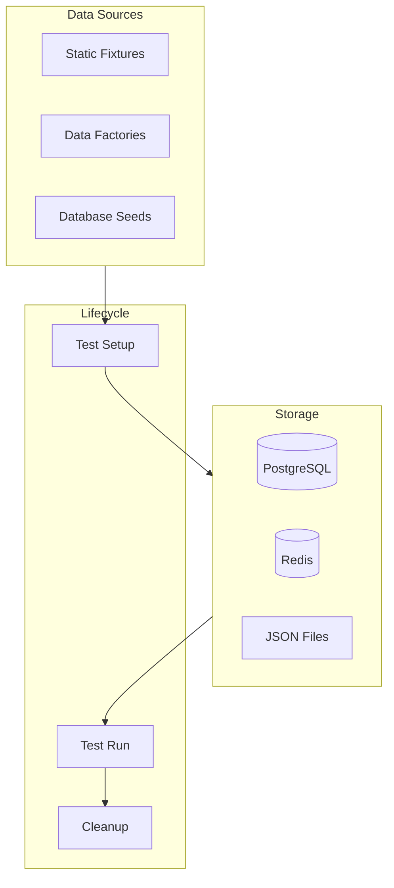
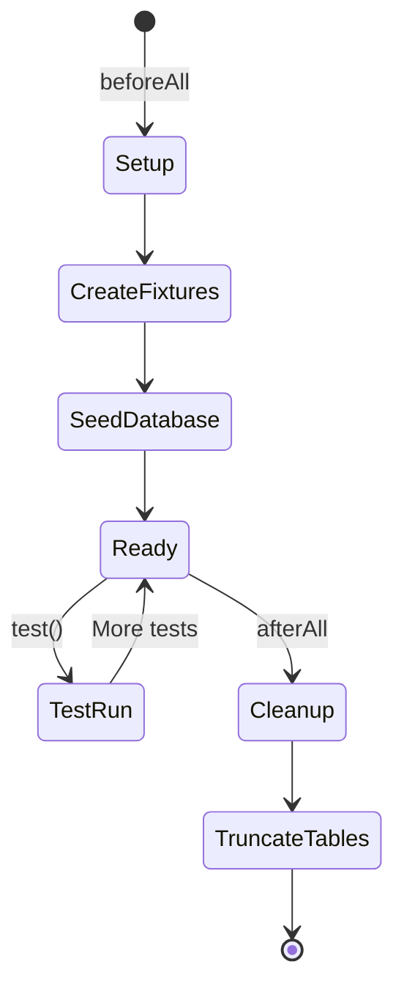

# ShopFlow Test Data

## Overview

Test data management strategies and fixtures for the ShopFlow e-commerce platform.

---

## Test Data Architecture



---

## Static Fixtures

### User Fixtures

```typescript
// tests/fixtures/users.ts
export const userFixtures = {
  customer: {
    id: 'usr_customer_test',
    email: 'customer@test.shopflow.io',
    password: 'password123',
    firstName: 'Test',
    lastName: 'Customer',
    role: 'customer',
  },

  admin: {
    id: 'usr_admin_test',
    email: 'admin@test.shopflow.io',
    password: 'admin123',
    firstName: 'Admin',
    lastName: 'User',
    role: 'admin',
  },

  premiumCustomer: {
    id: 'usr_premium_test',
    email: 'premium@test.shopflow.io',
    password: 'premium123',
    firstName: 'Premium',
    lastName: 'Customer',
    role: 'customer',
    tier: 'premium',
  },
};
```

### Product Fixtures

```typescript
// tests/fixtures/products.ts
export const productFixtures = {
  tshirt: {
    id: 'prod_tshirt_test',
    name: 'Classic T-Shirt',
    slug: 'classic-tshirt',
    description: 'Comfortable cotton t-shirt',
    price: 29.99,
    compareAtPrice: 39.99,
    categoryId: 'cat_clothing',
    stock: 100,
    variants: [
      { id: 'var_tshirt_s', size: 'S', color: 'Black', stock: 25 },
      { id: 'var_tshirt_m', size: 'M', color: 'Black', stock: 30 },
      { id: 'var_tshirt_l', size: 'L', color: 'Black', stock: 25 },
      { id: 'var_tshirt_xl', size: 'XL', color: 'Black', stock: 20 },
    ],
  },

  outOfStock: {
    id: 'prod_oos_test',
    name: 'Sold Out Item',
    slug: 'sold-out-item',
    price: 49.99,
    stock: 0,
  },

  expensive: {
    id: 'prod_expensive_test',
    name: 'Luxury Watch',
    slug: 'luxury-watch',
    price: 999.99,
    stock: 5,
  },
};
```

### Coupon Fixtures

```typescript
// tests/fixtures/coupons.ts
export const couponFixtures = {
  percentOff: {
    id: 'coupon_percent_test',
    code: 'SAVE10',
    type: 'percentage',
    value: 10,
    minOrderAmount: 0,
    active: true,
  },

  fixedOff: {
    id: 'coupon_fixed_test',
    code: 'MINUS20',
    type: 'fixed',
    value: 20,
    minOrderAmount: 50,
    active: true,
  },

  expired: {
    id: 'coupon_expired_test',
    code: 'EXPIRED',
    type: 'percentage',
    value: 50,
    active: true,
    expiresAt: new Date('2020-01-01'),
  },

  freeShipping: {
    id: 'coupon_freeship_test',
    code: 'FREESHIP',
    type: 'free_shipping',
    value: 0,
    minOrderAmount: 25,
    active: true,
  },
};
```

---

## Data Factories

### Product Factory

```typescript
// tests/factories/product.factory.ts
import { faker } from '@faker-js/faker';

interface ProductOptions {
  category?: string;
  priceRange?: { min: number; max: number };
  stock?: number;
}

export class ProductFactory {
  static create(options: ProductOptions = {}) {
    const price = options.priceRange
      ? faker.number.float({
          min: options.priceRange.min,
          max: options.priceRange.max,
          precision: 0.01,
        })
      : faker.number.float({ min: 9.99, max: 199.99, precision: 0.01 });

    return {
      id: `prod_${faker.string.alphanumeric(12)}`,
      name: faker.commerce.productName(),
      slug: faker.helpers.slugify(faker.commerce.productName()).toLowerCase(),
      description: faker.commerce.productDescription(),
      price,
      compareAtPrice: faker.datatype.boolean() ? price * 1.2 : null,
      categoryId: options.category || 'cat_general',
      stock: options.stock ?? faker.number.int({ min: 0, max: 100 }),
      images: [
        {
          url: faker.image.url(),
          alt: faker.commerce.productName(),
        },
      ],
      createdAt: faker.date.recent({ days: 30 }),
    };
  }

  static createBatch(count: number, options: ProductOptions = {}) {
    return Array.from({ length: count }, () => this.create(options));
  }
}
```

### Order Factory

```typescript
// tests/factories/order.factory.ts
import { faker } from '@faker-js/faker';

export class OrderFactory {
  static create(options: { userId?: string; status?: string } = {}) {
    const subtotal = faker.number.float({ min: 20, max: 500, precision: 0.01 });
    const shipping = subtotal > 50 ? 0 : 5.99;
    const tax = subtotal * 0.08;

    return {
      id: `order_${faker.string.alphanumeric(12)}`,
      orderNumber: `SF-${faker.date.recent().getFullYear()}-${faker.string.numeric(5)}`,
      userId: options.userId || `usr_${faker.string.alphanumeric(12)}`,
      status: options.status || 'pending',
      items: [
        {
          productId: `prod_${faker.string.alphanumeric(12)}`,
          name: faker.commerce.productName(),
          quantity: faker.number.int({ min: 1, max: 3 }),
          price: faker.number.float({ min: 10, max: 100, precision: 0.01 }),
        },
      ],
      subtotal,
      shipping,
      tax,
      total: subtotal + shipping + tax,
      shippingAddress: AddressFactory.create(),
      createdAt: faker.date.recent({ days: 30 }),
    };
  }
}
```

### Address Factory

```typescript
// tests/factories/address.factory.ts
import { faker } from '@faker-js/faker';

export class AddressFactory {
  static create() {
    return {
      firstName: faker.person.firstName(),
      lastName: faker.person.lastName(),
      address1: faker.location.streetAddress(),
      address2: faker.datatype.boolean() ? faker.location.secondaryAddress() : null,
      city: faker.location.city(),
      state: faker.location.state({ abbreviated: true }),
      postalCode: faker.location.zipCode(),
      country: 'US',
      phone: faker.phone.number(),
    };
  }
}
```

---

## Database Seeding

### Seed Script

```typescript
// prisma/seed.ts
import { PrismaClient } from '@prisma/client';
import { userFixtures } from '../tests/fixtures/users';
import { productFixtures } from '../tests/fixtures/products';
import { couponFixtures } from '../tests/fixtures/coupons';
import { ProductFactory } from '../tests/factories/product.factory';

const prisma = new PrismaClient();

async function seed() {
  console.log('Seeding database...');

  // Clear existing data
  await prisma.orderItem.deleteMany();
  await prisma.order.deleteMany();
  await prisma.cartItem.deleteMany();
  await prisma.cart.deleteMany();
  await prisma.productVariant.deleteMany();
  await prisma.product.deleteMany();
  await prisma.user.deleteMany();
  await prisma.coupon.deleteMany();

  // Seed categories
  await prisma.category.createMany({
    data: [
      { id: 'cat_clothing', name: 'Clothing', slug: 'clothing' },
      { id: 'cat_electronics', name: 'Electronics', slug: 'electronics' },
      { id: 'cat_home', name: 'Home & Garden', slug: 'home-garden' },
    ],
  });

  // Seed users
  for (const user of Object.values(userFixtures)) {
    await prisma.user.create({
      data: {
        ...user,
        password: await hashPassword(user.password),
      },
    });
  }

  // Seed products
  for (const product of Object.values(productFixtures)) {
    const { variants, ...productData } = product;
    await prisma.product.create({
      data: {
        ...productData,
        variants: { create: variants },
      },
    });
  }

  // Generate additional products
  const generatedProducts = ProductFactory.createBatch(50);
  for (const product of generatedProducts) {
    await prisma.product.create({ data: product });
  }

  // Seed coupons
  for (const coupon of Object.values(couponFixtures)) {
    await prisma.coupon.create({ data: coupon });
  }

  console.log('Database seeded successfully');
}

seed()
  .catch(console.error)
  .finally(() => prisma.$disconnect());
```

---

## Test Data Lifecycle



### Transaction Rollback Pattern

```typescript
// tests/helpers/transaction.ts
export async function withTestTransaction<T>(
  prisma: PrismaClient,
  testFn: () => Promise<T>
): Promise<T> {
  return prisma.$transaction(async (tx) => {
    const result = await testFn();
    throw new Error('ROLLBACK'); // Force rollback
    return result;
  }).catch((e) => {
    if (e.message === 'ROLLBACK') return;
    throw e;
  });
}
```

---

## Test Data Commands

```bash
# Seed test database
npm run db:seed:test

# Reset test database
npm run db:reset:test

# Generate test fixtures
npm run fixtures:generate

# Clear test data
npm run db:clear:test
```

---

## Related Documents

- [Testing Strategy](./strategy.md)
- [Unit Tests](./unit-tests.md)
- [Integration Tests](./integration-tests.md)
