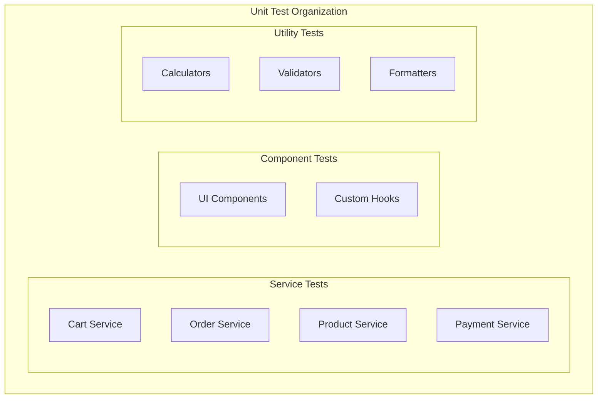

# ShopFlow Unit Tests

## Overview

Unit testing patterns and examples for the ShopFlow e-commerce platform.

---

## Test Structure



---

## Cart Service Tests

```typescript
// src/services/cart.service.test.ts
import { CartService } from './cart.service';
import { prismaMock } from '@/tests/mocks/prisma';
import { redisMock } from '@/tests/mocks/redis';

describe('CartService', () => {
  let service: CartService;

  beforeEach(() => {
    service = new CartService(prismaMock, redisMock);
    jest.clearAllMocks();
  });

  describe('addItem', () => {
    it('should add new item to cart', async () => {
      const cart = { id: 'cart_123', items: [] };
      const product = { id: 'prod_abc', price: 29.99, stock: 10 };

      redisMock.get.mockResolvedValue(JSON.stringify(cart));
      prismaMock.product.findUnique.mockResolvedValue(product);

      const result = await service.addItem('cart_123', {
        productId: 'prod_abc',
        variantId: 'var_xyz',
        quantity: 2,
      });

      expect(result.items).toHaveLength(1);
      expect(result.items[0].quantity).toBe(2);
      expect(result.subtotal).toBe(59.98);
    });

    it('should increment quantity for existing item', async () => {
      const cart = {
        id: 'cart_123',
        items: [
          {
            productId: 'prod_abc',
            variantId: 'var_xyz',
            quantity: 1,
            price: 29.99,
          },
        ],
      };

      redisMock.get.mockResolvedValue(JSON.stringify(cart));

      const result = await service.addItem('cart_123', {
        productId: 'prod_abc',
        variantId: 'var_xyz',
        quantity: 2,
      });

      expect(result.items).toHaveLength(1);
      expect(result.items[0].quantity).toBe(3);
    });

    it('should throw error when product out of stock', async () => {
      const product = { id: 'prod_abc', price: 29.99, stock: 0 };
      prismaMock.product.findUnique.mockResolvedValue(product);

      await expect(
        service.addItem('cart_123', {
          productId: 'prod_abc',
          variantId: 'var_xyz',
          quantity: 1,
        })
      ).rejects.toThrow('OUT_OF_STOCK');
    });

    it('should throw error when exceeding available stock', async () => {
      const product = { id: 'prod_abc', price: 29.99, stock: 5 };
      prismaMock.product.findUnique.mockResolvedValue(product);

      await expect(
        service.addItem('cart_123', {
          productId: 'prod_abc',
          variantId: 'var_xyz',
          quantity: 10,
        })
      ).rejects.toThrow('INSUFFICIENT_STOCK');
    });
  });

  describe('calculateTotals', () => {
    it('should calculate subtotal correctly', () => {
      const items = [
        { price: 29.99, quantity: 2 },
        { price: 49.99, quantity: 1 },
      ];

      const totals = service.calculateTotals(items);

      expect(totals.subtotal).toBe(109.97);
    });

    it('should apply percentage discount', () => {
      const items = [{ price: 100, quantity: 1 }];
      const discount = { type: 'percentage', value: 10 };

      const totals = service.calculateTotals(items, discount);

      expect(totals.discount).toBe(10);
      expect(totals.subtotal).toBe(90);
    });

    it('should apply fixed discount', () => {
      const items = [{ price: 100, quantity: 1 }];
      const discount = { type: 'fixed', value: 15 };

      const totals = service.calculateTotals(items, discount);

      expect(totals.discount).toBe(15);
      expect(totals.subtotal).toBe(85);
    });
  });
});
```

---

## Order Service Tests

```typescript
// src/services/order.service.test.ts
import { OrderService } from './order.service';

describe('OrderService', () => {
  let service: OrderService;

  describe('create', () => {
    it('should create order from cart', async () => {
      const cart = {
        items: [{ productId: 'prod_abc', quantity: 2, price: 29.99 }],
        subtotal: 59.98,
        total: 65.97,
      };

      prismaMock.cart.findUnique.mockResolvedValue(cart);
      prismaMock.order.create.mockResolvedValue({
        id: 'order_123',
        orderNumber: 'SF-2024-00001',
        status: 'pending',
      });

      const order = await service.create('user_123', {
        shippingAddress: mockAddress,
        paymentMethodId: 'pm_visa',
      });

      expect(order.orderNumber).toMatch(/^SF-2024-/);
      expect(order.status).toBe('pending');
    });

    it('should throw error for empty cart', async () => {
      prismaMock.cart.findUnique.mockResolvedValue({ items: [] });

      await expect(
        service.create('user_123', { shippingAddress: mockAddress })
      ).rejects.toThrow('CART_EMPTY');
    });
  });

  describe('cancel', () => {
    it('should cancel pending order', async () => {
      prismaMock.order.findUnique.mockResolvedValue({
        id: 'order_123',
        status: 'pending',
      });

      const result = await service.cancel('order_123', 'Changed mind');

      expect(result.status).toBe('cancelled');
    });

    it('should throw error for shipped order', async () => {
      prismaMock.order.findUnique.mockResolvedValue({
        id: 'order_123',
        status: 'shipped',
      });

      await expect(service.cancel('order_123', 'reason')).rejects.toThrow(
        'ORDER_CANNOT_BE_CANCELLED'
      );
    });
  });
});
```

---

## Price Calculator Tests

```typescript
// src/utils/price-calculator.test.ts
import { PriceCalculator } from './price-calculator';

describe('PriceCalculator', () => {
  describe('calculateTax', () => {
    it.each([
      { subtotal: 100, state: 'CA', expected: 7.25 },
      { subtotal: 100, state: 'NY', expected: 8.0 },
      { subtotal: 100, state: 'TX', expected: 6.25 },
      { subtotal: 100, state: 'OR', expected: 0 }, // No sales tax
    ])('should calculate $expected tax for $state', ({ subtotal, state, expected }) => {
      const tax = PriceCalculator.calculateTax(subtotal, state);
      expect(tax).toBe(expected);
    });
  });

  describe('calculateShipping', () => {
    it('should return free shipping over $50', () => {
      const shipping = PriceCalculator.calculateShipping(75, 'standard');
      expect(shipping).toBe(0);
    });

    it('should calculate standard shipping', () => {
      const shipping = PriceCalculator.calculateShipping(30, 'standard');
      expect(shipping).toBe(5.99);
    });

    it('should calculate express shipping', () => {
      const shipping = PriceCalculator.calculateShipping(30, 'express');
      expect(shipping).toBe(12.99);
    });
  });

  describe('formatPrice', () => {
    it('should format price with 2 decimal places', () => {
      expect(PriceCalculator.formatPrice(29.9)).toBe('$29.90');
      expect(PriceCalculator.formatPrice(100)).toBe('$100.00');
    });

    it('should handle different currencies', () => {
      expect(PriceCalculator.formatPrice(29.99, 'EUR')).toBe('€29.99');
      expect(PriceCalculator.formatPrice(29.99, 'GBP')).toBe('£29.99');
    });
  });
});
```

---

## React Component Tests

```typescript
// src/components/ProductCard.test.tsx
import { render, screen, fireEvent } from '@testing-library/react';
import { ProductCard } from './ProductCard';

describe('ProductCard', () => {
  const mockProduct = {
    id: 'prod_123',
    name: 'Classic T-Shirt',
    price: 29.99,
    image: '/images/tshirt.jpg',
    rating: 4.5,
  };

  it('should render product information', () => {
    render(<ProductCard product={mockProduct} />);

    expect(screen.getByText('Classic T-Shirt')).toBeInTheDocument();
    expect(screen.getByText('$29.99')).toBeInTheDocument();
    expect(screen.getByAltText('Classic T-Shirt')).toHaveAttribute(
      'src',
      '/images/tshirt.jpg'
    );
  });

  it('should call onAddToCart when button clicked', () => {
    const onAddToCart = jest.fn();
    render(<ProductCard product={mockProduct} onAddToCart={onAddToCart} />);

    fireEvent.click(screen.getByRole('button', { name: /add to cart/i }));

    expect(onAddToCart).toHaveBeenCalledWith('prod_123');
  });

  it('should display sale price when on sale', () => {
    const saleProduct = { ...mockProduct, compareAtPrice: 39.99 };
    render(<ProductCard product={saleProduct} />);

    expect(screen.getByText('$29.99')).toHaveClass('sale-price');
    expect(screen.getByText('$39.99')).toHaveClass('original-price');
  });
});
```

---

## Custom Hook Tests

```typescript
// src/hooks/useCart.test.ts
import { renderHook, act } from '@testing-library/react-hooks';
import { useCart } from './useCart';
import { QueryClient, QueryClientProvider } from '@tanstack/react-query';

describe('useCart', () => {
  const wrapper = ({ children }) => (
    <QueryClientProvider client={new QueryClient()}>
      {children}
    </QueryClientProvider>
  );

  it('should add item to cart', async () => {
    const { result, waitFor } = renderHook(() => useCart(), { wrapper });

    await act(async () => {
      await result.current.addItem({
        productId: 'prod_123',
        quantity: 1,
      });
    });

    await waitFor(() => {
      expect(result.current.cart.items).toHaveLength(1);
    });
  });

  it('should update item quantity', async () => {
    const { result, waitFor } = renderHook(() => useCart(), { wrapper });

    await act(async () => {
      await result.current.updateQuantity('item_123', 3);
    });

    await waitFor(() => {
      expect(result.current.cart.items[0].quantity).toBe(3);
    });
  });
});
```

---

## Running Unit Tests

```bash
# Run all unit tests
npm run test:unit

# Run specific file
npm run test:unit -- cart.service.test.ts

# Run with coverage
npm run test:unit -- --coverage

# Watch mode
npm run test:unit -- --watch

# Update snapshots
npm run test:unit -- -u
```

---

## Related Documents

- [Testing Strategy](./strategy.md)
- [Integration Tests](./integration-tests.md)
- [Test Data](./test-data.md)
