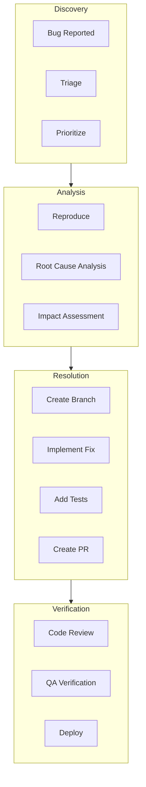
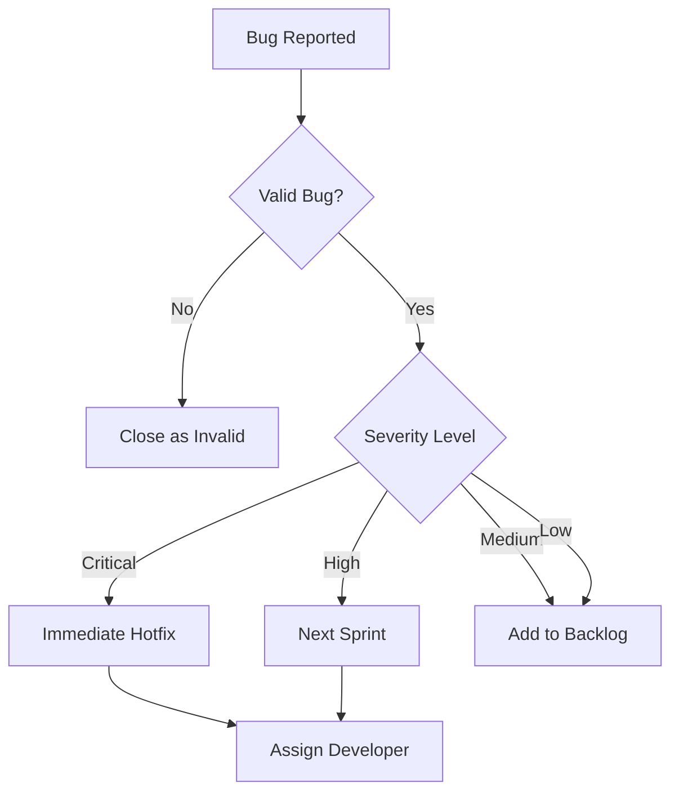
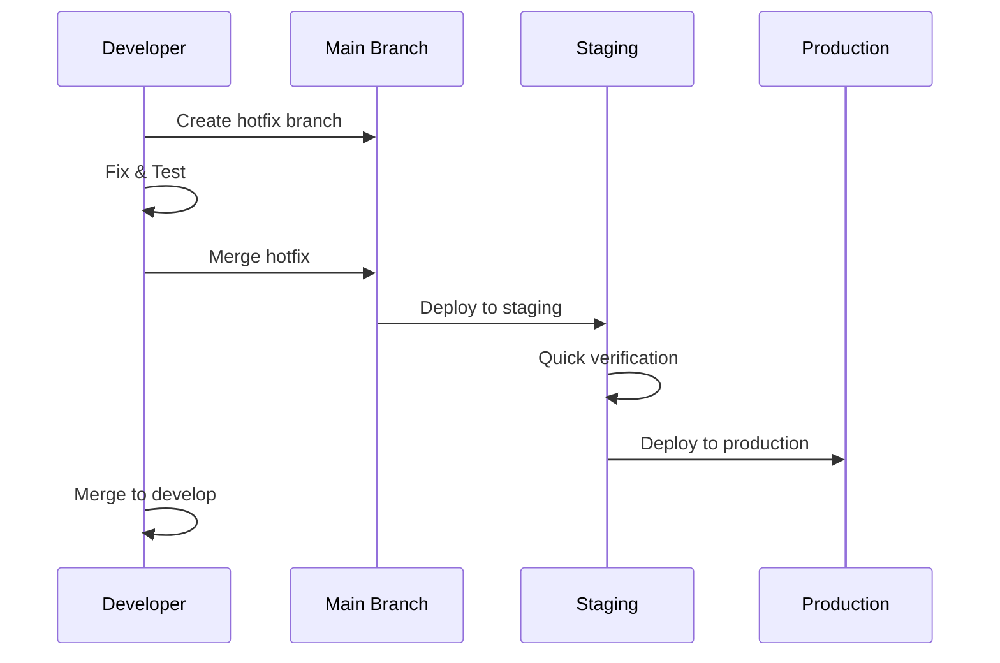
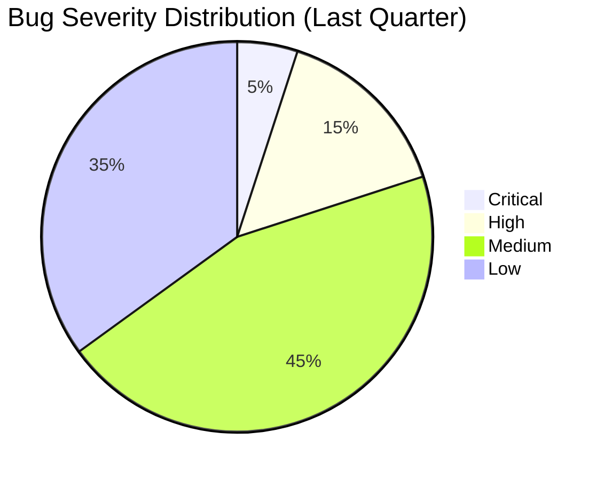

# ShopFlow Bug Fix Workflow

## Overview

Standardized process for identifying, triaging, fixing, and verifying bugs in the ShopFlow e-commerce platform.

---

## Bug Fix Lifecycle



---

## Bug Severity Levels

| Severity | Description | Response Time | Example |
|----------|-------------|---------------|---------|
| Critical | System down, data loss | < 1 hour | Payment processing broken |
| High | Major feature broken | < 4 hours | Cart cannot add items |
| Medium | Feature degraded | < 1 day | Search filters not working |
| Low | Minor issue | < 1 week | UI alignment issues |

---

## Bug Report Template

```markdown
## Bug Report

**Title:** [Brief description]

**Severity:** [Critical/High/Medium/Low]

**Environment:**
- Browser: Chrome 121
- Device: Desktop
- OS: macOS 14.3

**Steps to Reproduce:**
1. Navigate to /products
2. Add item to cart
3. Click checkout
4. Enter payment details
5. Submit order

**Expected Behavior:**
Order should be processed and confirmation shown.

**Actual Behavior:**
Error message "Payment failed" displayed, but order was created.

**Screenshots/Logs:**
[Attach relevant screenshots or error logs]

**Additional Context:**
This started after the v1.5.0 release.
```

---

## Triage Process



---

## Bug Fix Process

### 1. Create Fix Branch

```bash
# For regular bugs (from develop)
git checkout develop
git pull origin develop
git checkout -b fix/SHOP-456-cart-calculation-error

# For critical bugs (from main)
git checkout main
git pull origin main
git checkout -b hotfix/SHOP-789-payment-double-charge
```

### 2. Reproduce the Bug

```typescript
// First, write a failing test that reproduces the bug
describe('Cart calculation', () => {
  it('should correctly calculate total with discounts', () => {
    const cart = new Cart();
    cart.addItem({ id: '1', price: 100, quantity: 2 });
    cart.applyDiscount('10PERCENT');

    // This test should fail, reproducing the bug
    expect(cart.getTotal()).toBe(180); // Currently returns 200
  });
});
```

### 3. Implement the Fix

```typescript
// Fix the root cause
class Cart {
  getTotal(): number {
    const subtotal = this.items.reduce(
      (sum, item) => sum + item.price * item.quantity,
      0
    );

    // BUG FIX: Apply discount to subtotal, not individual items
    if (this.discount) {
      return subtotal * (1 - this.discount.percentage / 100);
    }

    return subtotal;
  }
}
```

### 4. Verify the Fix

```bash
# Run the specific test
npm run test -- cart.test.ts

# Run all related tests
npm run test -- --grep "Cart"

# Run full test suite
npm run test
```

### 5. Create Pull Request

```bash
git add .
git commit -m "fix(cart): correct discount calculation in total

The discount was being applied per-item instead of to the subtotal,
causing incorrect totals when multiple quantities were involved.

Fixes SHOP-456"

git push origin fix/SHOP-456-cart-calculation-error
```

---

## Hotfix Process



### Hotfix Commands

```bash
# Create hotfix
git checkout main
git checkout -b hotfix/SHOP-789-critical-fix

# Make fix
# ... implement fix ...

# Commit and push
git commit -m "fix(payment): prevent double-charge on retry

Critical fix for payment processing bug causing customers
to be charged twice when retrying failed payments.

Fixes SHOP-789"

git push origin hotfix/SHOP-789-critical-fix

# After merge to main
git checkout develop
git merge main
git push origin develop
```

---

## Post-Fix Checklist

### Code Review

- [ ] Fix addresses root cause, not just symptoms
- [ ] Test covers the bug scenario
- [ ] No regressions in related functionality
- [ ] Code follows style guidelines
- [ ] Documentation updated if needed

### QA Verification

- [ ] Bug no longer reproducible
- [ ] Related features still work
- [ ] Edge cases tested
- [ ] Performance not degraded

### Deployment

- [ ] Deployed to staging
- [ ] Staging verification passed
- [ ] Deployed to production
- [ ] Production monitoring in place

---

## Bug Metrics

### Tracking Metrics

| Metric | Description | Target |
|--------|-------------|--------|
| MTTR | Mean Time to Resolution | < 24 hours |
| Bug Escape Rate | Bugs found in production | < 5% |
| Regression Rate | Bugs reintroduced | < 2% |
| First-Time Fix Rate | Bugs fixed on first attempt | > 90% |

### Bug Distribution



---

## Root Cause Categories

| Category | Example | Prevention |
|----------|---------|------------|
| Logic Error | Incorrect calculation | Better unit tests |
| Edge Case | Null handling | Defensive coding |
| Integration | API contract mismatch | Contract tests |
| Concurrency | Race condition | Stress testing |
| Configuration | Wrong env variable | Config validation |

---

## Related Documents

- [Development Workflow](./development.md)
- [QA Review Process](./qa-review.md)
- [Testing Strategy](../testing/strategy.md)
