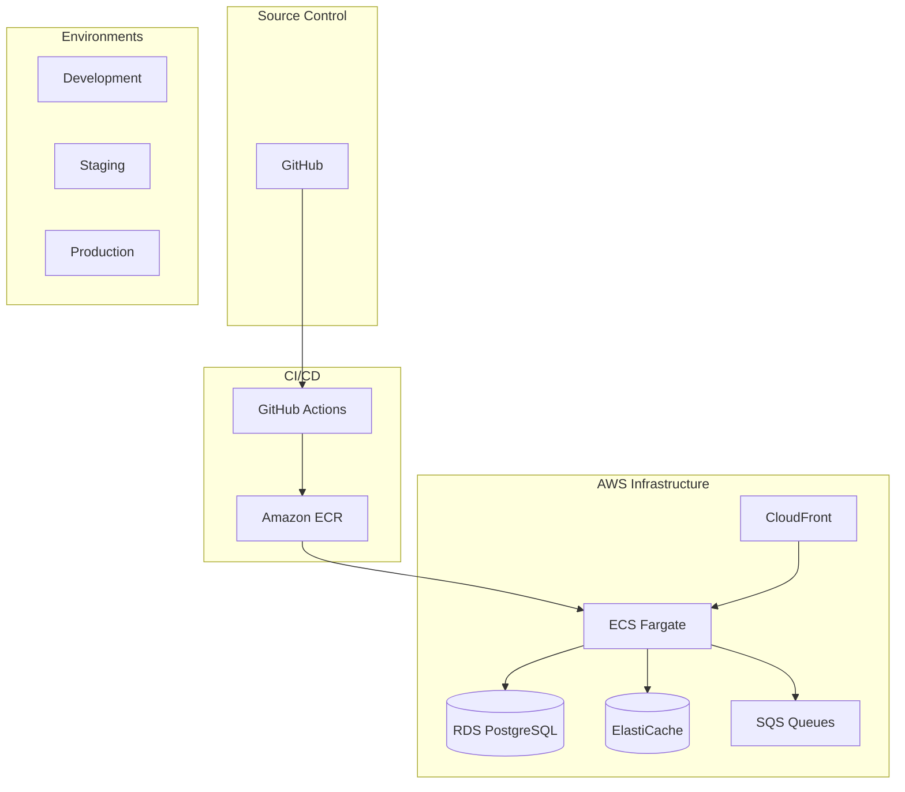
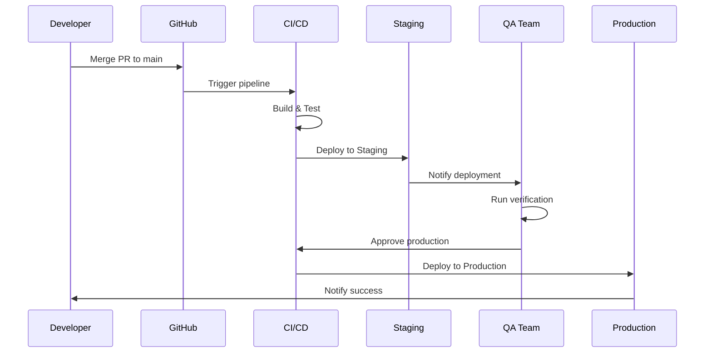
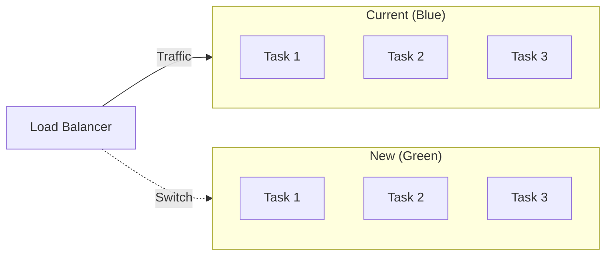
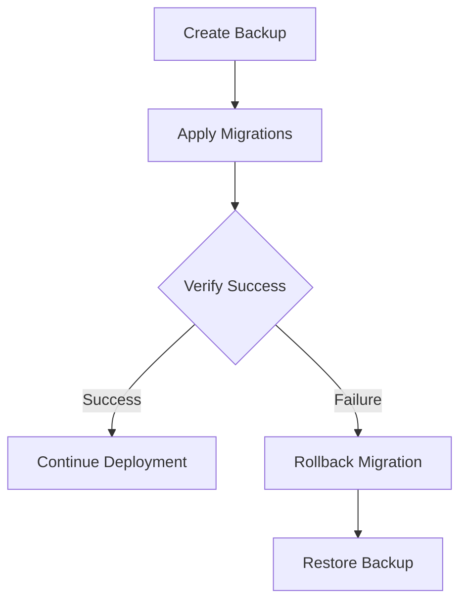

# ShopFlow Deployment Process

## Overview

Deployment procedures for the ShopFlow e-commerce platform across all environments.

---

## Deployment Architecture



---

## Environment Overview

| Environment | URL | Purpose |
|-------------|-----|---------|
| Development | localhost:3000 | Local development |
| Staging | staging.shopflow.io | Pre-production testing |
| Production | www.shopflow.io | Live customer traffic |

---

## Deployment Flow



---

## Pre-Deployment Checklist

### Code Readiness

- [ ] All tests passing in CI
- [ ] Code reviewed and approved
- [ ] No critical security issues
- [ ] Documentation updated

### Database

- [ ] Migrations reviewed
- [ ] Rollback plan prepared
- [ ] Backup verified

### Infrastructure

- [ ] Resource limits configured
- [ ] Monitoring dashboards ready
- [ ] Alert thresholds set
- [ ] On-call schedule confirmed

---

## Staging Deployment

### Automatic Deployment

Staging deploys automatically when code is merged to `main`:

```yaml
# Triggered automatically on merge to main
deploy-staging:
  runs-on: ubuntu-latest
  steps:
    - name: Deploy to Staging
      run: |
        aws ecs update-service \
          --cluster shopflow-staging \
          --service shopflow-api \
          --force-new-deployment
```

### Manual Deployment

```bash
# Deploy specific version to staging
./scripts/deploy.sh staging v1.5.0

# Or using AWS CLI directly
aws ecs update-service \
  --cluster shopflow-staging \
  --service shopflow-api \
  --task-definition shopflow-api:42
```

---

## Production Deployment

### Deployment Window

- **Preferred Time:** Tuesday-Thursday, 10:00-14:00 UTC
- **Avoid:** Fridays, holidays, peak shopping periods
- **Freeze Period:** Black Friday week, December 20-26

### Deployment Steps

```bash
# 1. Create release tag
git tag -a v1.5.0 -m "Release v1.5.0"
git push origin v1.5.0

# 2. Trigger production deployment
gh workflow run deploy.yml \
  --field environment=production \
  --field version=v1.5.0

# 3. Monitor deployment
aws ecs describe-services \
  --cluster shopflow-production \
  --services shopflow-api

# 4. Verify deployment
curl https://www.shopflow.io/api/health
```

### Blue-Green Deployment



---

## Database Migrations

### Migration Process



### Running Migrations

```bash
# Generate migration
npm run db:migrate:create -- add_wishlist_table

# Apply migrations (staging)
DATABASE_URL=$STAGING_DB_URL npm run db:migrate

# Apply migrations (production)
DATABASE_URL=$PROD_DB_URL npm run db:migrate

# Rollback if needed
DATABASE_URL=$PROD_DB_URL npm run db:migrate:rollback
```

---

## Rollback Procedures

### Quick Rollback

```bash
# Rollback to previous task definition
aws ecs update-service \
  --cluster shopflow-production \
  --service shopflow-api \
  --task-definition shopflow-api:41  # Previous version

# Monitor rollback
aws ecs wait services-stable \
  --cluster shopflow-production \
  --services shopflow-api
```

### Full Rollback Checklist

- [ ] Identify the issue
- [ ] Notify stakeholders
- [ ] Roll back application
- [ ] Roll back database if needed
- [ ] Verify system stability
- [ ] Document incident

---

## Post-Deployment Verification

### Health Checks

```bash
# API health
curl https://www.shopflow.io/api/health

# Database connectivity
curl https://www.shopflow.io/api/health/db

# Redis connectivity
curl https://www.shopflow.io/api/health/cache

# External services
curl https://www.shopflow.io/api/health/external
```

### Smoke Tests

```bash
# Run automated smoke tests
npm run test:smoke -- --env production

# Manual verification checklist
# - [ ] Homepage loads
# - [ ] Product search works
# - [ ] Add to cart works
# - [ ] Checkout process completes
# - [ ] Order confirmation received
```

---

## Monitoring After Deployment

### Key Metrics to Watch

| Metric | Normal Range | Alert Threshold |
|--------|--------------|-----------------|
| Error Rate | < 0.1% | > 1% |
| P95 Latency | < 200ms | > 500ms |
| CPU Usage | < 60% | > 80% |
| Memory Usage | < 70% | > 85% |
| Order Success | > 99% | < 95% |

### Dashboard Links

- [CloudWatch Dashboard](https://console.aws.amazon.com/cloudwatch)
- [Application Logs](https://console.aws.amazon.com/cloudwatch/logs)
- [ECS Service Status](https://console.aws.amazon.com/ecs)

---

## Incident Response

### Severity Levels

| Level | Response | Example |
|-------|----------|---------|
| SEV1 | Immediate rollback | Site down |
| SEV2 | Assess within 15 min | Checkout broken |
| SEV3 | Fix in next deploy | Minor UI bug |

### Communication Template

```
DEPLOYMENT INCIDENT

Status: [Investigating/Identified/Resolved]
Severity: [SEV1/SEV2/SEV3]
Impact: [Description of customer impact]
Start Time: [UTC timestamp]
Resolution: [Action taken or planned]
ETA: [Expected resolution time]
```

---

## Related Documents

- [CI/CD Pipeline](./ci-cd-pipeline.md)
- [Production Environment](../environments/production.md)
- [Bug Fix Workflow](./bug-fix.md)
