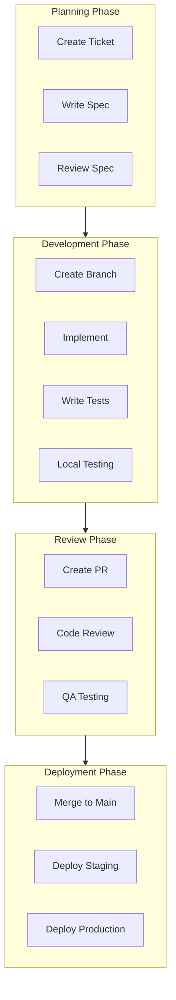
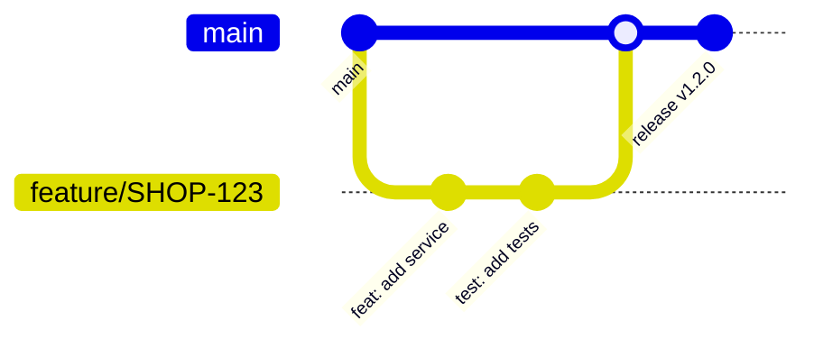
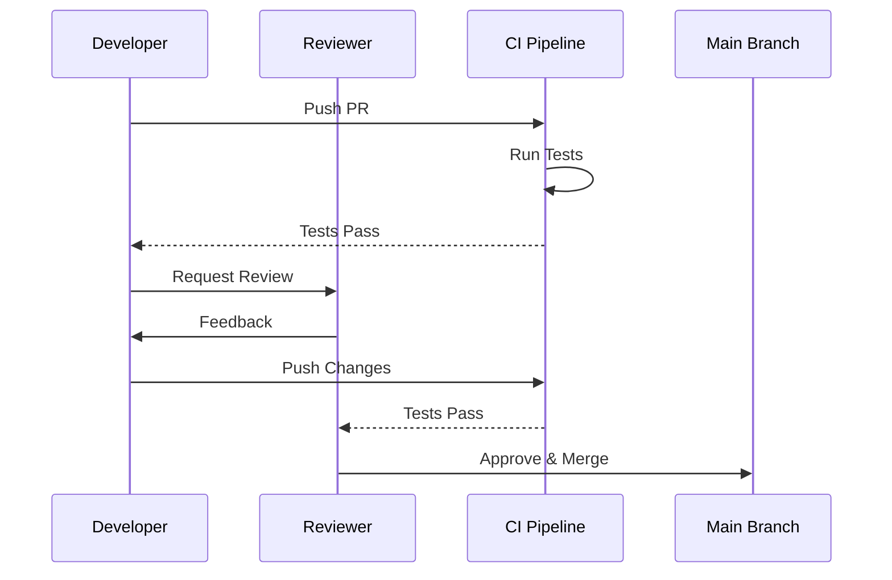

# ShopFlow Development Workflow

## Overview

Standard development workflow for the ShopFlow e-commerce platform, from feature planning to deployment.

---

## Development Lifecycle



---

## Daily Development Flow

### 1. Start of Day

```bash
# Pull latest changes
git checkout main
git pull origin main

# Update dependencies if needed
npm install

# Start local development environment
docker compose up -d
npm run dev
```

### 2. Feature Development

```bash
# Create feature branch
git checkout -b feature/SHOP-123-add-wishlist

# Make changes and commit frequently
git add src/features/wishlist/
git commit -m "feat(wishlist): add wishlist service"

# Run tests before pushing
npm run test
npm run lint
```

### 3. End of Day

```bash
# Push work in progress
git push origin feature/SHOP-123-add-wishlist

# Update PR if exists
# Document any blockers in the ticket
```

---

## Branch Strategy



### Branch Naming

| Type | Pattern | Example |
|------|---------|---------|
| Feature | `feature/SHOP-{id}-{description}` | `feature/SHOP-123-add-wishlist` |
| Bug Fix | `fix/SHOP-{id}-{description}` | `fix/SHOP-456-cart-calculation` |
| Hotfix | `hotfix/SHOP-{id}-{description}` | `hotfix/SHOP-789-payment-error` |
| Release | `release/v{version}` | `release/v1.2.0` |

---

## Code Review Process

### PR Checklist

- [ ] Code follows style guidelines
- [ ] Tests added and passing
- [ ] Documentation updated
- [ ] No console.log or debug statements
- [ ] Database migrations reviewed
- [ ] API changes documented
- [ ] Security considerations addressed

### Review Flow



---

## Development Commands

| Command | Description |
|---------|-------------|
| `npm run dev` | Start development servers |
| `npm run dev:api` | Start API server only |
| `npm run dev:web` | Start frontend only |
| `npm run test` | Run all tests |
| `npm run test:watch` | Run tests in watch mode |
| `npm run lint` | Run ESLint |
| `npm run lint:fix` | Fix linting issues |
| `npm run build` | Build for production |
| `npm run db:migrate` | Run database migrations |
| `npm run db:seed` | Seed development data |

---

## Local Development URLs

| Service | URL |
|---------|-----|
| Web App | http://localhost:3000 |
| API Server | http://localhost:4000 |
| Admin Panel | http://localhost:3001 |
| API Docs | http://localhost:4000/docs |
| PostgreSQL | localhost:5432 |
| Redis | localhost:6379 |

---

## Environment Setup

```bash
# Clone repository
git clone https://github.com/your-org/shopflow.git
cd shopflow

# Install dependencies
npm install

# Copy environment file
cp .env.example .env

# Start infrastructure
docker compose up -d

# Run migrations
npm run db:migrate

# Seed development data
npm run db:seed

# Start development
npm run dev
```

---

## Related Documents

- [Git Workflow](./git-workflow.md)
- [Sprint Execution](./sprint-execution.md)
- [CI/CD Pipeline](./ci-cd-pipeline.md)
