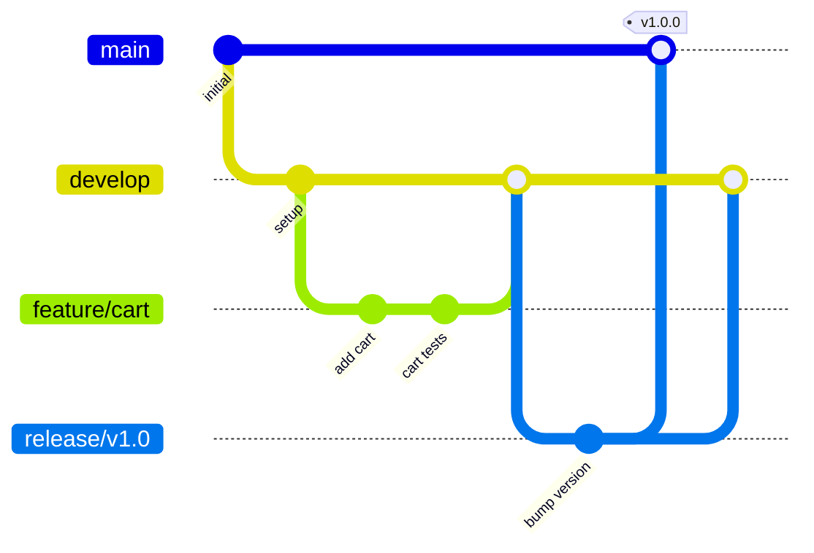
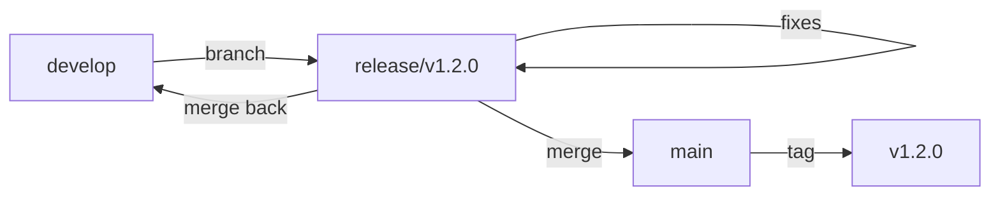
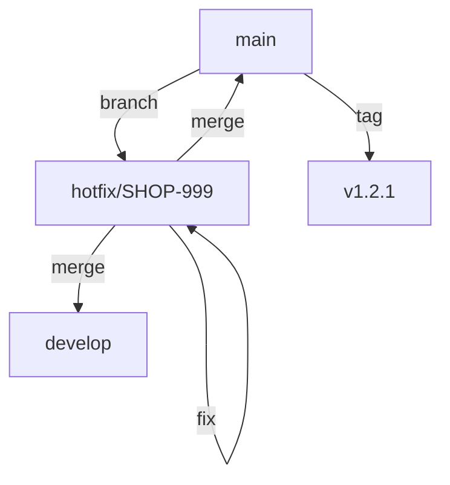

# ShopFlow Git Workflow

## Overview

Git branching strategy and workflow guidelines for the ShopFlow e-commerce platform.

---

## Branch Structure



---

## Branch Types

| Branch | Purpose | Base | Merges To |
|--------|---------|------|-----------|
| `main` | Production code | - | - |
| `develop` | Integration branch | main | main (via release) |
| `feature/*` | New features | develop | develop |
| `fix/*` | Bug fixes | develop | develop |
| `hotfix/*` | Production fixes | main | main & develop |
| `release/*` | Release prep | develop | main & develop |

---

## Feature Development Flow

### 1. Create Feature Branch

```bash
# Update develop branch
git checkout develop
git pull origin develop

# Create feature branch
git checkout -b feature/SHOP-123-add-wishlist

# Push branch to remote
git push -u origin feature/SHOP-123-add-wishlist
```

### 2. Development Commits

```bash
# Make atomic commits
git add src/features/wishlist/wishlist.service.ts
git commit -m "feat(wishlist): add wishlist service with CRUD operations"

git add src/features/wishlist/wishlist.controller.ts
git commit -m "feat(wishlist): add REST endpoints for wishlist"

git add tests/wishlist/
git commit -m "test(wishlist): add unit and integration tests"
```

### 3. Keep Branch Updated

```bash
# Regularly rebase on develop
git fetch origin
git rebase origin/develop

# Resolve conflicts if any
# Then force push (only on feature branches)
git push --force-with-lease
```

### 4. Create Pull Request

```bash
# Push final changes
git push origin feature/SHOP-123-add-wishlist

# Create PR via GitHub CLI
gh pr create \
  --base develop \
  --title "feat(wishlist): add wishlist functionality" \
  --body "Implements wishlist feature for users to save products"
```

---

## Commit Message Convention

### Format

```
type(scope): description

[optional body]

[optional footer]
```

### Types

| Type | Description |
|------|-------------|
| `feat` | New feature |
| `fix` | Bug fix |
| `docs` | Documentation |
| `style` | Code style changes |
| `refactor` | Code refactoring |
| `test` | Adding tests |
| `chore` | Maintenance |
| `perf` | Performance improvement |

### Examples

```bash
# Feature
git commit -m "feat(cart): add quantity update functionality"

# Bug fix
git commit -m "fix(checkout): correct tax calculation for EU orders"

# Breaking change
git commit -m "feat(api)!: change order response structure

BREAKING CHANGE: order.items is now an array of OrderItem objects"

# With ticket reference
git commit -m "fix(payment): handle Stripe webhook failures

Fixes SHOP-456"
```

---

## Release Process

### Create Release Branch



```bash
# Create release branch from develop
git checkout develop
git pull origin develop
git checkout -b release/v1.2.0

# Update version
npm version minor --no-git-tag-version
git add package.json package-lock.json
git commit -m "chore: bump version to 1.2.0"

# Push release branch
git push -u origin release/v1.2.0
```

### Finalize Release

```bash
# After QA approval, merge to main
git checkout main
git pull origin main
git merge release/v1.2.0 --no-ff -m "chore: release v1.2.0"

# Tag the release
git tag -a v1.2.0 -m "Release version 1.2.0"
git push origin main --tags

# Merge back to develop
git checkout develop
git merge release/v1.2.0 --no-ff

# Delete release branch
git branch -d release/v1.2.0
git push origin --delete release/v1.2.0
```

---

## Hotfix Process



```bash
# Create hotfix from main
git checkout main
git pull origin main
git checkout -b hotfix/SHOP-999-fix-payment

# Make fix and commit
git add .
git commit -m "fix(payment): resolve double-charge issue

Fixes SHOP-999"

# Merge to main
git checkout main
git merge hotfix/SHOP-999-fix-payment --no-ff
git tag -a v1.2.1 -m "Hotfix: payment double-charge"
git push origin main --tags

# Merge to develop
git checkout develop
git merge hotfix/SHOP-999-fix-payment --no-ff
git push origin develop

# Delete hotfix branch
git branch -d hotfix/SHOP-999-fix-payment
```

---

## Protected Branch Rules

### main Branch

- Require pull request reviews (2 approvers)
- Require status checks to pass
- Require branches to be up to date
- No force pushes
- No deletions

### develop Branch

- Require pull request reviews (1 approver)
- Require status checks to pass
- No force pushes
- No deletions

---

## Git Hooks

### Pre-commit

```bash
#!/bin/sh
# .husky/pre-commit

npm run lint-staged
npm run test:unit -- --bail
```

### Commit-msg

```bash
#!/bin/sh
# .husky/commit-msg

npx commitlint --edit $1
```

---

## Useful Git Commands

```bash
# View branch graph
git log --oneline --graph --all

# Undo last commit (keep changes)
git reset --soft HEAD~1

# Squash last N commits
git rebase -i HEAD~N

# Cherry-pick a commit
git cherry-pick <commit-hash>

# Stash changes
git stash save "WIP: feature work"
git stash pop

# Find commit that introduced a bug
git bisect start
git bisect bad HEAD
git bisect good v1.0.0
```

---

## Related Documents

- [Development Workflow](./development.md)
- [CI/CD Pipeline](./ci-cd-pipeline.md)
- [Deployment Process](./deployment.md)
