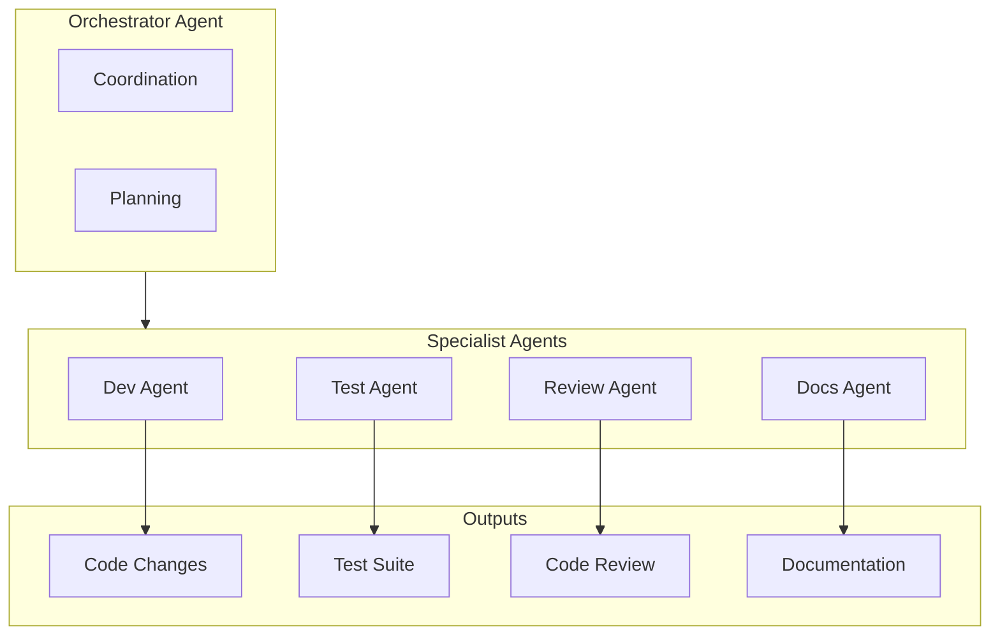
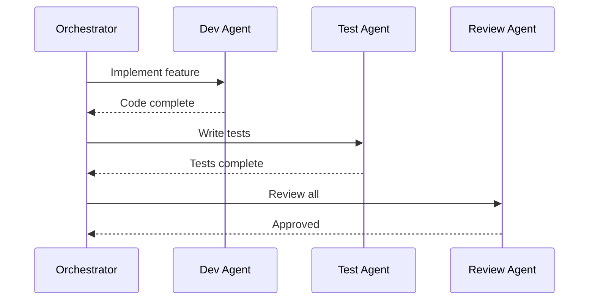
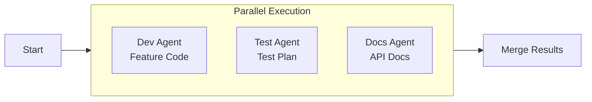
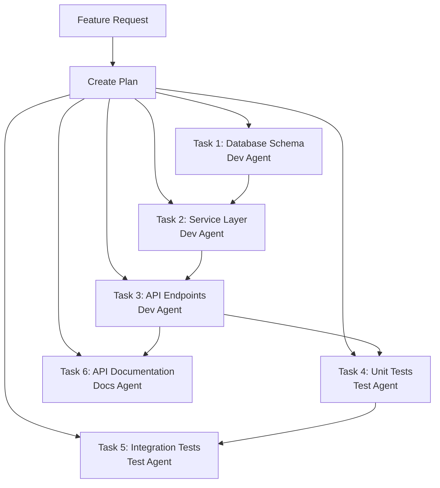
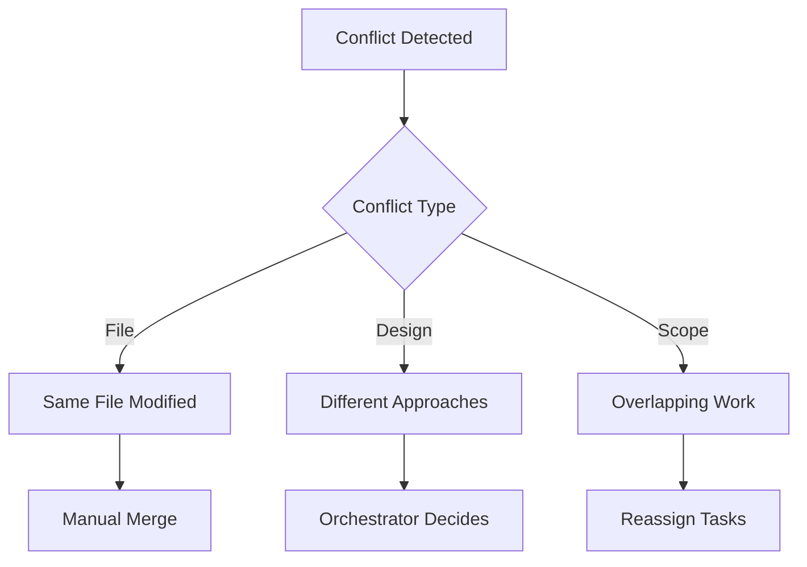

# ShopFlow Multi-Agent Workflow

## Overview

Guidelines for AI agent collaboration in ShopFlow e-commerce platform development using multiple specialized agents.

---

## Agent Architecture



---

## Agent Roles

### Orchestrator Agent

**Responsibilities:**
- Break down complex tasks into subtasks
- Assign work to specialist agents
- Coordinate parallel work streams
- Merge and validate outputs

**Triggers:**
- New feature requests
- Complex bug fixes
- Refactoring tasks

### Development Agent

**Responsibilities:**
- Implement features and fixes
- Write production code
- Handle database migrations
- Create API endpoints

**Context Required:**
- Architecture documentation
- Coding standards
- Existing code patterns

### Test Agent

**Responsibilities:**
- Write unit tests
- Create integration tests
- Design E2E test scenarios
- Generate test data

**Context Required:**
- Testing strategy
- Test data patterns
- Coverage requirements

### Review Agent

**Responsibilities:**
- Review code changes
- Check for security issues
- Validate architecture decisions
- Suggest improvements

**Context Required:**
- Security guidelines
- Performance standards
- Code review checklist

### Documentation Agent

**Responsibilities:**
- Update API documentation
- Write feature guides
- Maintain changelog
- Update architecture docs

**Context Required:**
- Documentation standards
- Existing documentation
- API specifications

---

## Collaboration Patterns

### Sequential Pattern



### Parallel Pattern



---

## Task Handoff Protocol

### Handoff Message Format

```json
{
  "taskId": "SHOP-123-add-wishlist",
  "fromAgent": "orchestrator",
  "toAgent": "dev-agent",
  "type": "implement",
  "context": {
    "feature": "wishlist",
    "requirements": [
      "Users can add products to wishlist",
      "Wishlist persists across sessions",
      "Maximum 50 items per wishlist"
    ],
    "relatedFiles": [
      "src/features/cart/",
      "src/services/product.service.ts"
    ],
    "acceptanceCriteria": [
      "REST API endpoints created",
      "Database schema updated",
      "Service layer implemented"
    ]
  },
  "dependencies": [],
  "deadline": "2024-01-20T17:00:00Z"
}
```

### Completion Message Format

```json
{
  "taskId": "SHOP-123-add-wishlist",
  "fromAgent": "dev-agent",
  "toAgent": "orchestrator",
  "type": "completed",
  "output": {
    "filesCreated": [
      "src/features/wishlist/wishlist.service.ts",
      "src/features/wishlist/wishlist.controller.ts",
      "src/features/wishlist/wishlist.model.ts"
    ],
    "filesModified": [
      "prisma/schema.prisma",
      "src/routes/index.ts"
    ],
    "summary": "Implemented wishlist feature with CRUD operations",
    "notes": "Used similar pattern to cart feature"
  },
  "nextSteps": ["Write tests", "Update API docs"]
}
```

---

## Feature Development Example

### Input: Feature Request

```markdown
Feature: Product Wishlist

As a customer, I want to save products to a wishlist
so that I can purchase them later.

Requirements:
- Add/remove products from wishlist
- View all wishlist items
- Move items from wishlist to cart
- Limit: 50 items per user
```

### Orchestrator Breakdown



### Agent Outputs

**Dev Agent Output:**
```typescript
// src/features/wishlist/wishlist.service.ts
export class WishlistService {
  async addItem(userId: string, productId: string): Promise<WishlistItem> {
    const count = await this.prisma.wishlistItem.count({
      where: { userId }
    });

    if (count >= 50) {
      throw new WishlistLimitError('Maximum 50 items allowed');
    }

    return this.prisma.wishlistItem.create({
      data: { userId, productId }
    });
  }
}
```

**Test Agent Output:**
```typescript
// tests/wishlist.test.ts
describe('WishlistService', () => {
  describe('addItem', () => {
    it('should add product to wishlist', async () => {
      const item = await service.addItem('user_1', 'product_1');
      expect(item.productId).toBe('product_1');
    });

    it('should enforce 50 item limit', async () => {
      // Add 50 items
      for (let i = 0; i < 50; i++) {
        await service.addItem('user_1', `product_${i}`);
      }

      await expect(
        service.addItem('user_1', 'product_51')
      ).rejects.toThrow(WishlistLimitError);
    });
  });
});
```

---

## Conflict Resolution

### When Conflicts Occur



### Resolution Protocol

1. **Detect**: Identify conflicting changes
2. **Analyze**: Understand the conflict type
3. **Escalate**: Notify orchestrator if needed
4. **Resolve**: Apply appropriate resolution
5. **Verify**: Ensure both changes preserved

---

## Quality Gates

| Gate | Agent | Criteria |
|------|-------|----------|
| Code Complete | Dev Agent | All requirements implemented |
| Tests Pass | Test Agent | 80%+ coverage, all tests pass |
| Review Approved | Review Agent | No critical issues |
| Docs Updated | Docs Agent | API docs complete |

---

## Related Documents

- [Development Workflow](./development.md)
- [Sprint Execution](./sprint-execution.md)
- [QA Review Process](./qa-review.md)
