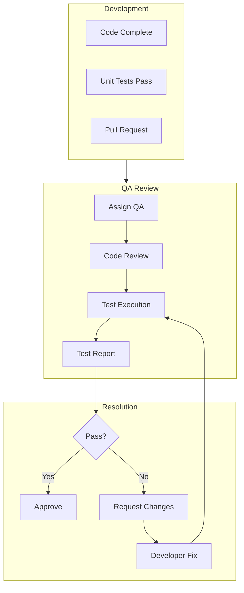
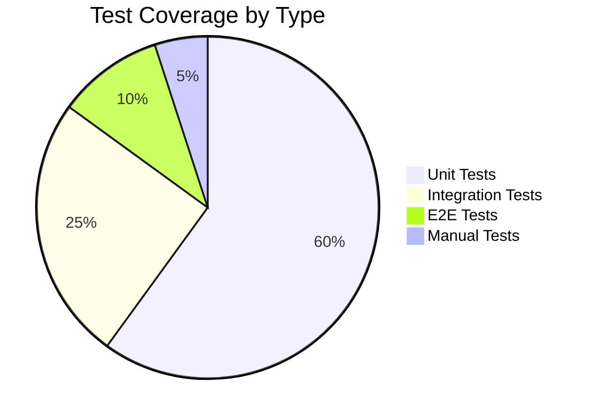
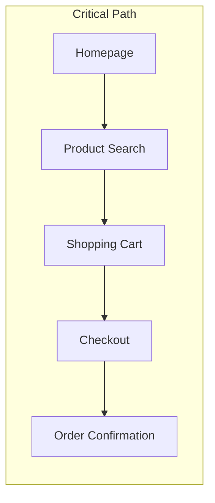

# ShopFlow QA Review Process

## Overview

Quality assurance review process for the ShopFlow e-commerce platform ensuring high-quality releases.

---

## QA Process Flow



---

## Review Stages

### Stage 1: Code Review

**Checklist:**
- [ ] Code follows style guidelines
- [ ] No hardcoded values
- [ ] Proper error handling
- [ ] Security considerations addressed
- [ ] Database queries optimized
- [ ] No console.log statements
- [ ] Comments for complex logic

### Stage 2: Functional Testing

**Checklist:**
- [ ] Feature works as specified
- [ ] Edge cases handled
- [ ] Error states display correctly
- [ ] Loading states present
- [ ] Form validations work
- [ ] Navigation flows correct

### Stage 3: Integration Testing

**Checklist:**
- [ ] API endpoints respond correctly
- [ ] Database operations succeed
- [ ] Third-party integrations work
- [ ] Authentication/authorization correct
- [ ] Data consistency maintained

### Stage 4: UI/UX Review

**Checklist:**
- [ ] Design matches mockups
- [ ] Responsive on all breakpoints
- [ ] Accessibility standards met
- [ ] Consistent with design system
- [ ] Animations smooth
- [ ] Copy/text accurate

---

## Test Case Template

```markdown
## Test Case: TC-SHOP-123

**Feature:** Add to Cart

**Prerequisites:**
- User is logged in
- Product is in stock

**Test Steps:**
1. Navigate to product detail page
2. Select size "Medium"
3. Click "Add to Cart" button
4. Observe cart icon

**Expected Result:**
- Cart icon shows badge with "1"
- Toast notification appears "Added to cart"
- Cart total updates

**Actual Result:**
[To be filled during testing]

**Status:** [Pass/Fail]

**Notes:**
[Any observations or issues]
```

---

## Bug Report Template

```markdown
## Bug Report: BUG-456

**Severity:** High
**Priority:** P1

**Environment:**
- Browser: Chrome 121
- Device: Desktop
- OS: Windows 11

**Steps to Reproduce:**
1. Add item to cart
2. Apply coupon code "SAVE10"
3. Change quantity to 2
4. Observe total

**Expected Behavior:**
Discount should apply to updated total ($90 instead of $100)

**Actual Behavior:**
Discount only applies to original amount (still shows $90 instead of $81)

**Screenshots:**
[Attach screenshots]

**Logs:**
```
Error: Discount calculation error at line 42
```

**Related Test Case:** TC-SHOP-789
```

---

## QA Environments

| Environment | Purpose | URL |
|-------------|---------|-----|
| QA | Feature testing | qa.shopflow.io |
| Staging | Pre-production | staging.shopflow.io |
| UAT | User acceptance | uat.shopflow.io |

---

## Test Coverage Requirements

### By Feature Type



### Minimum Coverage

| Area | Minimum Coverage |
|------|------------------|
| Business Logic | 90% |
| API Endpoints | 85% |
| UI Components | 75% |
| Utilities | 80% |

---

## Regression Testing

### Regression Suite



### Regression Checklist

**Core Flows:**
- [ ] User registration
- [ ] User login/logout
- [ ] Product search and filtering
- [ ] Add to cart
- [ ] Cart modifications
- [ ] Checkout process
- [ ] Payment processing
- [ ] Order confirmation
- [ ] Order history

**Edge Cases:**
- [ ] Empty cart checkout attempt
- [ ] Out of stock handling
- [ ] Invalid coupon codes
- [ ] Session expiration
- [ ] Network error handling

---

## Performance Testing

### Key Metrics

| Metric | Target | Tool |
|--------|--------|------|
| Page Load Time | < 3s | Lighthouse |
| Time to Interactive | < 5s | Lighthouse |
| First Contentful Paint | < 1.5s | WebVitals |
| API Response Time | < 200ms | k6 |

### Load Test Scenarios

```javascript
// k6 load test script
export const options = {
  stages: [
    { duration: '2m', target: 100 },  // Ramp up
    { duration: '5m', target: 100 },  // Steady state
    { duration: '2m', target: 200 },  // Spike
    { duration: '5m', target: 200 },  // Peak load
    { duration: '2m', target: 0 },    // Ramp down
  ],
  thresholds: {
    http_req_duration: ['p(95)<500'],
    http_req_failed: ['rate<0.01'],
  },
};
```

---

## Security Testing

### OWASP Top 10 Checklist

- [ ] Injection vulnerabilities
- [ ] Broken authentication
- [ ] Sensitive data exposure
- [ ] XML external entities
- [ ] Broken access control
- [ ] Security misconfiguration
- [ ] Cross-site scripting (XSS)
- [ ] Insecure deserialization
- [ ] Vulnerable components
- [ ] Insufficient logging

### Security Test Cases

| Category | Test | Status |
|----------|------|--------|
| Auth | SQL injection in login | Pass |
| Auth | Brute force protection | Pass |
| XSS | Stored XSS in reviews | Pass |
| CSRF | Token validation | Pass |
| Access | Unauthorized API access | Pass |

---

## QA Sign-off

### Sign-off Criteria

- [ ] All critical test cases pass
- [ ] No open P1/P2 bugs
- [ ] Regression suite complete
- [ ] Performance targets met
- [ ] Security scan clean
- [ ] Accessibility audit pass

### Sign-off Template

```markdown
## QA Sign-off: Release v1.5.0

**Date:** 2024-01-20
**QA Engineer:** Jane Smith

**Test Summary:**
- Total Test Cases: 150
- Passed: 148
- Failed: 0
- Blocked: 2 (non-critical)

**Coverage:**
- Unit: 87%
- Integration: 82%
- E2E: 100% critical paths

**Known Issues:**
- SHOP-789: Minor UI alignment (P3) - Deferred

**Recommendation:** APPROVED for production release

**Signature:** Jane Smith, QA Lead
```

---

## Related Documents

- [Testing Strategy](../testing/strategy.md)
- [Bug Fix Workflow](./bug-fix.md)
- [Deployment Process](./deployment.md)
