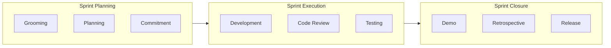
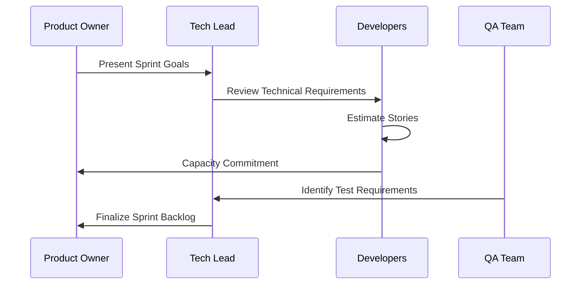
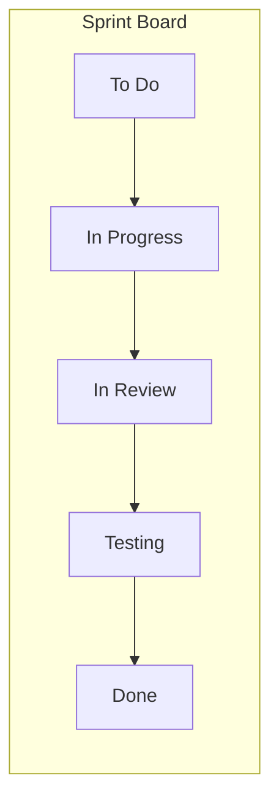
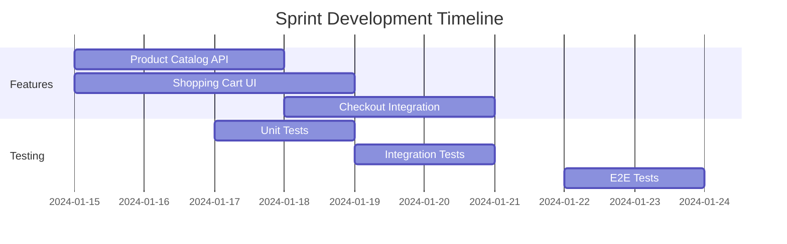
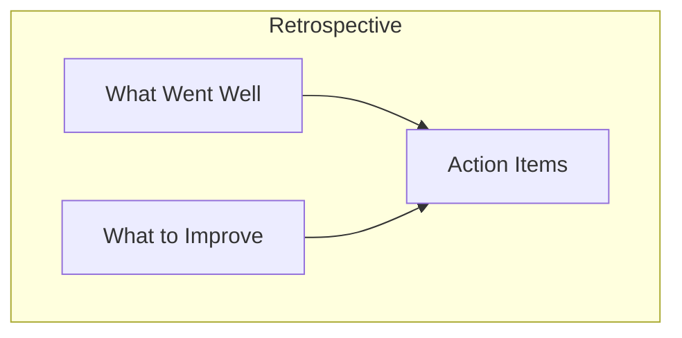
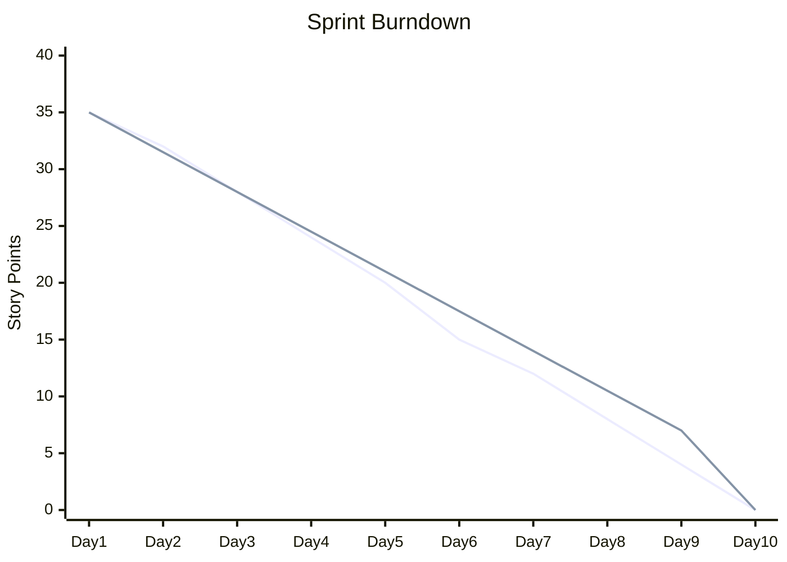

# ShopFlow Sprint Execution

## Overview

Sprint execution workflow for the ShopFlow e-commerce platform development team.

---

## Sprint Lifecycle

---

## Sprint Timeline

| Day | Activity | Duration |
|-----|----------|----------|
| Day 1 | Sprint Planning | 2-4 hours |
| Day 1-8 | Development & Testing | Ongoing |
| Daily | Standup | 15 minutes |
| Day 9 | Code Freeze | - |
| Day 9-10 | Final Testing & Bug Fixes | 2 days |
| Day 10 | Sprint Demo | 1 hour |
| Day 10 | Retrospective | 1 hour |

---

## Sprint Planning

### Planning Session Flow

### Story Point Estimation

| Points | Complexity | Example |
|--------|------------|---------|
| 1 | Trivial | Update button text |
| 2 | Simple | Add form validation |
| 3 | Medium | New API endpoint |
| 5 | Complex | Payment integration |
| 8 | Very Complex | New checkout flow |
| 13 | Epic-sized | Needs breakdown |

---

## Daily Standup

### Format

Each team member answers:
1. What did I complete yesterday?
2. What will I work on today?
3. Are there any blockers?

### Standup Board

---

## Development Phases

### Phase 1: Feature Development (Days 1-5)

### Phase 2: Integration & Testing (Days 6-8)

- Complete feature integration
- Run full test suite
- Fix integration issues
- Performance testing

### Phase 3: Stabilization (Days 9-10)

- Code freeze (no new features)
- Bug fixes only
- Final QA sign-off
- Release preparation

---

## Sprint Ceremonies

### Sprint Demo Agenda

| Time | Activity |
|------|----------|
| 0:00 | Welcome & Sprint Goals Recap |
| 0:05 | Feature Demonstrations |
| 0:40 | Q&A |
| 0:50 | Sprint Metrics Review |
| 0:55 | Next Sprint Preview |

### Retrospective Format

---

## Sprint Metrics

### Velocity Tracking

| Sprint | Committed | Completed | Velocity |
|--------|-----------|-----------|----------|
| Sprint 1 | 34 | 30 | 30 |
| Sprint 2 | 32 | 32 | 32 |
| Sprint 3 | 35 | 33 | 33 |
| Average | - | - | 31.7 |

### Burndown Chart

---

## Definition of Done

### Story Level

- [ ] Code complete and reviewed
- [ ] Unit tests written and passing
- [ ] Integration tests passing
- [ ] Documentation updated
- [ ] QA sign-off obtained
- [ ] No critical bugs

### Sprint Level

- [ ] All committed stories done
- [ ] Sprint demo completed
- [ ] Retrospective held
- [ ] Release notes prepared
- [ ] Deployed to staging

---

## Communication Channels

| Channel | Purpose |
|---------|---------|
| #shopflow-dev | Development discussions |
| #shopflow-standup | Daily standup async |
| #shopflow-releases | Release announcements |
| #shopflow-incidents | Production issues |

---

## Related Documents

- [Development Workflow](./development.md)
- [QA Review Process](./qa-review.md)
- [Deployment Process](./deployment.md)
