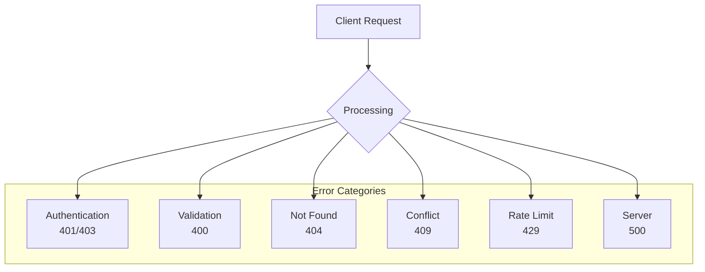
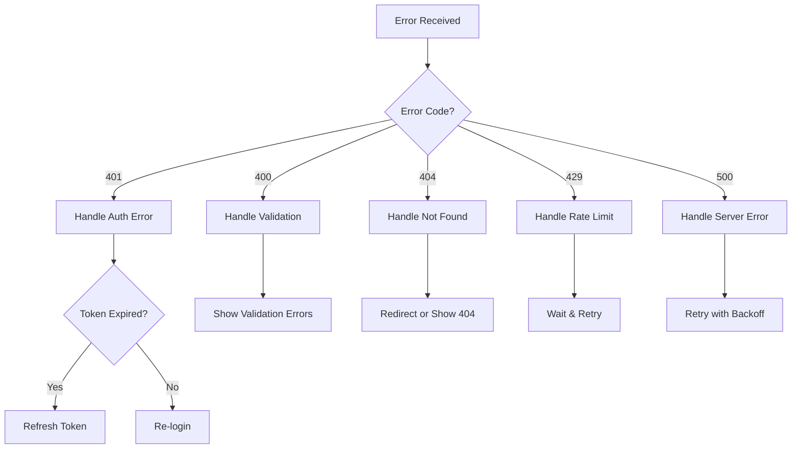

# TaskFlow API Error Codes

## Overview

This document provides a comprehensive catalog of all error codes returned by the TaskFlow API, including their meanings and how to handle them.

---

## Error Response Structure

```json
{
  "success": false,
  "error": {
    "code": "ERROR_CODE",
    "message": "Human-readable error message",
    "details": [
      {
        "field": "fieldName",
        "message": "Field-specific error message"
      }
    ]
  },
  "meta": {
    "timestamp": "2024-01-15T10:30:00Z",
    "requestId": "req_abc123"
  }
}
```

---

## Error Categories



---

## HTTP Status Codes

| Code | Status | Description |
|------|--------|-------------|
| 200 | OK | Request succeeded |
| 201 | Created | Resource created successfully |
| 204 | No Content | Request succeeded, no response body |
| 400 | Bad Request | Invalid request (validation error) |
| 401 | Unauthorized | Authentication required |
| 403 | Forbidden | Insufficient permissions |
| 404 | Not Found | Resource not found |
| 409 | Conflict | Resource conflict |
| 422 | Unprocessable Entity | Semantic validation error |
| 429 | Too Many Requests | Rate limit exceeded |
| 500 | Internal Server Error | Server error |
| 503 | Service Unavailable | Service temporarily unavailable |

---

## Authentication Errors (401)

| Code | Message | Description | Solution |
|------|---------|-------------|----------|
| `AUTH_REQUIRED` | Authentication required | No token provided | Include Authorization header |
| `INVALID_TOKEN` | Invalid or malformed token | Token is corrupt | Re-authenticate |
| `TOKEN_EXPIRED` | Access token has expired | Token lifetime ended | Refresh token or re-login |
| `INVALID_CREDENTIALS` | Invalid email or password | Wrong credentials | Check credentials |
| `ACCOUNT_DISABLED` | Account has been disabled | Account suspended | Contact support |
| `EMAIL_NOT_VERIFIED` | Email address not verified | Unverified email | Verify email |

### Example Responses

```json
// AUTH_REQUIRED
{
  "success": false,
  "error": {
    "code": "AUTH_REQUIRED",
    "message": "Authentication required"
  }
}

// TOKEN_EXPIRED
{
  "success": false,
  "error": {
    "code": "TOKEN_EXPIRED",
    "message": "Access token has expired",
    "details": {
      "expiredAt": "2024-01-15T10:30:00Z"
    }
  }
}
```

---

## Authorization Errors (403)

| Code | Message | Description | Solution |
|------|---------|-------------|----------|
| `FORBIDDEN` | Access denied | Insufficient permissions | Check user permissions |
| `RESOURCE_FORBIDDEN` | Cannot access this resource | Not owner | Use own resources |
| `ACTION_FORBIDDEN` | Cannot perform this action | Operation not allowed | Check allowed actions |
| `PLAN_LIMIT_REACHED` | Plan limit reached | Quota exceeded | Upgrade plan |

### Example Response

```json
{
  "success": false,
  "error": {
    "code": "RESOURCE_FORBIDDEN",
    "message": "Cannot access this resource",
    "details": {
      "resourceType": "task",
      "resourceId": "task_abc123"
    }
  }
}
```

---

## Validation Errors (400)

| Code | Message | Description | Solution |
|------|---------|-------------|----------|
| `VALIDATION_ERROR` | Validation failed | Invalid input data | Fix validation errors |
| `INVALID_REQUEST` | Invalid request format | Malformed request | Check request format |
| `MISSING_FIELD` | Required field missing | Field not provided | Include required field |
| `INVALID_FORMAT` | Invalid field format | Wrong data type | Fix field format |
| `VALUE_TOO_LONG` | Value exceeds maximum length | String too long | Shorten value |
| `VALUE_TOO_SHORT` | Value below minimum length | String too short | Lengthen value |
| `INVALID_ENUM` | Invalid enum value | Not in allowed values | Use allowed value |
| `INVALID_DATE` | Invalid date format | Date parsing failed | Use ISO 8601 format |

### Example Response

```json
{
  "success": false,
  "error": {
    "code": "VALIDATION_ERROR",
    "message": "Validation failed",
    "details": [
      {
        "field": "title",
        "code": "MISSING_FIELD",
        "message": "Title is required"
      },
      {
        "field": "email",
        "code": "INVALID_FORMAT",
        "message": "Invalid email format"
      },
      {
        "field": "priority",
        "code": "INVALID_ENUM",
        "message": "Priority must be one of: low, medium, high"
      }
    ]
  }
}
```

---

## Not Found Errors (404)

| Code | Message | Description | Solution |
|------|---------|-------------|----------|
| `NOT_FOUND` | Resource not found | Generic not found | Check resource ID |
| `TASK_NOT_FOUND` | Task not found | Task doesn't exist | Verify task ID |
| `PROJECT_NOT_FOUND` | Project not found | Project doesn't exist | Verify project ID |
| `LABEL_NOT_FOUND` | Label not found | Label doesn't exist | Verify label ID |
| `USER_NOT_FOUND` | User not found | User doesn't exist | Verify user ID |
| `ENDPOINT_NOT_FOUND` | Endpoint not found | Invalid URL | Check API URL |

### Example Response

```json
{
  "success": false,
  "error": {
    "code": "TASK_NOT_FOUND",
    "message": "Task not found",
    "details": {
      "taskId": "task_invalid123"
    }
  }
}
```

---

## Conflict Errors (409)

| Code | Message | Description | Solution |
|------|---------|-------------|----------|
| `CONFLICT` | Resource conflict | Generic conflict | Check resource state |
| `DUPLICATE_EMAIL` | Email already exists | Email taken | Use different email |
| `DUPLICATE_NAME` | Name already exists | Name taken | Use different name |
| `ALREADY_EXISTS` | Resource already exists | Duplicate resource | Use existing or rename |
| `CONCURRENT_MODIFICATION` | Resource was modified | Stale data | Refresh and retry |

### Example Response

```json
{
  "success": false,
  "error": {
    "code": "DUPLICATE_EMAIL",
    "message": "Email already exists",
    "details": {
      "email": "user@example.com"
    }
  }
}
```

---

## Rate Limit Errors (429)

| Code | Message | Description | Solution |
|------|---------|-------------|----------|
| `RATE_LIMIT_EXCEEDED` | Rate limit exceeded | Too many requests | Wait and retry |
| `LOGIN_RATE_LIMIT` | Too many login attempts | Brute force protection | Wait before retrying |
| `API_RATE_LIMIT` | API rate limit exceeded | General API limit | Reduce request rate |

### Example Response

```json
{
  "success": false,
  "error": {
    "code": "RATE_LIMIT_EXCEEDED",
    "message": "Rate limit exceeded",
    "details": {
      "limit": 100,
      "window": "1 minute",
      "retryAfter": 45
    }
  }
}
```

### Rate Limit Headers

```http
X-RateLimit-Limit: 100
X-RateLimit-Remaining: 0
X-RateLimit-Reset: 1705312200
Retry-After: 45
```

---

## Server Errors (500)

| Code | Message | Description | Solution |
|------|---------|-------------|----------|
| `INTERNAL_ERROR` | Internal server error | Unexpected error | Report to support |
| `DATABASE_ERROR` | Database error | DB operation failed | Retry later |
| `SERVICE_UNAVAILABLE` | Service unavailable | Service down | Retry later |
| `EXTERNAL_SERVICE_ERROR` | External service error | Third-party failure | Retry later |

### Example Response

```json
{
  "success": false,
  "error": {
    "code": "INTERNAL_ERROR",
    "message": "An unexpected error occurred",
    "details": {
      "requestId": "req_abc123"
    }
  }
}
```

---

## Error Handling Flow



---

## Client Error Handling

### JavaScript Example

```javascript
async function handleApiResponse(response) {
  const data = await response.json();

  if (data.success) {
    return data.data;
  }

  const error = data.error;

  switch (error.code) {
    case 'TOKEN_EXPIRED':
      // Try to refresh token
      const refreshed = await authService.refreshToken();
      if (refreshed) {
        // Retry original request
        return retryRequest();
      }
      // Redirect to login
      window.location.href = '/login';
      break;

    case 'VALIDATION_ERROR':
      // Display field errors
      error.details.forEach(detail => {
        showFieldError(detail.field, detail.message);
      });
      break;

    case 'RATE_LIMIT_EXCEEDED':
      // Wait and retry
      const retryAfter = error.details.retryAfter;
      await sleep(retryAfter * 1000);
      return retryRequest();

    case 'NOT_FOUND':
      // Redirect to 404 page
      window.location.href = '/404';
      break;

    default:
      // Show generic error
      showToast('An error occurred. Please try again.');
  }

  throw new ApiError(error);
}
```

---

## Best Practices

### For API Consumers

1. **Always check `success` field** before accessing data
2. **Handle specific error codes** before falling back to generic handling
3. **Display user-friendly messages** from `error.message`
4. **Log `requestId`** for debugging and support
5. **Implement retry logic** for transient errors (429, 503)
6. **Validate inputs client-side** to reduce validation errors

### Retry Strategy

```
Transient errors (500, 503, network):
- Max retries: 3
- Initial delay: 1 second
- Backoff multiplier: 2
- Max delay: 30 seconds

Rate limit errors (429):
- Use Retry-After header
- If not present, exponential backoff
```

---

## Related Documents

- [API Reference](./reference.md)
- [Authentication](./authentication.md)
- [Rate Limiting](./rate-limiting.md)
