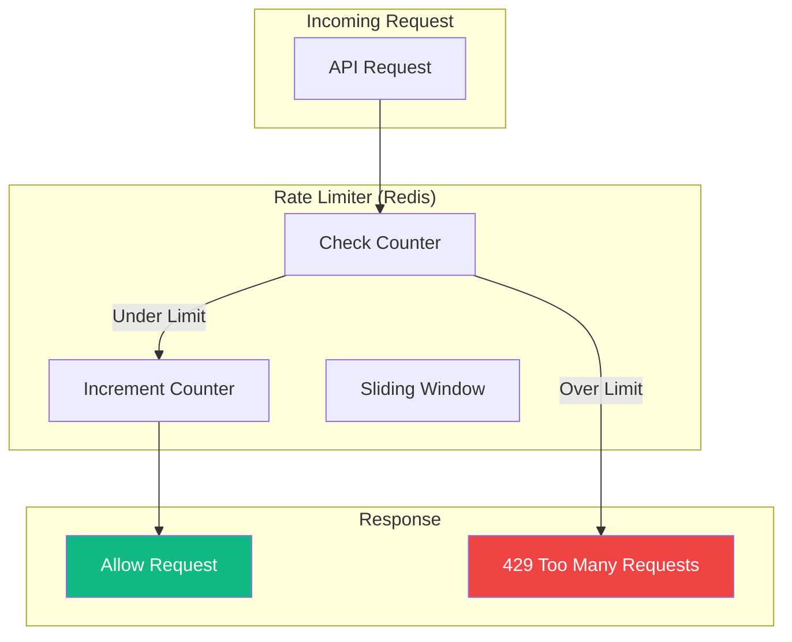
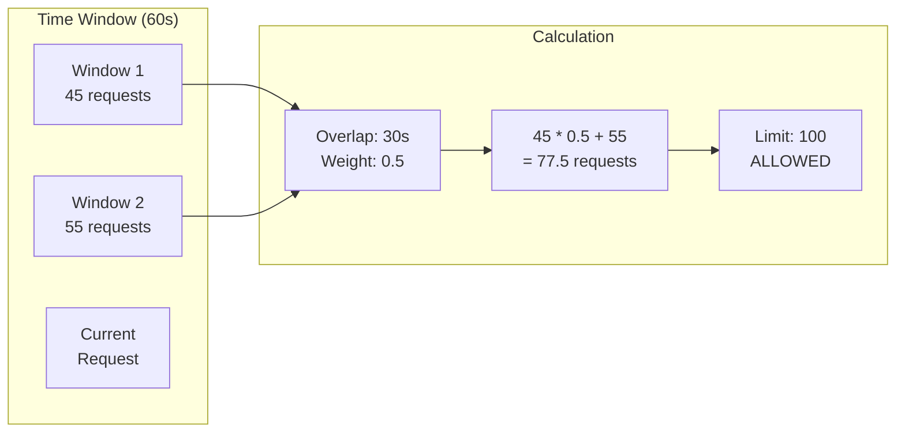

# TaskFlow API Rate Limiting

## Overview

TaskFlow implements rate limiting to ensure fair usage and protect the API from abuse. This document describes the rate limit rules, headers, and best practices for handling rate limits.

---

## Rate Limit Architecture



---

## Rate Limit Tiers

### By Endpoint Category

| Category | Limit | Window | Applies To |
|----------|-------|--------|------------|
| Authentication | 10 | 1 minute | /auth/login, /auth/register |
| Password Reset | 3 | 1 hour | /auth/forgot-password |
| API Read | 100 | 1 minute | GET requests |
| API Write | 30 | 1 minute | POST, PUT, DELETE |
| Search | 20 | 1 minute | Endpoints with search |
| Export | 5 | 1 hour | Bulk data exports |

### By Authentication Status

| Status | Read Limit | Write Limit |
|--------|------------|-------------|
| Unauthenticated | 20/min | N/A |
| Authenticated | 100/min | 30/min |
| Premium User | 500/min | 100/min |

---

## Rate Limit Headers

Every API response includes rate limit information:

```http
HTTP/1.1 200 OK
X-RateLimit-Limit: 100
X-RateLimit-Remaining: 87
X-RateLimit-Reset: 1705312260
X-RateLimit-Window: 60
```

### Header Descriptions

| Header | Description | Example |
|--------|-------------|---------|
| `X-RateLimit-Limit` | Maximum requests allowed in window | 100 |
| `X-RateLimit-Remaining` | Requests remaining in current window | 87 |
| `X-RateLimit-Reset` | Unix timestamp when window resets | 1705312260 |
| `X-RateLimit-Window` | Window size in seconds | 60 |

---

## Rate Limit Exceeded Response

When rate limit is exceeded, the API returns:

```http
HTTP/1.1 429 Too Many Requests
Content-Type: application/json
X-RateLimit-Limit: 100
X-RateLimit-Remaining: 0
X-RateLimit-Reset: 1705312260
Retry-After: 45

{
  "success": false,
  "error": {
    "code": "RATE_LIMIT_EXCEEDED",
    "message": "Rate limit exceeded. Please slow down.",
    "details": {
      "limit": 100,
      "window": "1 minute",
      "retryAfter": 45
    }
  }
}
```

---

## Endpoint-Specific Limits

### Authentication Endpoints

```
POST /auth/login
├── Limit: 10 requests
├── Window: 1 minute
├── Scope: Per IP + Email
└── Lockout: 15 minutes after 10 failures

POST /auth/register
├── Limit: 5 requests
├── Window: 1 hour
├── Scope: Per IP
└── Purpose: Prevent spam accounts

POST /auth/forgot-password
├── Limit: 3 requests
├── Window: 1 hour
├── Scope: Per Email
└── Purpose: Prevent email abuse
```

### Task Endpoints

```
GET /tasks
├── Limit: 100 requests
├── Window: 1 minute
└── Scope: Per User

POST /tasks
├── Limit: 30 requests
├── Window: 1 minute
└── Scope: Per User

PUT /tasks/:id
├── Limit: 30 requests
├── Window: 1 minute
└── Scope: Per User

DELETE /tasks/:id
├── Limit: 30 requests
├── Window: 1 minute
└── Scope: Per User
```

### Search & Filter

```
GET /tasks?search=...
├── Limit: 20 requests
├── Window: 1 minute
└── Scope: Per User

GET /tasks?filter=complex
├── Limit: 10 requests
├── Window: 1 minute
└── Purpose: Protect expensive queries
```

---

## Sliding Window Algorithm

TaskFlow uses a sliding window rate limiter for accurate, fair limiting:



---

## Handling Rate Limits

### Client Implementation

```javascript
class RateLimitHandler {
  constructor() {
    this.retryQueue = [];
    this.isRetrying = false;
  }

  async makeRequest(url, options) {
    try {
      const response = await fetch(url, options);

      // Track rate limit headers
      this.updateLimits(response.headers);

      if (response.status === 429) {
        return this.handleRateLimit(response, url, options);
      }

      return response;
    } catch (error) {
      throw error;
    }
  }

  updateLimits(headers) {
    this.remaining = parseInt(headers.get('X-RateLimit-Remaining'));
    this.resetTime = parseInt(headers.get('X-RateLimit-Reset'));
  }

  async handleRateLimit(response, url, options) {
    const retryAfter = parseInt(
      response.headers.get('Retry-After') || '60'
    );

    console.log(`Rate limited. Retrying in ${retryAfter}s`);

    // Wait for rate limit to reset
    await this.sleep(retryAfter * 1000);

    // Retry the request
    return this.makeRequest(url, options);
  }

  sleep(ms) {
    return new Promise(resolve => setTimeout(resolve, ms));
  }

  // Proactive rate limiting
  shouldThrottle() {
    if (this.remaining <= 5) {
      const waitTime = (this.resetTime - Date.now() / 1000) * 1000;
      return waitTime > 0 ? waitTime : 0;
    }
    return 0;
  }
}
```

### Exponential Backoff

```javascript
async function retryWithBackoff(fn, maxRetries = 3) {
  let retries = 0;
  let delay = 1000; // Start with 1 second

  while (retries < maxRetries) {
    try {
      return await fn();
    } catch (error) {
      if (error.status !== 429 || retries === maxRetries - 1) {
        throw error;
      }

      // Use Retry-After header if available
      const retryAfter = error.headers?.get('Retry-After');
      const waitTime = retryAfter
        ? parseInt(retryAfter) * 1000
        : delay;

      console.log(`Retry ${retries + 1}/${maxRetries} in ${waitTime}ms`);

      await sleep(waitTime);
      retries++;
      delay *= 2; // Exponential backoff
    }
  }
}
```

---

## Best Practices

### Do

```markdown
1. **Monitor rate limit headers**
   - Track X-RateLimit-Remaining
   - Slow down proactively when low

2. **Implement backoff strategies**
   - Use Retry-After header
   - Exponential backoff for retries

3. **Batch requests when possible**
   - Combine multiple operations
   - Use bulk endpoints if available

4. **Cache responses**
   - Reduce unnecessary API calls
   - Use ETags for conditional requests

5. **Spread requests over time**
   - Avoid burst patterns
   - Use request queuing
```

### Don't

```markdown
1. **Don't ignore rate limit headers**
   - They help you avoid 429s

2. **Don't retry immediately**
   - Always wait for retry window

3. **Don't make parallel requests**
   - Can quickly exhaust limits

4. **Don't poll unnecessarily**
   - Use webhooks when available
   - Implement efficient caching
```

---

## Rate Limit Monitoring

### Dashboard View

```
┌─────────────────────────────────────────────────────────────────┐
│                    RATE LIMIT DASHBOARD                          │
├─────────────────────────────────────────────────────────────────┤
│                                                                  │
│  Current Usage                      Status                       │
│  ┌─────────────────────┐           ┌─────────────────────┐      │
│  │ ████████░░░░ 67%    │           │ ✓ Within Limits     │      │
│  │ 67/100 requests     │           │                     │      │
│  │ Resets in 23s       │           │ Avg: 45 req/min     │      │
│  └─────────────────────┘           └─────────────────────┘      │
│                                                                  │
│  History (Last Hour)                                             │
│  100 ┤                                                          │
│   75 ┤    ╭──╮   ╭─╮                                            │
│   50 ┤ ╭──╯  ╰───╯ ╰──╮    ╭──╮                                │
│   25 ┤─╯              ╰────╯  ╰───                              │
│    0 ┼─────────────────────────────────────────────             │
│      0    15   30   45   60 min                                 │
│                                                                  │
└─────────────────────────────────────────────────────────────────┘
```

---

## Requesting Higher Limits

If you need higher rate limits:

1. **Contact Support**: support@taskflow.app
2. **Provide Justification**: Describe your use case
3. **Usage Patterns**: Share expected request volumes
4. **Consider Premium**: Higher limits included

### Premium Tier Limits

| Feature | Standard | Premium |
|---------|----------|---------|
| Read Requests | 100/min | 500/min |
| Write Requests | 30/min | 100/min |
| Search Requests | 20/min | 100/min |
| Export Requests | 5/hour | 50/hour |
| Burst Allowance | 0 | +50% |

---

## Technical Implementation

### Redis-Based Rate Limiter

```typescript
// Simplified rate limiter implementation
async function checkRateLimit(
  userId: string,
  endpoint: string,
  limit: number,
  windowSeconds: number
): Promise<RateLimitResult> {
  const key = `ratelimit:${userId}:${endpoint}`;
  const now = Date.now();
  const windowStart = now - (windowSeconds * 1000);

  // Remove old entries
  await redis.zremrangebyscore(key, 0, windowStart);

  // Count requests in window
  const count = await redis.zcard(key);

  if (count >= limit) {
    const oldestEntry = await redis.zrange(key, 0, 0, 'WITHSCORES');
    const resetTime = parseInt(oldestEntry[1]) + (windowSeconds * 1000);

    return {
      allowed: false,
      remaining: 0,
      resetTime: Math.ceil(resetTime / 1000),
      retryAfter: Math.ceil((resetTime - now) / 1000)
    };
  }

  // Add current request
  await redis.zadd(key, now, `${now}:${Math.random()}`);
  await redis.expire(key, windowSeconds);

  return {
    allowed: true,
    remaining: limit - count - 1,
    resetTime: Math.ceil((now + windowSeconds * 1000) / 1000)
  };
}
```

---

## Related Documents

- [API Reference](./reference.md)
- [Error Codes](./error-codes.md)
- [Authentication](./authentication.md)
