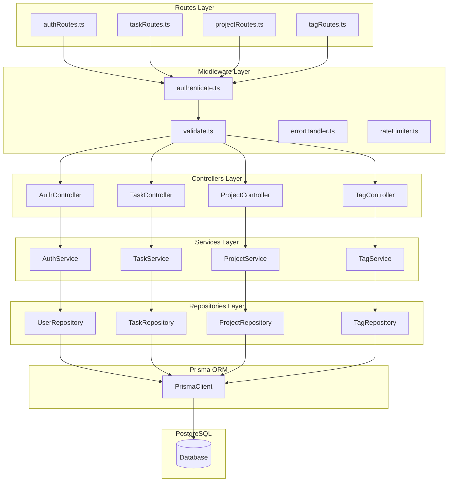

# TaskFlow Backend Architecture

## Layered Architecture Overview

The TaskFlow backend follows a clean layered architecture pattern, separating concerns across distinct layers for maintainability and testability.

### ASCII Layer Diagram

```
                         TASKFLOW BACKEND LAYERS
    =====================================================================

    +-------------------------------------------------------------------+
    |                         HTTP REQUEST                               |
    +-------------------------------------------------------------------+
                                    |
                                    v
    +-------------------------------------------------------------------+
    |                          ROUTES LAYER                              |
    |                     (src/routes/*.ts)                              |
    |                                                                    |
    |    authRoutes.ts  |  taskRoutes.ts  |  projectRoutes.ts  |  ...   |
    |                                                                    |
    |    - URL path mapping                                              |
    |    - HTTP method binding                                           |
    |    - Middleware attachment                                         |
    +-------------------------------------------------------------------+
                                    |
                                    v
    +-------------------------------------------------------------------+
    |                       MIDDLEWARE LAYER                             |
    |                    (src/middleware/*.ts)                           |
    |                                                                    |
    |    authenticate.ts  |  validate.ts  |  errorHandler.ts  |  ...    |
    |                                                                    |
    |    - Authentication (JWT verification)                             |
    |    - Request validation (Zod schemas)                              |
    |    - Rate limiting                                                 |
    |    - Error handling                                                |
    |    - Logging                                                       |
    +-------------------------------------------------------------------+
                                    |
                                    v
    +-------------------------------------------------------------------+
    |                      CONTROLLERS LAYER                             |
    |                   (src/controllers/*.ts)                           |
    |                                                                    |
    |   AuthController  |  TaskController  |  ProjectController  |  ... |
    |                                                                    |
    |    - Extract request data                                          |
    |    - Call service methods                                          |
    |    - Format HTTP responses                                         |
    |    - Handle HTTP status codes                                      |
    +-------------------------------------------------------------------+
                                    |
                                    v
    +-------------------------------------------------------------------+
    |                       SERVICES LAYER                               |
    |                    (src/services/*.ts)                             |
    |                                                                    |
    |    AuthService  |  TaskService  |  ProjectService  |  TagService  |
    |                                                                    |
    |    - Business logic                                                |
    |    - Data transformation                                           |
    |    - Cross-entity operations                                       |
    |    - Validation rules                                              |
    +-------------------------------------------------------------------+
                                    |
                                    v
    +-------------------------------------------------------------------+
    |                     REPOSITORIES LAYER                             |
    |                  (src/repositories/*.ts)                           |
    |                                                                    |
    |   UserRepository | TaskRepository | ProjectRepository | TagRepository
    |                                                                    |
    |    - Prisma operations                                             |
    |    - Query building                                                |
    |    - Data access abstraction                                       |
    +-------------------------------------------------------------------+
                                    |
                                    v
    +-------------------------------------------------------------------+
    |                        PRISMA ORM                                  |
    |                    (prisma/schema.prisma)                          |
    |                                                                    |
    |    - Type-safe queries                                             |
    |    - Connection pooling                                            |
    |    - Migration management                                          |
    +-------------------------------------------------------------------+
                                    |
                                    v
    +-------------------------------------------------------------------+
    |                       POSTGRESQL                                   |
    +-------------------------------------------------------------------+
```

### Mermaid Architecture Diagram



## Directory Structure

```
backend/
├── src/
│   ├── index.ts                 # Application entry point
│   ├── app.ts                   # Express app configuration
│   ├── config/
│   │   ├── index.ts             # Configuration loader
│   │   ├── database.ts          # Database configuration
│   │   └── auth.ts              # JWT/auth configuration
│   │
│   ├── routes/
│   │   ├── index.ts             # Route aggregator
│   │   ├── authRoutes.ts        # /api/v1/auth/*
│   │   ├── taskRoutes.ts        # /api/v1/tasks/*
│   │   ├── projectRoutes.ts     # /api/v1/projects/*
│   │   ├── tagRoutes.ts         # /api/v1/tags/*
│   │   └── userRoutes.ts        # /api/v1/users/*
│   │
│   ├── middleware/
│   │   ├── authenticate.ts      # JWT verification
│   │   ├── validate.ts          # Zod validation wrapper
│   │   ├── errorHandler.ts      # Global error handler
│   │   ├── rateLimiter.ts       # Rate limiting
│   │   └── requestLogger.ts     # Request logging
│   │
│   ├── controllers/
│   │   ├── AuthController.ts    # Authentication endpoints
│   │   ├── TaskController.ts    # Task CRUD operations
│   │   ├── ProjectController.ts # Project management
│   │   ├── TagController.ts     # Tag management
│   │   └── UserController.ts    # User profile
│   │
│   ├── services/
│   │   ├── AuthService.ts       # Auth business logic
│   │   ├── TaskService.ts       # Task business logic
│   │   ├── ProjectService.ts    # Project business logic
│   │   ├── TagService.ts        # Tag business logic
│   │   └── EmailService.ts      # Email notifications
│   │
│   ├── repositories/
│   │   ├── UserRepository.ts    # User data access
│   │   ├── TaskRepository.ts    # Task data access
│   │   ├── ProjectRepository.ts # Project data access
│   │   └── TagRepository.ts     # Tag data access
│   │
│   ├── schemas/
│   │   ├── authSchemas.ts       # Auth validation schemas
│   │   ├── taskSchemas.ts       # Task validation schemas
│   │   ├── projectSchemas.ts    # Project validation schemas
│   │   └── commonSchemas.ts     # Shared schemas
│   │
│   ├── types/
│   │   ├── index.ts             # Type exports
│   │   ├── express.d.ts         # Express type extensions
│   │   └── api.ts               # API response types
│   │
│   ├── utils/
│   │   ├── jwt.ts               # JWT helpers
│   │   ├── password.ts          # Password hashing
│   │   ├── errors.ts            # Custom error classes
│   │   └── logger.ts            # Winston logger setup
│   │
│   └── __tests__/
│       ├── unit/
│       │   └── services/        # Service unit tests
│       └── integration/
│           └── routes/          # API integration tests
│
├── prisma/
│   ├── schema.prisma            # Database schema
│   ├── migrations/              # Migration files
│   └── seed.ts                  # Seed data script
│
├── package.json
├── tsconfig.json
└── vitest.config.ts
```

## Dependency Injection Pattern

TaskFlow uses a simple factory pattern for dependency injection:

```typescript
// src/container.ts
import { PrismaClient } from '@prisma/client';
import { UserRepository } from './repositories/UserRepository';
import { TaskRepository } from './repositories/TaskRepository';
import { AuthService } from './services/AuthService';
import { TaskService } from './services/TaskService';

const prisma = new PrismaClient();

// Repositories
const userRepository = new UserRepository(prisma);
const taskRepository = new TaskRepository(prisma);

// Services
export const authService = new AuthService(userRepository);
export const taskService = new TaskService(taskRepository, userRepository);

// Export for testing
export { prisma };
```

## Error Propagation

```
Layer                Error Type                  Action
--------------------------------------------------------------------------------
Repository      →    Prisma Error           →   Wrap in RepositoryError
Service         →    Business Rule Error    →   Throw ServiceError
Controller      →    Format Error           →   Create ApiError
ErrorHandler    →    Any Error              →   Convert to HTTP Response
```

### Error Classes

```typescript
// src/utils/errors.ts
export class AppError extends Error {
  constructor(
    public message: string,
    public statusCode: number,
    public code: string
  ) {
    super(message);
  }
}

export class ValidationError extends AppError {
  constructor(message: string, public details: any[]) {
    super(message, 400, 'VALIDATION_ERROR');
  }
}

export class AuthenticationError extends AppError {
  constructor(message = 'Authentication required') {
    super(message, 401, 'AUTHENTICATION_ERROR');
  }
}

export class NotFoundError extends AppError {
  constructor(resource: string) {
    super(`${resource} not found`, 404, 'NOT_FOUND');
  }
}
```

## Logging Strategy

Each layer logs at appropriate levels:

| Layer | Log Level | What to Log |
|-------|-----------|-------------|
| Routes | DEBUG | Request received, path, method |
| Middleware | INFO | Auth success/failure, validation errors |
| Controller | INFO | Operation started, completed |
| Service | DEBUG | Business logic steps |
| Repository | DEBUG | Queries executed |
| Error Handler | ERROR | All errors with stack traces |

### Logger Configuration

```typescript
// src/utils/logger.ts
import winston from 'winston';

export const logger = winston.createLogger({
  level: process.env.LOG_LEVEL || 'info',
  format: winston.format.combine(
    winston.format.timestamp(),
    winston.format.json()
  ),
  transports: [
    new winston.transports.Console(),
    new winston.transports.File({ filename: 'logs/error.log', level: 'error' }),
    new winston.transports.File({ filename: 'logs/combined.log' })
  ]
});
```

## Middleware Chain Order


1. **requestLogger** - Log all incoming requests
2. **cors** - Handle CORS headers
3. **helmet** - Security headers
4. **rateLimiter** - Rate limiting by IP
5. **bodyParser** - Parse JSON body
6. **authenticate** - Verify JWT token (on protected routes)
7. **validate** - Validate request body/params
8. **Controller** - Handle business logic
