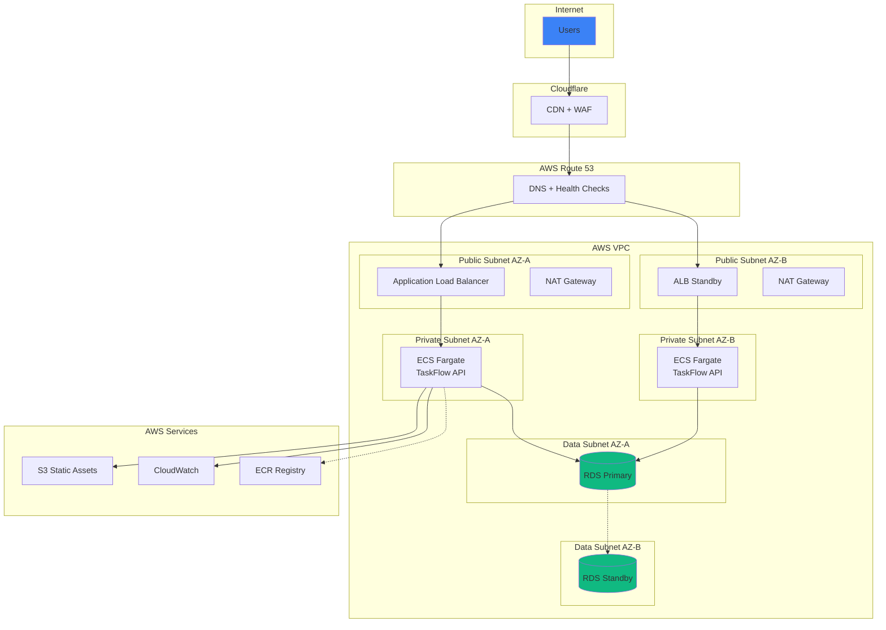
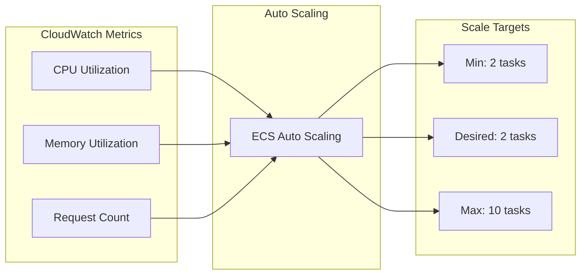

# TaskFlow Cloud Architecture

## Target Cloud Provider

TaskFlow is designed for deployment on AWS, with notes for GCP and Azure equivalents.

### ASCII Infrastructure Diagram

```
                        TASKFLOW CLOUD ARCHITECTURE (AWS)
    ========================================================================

                              ┌─────────────────────┐
                              │     CLOUDFLARE      │
                              │   (CDN + WAF)       │
                              └──────────┬──────────┘
                                         │
                              ┌──────────▼──────────┐
                              │     ROUTE 53        │
                              │   (DNS + Health)    │
                              └──────────┬──────────┘
                                         │
    ═══════════════════════════════════════════════════════════════════════
                                    VPC (10.0.0.0/16)
    ═══════════════════════════════════════════════════════════════════════
    │                                    │                                 │
    │  Public Subnet (10.0.1.0/24)       │  Public Subnet (10.0.2.0/24)    │
    │  ┌─────────────────────────┐       │  ┌─────────────────────────┐    │
    │  │  Application Load       │       │  │  Application Load       │    │
    │  │  Balancer (ALB)         │◄──────┼──┤  Balancer (ALB)         │    │
    │  └───────────┬─────────────┘       │  └───────────┬─────────────┘    │
    │              │                     │              │                  │
    │  ┌───────────▼─────────────┐       │  ┌───────────▼─────────────┐    │
    │  │       NAT Gateway       │       │  │       NAT Gateway       │    │
    │  └───────────┬─────────────┘       │  └───────────┬─────────────┘    │
    │              │                     │              │                  │
    ├──────────────┼─────────────────────┼──────────────┼──────────────────┤
    │              │                     │              │                  │
    │  Private Subnet (10.0.10.0/24)     │  Private Subnet (10.0.20.0/24)  │
    │  ┌─────────────────────────┐       │  ┌─────────────────────────┐    │
    │  │      ECS Fargate        │       │  │      ECS Fargate        │    │
    │  │  ┌─────────────────┐    │       │  │  ┌─────────────────┐    │    │
    │  │  │ TaskFlow API    │    │       │  │  │ TaskFlow API    │    │    │
    │  │  │ Container       │    │       │  │  │ Container       │    │    │
    │  │  └─────────────────┘    │       │  │  └─────────────────┘    │    │
    │  └───────────┬─────────────┘       │  └───────────┬─────────────┘    │
    │              │                     │              │                  │
    ├──────────────┼─────────────────────┼──────────────┼──────────────────┤
    │              │                     │              │                  │
    │  Private Subnet (10.0.100.0/24)    │  Private Subnet (10.0.200.0/24) │
    │  ┌─────────────────────────────────┴─────────────────────────────┐   │
    │  │                        RDS PostgreSQL                         │   │
    │  │                       (Multi-AZ Standby)                      │   │
    │  └───────────────────────────────────────────────────────────────┘   │
    │                                                                      │
    ═══════════════════════════════════════════════════════════════════════

    External Services:
    ┌─────────────────┐  ┌─────────────────┐  ┌─────────────────┐
    │    S3 Bucket    │  │   CloudWatch    │  │   ECR Registry  │
    │  (Static Files) │  │   (Logging)     │  │   (Images)      │
    └─────────────────┘  └─────────────────┘  └─────────────────┘
```

### Mermaid Cloud Diagram



## Service Mapping

| Component | AWS Service | GCP Equivalent | Azure Equivalent |
|-----------|-------------|----------------|------------------|
| DNS | Route 53 | Cloud DNS | Azure DNS |
| CDN | CloudFront | Cloud CDN | Azure CDN |
| Load Balancer | ALB | Cloud Load Balancing | Azure LB |
| Containers | ECS Fargate | Cloud Run | Azure Container Apps |
| Database | RDS PostgreSQL | Cloud SQL | Azure Database for PostgreSQL |
| Static Files | S3 | Cloud Storage | Azure Blob Storage |
| Container Registry | ECR | Artifact Registry | Azure Container Registry |
| Monitoring | CloudWatch | Cloud Monitoring | Azure Monitor |
| Secrets | Secrets Manager | Secret Manager | Key Vault |

## Networking

### VPC Configuration

```
VPC CIDR: 10.0.0.0/16 (65,536 IPs)

Subnets:
├── Public Subnet AZ-A:    10.0.1.0/24   (254 IPs)
├── Public Subnet AZ-B:    10.0.2.0/24   (254 IPs)
├── Private Subnet AZ-A:   10.0.10.0/24  (254 IPs)
├── Private Subnet AZ-B:   10.0.20.0/24  (254 IPs)
├── Data Subnet AZ-A:      10.0.100.0/24 (254 IPs)
└── Data Subnet AZ-B:      10.0.200.0/24 (254 IPs)
```

### Security Groups

| Security Group | Inbound Rules | Outbound Rules |
|----------------|---------------|----------------|
| ALB SG | 443 from 0.0.0.0/0 | All to ECS SG |
| ECS SG | 3000 from ALB SG | All to 0.0.0.0/0 |
| RDS SG | 5432 from ECS SG | None |

## Scaling Strategy

### Horizontal Auto-Scaling



### Scaling Rules

| Metric | Scale Out | Scale In |
|--------|-----------|----------|
| CPU | > 70% for 3 min | < 30% for 10 min |
| Memory | > 80% for 3 min | < 40% for 10 min |
| Request Latency | > 500ms p99 | < 200ms p99 |

### Database Scaling

- **Read Replicas:** Add read replicas when read:write ratio > 10:1
- **Instance Size:** Start with db.t3.medium, scale to db.r5.large at 500 concurrent connections
- **Storage:** Auto-scaling enabled, starts at 20GB

## Cost Optimization

### Instance Sizing (Development)

| Service | Size | Monthly Cost (est.) |
|---------|------|---------------------|
| ECS Fargate | 0.5 vCPU, 1GB | $15 |
| RDS PostgreSQL | db.t3.micro | $13 |
| ALB | - | $16 |
| S3 | 1GB | $0.02 |
| **Total** | | **~$44/month** |

### Instance Sizing (Production)

| Service | Size | Monthly Cost (est.) |
|---------|------|---------------------|
| ECS Fargate (x2) | 1 vCPU, 2GB | $60 |
| RDS PostgreSQL | db.t3.small | $25 |
| RDS Multi-AZ | - | +$25 |
| ALB | - | $16 |
| NAT Gateway (x2) | - | $65 |
| S3 | 10GB | $0.25 |
| CloudWatch | - | $10 |
| **Total** | | **~$200/month** |

### Cost Saving Tips

1. **Reserved Instances:** 30-40% savings on RDS
2. **Spot Instances:** Consider for non-critical workloads
3. **Right-sizing:** Monitor and adjust instance sizes
4. **NAT Gateway:** Use VPC endpoints for S3/ECR to reduce NAT costs

## Simple Docker Deployment (Alternative)

For smaller deployments, TaskFlow can run on a single server:

```
┌─────────────────────────────────────────────────────────────┐
│                    Single VPS / EC2                          │
│  ┌─────────────────────────────────────────────────────┐    │
│  │                    Docker Host                       │    │
│  │  ┌─────────────┐  ┌─────────────┐  ┌─────────────┐  │    │
│  │  │   NGINX     │  │  TaskFlow   │  │  PostgreSQL │  │    │
│  │  │  (Reverse   │─▶│    API      │─▶│  (Database) │  │    │
│  │  │   Proxy)    │  │             │  │             │  │    │
│  │  └─────────────┘  └─────────────┘  └─────────────┘  │    │
│  └─────────────────────────────────────────────────────┘    │
│                                                              │
│  Volumes:                                                    │
│  - /var/lib/postgresql/data (persistent DB)                 │
│  - /var/log/taskflow (logs)                                 │
└─────────────────────────────────────────────────────────────┘
```

### docker-compose.yml (Production-ready)

```yaml
version: '3.8'
services:
  nginx:
    image: nginx:alpine
    ports:
      - "80:80"
      - "443:443"
    volumes:
      - ./nginx.conf:/etc/nginx/nginx.conf
      - ./certs:/etc/nginx/certs
    depends_on:
      - api

  api:
    image: taskflow/api:latest
    environment:
      - DATABASE_URL=postgresql://taskflow:password@db:5432/taskflow
      - JWT_SECRET=${JWT_SECRET}
    depends_on:
      - db
    restart: unless-stopped

  db:
    image: postgres:15-alpine
    environment:
      - POSTGRES_USER=taskflow
      - POSTGRES_PASSWORD=${DB_PASSWORD}
      - POSTGRES_DB=taskflow
    volumes:
      - postgres_data:/var/lib/postgresql/data
    restart: unless-stopped

volumes:
  postgres_data:
```

## Deployment Checklist

- [ ] VPC and subnets created
- [ ] Security groups configured
- [ ] RDS instance provisioned
- [ ] ECS cluster created
- [ ] Task definition deployed
- [ ] ALB configured with health checks
- [ ] SSL certificate installed
- [ ] DNS records configured
- [ ] Auto-scaling policies set
- [ ] CloudWatch alarms configured
- [ ] Backup retention configured
