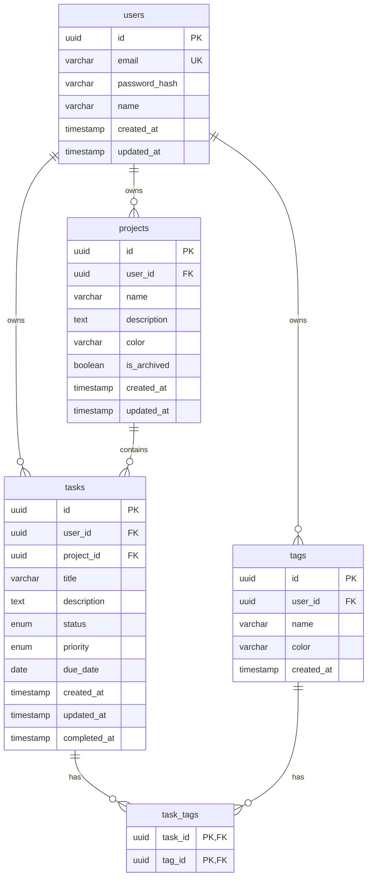

# TaskFlow Database Architecture

## Database Technology

- **Database:** PostgreSQL 15.x
- **ORM:** Prisma 5.x
- **Connection Pooling:** PgBouncer (production)

## Entity-Relationship Diagram

### ASCII ERD

```
                              TASKFLOW DATABASE ERD
    ========================================================================

    +------------------+          +------------------+
    |      users       |          |     projects     |
    +------------------+          +------------------+
    | PK id            |<----+    | PK id            |
    |    email         |     |    |    name          |
    |    password_hash |     |    |    description   |
    |    name          |     |    |    color         |
    |    created_at    |     |    |    is_archived   |
    |    updated_at    |     +----| FK user_id       |
    +------------------+          |    created_at    |
             |                    |    updated_at    |
             |                    +------------------+
             |                            |
             |                            |
             v                            v
    +------------------+          +------------------+
    |      tasks       |          |      tags        |
    +------------------+          +------------------+
    | PK id            |          | PK id            |
    |    title         |          |    name          |
    |    description   |          |    color         |
    |    status        |<---------| FK user_id       |-----+
    |    priority      |          |    created_at    |     |
    |    due_date      |          +------------------+     |
    | FK user_id       |-----+            |                |
    | FK project_id    |-----|            |                |
    |    created_at    |     |            v                |
    |    updated_at    |     |    +------------------+     |
    |    completed_at  |     |    |    task_tags     |     |
    +------------------+     |    +------------------+     |
             |               |    | PK task_id       |-----+
             |               |    | PK tag_id        |
             |               |    +------------------+
             |               |
             |               +---> users
             +-------------------> projects


    RELATIONSHIP LEGEND:
    ─────────────────────
    PK = Primary Key
    FK = Foreign Key
    ─── = One-to-Many
    ═══ = Many-to-Many (via junction table)

    CARDINALITY:
    ─────────────
    users      1 ──< tasks        (One user has many tasks)
    users      1 ──< projects     (One user has many projects)
    users      1 ──< tags         (One user has many tags)
    projects   1 ──< tasks        (One project has many tasks)
    tasks      >──< tags          (Many-to-many via task_tags)
```

### Mermaid ERD



## Table Definitions

### users

```sql
CREATE TABLE users (
    id UUID PRIMARY KEY DEFAULT gen_random_uuid(),
    email VARCHAR(255) NOT NULL UNIQUE,
    password_hash VARCHAR(255) NOT NULL,
    name VARCHAR(100) NOT NULL,
    created_at TIMESTAMP WITH TIME ZONE DEFAULT CURRENT_TIMESTAMP,
    updated_at TIMESTAMP WITH TIME ZONE DEFAULT CURRENT_TIMESTAMP
);

CREATE INDEX idx_users_email ON users(email);
```

### projects

```sql
CREATE TABLE projects (
    id UUID PRIMARY KEY DEFAULT gen_random_uuid(),
    user_id UUID NOT NULL REFERENCES users(id) ON DELETE CASCADE,
    name VARCHAR(100) NOT NULL,
    description TEXT,
    color VARCHAR(7) DEFAULT '#3b82f6',
    is_archived BOOLEAN DEFAULT FALSE,
    created_at TIMESTAMP WITH TIME ZONE DEFAULT CURRENT_TIMESTAMP,
    updated_at TIMESTAMP WITH TIME ZONE DEFAULT CURRENT_TIMESTAMP
);

CREATE INDEX idx_projects_user_id ON projects(user_id);
CREATE INDEX idx_projects_archived ON projects(user_id, is_archived);
```

### tasks

```sql
CREATE TABLE tasks (
    id UUID PRIMARY KEY DEFAULT gen_random_uuid(),
    user_id UUID NOT NULL REFERENCES users(id) ON DELETE CASCADE,
    project_id UUID REFERENCES projects(id) ON DELETE SET NULL,
    title VARCHAR(255) NOT NULL,
    description TEXT,
    status VARCHAR(20) NOT NULL DEFAULT 'todo'
        CHECK (status IN ('todo', 'in_progress', 'done')),
    priority VARCHAR(10) NOT NULL DEFAULT 'medium'
        CHECK (priority IN ('low', 'medium', 'high', 'urgent')),
    due_date DATE,
    created_at TIMESTAMP WITH TIME ZONE DEFAULT CURRENT_TIMESTAMP,
    updated_at TIMESTAMP WITH TIME ZONE DEFAULT CURRENT_TIMESTAMP,
    completed_at TIMESTAMP WITH TIME ZONE
);

CREATE INDEX idx_tasks_user_id ON tasks(user_id);
CREATE INDEX idx_tasks_project_id ON tasks(project_id);
CREATE INDEX idx_tasks_status ON tasks(user_id, status);
CREATE INDEX idx_tasks_due_date ON tasks(user_id, due_date);
CREATE INDEX idx_tasks_priority ON tasks(user_id, priority);
```

### tags

```sql
CREATE TABLE tags (
    id UUID PRIMARY KEY DEFAULT gen_random_uuid(),
    user_id UUID NOT NULL REFERENCES users(id) ON DELETE CASCADE,
    name VARCHAR(50) NOT NULL,
    color VARCHAR(7) DEFAULT '#6b7280',
    created_at TIMESTAMP WITH TIME ZONE DEFAULT CURRENT_TIMESTAMP,
    UNIQUE(user_id, name)
);

CREATE INDEX idx_tags_user_id ON tags(user_id);
```

### task_tags (Junction Table)

```sql
CREATE TABLE task_tags (
    task_id UUID NOT NULL REFERENCES tasks(id) ON DELETE CASCADE,
    tag_id UUID NOT NULL REFERENCES tags(id) ON DELETE CASCADE,
    PRIMARY KEY (task_id, tag_id)
);

CREATE INDEX idx_task_tags_tag_id ON task_tags(tag_id);
```

## Prisma Schema

```prisma
// prisma/schema.prisma

generator client {
  provider = "prisma-client-js"
}

datasource db {
  provider = "postgresql"
  url      = env("DATABASE_URL")
}

model User {
  id           String    @id @default(uuid())
  email        String    @unique
  passwordHash String    @map("password_hash")
  name         String
  createdAt    DateTime  @default(now()) @map("created_at")
  updatedAt    DateTime  @updatedAt @map("updated_at")

  tasks        Task[]
  projects     Project[]
  tags         Tag[]

  @@map("users")
}

model Project {
  id          String    @id @default(uuid())
  userId      String    @map("user_id")
  name        String
  description String?
  color       String    @default("#3b82f6")
  isArchived  Boolean   @default(false) @map("is_archived")
  createdAt   DateTime  @default(now()) @map("created_at")
  updatedAt   DateTime  @updatedAt @map("updated_at")

  user        User      @relation(fields: [userId], references: [id], onDelete: Cascade)
  tasks       Task[]

  @@index([userId])
  @@map("projects")
}

enum TaskStatus {
  todo
  in_progress
  done
}

enum TaskPriority {
  low
  medium
  high
  urgent
}

model Task {
  id          String       @id @default(uuid())
  userId      String       @map("user_id")
  projectId   String?      @map("project_id")
  title       String
  description String?
  status      TaskStatus   @default(todo)
  priority    TaskPriority @default(medium)
  dueDate     DateTime?    @map("due_date") @db.Date
  createdAt   DateTime     @default(now()) @map("created_at")
  updatedAt   DateTime     @updatedAt @map("updated_at")
  completedAt DateTime?    @map("completed_at")

  user        User         @relation(fields: [userId], references: [id], onDelete: Cascade)
  project     Project?     @relation(fields: [projectId], references: [id], onDelete: SetNull)
  tags        TaskTag[]

  @@index([userId])
  @@index([projectId])
  @@index([userId, status])
  @@index([userId, dueDate])
  @@map("tasks")
}

model Tag {
  id        String    @id @default(uuid())
  userId    String    @map("user_id")
  name      String
  color     String    @default("#6b7280")
  createdAt DateTime  @default(now()) @map("created_at")

  user      User      @relation(fields: [userId], references: [id], onDelete: Cascade)
  tasks     TaskTag[]

  @@unique([userId, name])
  @@index([userId])
  @@map("tags")
}

model TaskTag {
  taskId String @map("task_id")
  tagId  String @map("tag_id")

  task   Task   @relation(fields: [taskId], references: [id], onDelete: Cascade)
  tag    Tag    @relation(fields: [tagId], references: [id], onDelete: Cascade)

  @@id([taskId, tagId])
  @@index([tagId])
  @@map("task_tags")
}
```

## Index Definitions

| Table | Index | Columns | Purpose |
|-------|-------|---------|---------|
| users | idx_users_email | email | Fast login lookup |
| projects | idx_projects_user_id | user_id | List user's projects |
| projects | idx_projects_archived | user_id, is_archived | Filter archived |
| tasks | idx_tasks_user_id | user_id | List user's tasks |
| tasks | idx_tasks_project_id | project_id | Tasks by project |
| tasks | idx_tasks_status | user_id, status | Filter by status |
| tasks | idx_tasks_due_date | user_id, due_date | Sort by due date |
| tasks | idx_tasks_priority | user_id, priority | Filter by priority |
| tags | idx_tags_user_id | user_id | List user's tags |
| task_tags | idx_task_tags_tag_id | tag_id | Find tasks by tag |

## Common Query Patterns

### List Tasks with Filters

```sql
SELECT t.*,
       p.name as project_name,
       array_agg(tg.name) as tag_names
FROM tasks t
LEFT JOIN projects p ON t.project_id = p.id
LEFT JOIN task_tags tt ON t.id = tt.task_id
LEFT JOIN tags tg ON tt.tag_id = tg.id
WHERE t.user_id = $1
  AND ($2::text IS NULL OR t.status = $2)
  AND ($3::text IS NULL OR t.priority = $3)
  AND ($4::uuid IS NULL OR t.project_id = $4)
GROUP BY t.id, p.name
ORDER BY t.due_date ASC NULLS LAST, t.created_at DESC
LIMIT $5 OFFSET $6;
```

### Dashboard Statistics

```sql
SELECT
    COUNT(*) as total,
    COUNT(*) FILTER (WHERE status = 'done') as completed,
    COUNT(*) FILTER (WHERE status = 'in_progress') as in_progress,
    COUNT(*) FILTER (WHERE due_date < CURRENT_DATE AND status != 'done') as overdue
FROM tasks
WHERE user_id = $1;
```

### Project Progress

```sql
SELECT
    p.id,
    p.name,
    COUNT(t.id) as total_tasks,
    COUNT(t.id) FILTER (WHERE t.status = 'done') as completed_tasks,
    ROUND(
        COUNT(t.id) FILTER (WHERE t.status = 'done')::numeric /
        NULLIF(COUNT(t.id), 0) * 100
    ) as progress_percent
FROM projects p
LEFT JOIN tasks t ON p.id = t.project_id
WHERE p.user_id = $1 AND p.is_archived = false
GROUP BY p.id
ORDER BY p.name;
```

## Migration Strategy

### Naming Convention

```
YYYYMMDDHHMMSS_description.sql
```

Examples:
- `20260129100000_create_users_table.sql`
- `20260129100001_create_projects_table.sql`
- `20260129100002_create_tasks_table.sql`
- `20260129100003_create_tags_table.sql`
- `20260129100004_create_task_tags_table.sql`

### Migration Commands

```bash
# Create migration
npx prisma migrate dev --name create_users_table

# Apply migrations
npx prisma migrate deploy

# Reset database (development only)
npx prisma migrate reset
```

## Seed Data Plan

| Table | Rows | Data |
|-------|------|------|
| users | 3 | Test users with different task counts |
| projects | 6 | 2 per user (1 active, 1 archived) |
| tasks | 30 | 10 per user across statuses |
| tags | 9 | 3 per user (work, personal, urgent) |
| task_tags | 45 | ~1.5 tags per task average |

## Soft Delete Policy

TaskFlow uses **hard delete** for most entities with cascading deletes:

- Deleting a user deletes all their projects, tasks, and tags
- Deleting a project sets tasks' project_id to NULL (preserves tasks)
- Deleting a tag removes task_tag associations
- Deleting a task removes task_tag associations

**Exception:** Projects support archiving (soft delete) via `is_archived` flag.

## Connection Pooling

```
Production:
- PgBouncer pool_mode: transaction
- Max connections: 100
- Default pool size: 20

Development:
- Direct Prisma connection
- Pool size: 5
```
