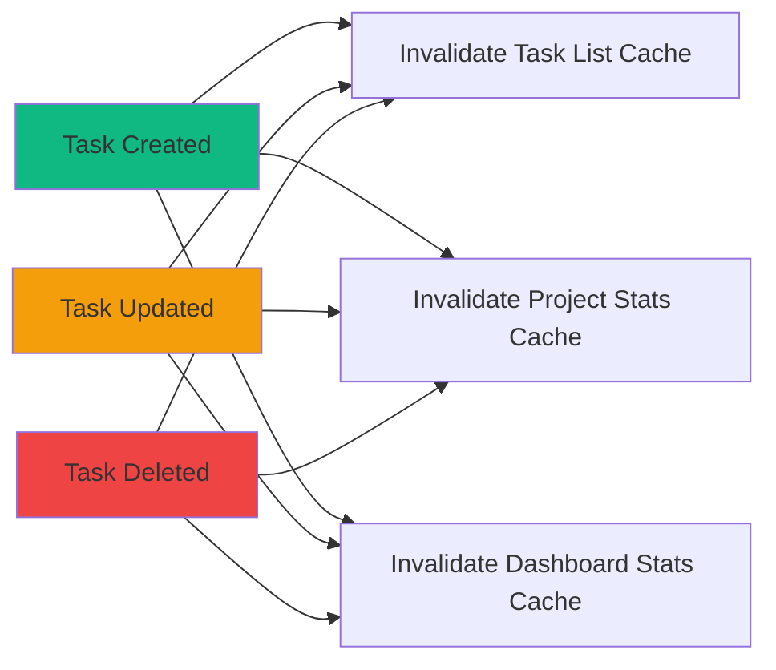

# TaskFlow Technical Deep Dive

## Technical Decisions Log

### Decision 1: React over Vue/Svelte

| Aspect | Details |
|--------|---------|
| **Decision** | Use React 18 as frontend framework |
| **Options Considered** | React, Vue 3, Svelte, SolidJS |
| **Chosen** | React |
| **Rationale** | - Largest ecosystem and community<br>- Best TypeScript support<br>- Team familiarity<br>- Excellent tooling (React Query, etc.)<br>- Long-term stability |
| **Trade-offs** | - Larger bundle size than Svelte<br>- More boilerplate than Vue |

### Decision 2: Express over Fastify/NestJS

| Aspect | Details |
|--------|---------|
| **Decision** | Use Express.js as backend framework |
| **Options Considered** | Express, Fastify, NestJS, Koa |
| **Chosen** | Express |
| **Rationale** | - Simple and well-understood<br>- Huge middleware ecosystem<br>- Easy to onboard developers<br>- Sufficient performance for our scale |
| **Trade-offs** | - Slightly slower than Fastify<br>- No built-in TypeScript decorators like NestJS |

### Decision 3: PostgreSQL over MongoDB

| Aspect | Details |
|--------|---------|
| **Decision** | Use PostgreSQL as primary database |
| **Options Considered** | PostgreSQL, MongoDB, MySQL, SQLite |
| **Chosen** | PostgreSQL |
| **Rationale** | - Tasks/projects have clear relational structure<br>- ACID compliance for task state transitions<br>- Powerful query capabilities<br>- Prisma's excellent PostgreSQL support<br>- JSON support if needed |
| **Trade-offs** | - Requires more upfront schema design<br>- Migrations needed for schema changes |

### Decision 4: Prisma over TypeORM/Sequelize

| Aspect | Details |
|--------|---------|
| **Decision** | Use Prisma as ORM |
| **Options Considered** | Prisma, TypeORM, Sequelize, Drizzle |
| **Chosen** | Prisma |
| **Rationale** | - Best-in-class TypeScript types<br>- Schema-first approach<br>- Excellent migration system<br>- Prisma Studio for debugging<br>- Active development |
| **Trade-offs** | - Slightly larger learning curve<br>- Some complex queries need raw SQL |

### Decision 5: JWT over Session-based Auth

| Aspect | Details |
|--------|---------|
| **Decision** | Use JWT tokens for authentication |
| **Options Considered** | JWT, Session cookies, OAuth only |
| **Chosen** | JWT with refresh tokens |
| **Rationale** | - Stateless (easier to scale)<br>- Works well with SPA architecture<br>- Can embed claims (userId, email)<br>- No server-side session storage |
| **Trade-offs** | - Can't invalidate tokens immediately<br>- Need refresh token strategy |

### Decision 6: Zustand over Redux/Context

| Aspect | Details |
|--------|---------|
| **Decision** | Use Zustand for global state |
| **Options Considered** | Redux Toolkit, Zustand, Jotai, Context API |
| **Chosen** | Zustand |
| **Rationale** | - Minimal boilerplate<br>- Simple mental model<br>- Great TypeScript support<br>- Small bundle size<br>- Easy testing |
| **Trade-offs** | - Less ecosystem than Redux<br>- No Redux DevTools (has own devtools) |

### Decision 7: React Query for Server State

| Aspect | Details |
|--------|---------|
| **Decision** | Use React Query for data fetching |
| **Options Considered** | React Query, SWR, Apollo Client, RTK Query |
| **Chosen** | React Query (TanStack Query) |
| **Rationale** | - Best caching strategy<br>- Automatic refetching<br>- Excellent DevTools<br>- Works great with REST APIs<br>- Mutation handling |
| **Trade-offs** | - Another library to learn<br>- Adds bundle size |

### Decision 8: Tailwind CSS over CSS Modules

| Aspect | Details |
|--------|---------|
| **Decision** | Use Tailwind CSS for styling |
| **Options Considered** | Tailwind, CSS Modules, Styled Components, Emotion |
| **Chosen** | Tailwind CSS |
| **Rationale** | - Utility-first is fast for prototyping<br>- Consistent design system<br>- Small production bundle (JIT)<br>- No context switching |
| **Trade-offs** | - Verbose class names<br>- Learning curve for utility classes |

## Known Limitations

### 1. No Real-time Updates

**Current:** Tasks update only on manual refresh or React Query's background refetch.

**Future:** Could add WebSocket support for real-time collaboration:
```
Client A updates task → API → WebSocket broadcast → Client B sees update
```

### 2. Single User per Task

**Current:** Tasks belong to one user only. No sharing or assignment.

**Future (v2):** Team collaboration with task assignment:
- Add `team` table
- Add `team_members` junction table
- Add `assigned_to` column to tasks

### 3. No File Attachments

**Current:** Tasks have text descriptions only.

**Future:** Could add file attachments:
- S3 for file storage
- `task_attachments` table
- Presigned URLs for uploads

### 4. No Recurring Tasks

**Current:** Each task is a one-time item.

**Future:** Add recurrence rules:
```typescript
interface RecurrenceRule {
  frequency: 'daily' | 'weekly' | 'monthly';
  interval: number;
  endDate?: Date;
}
```

### 5. Limited Search

**Current:** Basic filtering by status, priority, project.

**Future:** Full-text search with PostgreSQL:
```sql
ALTER TABLE tasks ADD COLUMN search_vector tsvector;
CREATE INDEX idx_tasks_search ON tasks USING GIN(search_vector);
```

## Performance Bottleneck Analysis

### Frontend Bottlenecks

| Bottleneck | Impact | Mitigation |
|------------|--------|------------|
| Large task lists | Slow rendering | Virtual scrolling (react-window) |
| Frequent re-renders | UI jank | React.memo, useMemo |
| Large bundle | Slow initial load | Code splitting, lazy loading |
| API waterfall | Slow page load | Parallel queries, prefetching |

### Backend Bottlenecks

| Bottleneck | Impact | Mitigation |
|------------|--------|------------|
| N+1 queries | Slow API | Prisma includes, dataloader |
| No caching | Repeated DB hits | Redis cache for common queries |
| Large payloads | Slow transfer | Pagination, field selection |
| Single server | Limited scale | Horizontal scaling with LB |

### Database Bottlenecks

| Bottleneck | Impact | Mitigation |
|------------|--------|------------|
| Missing indexes | Slow queries | Add indexes (see database.md) |
| Large tables | Slow scans | Partitioning, archiving |
| Connection limits | Connection errors | PgBouncer connection pooling |

## Caching Strategy

### What to Cache

| Data | Cache Location | TTL | Invalidation |
|------|----------------|-----|--------------|
| User session | Memory (Zustand) | Session | Logout |
| Task list | React Query | 1 min | On mutation |
| Project list | React Query | 5 min | On mutation |
| User profile | React Query | 10 min | On update |
| Static config | React Query | 1 hour | Manual |

### React Query Caching

```typescript
const queryClient = new QueryClient({
  defaultOptions: {
    queries: {
      staleTime: 1000 * 60, // 1 minute
      gcTime: 1000 * 60 * 5, // 5 minutes (garbage collection)
      refetchOnWindowFocus: true,
      retry: 3,
    },
  },
});
```

### Future: Redis Caching

For high-traffic scenarios:

```typescript
// Cache dashboard stats (computed value)
const stats = await redis.get(`stats:${userId}`);
if (!stats) {
  const computed = await computeStats(userId);
  await redis.set(`stats:${userId}`, JSON.stringify(computed), 'EX', 60);
  return computed;
}
return JSON.parse(stats);
```

### Cache Invalidation Strategy



## Migration Paths

### To Real-time (WebSockets)

1. Add Socket.io or ws to backend
2. Create WebSocket event handlers
3. Broadcast changes on mutations
4. Add client-side socket connection
5. Update React Query cache on socket events

### To GraphQL

1. Add Apollo Server / graphql-yoga
2. Define GraphQL schema matching REST API
3. Create resolvers using existing services
4. Add Apollo Client to frontend
5. Migrate queries incrementally

### To Microservices

1. Extract auth service first (most independent)
2. Use message queue (RabbitMQ/SQS) for async
3. Extract task service
4. Extract notification service
5. Add API gateway (Kong/AWS API Gateway)

## Technical Debt Tracking

| Debt Item | Priority | Effort | Sprint Target |
|-----------|----------|--------|---------------|
| Add request logging middleware | High | 2h | Sprint 1 |
| Add rate limiting tests | Medium | 4h | Sprint 2 |
| Improve error messages | Medium | 3h | Sprint 2 |
| Add API documentation (OpenAPI) | Low | 8h | Sprint 3 |
| Add database query logging | Low | 2h | Sprint 3 |
