# TaskFlow Diagrams Collection

This file contains all Mermaid diagram definitions for the TaskFlow project, collected for viewer rendering.

## System Architecture

### High-Level System Diagram

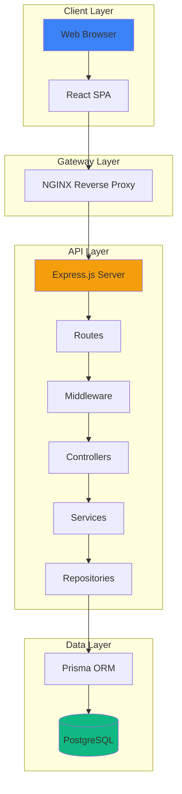

### Request Lifecycle

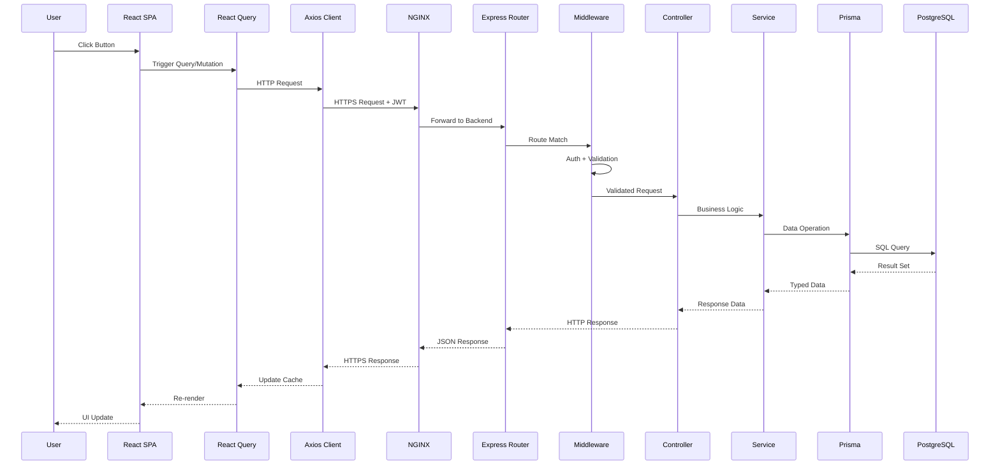

## Backend Architecture

### Layer Diagram

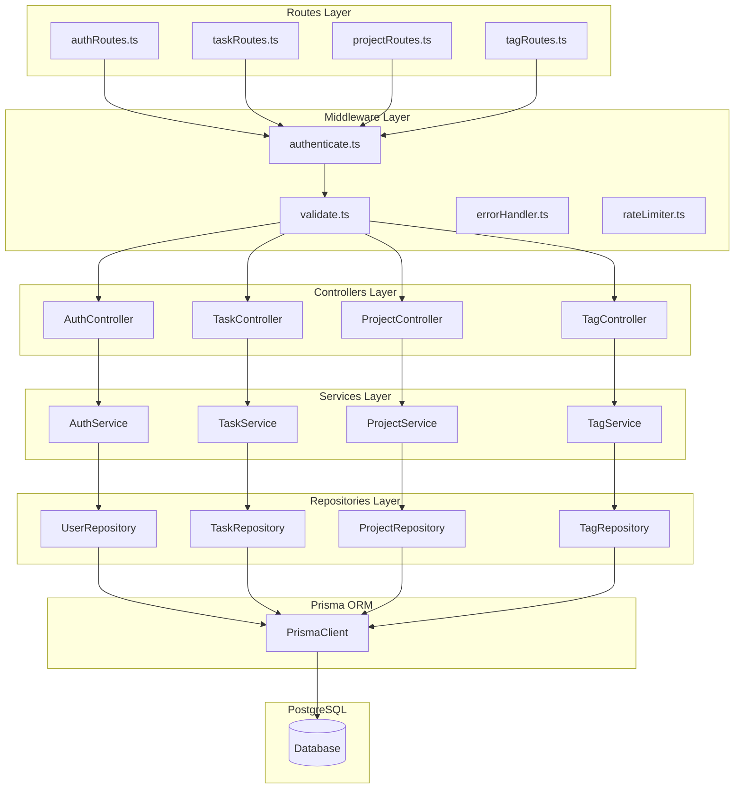

### Middleware Chain

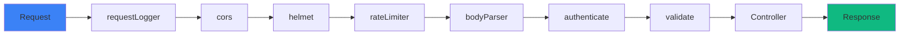

## Frontend Architecture

### Component Hierarchy

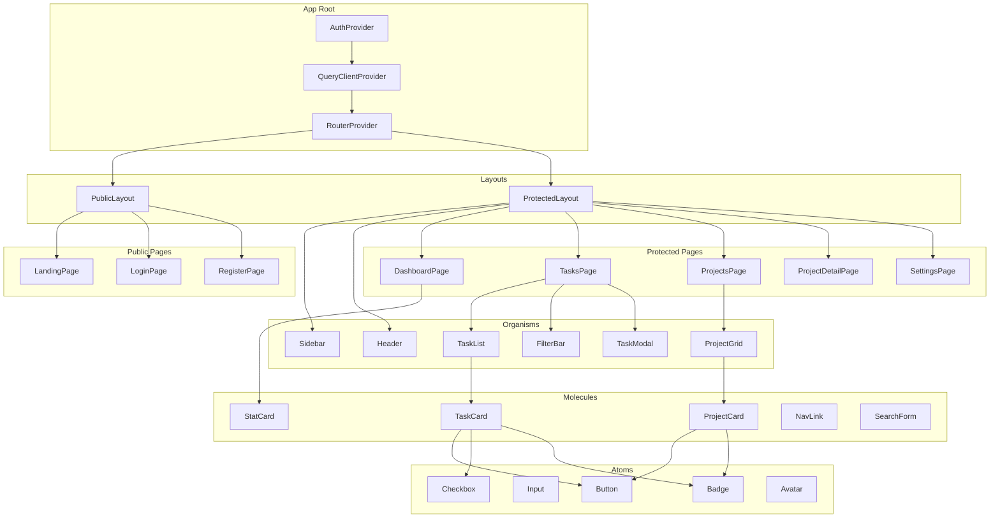

### State Flow

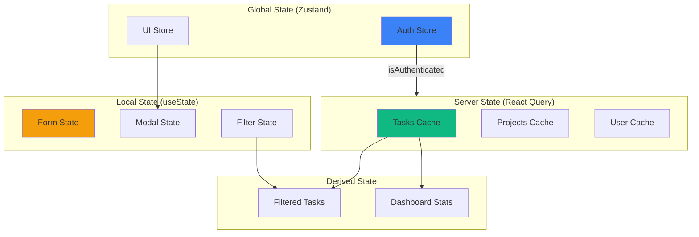

## Database Architecture

### Entity-Relationship Diagram

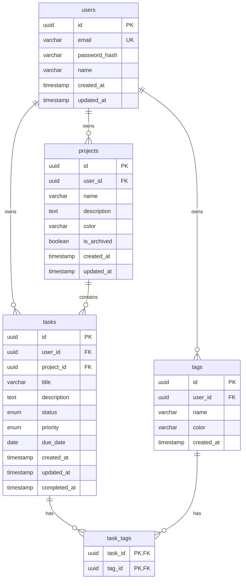

## Authentication Flow

### Full Auth Sequence

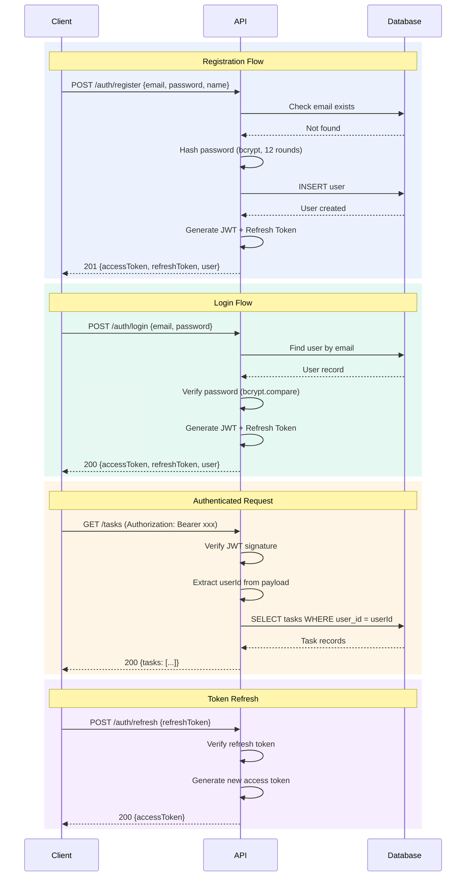

## Task State Machine

### Task Status Transitions

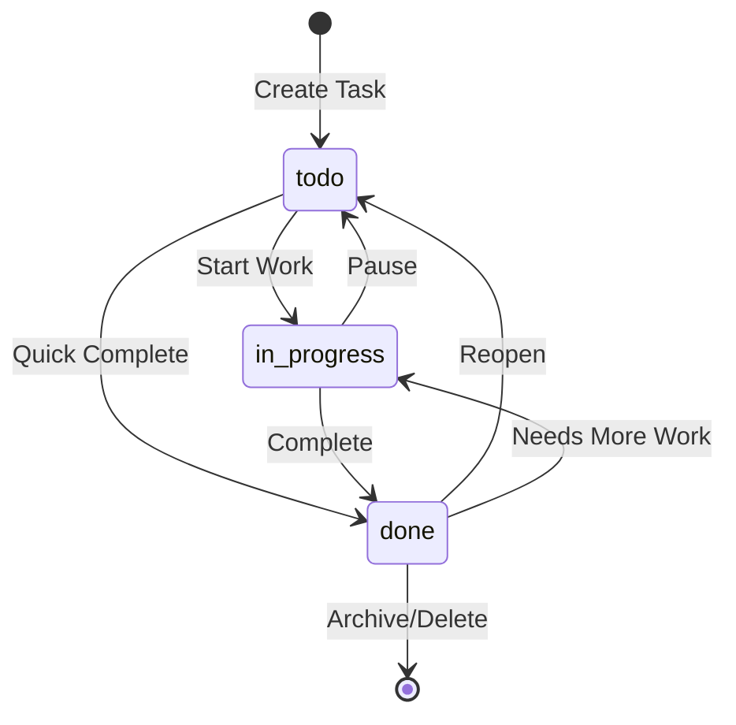

## Cloud Architecture

### AWS Infrastructure

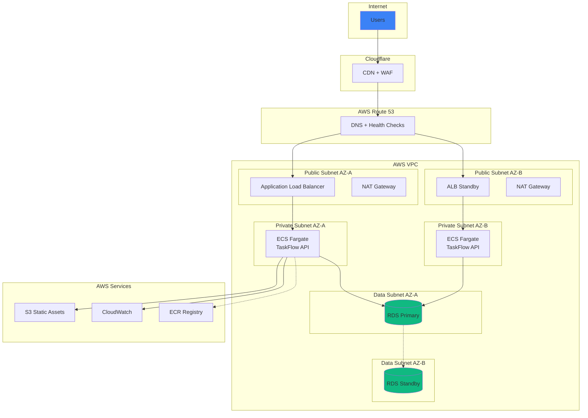

## CI/CD Pipeline

### Pipeline Flow

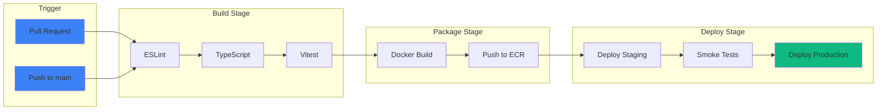

## User Journey Flows

### Create Task Flow

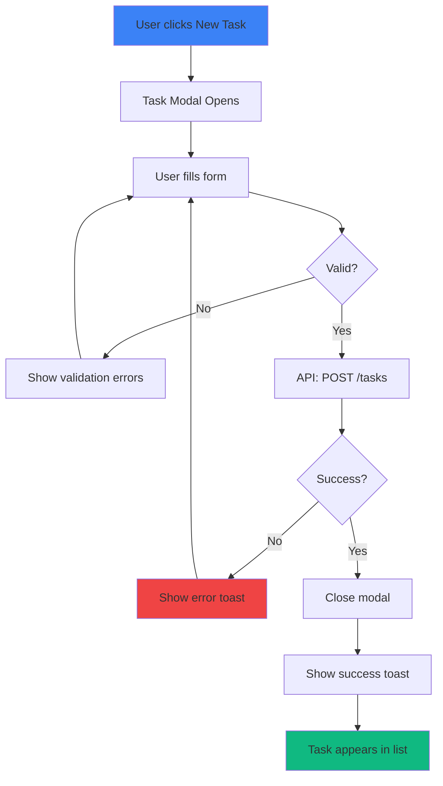

### Complete Task Flow

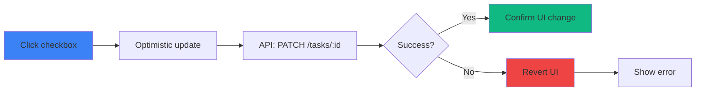

## Data Flow

### Task Data Flow

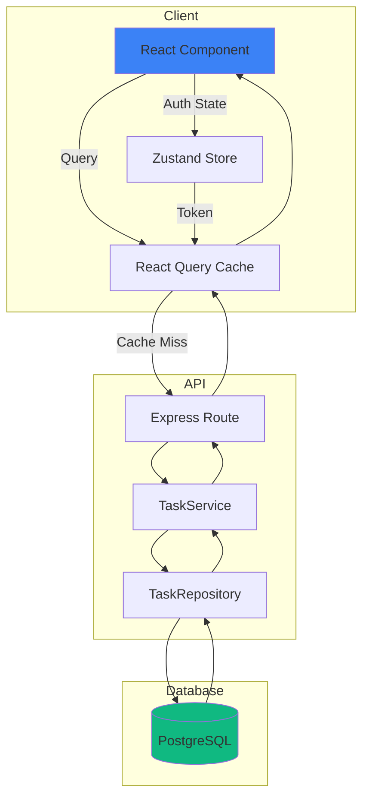

## Auto Scaling

### Scaling Rules

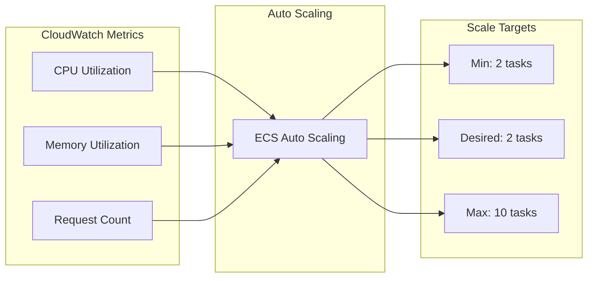

## Cache Invalidation

### Invalidation Flow

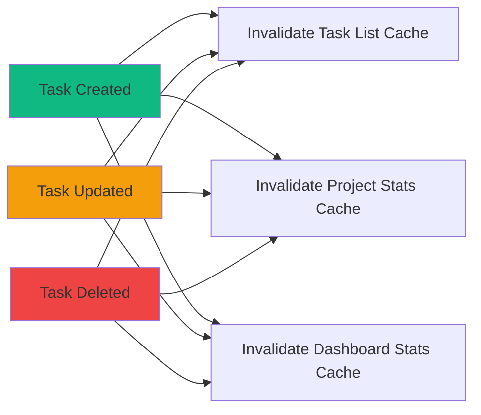
