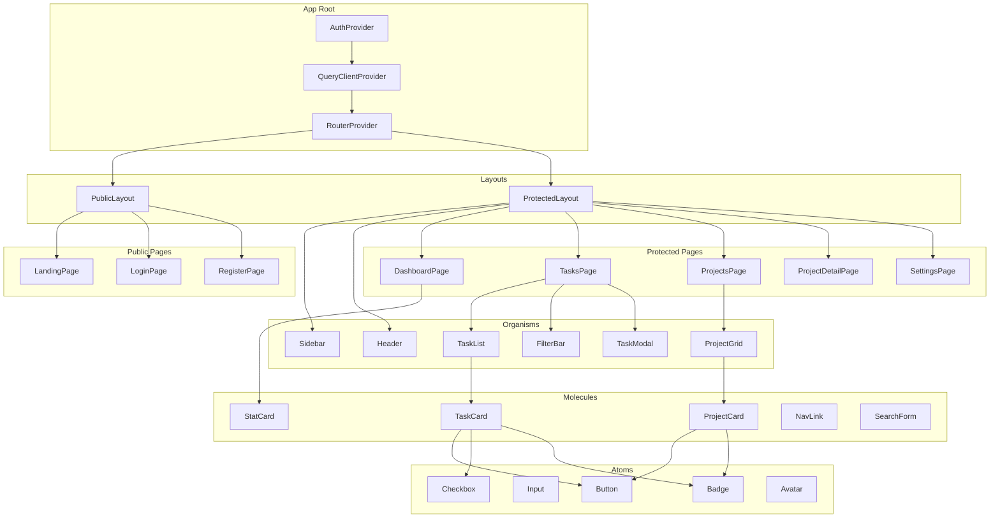
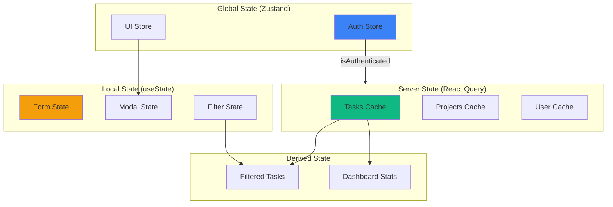
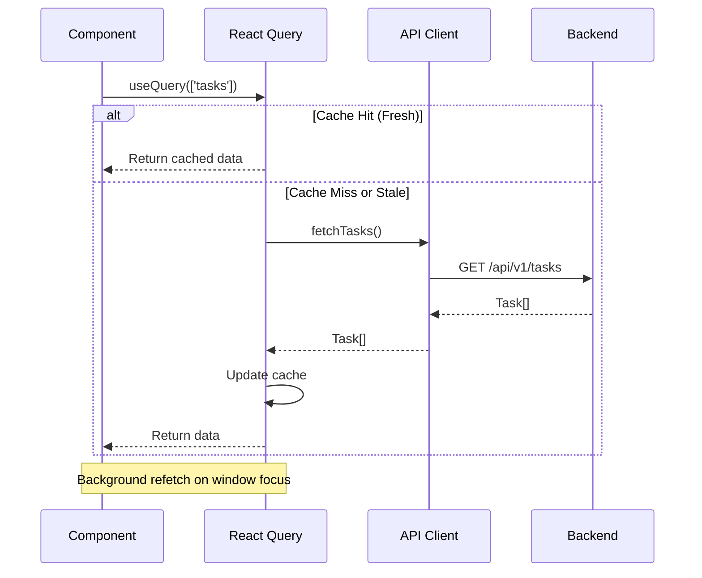

# TaskFlow Frontend Architecture

## Component Hierarchy

The TaskFlow frontend follows atomic design principles, organizing components from smallest (atoms) to largest (pages).

### ASCII Component Tree

```
                           TASKFLOW COMPONENT HIERARCHY
    ========================================================================

    App
    ├── AuthProvider (Context)
    │   └── QueryClientProvider (React Query)
    │       └── RouterProvider (React Router)
    │           │
    │           ├── PublicLayout
    │           │   ├── Header (Logo only)
    │           │   └── Routes:
    │           │       ├── LandingPage
    │           │       ├── LoginPage
    │           │       │   └── LoginForm
    │           │       │       ├── Input (email)
    │           │       │       ├── Input (password)
    │           │       │       └── Button (submit)
    │           │       └── RegisterPage
    │           │           └── RegisterForm
    │           │               ├── Input (email)
    │           │               ├── Input (password)
    │           │               ├── Input (confirmPassword)
    │           │               └── Button (submit)
    │           │
    │           └── ProtectedLayout
    │               ├── Sidebar
    │               │   ├── Logo
    │               │   ├── NavLink (Dashboard)
    │               │   ├── NavLink (Tasks)
    │               │   ├── NavLink (Projects)
    │               │   ├── NavLink (Settings)
    │               │   └── UserMenu
    │               │       ├── Avatar
    │               │       └── Dropdown
    │               │
    │               ├── Header
    │               │   ├── SearchBar
    │               │   ├── NotificationBell
    │               │   └── QuickAddButton
    │               │
    │               └── Main (Outlet)
    │                   │
    │                   ├── DashboardPage
    │                   │   ├── StatsGrid
    │                   │   │   ├── StatCard (Total Tasks)
    │                   │   │   ├── StatCard (Completed)
    │                   │   │   ├── StatCard (In Progress)
    │                   │   │   └── StatCard (Overdue)
    │                   │   ├── TasksDueToday
    │                   │   │   └── TaskCard[]
    │                   │   └── RecentActivity
    │                   │       └── ActivityItem[]
    │                   │
    │                   ├── TasksPage
    │                   │   ├── FilterBar
    │                   │   │   ├── StatusFilter
    │                   │   │   ├── PriorityFilter
    │                   │   │   ├── ProjectFilter
    │                   │   │   └── TagFilter
    │                   │   ├── TaskList
    │                   │   │   └── TaskCard[]
    │                   │   │       ├── Checkbox
    │                   │   │       ├── TaskTitle
    │                   │   │       ├── DueDate
    │                   │   │       ├── PriorityBadge
    │                   │   │       └── TagBadge[]
    │                   │   └── TaskModal (on click)
    │                   │       ├── TaskForm
    │                   │       └── DeleteConfirmation
    │                   │
    │                   ├── ProjectsPage
    │                   │   ├── ProjectGrid
    │                   │   │   └── ProjectCard[]
    │                   │   │       ├── ProjectName
    │                   │   │       ├── ProgressBar
    │                   │   │       └── TaskCount
    │                   │   └── CreateProjectModal
    │                   │
    │                   ├── ProjectDetailPage
    │                   │   ├── ProjectHeader
    │                   │   ├── ProjectTasks
    │                   │   │   └── TaskCard[]
    │                   │   └── ProjectSettings
    │                   │
    │                   └── SettingsPage
    │                       ├── ProfileSection
    │                       ├── PreferencesSection
    │                       └── DangerZone
```

### Mermaid Component Diagram



## State Management

### Global State (Zustand)

```typescript
// src/store/authStore.ts
interface AuthState {
  user: User | null;
  token: string | null;
  isAuthenticated: boolean;
  login: (email: string, password: string) => Promise<void>;
  logout: () => void;
  refreshToken: () => Promise<void>;
}

// src/store/uiStore.ts
interface UIState {
  sidebarOpen: boolean;
  theme: 'light' | 'dark';
  taskModalOpen: boolean;
  selectedTaskId: string | null;
  toggleSidebar: () => void;
  setTheme: (theme: 'light' | 'dark') => void;
  openTaskModal: (taskId?: string) => void;
  closeTaskModal: () => void;
}
```

### Server State (React Query)

```typescript
// src/hooks/useTasks.ts
export function useTasks(filters: TaskFilters) {
  return useQuery({
    queryKey: ['tasks', filters],
    queryFn: () => taskApi.getTasks(filters),
    staleTime: 1000 * 60, // 1 minute
  });
}

export function useCreateTask() {
  const queryClient = useQueryClient();
  return useMutation({
    mutationFn: taskApi.createTask,
    onSuccess: () => {
      queryClient.invalidateQueries({ queryKey: ['tasks'] });
    },
  });
}
```

### State Flow Diagram



## Routing

### Route Configuration

```typescript
// src/routes/index.tsx
const router = createBrowserRouter([
  {
    element: <PublicLayout />,
    children: [
      { path: '/', element: <LandingPage /> },
      { path: '/login', element: <LoginPage /> },
      { path: '/register', element: <RegisterPage /> },
      { path: '/forgot-password', element: <ForgotPasswordPage /> },
    ],
  },
  {
    element: <ProtectedLayout />,
    children: [
      { path: '/dashboard', element: <DashboardPage /> },
      { path: '/tasks', element: <TasksPage /> },
      { path: '/tasks/:taskId', element: <TaskDetailPage /> },
      { path: '/projects', element: <ProjectsPage /> },
      { path: '/projects/:projectId', element: <ProjectDetailPage /> },
      { path: '/settings', element: <SettingsPage /> },
    ],
  },
]);
```

### Route Table

| Path | Component | Auth | Lazy Load |
|------|-----------|------|-----------|
| `/` | LandingPage | No | No |
| `/login` | LoginPage | No | No |
| `/register` | RegisterPage | No | No |
| `/forgot-password` | ForgotPasswordPage | No | Yes |
| `/dashboard` | DashboardPage | Yes | No |
| `/tasks` | TasksPage | Yes | No |
| `/tasks/:taskId` | TaskDetailPage | Yes | Yes |
| `/projects` | ProjectsPage | Yes | Yes |
| `/projects/:projectId` | ProjectDetailPage | Yes | Yes |
| `/settings` | SettingsPage | Yes | Yes |

## Data Fetching Strategy



## Code Splitting

```typescript
// Lazy loaded routes
const ProjectsPage = lazy(() => import('./pages/ProjectsPage'));
const SettingsPage = lazy(() => import('./pages/SettingsPage'));

// With loading fallback
<Suspense fallback={<PageSkeleton />}>
  <ProjectsPage />
</Suspense>
```

## Asset Pipeline

| Asset Type | Location | Optimization |
|------------|----------|--------------|
| Icons | lucide-react | Tree-shaken, SVG |
| Images | public/images | WebP, lazy loading |
| Fonts | Google Fonts (Inter) | Font-display: swap |
| CSS | Tailwind (JIT) | Purged unused styles |

## Performance Targets

| Metric | Target | Measurement |
|--------|--------|-------------|
| LCP | < 2.5s | Largest Contentful Paint |
| FID | < 100ms | First Input Delay |
| CLS | < 0.1 | Cumulative Layout Shift |
| Bundle Size | < 200KB | Initial JS bundle (gzipped) |
