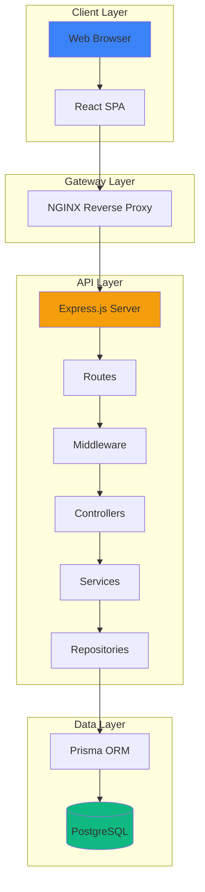
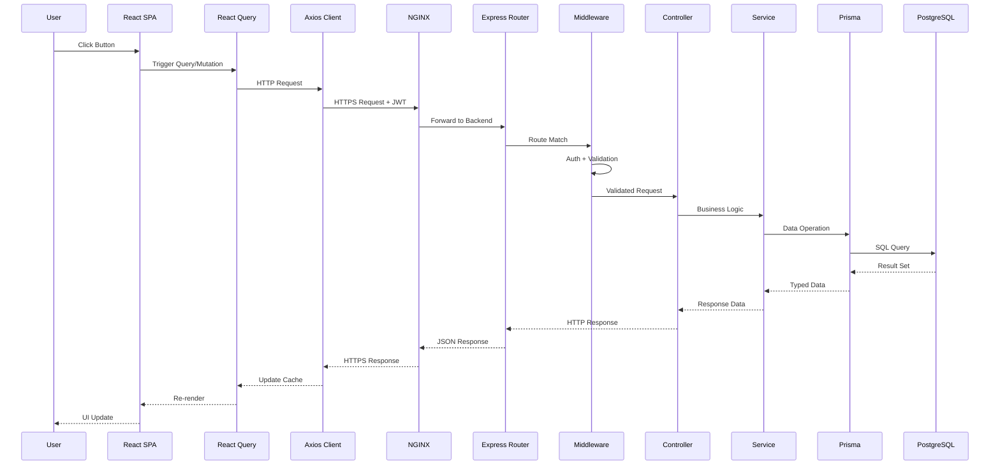

# TaskFlow System Architecture Overview

## High-Level Architecture

TaskFlow follows a modern three-tier architecture with a React Single Page Application (SPA) frontend, Express.js REST API backend, and PostgreSQL database.

### ASCII Architecture Diagram

```
                                    TASKFLOW SYSTEM ARCHITECTURE
    ====================================================================================

                                         [INTERNET]
                                              |
                                              v
    +-----------------------------------------------------------------------------------+
    |                                    NGINX                                          |
    |                              (Reverse Proxy / SSL)                                |
    +-----------------------------------------------------------------------------------+
                                              |
                    +-------------------------+-------------------------+
                    |                                                   |
                    v                                                   v
    +-------------------------------+                   +-------------------------------+
    |        REACT SPA              |                   |        EXPRESS API            |
    |       (Frontend)              |                   |         (Backend)             |
    |                               |                   |                               |
    |  +-------------------------+  |                   |  +-------------------------+  |
    |  |    App Component        |  |    REST/JSON      |  |       Routes            |  |
    |  +-------------------------+  | <---------------> |  +-------------------------+  |
    |  |    React Router         |  |    HTTP/HTTPS     |  |       Middleware        |  |
    |  +-------------------------+  |                   |  +-------------------------+  |
    |  |    React Query          |  |                   |  |       Controllers       |  |
    |  +-------------------------+  |                   |  +-------------------------+  |
    |  |    Zustand Store        |  |                   |  |       Services          |  |
    |  +-------------------------+  |                   |  +-------------------------+  |
    |  |    Tailwind CSS         |  |                   |  |       Repositories      |  |
    |  +-------------------------+  |                   |  +-------------------------+  |
    |                               |                   |               |               |
    +-------------------------------+                   +---------------+---------------+
           |                                                            |
           |  Static Assets                                             |  Prisma ORM
           v                                                            v
    +-------------------------------+                   +-------------------------------+
    |           CDN                 |                   |        POSTGRESQL             |
    |    (JS, CSS, Images)          |                   |         Database              |
    +-------------------------------+                   |                               |
                                                        |  +-------------------------+  |
                                                        |  |  users                  |  |
                                                        |  +-------------------------+  |
                                                        |  |  tasks                  |  |
                                                        |  +-------------------------+  |
                                                        |  |  projects               |  |
                                                        |  +-------------------------+  |
                                                        |  |  tags                   |  |
                                                        |  +-------------------------+  |
                                                        |  |  task_tags              |  |
                                                        |  +-------------------------+  |
                                                        +-------------------------------+
```

### Mermaid System Diagram



## Tech Stack Summary

| Component | Technology | Version | Purpose |
|-----------|------------|---------|---------|
| Frontend | React | 18.x | UI Framework |
| Build Tool | Vite | 5.x | Fast bundling |
| Styling | Tailwind CSS | 3.x | Utility-first CSS |
| State | Zustand | 4.x | Global state management |
| Data Fetching | React Query | 5.x | Server state management |
| Backend | Express.js | 4.x | REST API framework |
| Runtime | Node.js | 20.x LTS | JavaScript runtime |
| Database | PostgreSQL | 15.x | Relational database |
| ORM | Prisma | 5.x | Type-safe database access |
| Auth | JWT | - | Token-based authentication |
| Testing | Vitest/Playwright | - | Unit/E2E testing |
| Containerization | Docker | - | Deployment |

## Request Lifecycle

```
1. User Action (Click/Submit)
         |
         v
2. React Component Event Handler
         |
         v
3. React Query Mutation/Query
         |
         v
4. API Client (Axios) with JWT Header
         |
         v
5. NGINX (SSL Termination, Load Balancing)
         |
         v
6. Express Router (Route Matching)
         |
         v
7. Auth Middleware (JWT Validation)
         |
         v
8. Validation Middleware (Zod Schema)
         |
         v
9. Controller (Request Handling)
         |
         v
10. Service Layer (Business Logic)
         |
         v
11. Repository Layer (Data Access)
         |
         v
12. Prisma ORM (Query Building)
         |
         v
13. PostgreSQL (Data Storage)
         |
         v
14. Response flows back up the chain
```

### Request Flow Mermaid Diagram



## Non-Functional Requirements Summary

| Requirement | Target | Measurement |
|-------------|--------|-------------|
| Page Load Time | < 2 seconds | Lighthouse Performance |
| API Response (p95) | < 300ms | Application metrics |
| Concurrent Users | 1000 | Load testing |
| Uptime | 99.9% | Monitoring alerts |
| Test Coverage | > 70% | CI coverage report |

## Key Architectural Decisions

### 1. Single Page Application (SPA)

**Decision:** Build frontend as React SPA rather than server-rendered.

**Rationale:**
- Task management requires highly interactive UI
- Real-time updates without page refreshes
- Better perceived performance for frequent actions
- Simpler deployment (static files)

### 2. REST API over GraphQL

**Decision:** Use REST API rather than GraphQL.

**Rationale:**
- Simpler to implement and debug
- Well-understood caching patterns
- No over-fetching concerns for our data model
- Team familiarity with REST patterns

### 3. PostgreSQL over NoSQL

**Decision:** Use PostgreSQL rather than MongoDB or similar.

**Rationale:**
- Tasks and projects have clear relational structure
- Need for ACID transactions (task completion)
- Complex queries (filtering, sorting, aggregations)
- Prisma provides excellent PostgreSQL support

### 4. JWT Authentication

**Decision:** Use JWT tokens rather than session-based auth.

**Rationale:**
- Stateless authentication scales well
- Simple to implement with Express
- Works seamlessly with SPA frontend
- Easy to invalidate via short expiry + refresh tokens

### 5. Zustand for State Management

**Decision:** Use Zustand rather than Redux or Context.

**Rationale:**
- Minimal boilerplate for our scope
- TypeScript-first design
- Simple mental model (stores as hooks)
- Easy to test and debug

See `docs/architecture/deep-dive.md` for detailed decision analysis.
