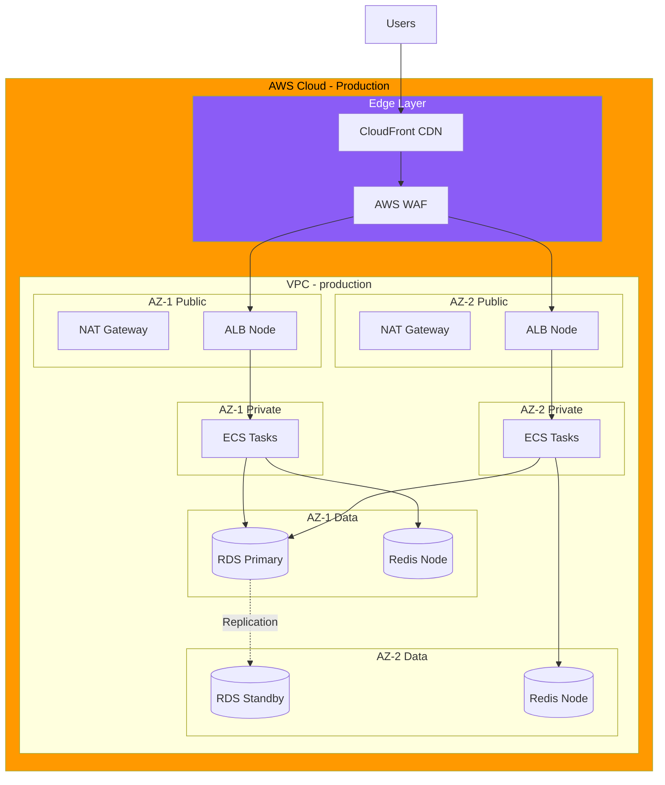
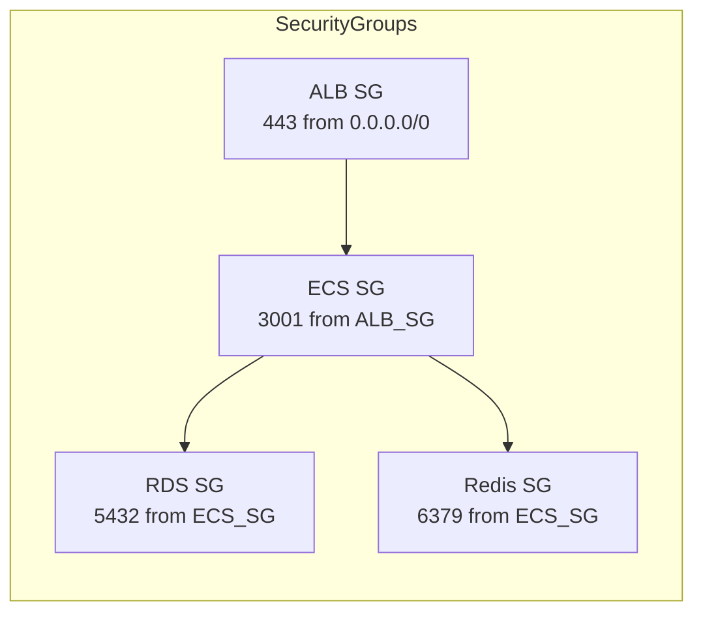
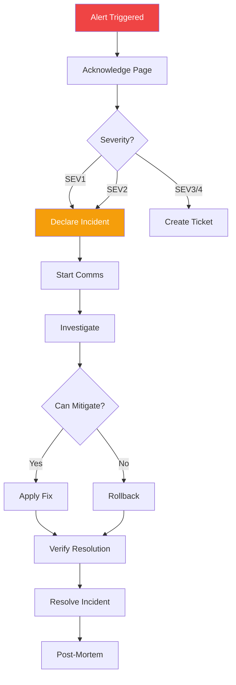

# TaskFlow Production Environment

## Overview

The production environment serves live user traffic for TaskFlow. This document covers infrastructure, access controls, deployment procedures, and incident response.

---

## Production Architecture



---

## Environment Details

| Property | Value |
|----------|-------|
| URL | https://taskflow.app |
| API URL | https://api.taskflow.app |
| Region | us-east-1 (primary), us-west-2 (DR) |
| AWS Account | 987654321098 (production) |
| ECS Cluster | taskflow-production |
| Domain | Managed via Route 53 |

---

## Infrastructure Specifications

### Compute (ECS Fargate)

```yaml
service:
  name: taskflow-api-production
  cluster: taskflow-production
  desiredCount: 4
  minCount: 2
  maxCount: 20

task:
  cpu: 1024      # 1 vCPU
  memory: 2048   # 2 GB

scaling:
  policies:
    - type: TargetTracking
      metric: CPUUtilization
      target: 70
    - type: TargetTracking
      metric: MemoryUtilization
      target: 80
  scaleInCooldown: 300
  scaleOutCooldown: 60
```

### Database (RDS PostgreSQL)

```yaml
rds:
  engine: postgres
  version: "15.4"
  instanceClass: db.r6g.large
  storage: 200 GB (gp3)
  iops: 3000
  multiAZ: true
  readReplicas: 1
  backupRetention: 30 days
  maintenanceWindow: "sun:04:00-sun:05:00"
  deletionProtection: true
  encryption: true (KMS)
```

### Cache (ElastiCache Redis)

```yaml
elasticache:
  engine: redis
  version: "7.0"
  nodeType: cache.r6g.large
  clusterMode: enabled
  numNodeGroups: 2
  replicasPerGroup: 1
  encryption:
    atRest: true
    inTransit: true
  snapshotRetention: 7 days
```

### CDN (CloudFront)

```yaml
cloudfront:
  priceClass: PriceClass_All
  origins:
    - ALB (API)
    - S3 (Static assets)
  caching:
    defaultTTL: 86400
    maxTTL: 31536000
  compression: true
  http2: true
  http3: true
```

---

## Security Configuration

### WAF Rules

```yaml
waf:
  webACL: taskflow-production-acl
  rules:
    - AWSManagedRulesCommonRuleSet
    - AWSManagedRulesKnownBadInputsRuleSet
    - AWSManagedRulesSQLiRuleSet
    - RateLimitRule:
        limit: 2000
        evaluationWindow: 300  # 5 minutes
    - GeoBlockRule:
        blockedCountries: [KP, IR]  # Compliance
```

### Security Groups



### IAM Roles

```yaml
roles:
  ecsTaskRole:
    name: taskflow-ecs-task-role
    policies:
      - SecretsManagerReadOnly
      - S3ReadWriteTaskflowBucket
      - SQSSendMessage

  ecsExecutionRole:
    name: taskflow-ecs-execution-role
    policies:
      - AmazonECSTaskExecutionRolePolicy
      - SecretsManagerReadOnly
```

---

## Access Controls

### Production Access Policy

```markdown
## Production Access Rules

### Who Can Access
- On-call engineers (emergency only)
- DevOps team (infrastructure changes)
- Database admins (data operations)

### How to Access
1. All access requires MFA
2. Access logged in CloudTrail
3. Access requires approval ticket
4. Sessions limited to 1 hour
5. No direct database writes without approval

### Emergency Access
1. Declare incident
2. Get verbal approval from tech lead
3. Access via break-glass procedure
4. Document all actions
5. Post-incident review
```

### Database Access

```bash
# Production database access (emergency only)
# Requires: Incident ticket, approval, MFA

# 1. Request temporary credentials
aws sts assume-role \
  --role-arn arn:aws:iam::987654321098:role/prod-db-access \
  --role-session-name "incident-12345"

# 2. Connect via bastion
ssh -L 5433:taskflow-prod.xxxxx.us-east-1.rds.amazonaws.com:5432 \
  ec2-user@bastion-prod.taskflow.app

# 3. Connect read-only
psql -h localhost -p 5433 -U taskflow_readonly -d taskflow

# All queries are logged and audited
```

---

## Deployment Checklist

### Pre-Deployment

```markdown
## Production Deployment Checklist

### 24 Hours Before
- [ ] Staging verification complete (24+ hours)
- [ ] All E2E tests passing
- [ ] Performance benchmarks acceptable
- [ ] Security scan clean
- [ ] Change request approved

### 1 Hour Before
- [ ] Deployment window confirmed
- [ ] On-call engineer available
- [ ] Rollback plan documented
- [ ] Stakeholders notified
- [ ] Monitoring dashboards open

### Deployment
- [ ] Database migrations run
- [ ] ECS service updated
- [ ] Health checks passing
- [ ] Smoke tests passing

### Post-Deployment (30 min)
- [ ] Error rate normal
- [ ] Latency normal
- [ ] Key user flows tested
- [ ] No customer complaints
```

### Deployment Commands

```bash
# Production deployment via version tag
# DO NOT RUN MANUALLY - use CI/CD

# 1. Create release tag
git tag -a v1.5.0 -m "Release v1.5.0"
git push origin v1.5.0

# 2. CI/CD automatically:
#    - Builds production image
#    - Runs production migrations
#    - Deploys to ECS
#    - Runs smoke tests

# 3. Monitor deployment
aws ecs describe-services \
  --cluster taskflow-production \
  --services taskflow-api \
  --query 'services[0].deployments'
```

---

## Monitoring & Alerting

### Key Metrics

```
┌─────────────────────────────────────────────────────────────────┐
│                 PRODUCTION METRICS DASHBOARD                     │
├─────────────────────────────────────────────────────────────────┤
│                                                                  │
│  Traffic                            Performance                  │
│  ┌─────────────────────┐           ┌─────────────────────┐      │
│  │ Requests/sec: 450   │           │ P50 Latency: 45ms   │      │
│  │ Active Users: 1,234 │           │ P95 Latency: 180ms  │      │
│  │ Peak Today: 2,100   │           │ P99 Latency: 450ms  │      │
│  └─────────────────────┘           └─────────────────────┘      │
│                                                                  │
│  Reliability                        Resources                    │
│  ┌─────────────────────┐           ┌─────────────────────┐      │
│  │ Error Rate: 0.02%   │           │ CPU: 45% avg        │      │
│  │ Uptime: 99.98%      │           │ Memory: 62% avg     │      │
│  │ Apdex: 0.95         │           │ DB Connections: 45  │      │
│  └─────────────────────┘           └─────────────────────┘      │
│                                                                  │
└─────────────────────────────────────────────────────────────────┘
```

### Alert Configuration

| Alert | Threshold | Severity | Notification |
|-------|-----------|----------|--------------|
| Error Rate | > 1% for 5 min | Critical | PagerDuty |
| P95 Latency | > 500ms for 5 min | High | PagerDuty |
| Service Down | Any task unhealthy | Critical | PagerDuty |
| CPU High | > 85% for 10 min | Warning | Slack |
| Memory High | > 90% for 10 min | Warning | Slack |
| DB Connections | > 80% for 5 min | Warning | Slack |
| Disk Space | > 80% | Warning | Slack |
| SSL Expiry | < 30 days | Warning | Slack |

---

## Incident Response

### Severity Levels

| Level | Description | Response Time | Example |
|-------|-------------|---------------|---------|
| SEV1 | Service down | < 15 min | Complete outage |
| SEV2 | Major degradation | < 30 min | Auth broken |
| SEV3 | Minor degradation | < 2 hours | Slow performance |
| SEV4 | Low impact | < 24 hours | UI bug |

### Incident Process



### Emergency Rollback

```bash
# Emergency rollback procedure
# Only use during active incident with approval

# 1. Get previous task definition
PREV_TASK=$(aws ecs describe-services \
  --cluster taskflow-production \
  --services taskflow-api \
  --query 'services[0].deployments[1].taskDefinition' \
  --output text)

# 2. Rollback
aws ecs update-service \
  --cluster taskflow-production \
  --service taskflow-api \
  --task-definition $PREV_TASK

# 3. Verify
aws ecs wait services-stable \
  --cluster taskflow-production \
  --services taskflow-api

# 4. Check health
curl https://api.taskflow.app/health
```

---

## Backup & Recovery

### Backup Schedule

| Data | Frequency | Retention | Location |
|------|-----------|-----------|----------|
| RDS Automated | Daily | 30 days | AWS |
| RDS Snapshot | Weekly | 90 days | AWS |
| Redis Snapshot | Daily | 7 days | AWS |
| S3 Data | Continuous | Versioned | S3 |
| CloudWatch Logs | Continuous | 90 days | CloudWatch |

### Recovery Procedures

```bash
# Database point-in-time recovery
aws rds restore-db-instance-to-point-in-time \
  --source-db-instance-identifier taskflow-production \
  --target-db-instance-identifier taskflow-recovery \
  --restore-time "2024-01-15T10:00:00Z"

# Restore from snapshot
aws rds restore-db-instance-from-db-snapshot \
  --db-instance-identifier taskflow-recovery \
  --db-snapshot-identifier taskflow-prod-weekly-20240114
```

---

## Compliance

### Data Handling

```markdown
## Production Data Rules

- No PII in logs
- Encryption at rest (AES-256)
- Encryption in transit (TLS 1.3)
- Data retention: 7 years
- Right to deletion: Supported
- Data export: Supported
```

### Audit Logging

```bash
# CloudTrail logs all AWS API calls
# Application logs include:
# - User authentication events
# - Data access events
# - Configuration changes
# - Error events

# Query audit logs
aws logs filter-log-events \
  --log-group-name /taskflow/audit \
  --filter-pattern '{ $.event_type = "data_access" }'
```

---

## Related Documents

- [Staging Environment](./staging.md)
- [Deployment Process](../workflows/deployment.md)
- [Environment Variables](./environment-variables.md)
- [Disaster Recovery Plan](./disaster-recovery.md)
