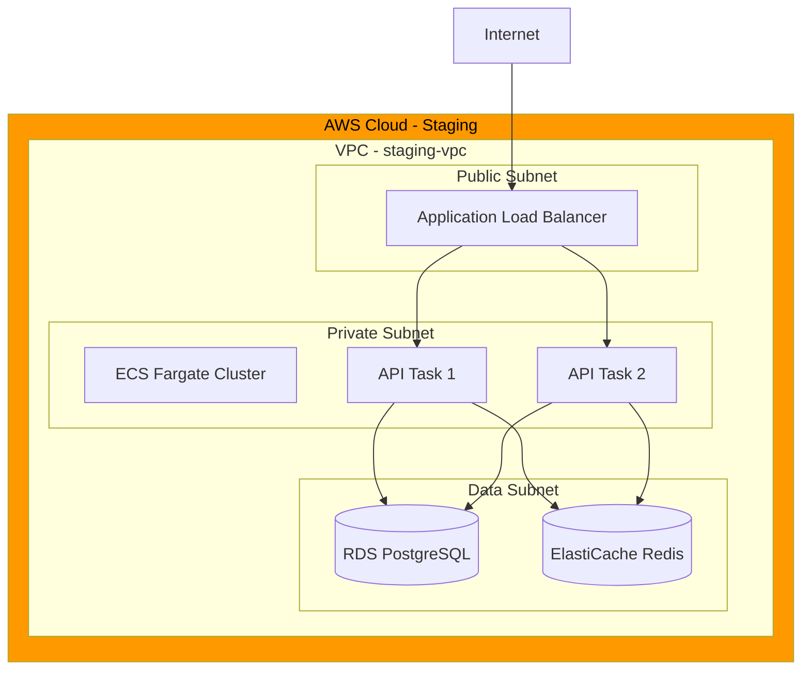
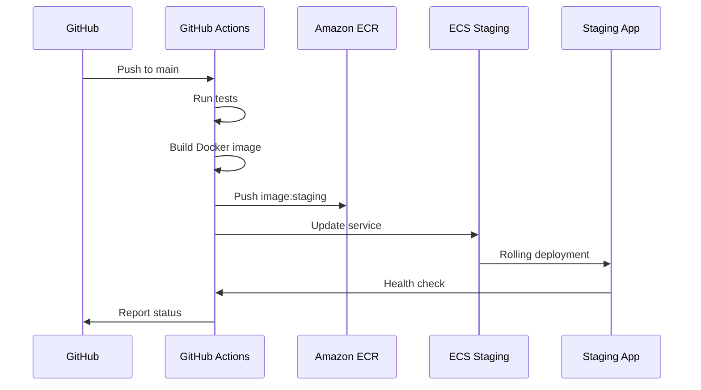

# TaskFlow Staging Environment

## Overview

The staging environment is a production-like environment used for final testing before production deployment. It mirrors production infrastructure while using isolated data.

---

## Staging Architecture



---

## Environment Details

| Property | Value |
|----------|-------|
| URL | https://staging.taskflow.app |
| API URL | https://staging-api.taskflow.app |
| Region | us-east-1 |
| AWS Account | 123456789012 (staging) |
| ECS Cluster | taskflow-staging |
| Database | taskflow-staging.xxxxx.us-east-1.rds.amazonaws.com |

---

## Infrastructure Specifications

### Compute

```yaml
# ECS Service Configuration
service:
  name: taskflow-api-staging
  cluster: taskflow-staging
  desiredCount: 2
  minCount: 1
  maxCount: 4

task:
  cpu: 512       # 0.5 vCPU
  memory: 1024   # 1 GB
  image: 123456789012.dkr.ecr.us-east-1.amazonaws.com/taskflow:staging

scaling:
  targetCPU: 70
  targetMemory: 80
  scaleInCooldown: 300
  scaleOutCooldown: 60
```

### Database

```yaml
# RDS Configuration
rds:
  engine: postgres
  version: "15.4"
  instanceClass: db.t3.small
  storage: 50 GB
  multiAZ: false
  backupRetention: 7 days
  maintenanceWindow: "sun:04:00-sun:05:00"
```

### Cache

```yaml
# ElastiCache Configuration
elasticache:
  engine: redis
  version: "7.0"
  nodeType: cache.t3.micro
  numNodes: 1
  snapshotRetention: 1 day
```

---

## Access Configuration

### VPN Access

```bash
# Connect to staging VPN
# 1. Download OpenVPN config from AWS Client VPN
# 2. Import into VPN client
# 3. Connect using your SSO credentials

# Verify connection
ping 10.0.2.10  # Should reach staging resources
```

### SSH/ECS Exec

```bash
# Enable ECS Exec for debugging
aws ecs execute-command \
  --cluster taskflow-staging \
  --task <task-id> \
  --container taskflow-api \
  --interactive \
  --command "/bin/sh"

# Prerequisites:
# - AWS CLI v2 installed
# - Session Manager plugin installed
# - Appropriate IAM permissions
```

### Database Access

```bash
# Connect via bastion host
ssh -L 5433:taskflow-staging.xxxxx.us-east-1.rds.amazonaws.com:5432 \
  ec2-user@bastion-staging.taskflow.app

# Then connect locally
psql -h localhost -p 5433 -U taskflow_staging -d taskflow

# Or use pgAdmin/DataGrip with SSH tunnel
```

---

## Deployment Process

### Staging Deployment Flow



### Manual Deployment

```bash
# 1. Build and push image
aws ecr get-login-password --region us-east-1 | \
  docker login --username AWS --password-stdin \
  123456789012.dkr.ecr.us-east-1.amazonaws.com

docker build -t taskflow:staging .
docker tag taskflow:staging \
  123456789012.dkr.ecr.us-east-1.amazonaws.com/taskflow:staging
docker push \
  123456789012.dkr.ecr.us-east-1.amazonaws.com/taskflow:staging

# 2. Deploy to ECS
aws ecs update-service \
  --cluster taskflow-staging \
  --service taskflow-api \
  --force-new-deployment

# 3. Monitor deployment
aws ecs wait services-stable \
  --cluster taskflow-staging \
  --services taskflow-api
```

---

## Database Management

### Migrations

```bash
# Run migrations on staging
# Option 1: Via CI/CD (recommended)
# Migrations run automatically in deployment pipeline

# Option 2: Manual via ECS Exec
aws ecs execute-command \
  --cluster taskflow-staging \
  --task <task-id> \
  --container taskflow-api \
  --interactive \
  --command "npx prisma migrate deploy"
```

### Data Seeding

```bash
# Staging uses anonymized production data snapshot
# Refresh happens weekly on Sundays at 2 AM UTC

# Manual refresh (if needed)
./scripts/refresh-staging-data.sh
```

### Database Snapshot

```bash
# Create manual snapshot
aws rds create-db-snapshot \
  --db-instance-identifier taskflow-staging \
  --db-snapshot-identifier taskflow-staging-manual-$(date +%Y%m%d)

# List snapshots
aws rds describe-db-snapshots \
  --db-instance-identifier taskflow-staging
```

---

## Monitoring

### CloudWatch Dashboard

```
┌─────────────────────────────────────────────────────────────────┐
│                  TASKFLOW STAGING DASHBOARD                      │
├─────────────────────────────────────────────────────────────────┤
│                                                                  │
│  ECS Service                        API Metrics                  │
│  ┌─────────────────────┐           ┌─────────────────────┐      │
│  │ Running Tasks: 2    │           │ Requests/min: 45    │      │
│  │ CPU: 35%            │           │ Error Rate: 0.1%    │      │
│  │ Memory: 52%         │           │ P95 Latency: 180ms  │      │
│  └─────────────────────┘           └─────────────────────┘      │
│                                                                  │
│  Database                           Cache                        │
│  ┌─────────────────────┐           ┌─────────────────────┐      │
│  │ Connections: 12/100 │           │ Hit Rate: 94%       │      │
│  │ CPU: 15%            │           │ Memory: 45 MB       │      │
│  │ Storage: 8.2 GB     │           │ Connections: 8      │      │
│  └─────────────────────┘           └─────────────────────┘      │
│                                                                  │
└─────────────────────────────────────────────────────────────────┘
```

### Alerts

| Alert | Condition | Action |
|-------|-----------|--------|
| High Error Rate | > 5% for 5 min | Slack notification |
| High Latency | P95 > 500ms for 5 min | Slack notification |
| Service Unhealthy | Tasks < desired for 5 min | Slack + PagerDuty |
| Database Storage | > 80% | Slack notification |

### Log Access

```bash
# View application logs
aws logs tail /ecs/taskflow-staging --follow

# Filter for errors
aws logs filter-log-events \
  --log-group-name /ecs/taskflow-staging \
  --filter-pattern "ERROR"

# Search specific time range
aws logs filter-log-events \
  --log-group-name /ecs/taskflow-staging \
  --start-time $(date -d '1 hour ago' +%s)000 \
  --filter-pattern "request_id"
```

---

## Testing on Staging

### Test Accounts

```yaml
# Pre-configured test accounts
admin:
  email: admin@staging.taskflow.app
  password: StagingAdmin123!
  role: admin

user:
  email: testuser@staging.taskflow.app
  password: StagingUser123!
  role: user

readonly:
  email: readonly@staging.taskflow.app
  password: StagingReadonly123!
  role: viewer
```

### Smoke Tests

```bash
# Run smoke tests against staging
npm run test:smoke -- --env=staging

# Manual smoke test
curl https://staging-api.taskflow.app/health
# Expected: {"status":"ok"}

curl https://staging-api.taskflow.app/api/v1/status
# Expected: {"version":"1.x.x","environment":"staging"}
```

### E2E Tests

```bash
# Run E2E tests against staging
PLAYWRIGHT_BASE_URL=https://staging.taskflow.app \
  npm run test:e2e

# Run specific test suite
npm run test:e2e -- --grep "authentication"
```

---

## Staging vs Production

| Aspect | Staging | Production |
|--------|---------|------------|
| URL | staging.taskflow.app | taskflow.app |
| ECS Tasks | 2 | 4+ |
| RDS Instance | db.t3.small | db.r6g.large |
| Multi-AZ | No | Yes |
| Data | Anonymized copy | Real data |
| Backups | 7 days | 30 days |
| Monitoring | Basic | Full |
| Alerts | Slack only | Slack + PagerDuty |

---

## Troubleshooting

### Common Issues

```markdown
## Issue: Deployment Stuck

Check deployment status:
```bash
aws ecs describe-services \
  --cluster taskflow-staging \
  --services taskflow-api \
  --query 'services[0].deployments'
```

Common causes:
- Health check failing
- Image pull error
- Insufficient resources

---

## Issue: Cannot Connect to Database

1. Verify security groups allow ECS -> RDS
2. Check database credentials in Secrets Manager
3. Verify database is running:
```bash
aws rds describe-db-instances \
  --db-instance-identifier taskflow-staging
```

---

## Issue: High Latency

1. Check database query performance
2. Review CloudWatch metrics
3. Check for N+1 queries in logs
4. Verify Redis cache is working
```

---

## Related Documents

- [Production Environment](./production.md)
- [Deployment Process](../workflows/deployment.md)
- [Environment Variables](./environment-variables.md)
