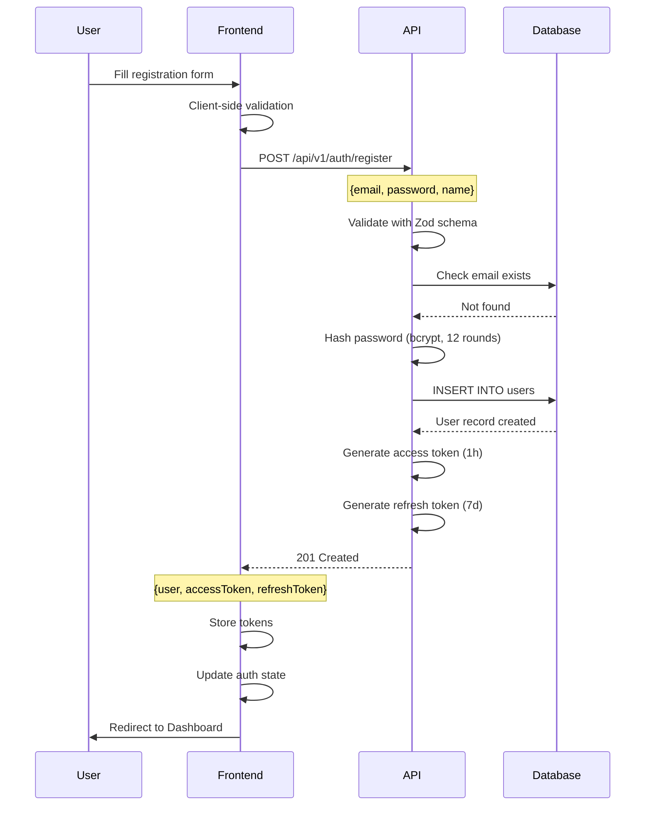
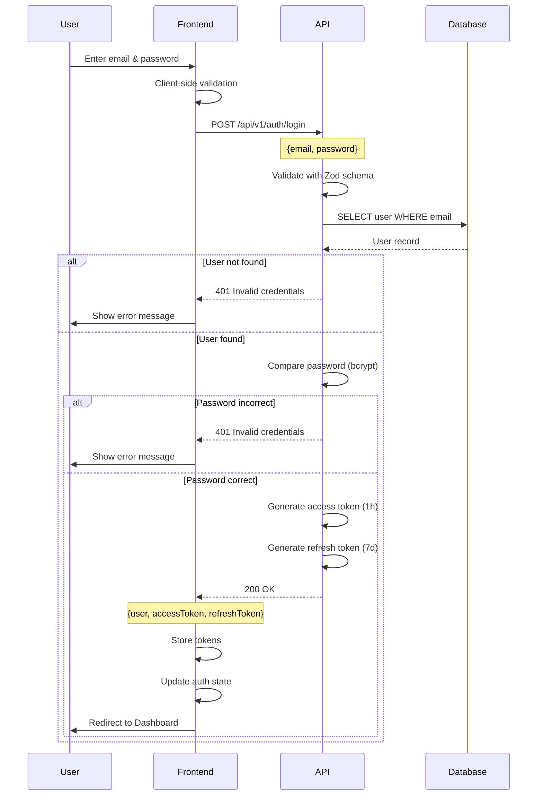
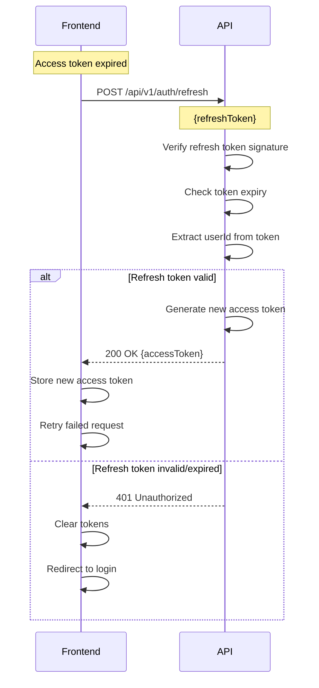
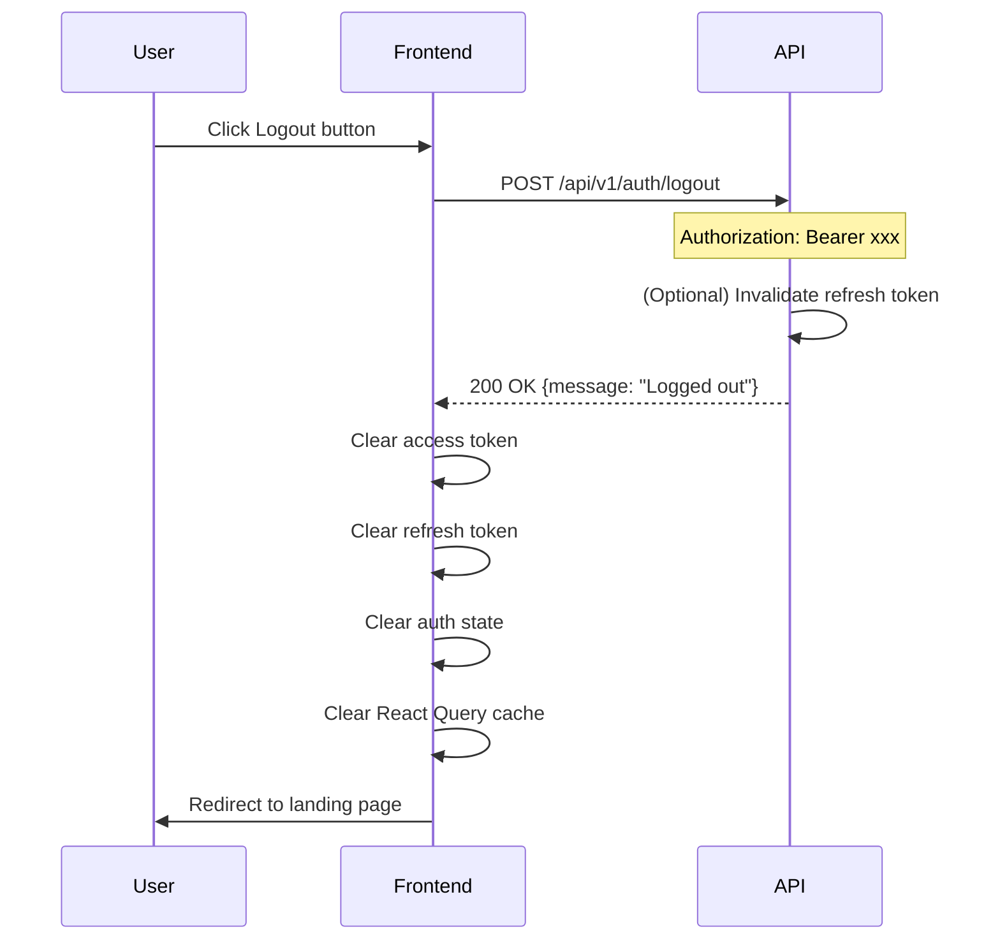
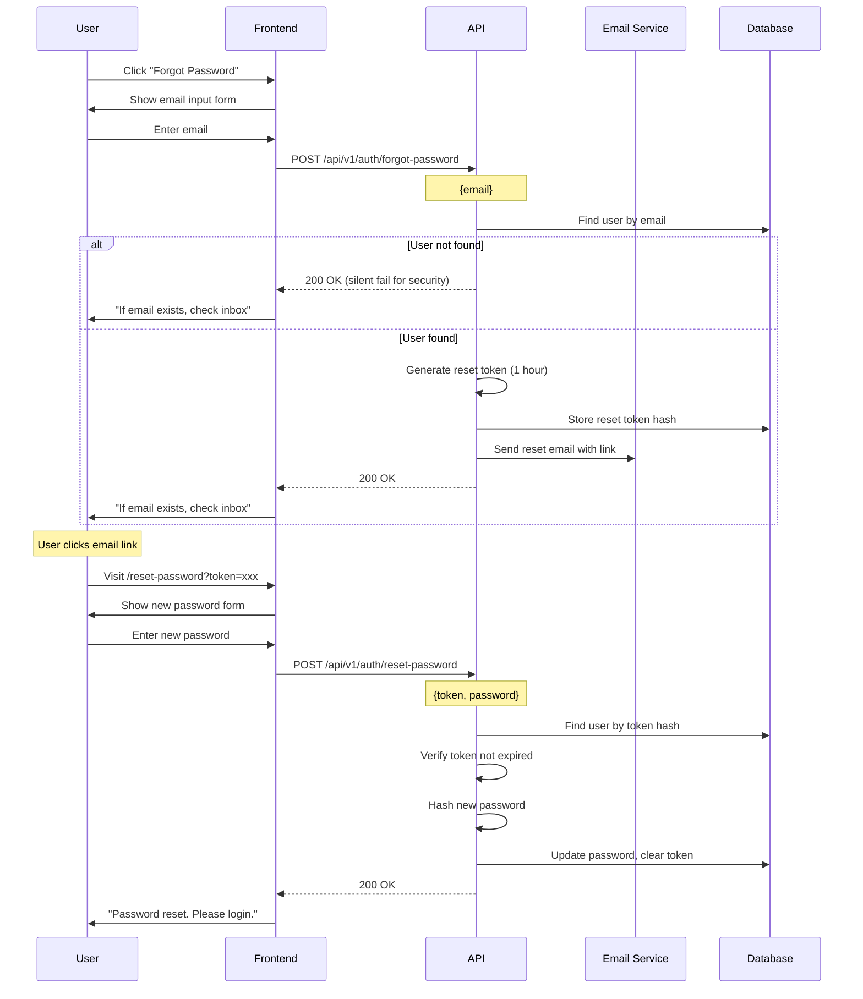
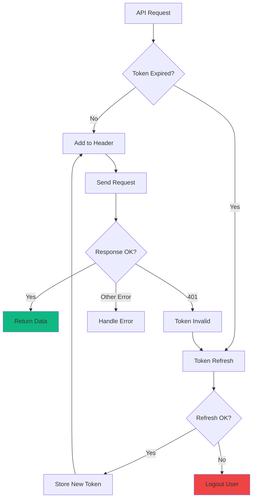
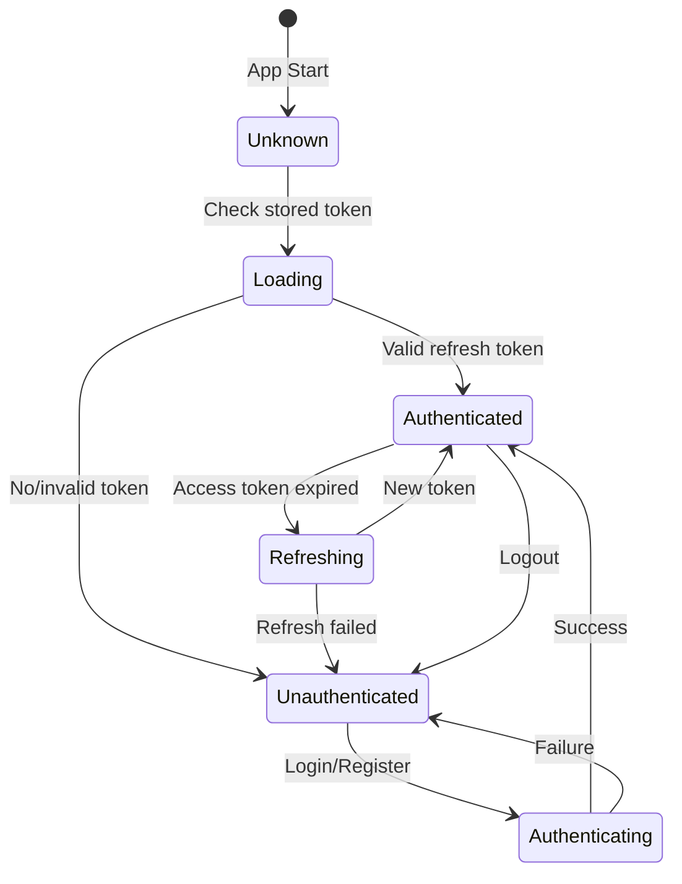

# TaskFlow Authentication Flow

## Overview

TaskFlow uses JWT-based authentication with access tokens (1 hour) and refresh tokens (7 days).

## Registration Flow

### Flow Diagram



### ASCII Flow

```
REGISTRATION FLOW
═════════════════

User                   Frontend                  API                    Database
 │                        │                       │                        │
 │  Fill form             │                       │                        │
 │───────────────────────>│                       │                        │
 │                        │                       │                        │
 │                        │  Validate locally     │                        │
 │                        │  ─────────────────    │                        │
 │                        │                       │                        │
 │                        │  POST /auth/register  │                        │
 │                        │──────────────────────>│                        │
 │                        │                       │                        │
 │                        │                       │  Check email unique    │
 │                        │                       │───────────────────────>│
 │                        │                       │<───────────────────────│
 │                        │                       │                        │
 │                        │                       │  Hash password         │
 │                        │                       │  ───────────────       │
 │                        │                       │                        │
 │                        │                       │  INSERT user           │
 │                        │                       │───────────────────────>│
 │                        │                       │<───────────────────────│
 │                        │                       │                        │
 │                        │                       │  Generate tokens       │
 │                        │                       │  ────────────────      │
 │                        │                       │                        │
 │                        │  201 {user, tokens}   │                        │
 │                        │<──────────────────────│                        │
 │                        │                       │                        │
 │                        │  Store tokens         │                        │
 │                        │  Update auth state    │                        │
 │                        │  ─────────────────    │                        │
 │                        │                       │                        │
 │  Redirect to Dashboard │                       │                        │
 │<───────────────────────│                       │                        │
```

---

## Login Flow

### Flow Diagram



---

## Token Refresh Flow

### Flow Diagram



### ASCII Flow

```
TOKEN REFRESH FLOW
══════════════════

Frontend                              API
   │                                   │
   │  Access token expired (401)       │
   │  ─────────────────────────        │
   │                                   │
   │  POST /auth/refresh               │
   │  {refreshToken: "xxx"}            │
   │──────────────────────────────────>│
   │                                   │
   │                                   │  Verify signature
   │                                   │  Check expiry
   │                                   │  Extract userId
   │                                   │  ────────────────
   │                                   │
   │          ┌────────────────────────┤
   │          │ VALID                  │
   │          │                        │
   │          │  Generate new token    │
   │          │  ──────────────────    │
   │          │                        │
   │  200 {accessToken: "new"}         │
   │<─────────┴────────────────────────│
   │                                   │
   │  Store new token                  │
   │  Retry failed request             │
   │  ────────────────────             │
   │                                   │
   │          ┌────────────────────────┤
   │          │ INVALID/EXPIRED        │
   │          │                        │
   │  401 Unauthorized                 │
   │<─────────┴────────────────────────│
   │                                   │
   │  Clear all tokens                 │
   │  Redirect to /login               │
   │  ─────────────────────            │
```

---

## Logout Flow

### Flow Diagram



---

## Password Reset Flow

### Flow Diagram



---

## Session Management

### Token Storage Strategy

```
┌─────────────────────────────────────────────────────────────────────────┐
│                        TOKEN STORAGE                                     │
├─────────────────────────────────────────────────────────────────────────┤
│                                                                          │
│  Access Token                      │  Refresh Token                      │
│  ────────────                      │  ─────────────                      │
│                                    │                                     │
│  Storage: Memory (Zustand)         │  Storage: localStorage              │
│  Lifetime: 1 hour                  │  Lifetime: 7 days                   │
│  Sent: Authorization header        │  Sent: Refresh endpoint body        │
│                                    │                                     │
│  ┌─────────────────────────────────────────────────────────────────┐   │
│  │                                                                  │   │
│  │  Why memory for access token?                                    │   │
│  │  - More secure (no XSS access)                                   │   │
│  │  - Cleared on tab close                                          │   │
│  │  - Refresh token restores session                                │   │
│  │                                                                  │   │
│  └─────────────────────────────────────────────────────────────────┘   │
│                                                                          │
└─────────────────────────────────────────────────────────────────────────┘
```

### Auto-Refresh Logic



---

## Auth State Machine



---

## Security Considerations

### Checklist

| Item | Status | Implementation |
|------|--------|----------------|
| Password hashing | Required | bcrypt, 12 rounds |
| JWT signing | Required | HS256 with secret |
| Token expiry | Required | 1h access, 7d refresh |
| Rate limiting | Required | 10 attempts / 15 min |
| HTTPS only | Required | TLS 1.3 |
| Secure headers | Required | helmet middleware |
| Input validation | Required | Zod schemas |
| Error messages | Required | Generic (no user enumeration) |
