# TaskFlow Core Features Flow

## Overview

This document describes the flows for TaskFlow's core features: Task CRUD, Project Management, and Tag/Filter operations.

---

## Task CRUD Operations

### Create Task Flow

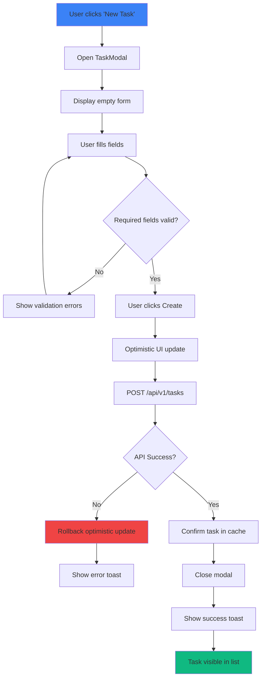

### ASCII Create Task Flow

```
CREATE TASK FLOW
════════════════

    ┌─────────────────────────────────────────────────────────────────┐
    │                         TASK FORM                                │
    ├─────────────────────────────────────────────────────────────────┤
    │                                                                  │
    │  Title*:        [_________________________________]              │
    │                                                                  │
    │  Description:   [_________________________________]              │
    │                 [_________________________________]              │
    │                                                                  │
    │  Due Date:      [__/__/____]  📅                                │
    │                                                                  │
    │  Priority:      ○ Low  ● Medium  ○ High  ○ Urgent               │
    │                                                                  │
    │  Project:       [Select project...        ▼]                    │
    │                                                                  │
    │  Tags:          [+ Add tag]  [work] [client-a]                  │
    │                                                                  │
    │                          [Cancel]  [Create Task]                │
    │                                                                  │
    └─────────────────────────────────────────────────────────────────┘

    User Flow:
    ──────────
    1. Click "New Task" button
    2. Modal opens with empty form
    3. Enter title (required)
    4. Optionally fill other fields
    5. Click "Create Task"
    6. Modal closes
    7. Task appears in list
```

### Read/View Task Flow

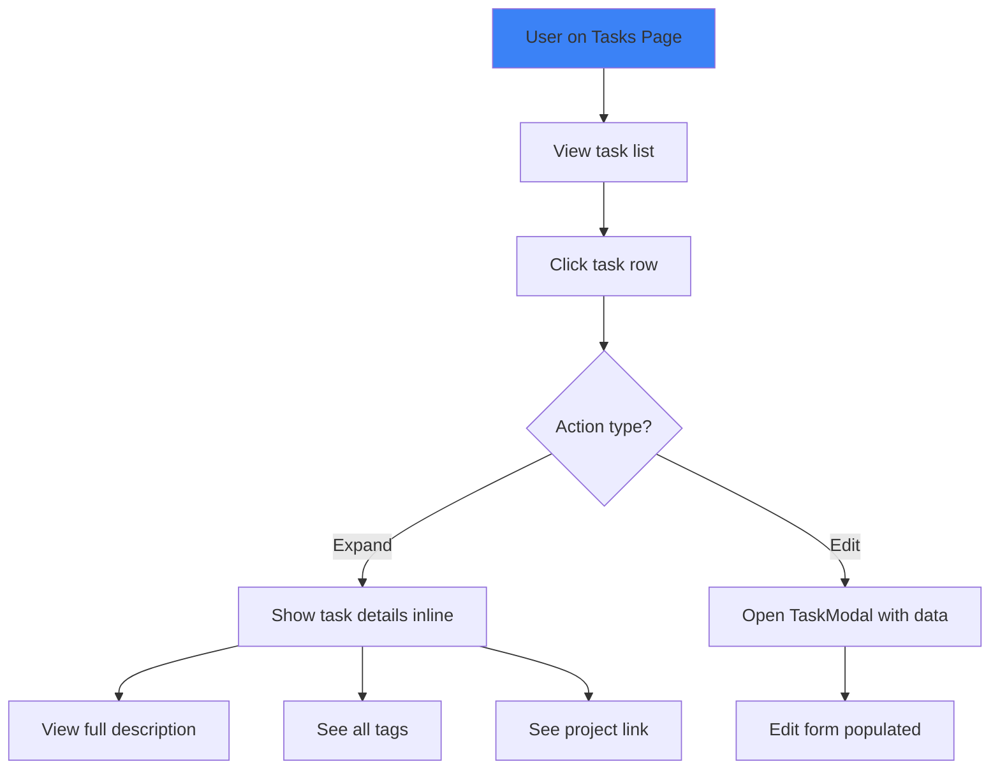

### Update Task Flow

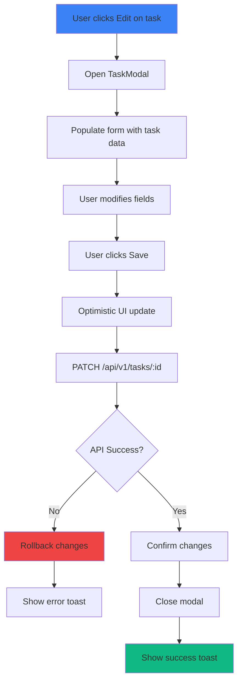

### Delete Task Flow

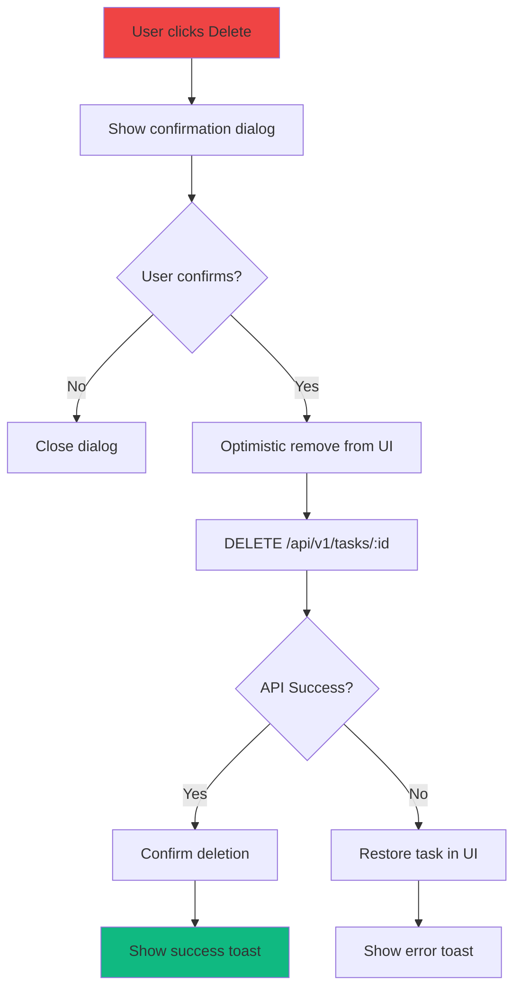

---

## Project Management

### Create Project Flow

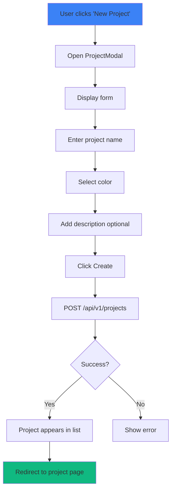

### ASCII Project List

```
PROJECTS VIEW
═════════════

┌─────────────────────────────────────────────────────────────────────────┐
│  Projects                                            [+ New Project]    │
├─────────────────────────────────────────────────────────────────────────┤
│                                                                          │
│  ┌─────────────────────┐  ┌─────────────────────┐  ┌────────────────┐   │
│  │ 🔵 Client Website   │  │ 🟢 Mobile App       │  │ 🟣 Marketing   │   │
│  │                     │  │                     │  │                │   │
│  │ 8/12 tasks          │  │ 3/10 tasks          │  │ 5/5 tasks ✓    │   │
│  │ ████████░░░░ 67%    │  │ ███░░░░░░░░░ 30%    │  │ ████████████   │   │
│  │                     │  │                     │  │     100%       │   │
│  │ Due: Feb 15, 2026   │  │ Due: Mar 1, 2026    │  │ Completed!     │   │
│  └─────────────────────┘  └─────────────────────┘  └────────────────┘   │
│                                                                          │
│  ┌─────────────────────────────────────────────────────────────────┐    │
│  │ 📁 Archived Projects (2)                               [Show ▼] │    │
│  └─────────────────────────────────────────────────────────────────┘    │
│                                                                          │
└─────────────────────────────────────────────────────────────────────────┘
```

### Assign Task to Project Flow

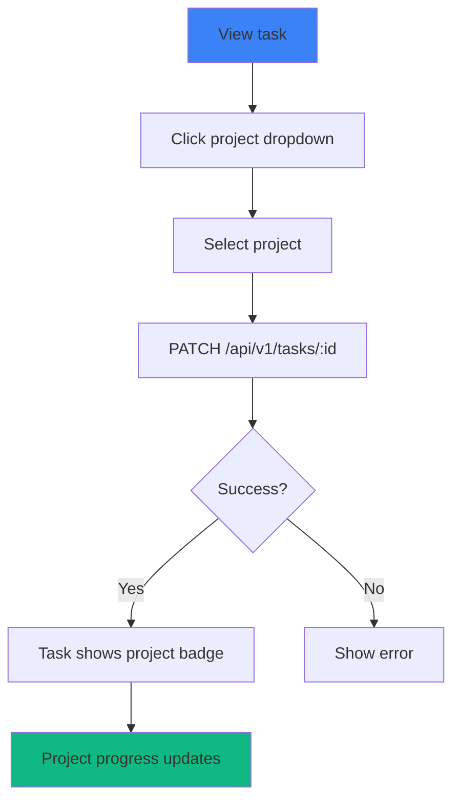

### Archive Project Flow

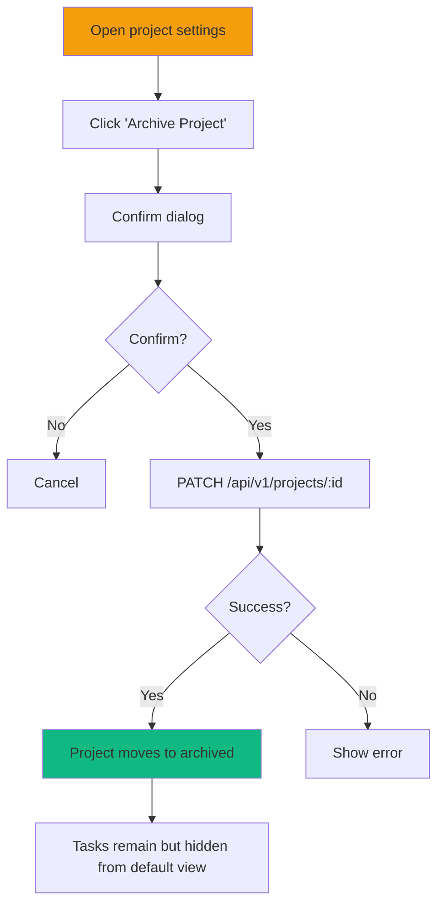

---

## Filtering and Search

### Filter Tasks Flow

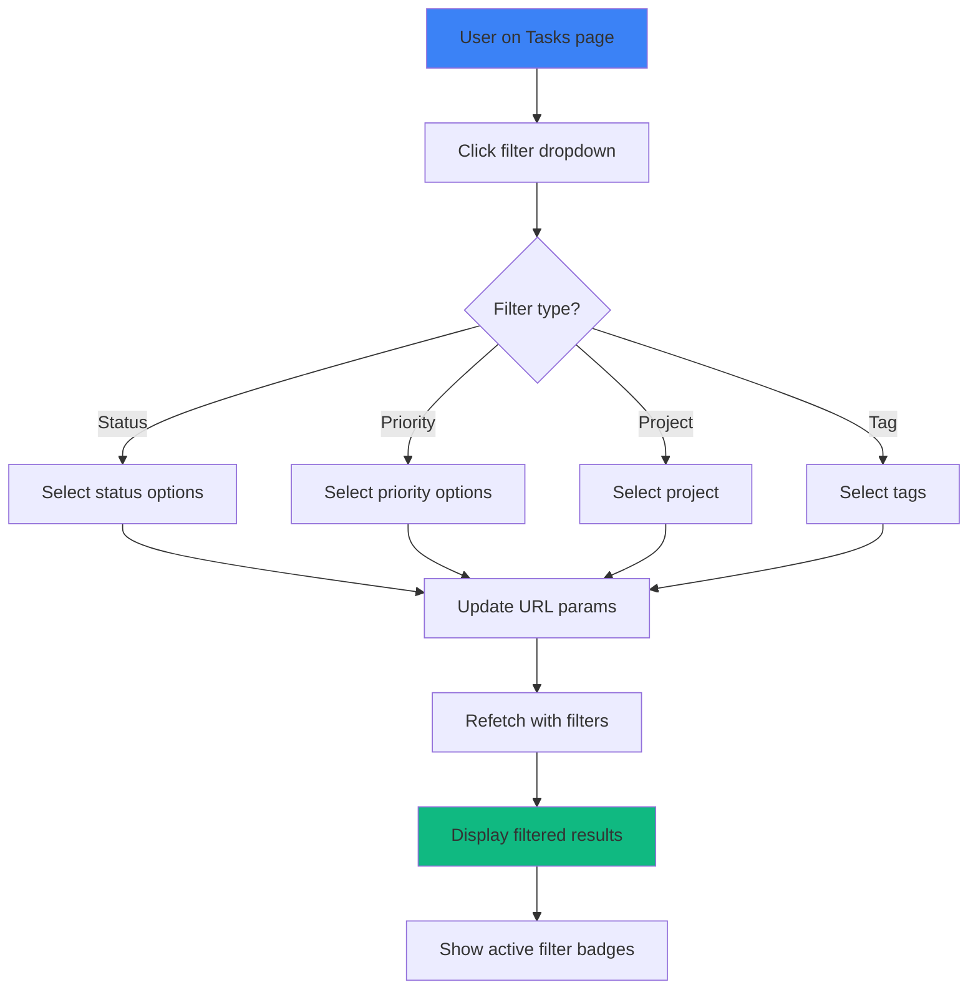

### ASCII Filter Bar

```
FILTER BAR
══════════

┌─────────────────────────────────────────────────────────────────────────┐
│                                                                          │
│  🔍 Search tasks...          │ Status ▼ │ Priority ▼ │ Project ▼ │ Tags │
│                                                                          │
│  Active filters: [In Progress ✕] [High Priority ✕] [Client Website ✕]   │
│                                                      [Clear all]         │
│                                                                          │
└─────────────────────────────────────────────────────────────────────────┘

Filter Dropdowns:
─────────────────

Status:              Priority:           Project:
┌──────────────┐    ┌──────────────┐    ┌──────────────┐
│ ☑ All        │    │ ☐ Low        │    │ ☐ All        │
│ ☑ Todo       │    │ ☐ Medium     │    │ ☑ Client Web │
│ ☑ In Progress│    │ ☑ High       │    │ ☐ Mobile App │
│ ☐ Done       │    │ ☐ Urgent     │    │ ☐ Marketing  │
└──────────────┘    └──────────────┘    └──────────────┘
```

### Search Flow

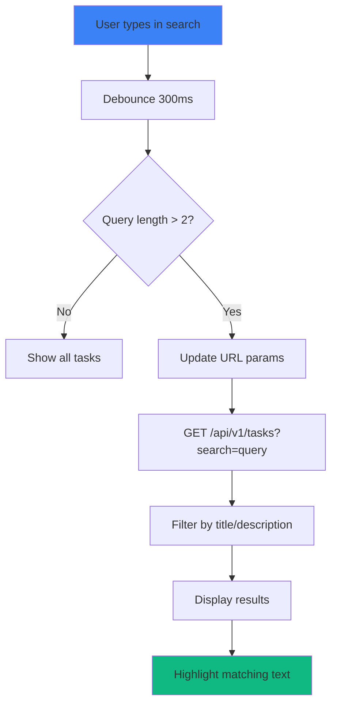

---

## Tag Management

### Create Tag Flow

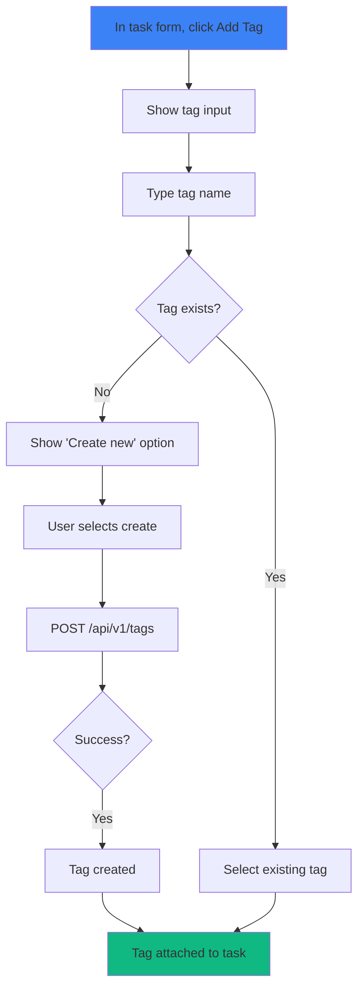

### ASCII Tag Selection

```
TAG SELECTOR
════════════

┌─────────────────────────────────────────┐
│  Tags:  [work ✕] [urgent ✕] [+ Add tag] │
└─────────────────────────────────────────┘
                    │
                    ▼
        ┌─────────────────────────┐
        │ 🔍 Search or create...  │
        ├─────────────────────────┤
        │ ☐ client-a              │
        │ ☐ client-b              │
        │ ☐ internal              │
        │ ☑ work (selected)       │
        │ ☑ urgent (selected)     │
        ├─────────────────────────┤
        │ + Create "meeting"      │
        └─────────────────────────┘
```

---

## Complete Task Flow (State Transition)

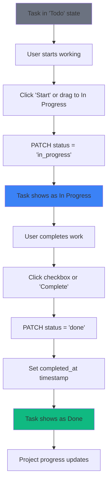

---

## Batch Operations

### Bulk Status Update

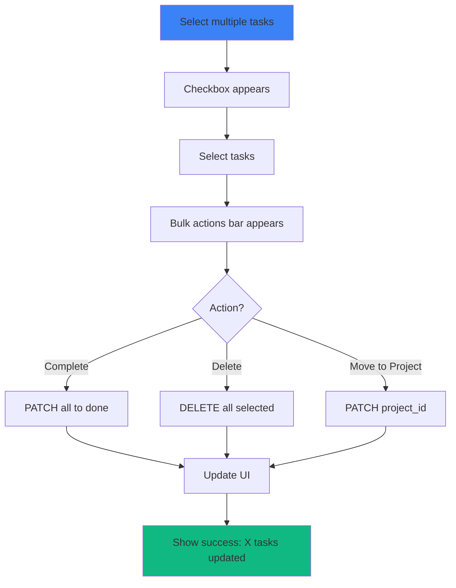

---

## Error Handling

### Validation Error Flow

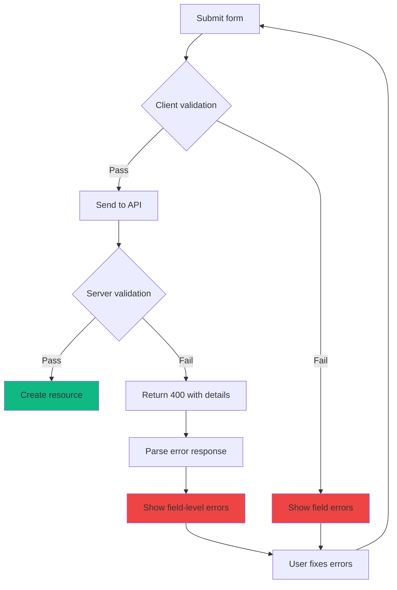
