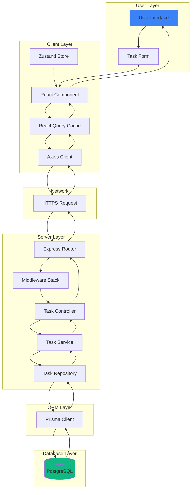
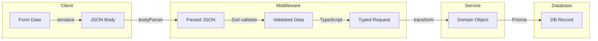
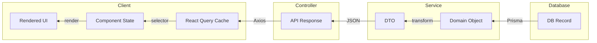
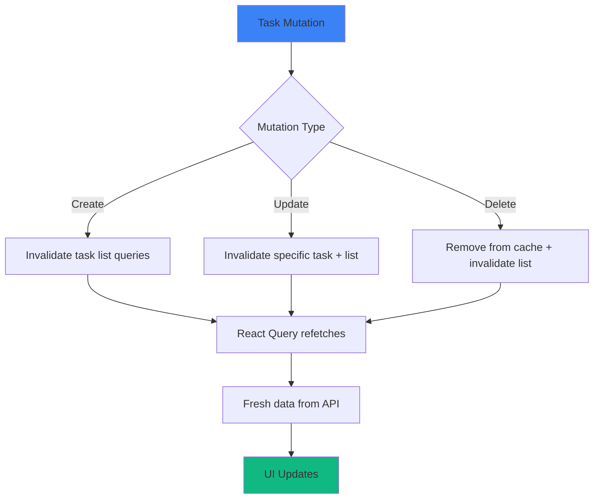
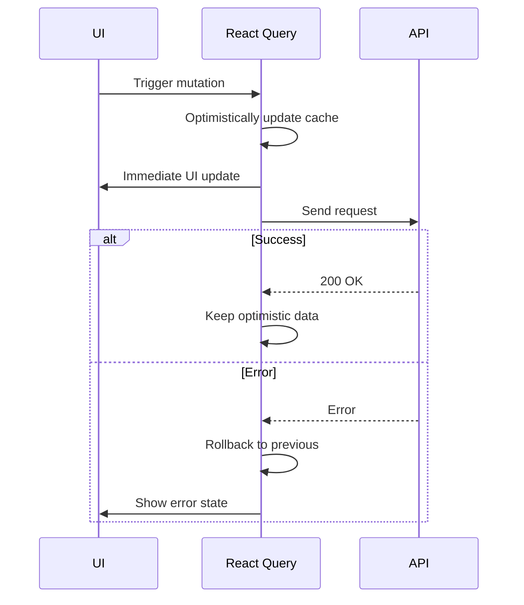
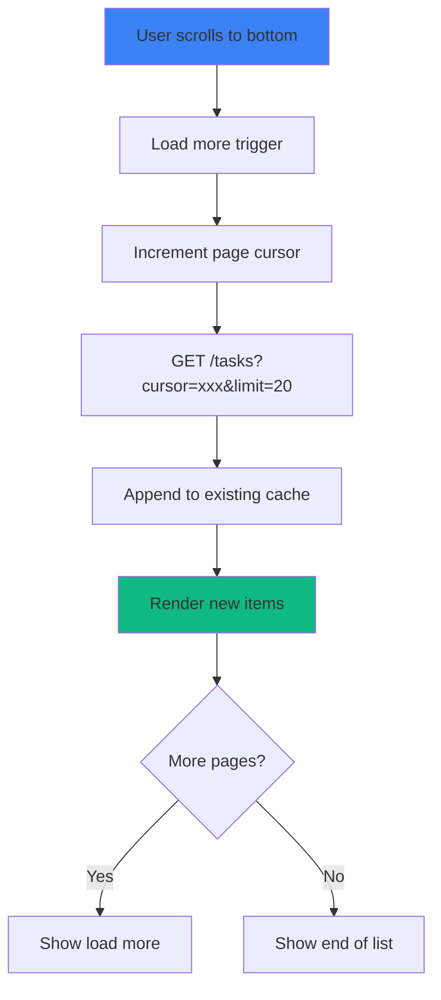

# TaskFlow Data Flow

## Overview

This document describes how data moves through the TaskFlow system, from user input to database storage and back to the UI.

---

## Task Data Lifecycle

### Complete Data Flow Diagram



### ASCII Data Flow

```
TASK DATA FLOW: CREATE
══════════════════════

User Input                           Database
    │                                    │
    ▼                                    │
┌─────────────────┐                      │
│  Task Form      │                      │
│  - title        │                      │
│  - description  │                      │
│  - due_date     │                      │
│  - priority     │                      │
└────────┬────────┘                      │
         │                               │
         ▼                               │
┌─────────────────┐                      │
│  Form State     │ (useState)           │
│  Validation     │ (Zod client-side)    │
└────────┬────────┘                      │
         │                               │
         ▼                               │
┌─────────────────┐                      │
│  React Query    │                      │
│  useMutation    │                      │
│  - optimistic   │                      │
│    update       │                      │
└────────┬────────┘                      │
         │                               │
         ▼                               │
┌─────────────────┐                      │
│  Axios Client   │                      │
│  - Add JWT      │                      │
│  - Set headers  │                      │
└────────┬────────┘                      │
         │                               │
    ═════╪═════════════════════════ NETWORK BOUNDARY
         │                               │
         ▼                               │
┌─────────────────┐                      │
│  Express Router │                      │
│  POST /tasks    │                      │
└────────┬────────┘                      │
         │                               │
         ▼                               │
┌─────────────────┐                      │
│  Middleware     │                      │
│  - authenticate │                      │
│  - validate     │                      │
│  - rateLimit    │                      │
└────────┬────────┘                      │
         │                               │
         ▼                               │
┌─────────────────┐                      │
│  Controller     │                      │
│  - Extract body │                      │
│  - Call service │                      │
└────────┬────────┘                      │
         │                               │
         ▼                               │
┌─────────────────┐                      │
│  Service        │                      │
│  - Business     │                      │
│    logic        │                      │
│  - Transform    │                      │
└────────┬────────┘                      │
         │                               │
         ▼                               │
┌─────────────────┐                      │
│  Repository     │                      │
│  - Prisma call  │                      │
└────────┬────────┘                      │
         │                               │
         ▼                               │
┌─────────────────┐                      │
│  Prisma ORM     │                      │
│  - SQL query    │                      │
│  - Type safety  │                      │
└────────┬────────┘                      │
         │                               │
         └───────────────────────────────┤
                                         ▼
                                 ┌───────────────┐
                                 │  PostgreSQL   │
                                 │  INSERT INTO  │
                                 │  tasks (...)  │
                                 └───────────────┘
```

---

## Data Transformation Pipeline

### Request Transformation



### Example: Task Creation

```typescript
// 1. Client Form Data
{
  title: "Review PR #123",
  description: "Check the new auth changes",
  dueDate: "2026-02-15",  // string from date picker
  priority: "high",
  projectId: "uuid-here",
  tagIds: ["uuid-1", "uuid-2"]
}

// 2. Zod Validation (middleware)
const createTaskSchema = z.object({
  title: z.string().min(1).max(255),
  description: z.string().max(5000).optional(),
  dueDate: z.coerce.date().optional(),  // coerces string to Date
  priority: z.enum(['low', 'medium', 'high', 'urgent']),
  projectId: z.string().uuid().optional(),
  tagIds: z.array(z.string().uuid()).optional(),
});

// 3. Service Layer (business logic)
{
  title: "Review PR #123",
  description: "Check the new auth changes",
  dueDate: Date("2026-02-15T00:00:00Z"),
  priority: "high",
  projectId: "uuid-here",
  userId: "current-user-uuid",  // injected from JWT
  status: "todo",               // default
  createdAt: Date.now(),        // auto
}

// 4. Prisma Create
await prisma.task.create({
  data: {
    title: "Review PR #123",
    description: "Check the new auth changes",
    dueDate: new Date("2026-02-15"),
    priority: "high",
    userId: "current-user-uuid",
    projectId: "uuid-here",
    tags: {
      create: [
        { tagId: "uuid-1" },
        { tagId: "uuid-2" }
      ]
    }
  }
});

// 5. Database Record
{
  id: "new-task-uuid",
  title: "Review PR #123",
  description: "Check the new auth changes",
  due_date: "2026-02-15",
  priority: "high",
  status: "todo",
  user_id: "current-user-uuid",
  project_id: "uuid-here",
  created_at: "2026-01-29T12:00:00Z",
  updated_at: "2026-01-29T12:00:00Z",
  completed_at: null
}
```

---

## Response Transformation

### Response Pipeline



### Example: Task Response

```typescript
// 1. Database Record (raw)
{
  id: "task-uuid",
  title: "Review PR #123",
  description: "Check the new auth changes",
  due_date: "2026-02-15",
  priority: "high",
  status: "todo",
  user_id: "user-uuid",
  project_id: "project-uuid",
  created_at: "2026-01-29T12:00:00Z",
  updated_at: "2026-01-29T12:00:00Z",
  completed_at: null
}

// 2. Prisma with Relations
{
  id: "task-uuid",
  title: "Review PR #123",
  description: "Check the new auth changes",
  dueDate: Date("2026-02-15"),
  priority: "high",
  status: "todo",
  userId: "user-uuid",
  projectId: "project-uuid",
  createdAt: Date("2026-01-29T12:00:00Z"),
  updatedAt: Date("2026-01-29T12:00:00Z"),
  completedAt: null,
  project: {
    id: "project-uuid",
    name: "Client Website",
    color: "#3b82f6"
  },
  tags: [
    { tag: { id: "tag-1", name: "work", color: "#10b981" } },
    { tag: { id: "tag-2", name: "urgent", color: "#ef4444" } }
  ]
}

// 3. API Response (DTO)
{
  "id": "task-uuid",
  "title": "Review PR #123",
  "description": "Check the new auth changes",
  "dueDate": "2026-02-15T00:00:00.000Z",
  "priority": "high",
  "status": "todo",
  "project": {
    "id": "project-uuid",
    "name": "Client Website",
    "color": "#3b82f6"
  },
  "tags": [
    { "id": "tag-1", "name": "work", "color": "#10b981" },
    { "id": "tag-2", "name": "urgent", "color": "#ef4444" }
  ],
  "createdAt": "2026-01-29T12:00:00.000Z",
  "updatedAt": "2026-01-29T12:00:00.000Z",
  "completedAt": null
}

// 4. React Query Cache
// Stored under queryKey: ['tasks', { status: 'all' }]

// 5. Component Usage
const { data: tasks } = useTasks();
// tasks[0].title => "Review PR #123"
// tasks[0].project.name => "Client Website"
// tasks[0].tags[0].name => "work"
```

---

## Caching Layer

### Cache Architecture

```
┌─────────────────────────────────────────────────────────────────────────┐
│                          CACHING LAYERS                                  │
├─────────────────────────────────────────────────────────────────────────┤
│                                                                          │
│  ┌─────────────────────────────────────────────────────────────────┐    │
│  │  LAYER 1: React Query Cache (Client)                            │    │
│  │                                                                  │    │
│  │  Key: ['tasks', filters]                                        │    │
│  │  Stale Time: 1 minute                                           │    │
│  │  GC Time: 5 minutes                                             │    │
│  │  Refetch: On window focus, on mount                             │    │
│  │                                                                  │    │
│  │  Benefits:                                                       │    │
│  │  - Instant navigation between pages                             │    │
│  │  - Optimistic updates                                           │    │
│  │  - Background refetching                                        │    │
│  └─────────────────────────────────────────────────────────────────┘    │
│                                                                          │
│  ┌─────────────────────────────────────────────────────────────────┐    │
│  │  LAYER 2: HTTP Cache (Browser)                                  │    │
│  │                                                                  │    │
│  │  Headers: Cache-Control: private, max-age=0, must-revalidate    │    │
│  │  ETag: Supported for conditional requests                        │    │
│  │                                                                  │    │
│  │  Note: Mostly disabled for dynamic API data                      │    │
│  └─────────────────────────────────────────────────────────────────┘    │
│                                                                          │
│  ┌─────────────────────────────────────────────────────────────────┐    │
│  │  LAYER 3: Database Query Cache (Prisma)                         │    │
│  │                                                                  │    │
│  │  - Connection pooling (reuse connections)                       │    │
│  │  - Prepared statements                                           │    │
│  │                                                                  │    │
│  │  Future: Redis cache for expensive queries                       │    │
│  └─────────────────────────────────────────────────────────────────┘    │
│                                                                          │
└─────────────────────────────────────────────────────────────────────────┘
```

### Cache Invalidation Strategy



---

## State Synchronization

### Optimistic Updates



### Code Example: Optimistic Update

```typescript
const useCompleteTask = () => {
  const queryClient = useQueryClient();

  return useMutation({
    mutationFn: (taskId: string) =>
      axios.patch(`/api/v1/tasks/${taskId}`, { status: 'done' }),

    onMutate: async (taskId) => {
      // Cancel outgoing refetches
      await queryClient.cancelQueries({ queryKey: ['tasks'] });

      // Snapshot previous value
      const previousTasks = queryClient.getQueryData(['tasks']);

      // Optimistically update
      queryClient.setQueryData(['tasks'], (old: Task[]) =>
        old.map(task =>
          task.id === taskId
            ? { ...task, status: 'done', completedAt: new Date() }
            : task
        )
      );

      return { previousTasks };
    },

    onError: (err, taskId, context) => {
      // Rollback on error
      queryClient.setQueryData(['tasks'], context?.previousTasks);
    },

    onSettled: () => {
      // Refetch to ensure consistency
      queryClient.invalidateQueries({ queryKey: ['tasks'] });
    },
  });
};
```

---

## Data Pagination

### Pagination Flow



### Cursor-based Pagination

```typescript
// API Request
GET /api/v1/tasks?cursor=last-task-id&limit=20

// Response
{
  "data": [...],
  "pagination": {
    "nextCursor": "task-id-20",
    "hasMore": true
  }
}
```
