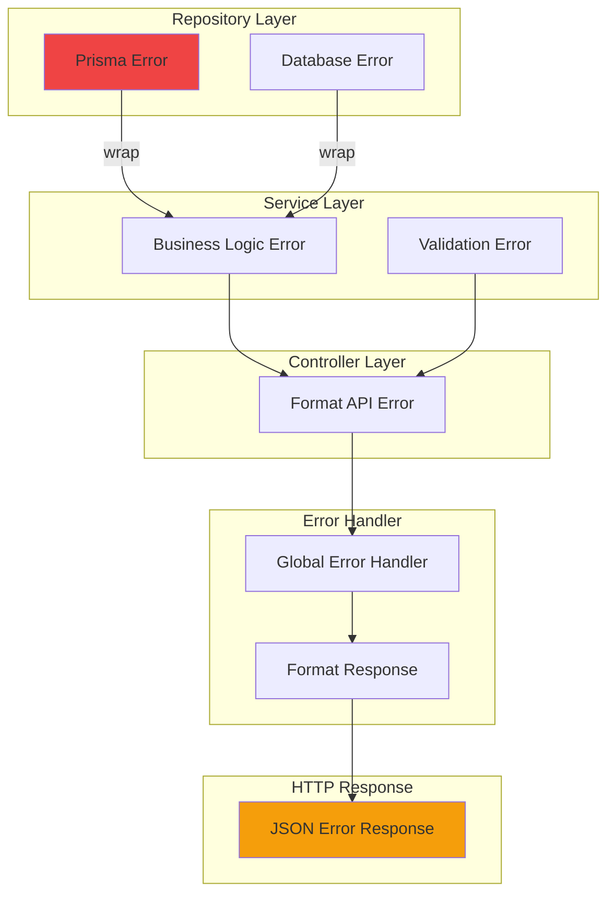
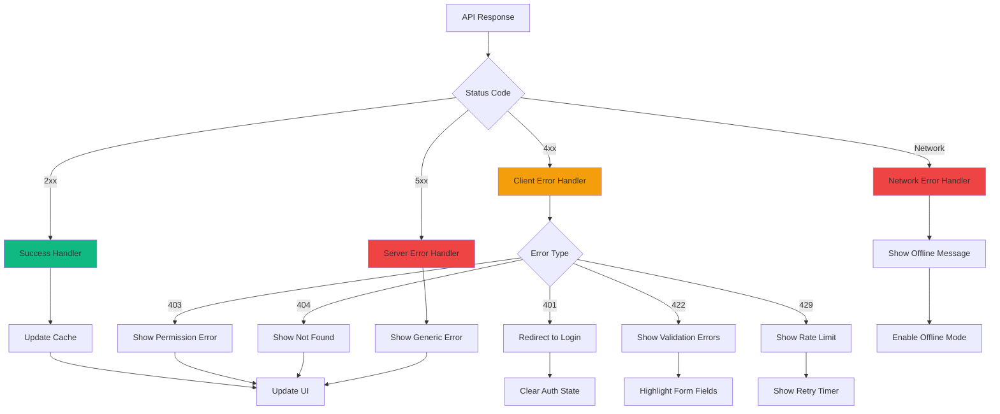
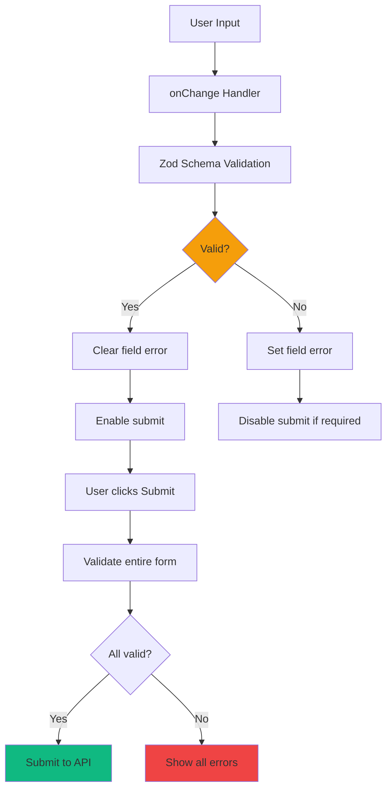
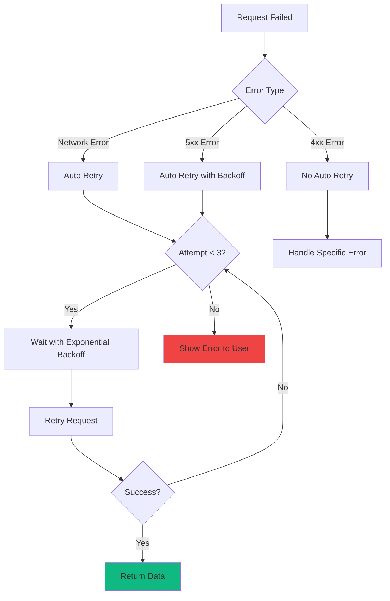
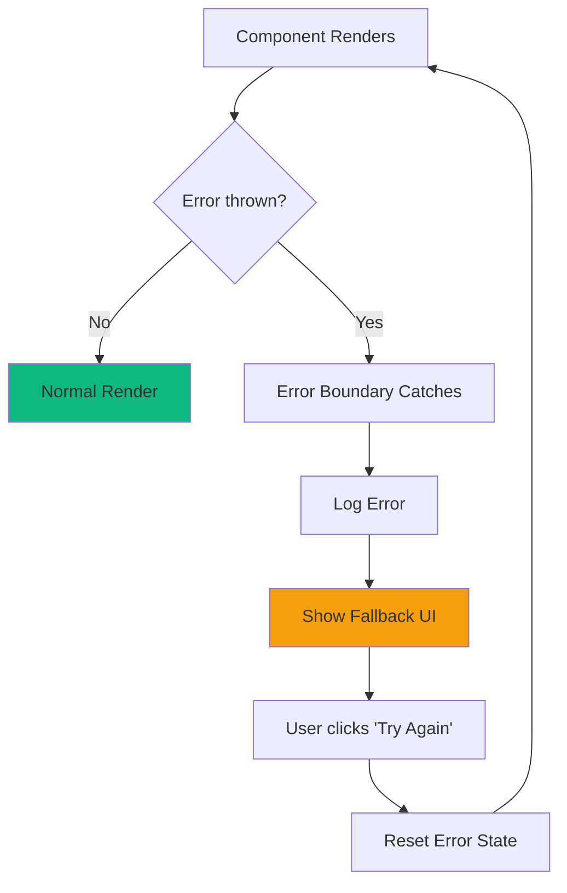

# TaskFlow Error Handling Flow

## Overview

This document describes how errors are handled throughout the TaskFlow application, from validation errors to network failures.

---

## Error Types

### Error Classification

```
┌─────────────────────────────────────────────────────────────────────────┐
│                          ERROR TYPES                                     │
├─────────────────────────────────────────────────────────────────────────┤
│                                                                          │
│  CLIENT ERRORS (4xx)                                                     │
│  ──────────────────                                                      │
│  400 Bad Request      - Validation errors, malformed JSON                │
│  401 Unauthorized     - Missing or invalid JWT token                     │
│  403 Forbidden        - Valid token but not authorized for resource      │
│  404 Not Found        - Resource doesn't exist                           │
│  409 Conflict         - Duplicate resource (e.g., email already exists)  │
│  422 Unprocessable    - Semantic validation error                        │
│  429 Too Many Requests - Rate limit exceeded                             │
│                                                                          │
│  SERVER ERRORS (5xx)                                                     │
│  ──────────────────                                                      │
│  500 Internal Error   - Unexpected server error                          │
│  502 Bad Gateway      - Database connection failure                      │
│  503 Service Unavail  - Server overloaded or maintenance                 │
│                                                                          │
│  NETWORK ERRORS                                                          │
│  ──────────────                                                          │
│  Network Error        - No internet connection                           │
│  Timeout              - Request took too long                            │
│  CORS Error           - Cross-origin request blocked                     │
│                                                                          │
└─────────────────────────────────────────────────────────────────────────┘
```

---

## Error Propagation Flow

### Backend Error Flow



### ASCII Error Propagation

```
ERROR PROPAGATION
═════════════════

Repository                Service                 Controller              Response
    │                        │                        │                      │
    │  PrismaError           │                        │                      │
    │  {code: P2025}         │                        │                      │
    │───────────────────────>│                        │                      │
    │                        │                        │                      │
    │                        │  NotFoundError         │                      │
    │                        │  "Task not found"      │                      │
    │                        │───────────────────────>│                      │
    │                        │                        │                      │
    │                        │                        │  throw error         │
    │                        │                        │──────────────────────┤
    │                        │                        │                      │
    │                        │                        │        ┌─────────────▼─────────┐
    │                        │                        │        │  Error Handler        │
    │                        │                        │        │  middleware           │
    │                        │                        │        │                       │
    │                        │                        │        │  - Log error          │
    │                        │                        │        │  - Map to HTTP code   │
    │                        │                        │        │  - Format response    │
    │                        │                        │        └─────────────┬─────────┘
    │                        │                        │                      │
    │                        │                        │                      ▼
    │                        │                        │        ┌─────────────────────┐
    │                        │                        │        │  404 Not Found      │
    │                        │                        │        │  {                  │
    │                        │                        │        │    error: {         │
    │                        │                        │        │      code: "...",   │
    │                        │                        │        │      message: "..." │
    │                        │                        │        │    }                │
    │                        │                        │        │  }                  │
    │                        │                        │        └─────────────────────┘
```

---

## Client-Side Error Handling

### Error Handling Flow



### Error Response Format

```typescript
// Standard API Error Response
interface ApiError {
  error: {
    code: string;           // Machine-readable code
    message: string;        // User-friendly message
    details?: {             // Field-level errors (validation)
      field: string;
      message: string;
    }[];
    requestId?: string;     // For support debugging
  };
}

// Example: Validation Error
{
  "error": {
    "code": "VALIDATION_ERROR",
    "message": "Validation failed",
    "details": [
      { "field": "title", "message": "Title is required" },
      { "field": "dueDate", "message": "Due date must be in the future" }
    ],
    "requestId": "req_abc123"
  }
}

// Example: Not Found
{
  "error": {
    "code": "NOT_FOUND",
    "message": "Task not found",
    "requestId": "req_def456"
  }
}
```

---

## Form Validation Flow

### Client-Side Validation



### ASCII Form Validation

```
FORM VALIDATION STATES
══════════════════════

PRISTINE (Initial):
┌─────────────────────────────────────────┐
│  Title*:    [                         ] │
│                                         │
│  Due Date:  [__/__/____]               │
│                                         │
│             [Cancel]  [Create Task]     │
└─────────────────────────────────────────┘

TOUCHED WITH ERROR:
┌─────────────────────────────────────────┐
│  Title*:    [                         ] │
│             ⚠️ Title is required        │
│                                         │
│  Due Date:  [01/01/2020]               │
│             ⚠️ Due date must be future  │
│                                         │
│             [Cancel]  [Create Task]     │
│                       (disabled)        │
└─────────────────────────────────────────┘

VALID:
┌─────────────────────────────────────────┐
│  Title*:    [Review PR #123        ✓ ] │
│                                         │
│  Due Date:  [02/15/2026            ✓ ] │
│                                         │
│             [Cancel]  [Create Task]     │
│                       (enabled)         │
└─────────────────────────────────────────┘

SERVER ERROR:
┌─────────────────────────────────────────┐
│  ┌─────────────────────────────────┐   │
│  │ ❌ Failed to create task        │   │
│  │    Please try again later       │   │
│  └─────────────────────────────────┘   │
│                                         │
│  Title*:    [Review PR #123         ]  │
│                                         │
│             [Cancel]  [Retry]           │
└─────────────────────────────────────────┘
```

---

## Network Error Recovery

### Retry Strategy



### Retry Configuration

```typescript
// React Query retry config
const queryClient = new QueryClient({
  defaultOptions: {
    queries: {
      retry: (failureCount, error) => {
        // Don't retry on 4xx errors
        if (error.response?.status >= 400 && error.response?.status < 500) {
          return false;
        }
        // Retry up to 3 times for network/5xx errors
        return failureCount < 3;
      },
      retryDelay: (attemptIndex) => Math.min(1000 * 2 ** attemptIndex, 30000),
    },
  },
});
```

---

## Error UI Components

### Toast Notifications

```
ERROR TOAST TYPES
═════════════════

SUCCESS:
┌─────────────────────────────────────────┐
│ ✅ Task created successfully        ✕  │
└─────────────────────────────────────────┘

WARNING:
┌─────────────────────────────────────────┐
│ ⚠️ You're offline. Changes saved locally ✕ │
└─────────────────────────────────────────┘

ERROR:
┌─────────────────────────────────────────┐
│ ❌ Failed to save task. Please retry  ✕  │
└─────────────────────────────────────────┘

INFO:
┌─────────────────────────────────────────┐
│ ℹ️ Session expires in 5 minutes      ✕  │
└─────────────────────────────────────────┘
```

### Error Boundaries



---

## Error Logging

### Logging Strategy

```
┌─────────────────────────────────────────────────────────────────────────┐
│                          ERROR LOGGING                                   │
├─────────────────────────────────────────────────────────────────────────┤
│                                                                          │
│  CLIENT SIDE                                                             │
│  ───────────                                                             │
│  - Console errors in development                                         │
│  - Send to error tracking service (Sentry) in production                 │
│  - Include: stack trace, user context, app state                        │
│                                                                          │
│  SERVER SIDE                                                             │
│  ───────────                                                             │
│  - Winston logger with JSON format                                       │
│  - Log levels: error, warn, info, debug                                 │
│  - Include: request ID, user ID, error stack                            │
│  - Ship to CloudWatch/DataDog in production                             │
│                                                                          │
│  ERROR LOG STRUCTURE:                                                    │
│  {                                                                       │
│    "level": "error",                                                     │
│    "timestamp": "2026-01-29T12:00:00Z",                                 │
│    "requestId": "req_abc123",                                           │
│    "userId": "user_xyz",                                                │
│    "message": "Task not found",                                          │
│    "error": {                                                            │
│      "name": "NotFoundError",                                           │
│      "code": "NOT_FOUND",                                               │
│      "stack": "..."                                                      │
│    },                                                                    │
│    "context": {                                                          │
│      "taskId": "task_123",                                              │
│      "action": "getTask"                                                │
│    }                                                                     │
│  }                                                                       │
│                                                                          │
└─────────────────────────────────────────────────────────────────────────┘
```

---

## Error Codes Reference

| Code | HTTP | Description | User Action |
|------|------|-------------|-------------|
| `VALIDATION_ERROR` | 400 | Invalid input data | Fix form fields |
| `INVALID_JSON` | 400 | Malformed request body | Contact support |
| `UNAUTHORIZED` | 401 | Not logged in | Login again |
| `TOKEN_EXPIRED` | 401 | JWT expired | Auto-refresh or login |
| `FORBIDDEN` | 403 | No permission | Contact admin |
| `NOT_FOUND` | 404 | Resource missing | Check URL |
| `DUPLICATE_EMAIL` | 409 | Email already exists | Use different email |
| `RATE_LIMITED` | 429 | Too many requests | Wait and retry |
| `INTERNAL_ERROR` | 500 | Server error | Retry later |
| `DB_ERROR` | 500 | Database error | Retry later |
