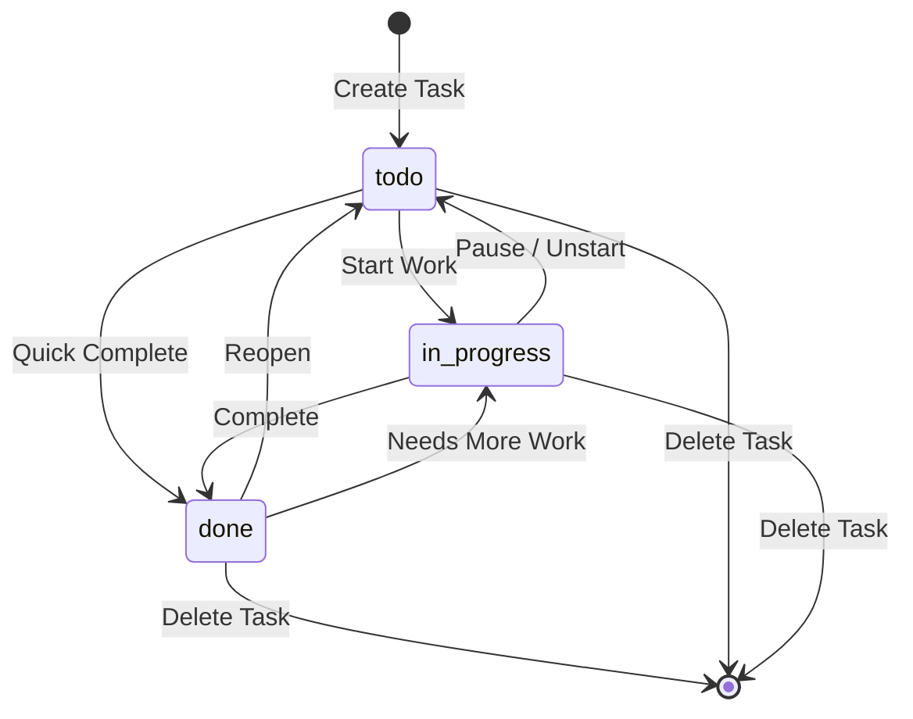
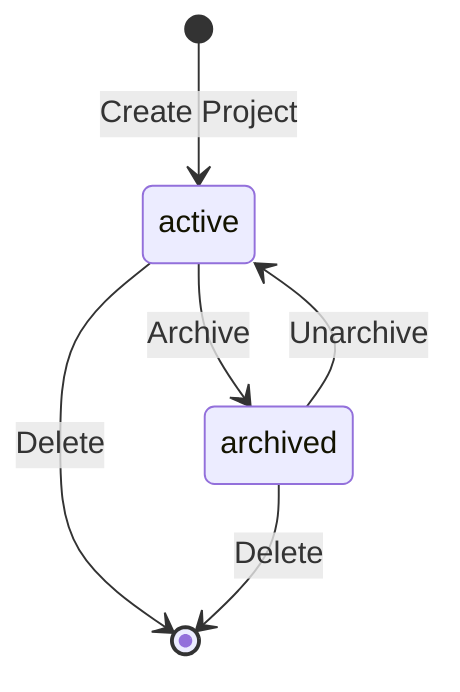
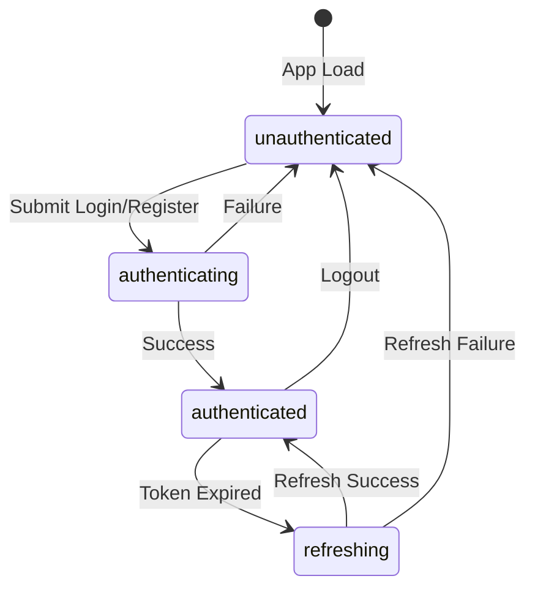
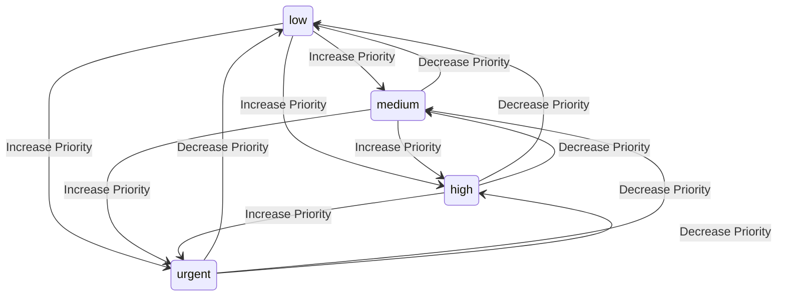
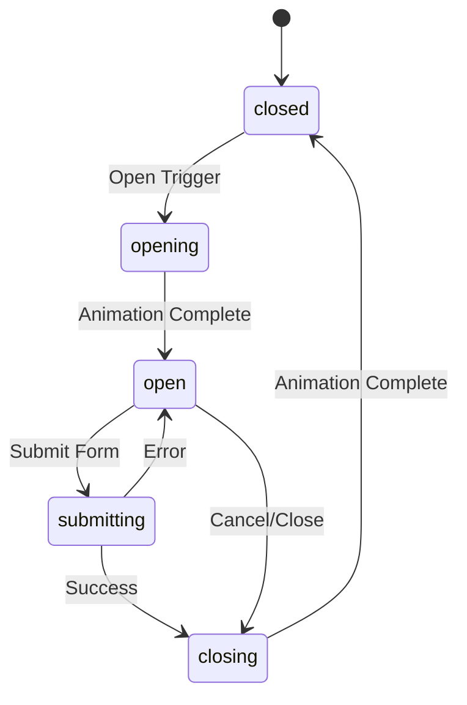
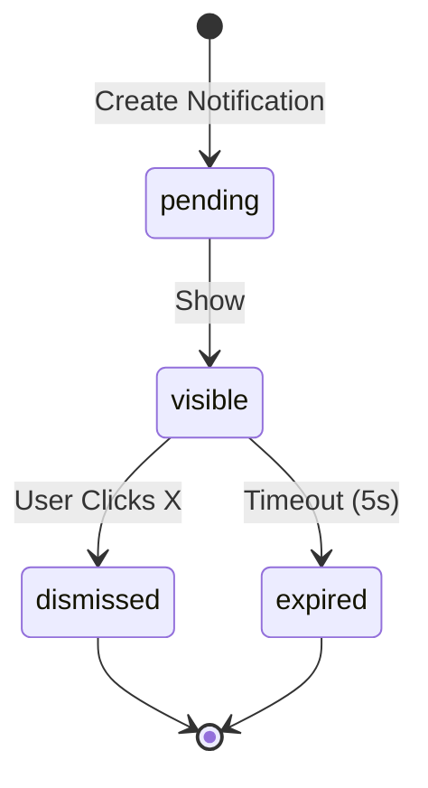
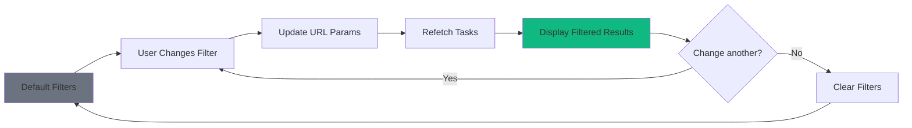

# TaskFlow State Transitions

## Overview

This document defines the state machines for key entities in TaskFlow, including valid states and allowed transitions.

---

## Task State Machine

### States

| State | Description | Visual Indicator |
|-------|-------------|------------------|
| `todo` | Task created, not started | Gray checkbox |
| `in_progress` | Task being worked on | Blue pulsing dot |
| `done` | Task completed | Green checkmark |

### State Diagram



### ASCII State Diagram

```
TASK STATE MACHINE
══════════════════

                    ┌────────────────────────────────────────────────┐
                    │                                                │
                    │                    CREATE                      │
                    │                      │                         │
                    │                      ▼                         │
                    │              ┌───────────────┐                 │
                    │              │               │                 │
          ┌────────┴──────────────│     TODO      │────────┐        │
          │        Pause          │               │        │        │
          │                       └───────┬───────┘        │        │
          │                               │                │        │
          │                   Start Work  │  Quick Complete│        │
          │                               │                │        │
          │                               ▼                │        │
          │                       ┌───────────────┐        │        │
          │                       │               │        │        │
          └──────────────────────>│ IN_PROGRESS   │        │        │
                                  │               │        │        │
                  Needs More Work └───────┬───────┘        │        │
          ┌─────────────────────────────┘ │                │        │
          │                               │ Complete       │        │
          │                               │                │        │
          │                               ▼                ▼        │
          │                       ┌───────────────┐                 │
          │                       │               │                 │
          └───────────────────────│     DONE      │<────────────────┘
                                  │               │
                    Reopen        └───────┬───────┘
                    ┌─────────────────────┘ │
                    │                       │
                    │                       │ Delete/Archive
                    ▼                       ▼
            Back to TODO                   END
```

### Transition Rules

```typescript
const TASK_TRANSITIONS: Record<TaskStatus, TaskStatus[]> = {
  todo: ['in_progress', 'done'],
  in_progress: ['todo', 'done'],
  done: ['todo', 'in_progress'],
};

function canTransition(from: TaskStatus, to: TaskStatus): boolean {
  return TASK_TRANSITIONS[from].includes(to);
}
```

### Transition Actions

| Transition | Trigger | Side Effects |
|------------|---------|--------------|
| `todo` -> `in_progress` | Click "Start" | None |
| `todo` -> `done` | Click checkbox | Set `completedAt` |
| `in_progress` -> `todo` | Click "Pause" | None |
| `in_progress` -> `done` | Click checkbox | Set `completedAt` |
| `done` -> `todo` | Click "Reopen" | Clear `completedAt` |
| `done` -> `in_progress` | Click "Continue" | Clear `completedAt` |

---

## Project State Machine

### States

| State | Description | Visual Indicator |
|-------|-------------|------------------|
| `active` | Project is active and visible | Normal display |
| `archived` | Project is hidden from default view | Grayed out |

### State Diagram



### ASCII State Diagram

```
PROJECT STATE MACHINE
═════════════════════

              CREATE
                │
                ▼
        ┌───────────────┐
        │               │
        │    ACTIVE     │<─────────────┐
        │               │              │
        └───────┬───────┘              │
                │                      │
        Archive │              Unarchive
                │                      │
                ▼                      │
        ┌───────────────┐              │
        │               │              │
        │   ARCHIVED    │──────────────┘
        │               │
        └───────┬───────┘
                │
                │ Delete
                ▼
               END
```

### Task Impact on Archive

When a project is archived:
- Tasks remain associated with the project
- Tasks are hidden from default task views
- Tasks can still be accessed via "Archived Projects" filter

---

## User Session State Machine

### States

| State | Description |
|-------|-------------|
| `unauthenticated` | No valid session |
| `authenticating` | Login/register in progress |
| `authenticated` | Valid session exists |
| `refreshing` | Token refresh in progress |

### State Diagram



### ASCII State Diagram

```
USER SESSION STATE MACHINE
══════════════════════════

                APP LOAD
                   │
                   ▼
          ┌───────────────────┐
          │                   │
          │  UNAUTHENTICATED  │<───────────────────┐
          │                   │                    │
          └─────────┬─────────┘                    │
                    │                              │
        Login/Register                             │
                    │                              │
                    ▼                              │
          ┌───────────────────┐                    │
          │                   │      Failure       │
          │  AUTHENTICATING   │────────────────────┤
          │                   │                    │
          └─────────┬─────────┘                    │
                    │                              │
              Success                              │
                    │                              │
                    ▼                              │
          ┌───────────────────┐                    │
          │                   │      Logout        │
          │   AUTHENTICATED   │────────────────────┤
          │                   │                    │
          └─────────┬─────────┘                    │
                    │                              │
          Token Expired                            │
                    │                              │
                    ▼                              │
          ┌───────────────────┐                    │
          │                   │  Refresh Failure   │
          │    REFRESHING     │────────────────────┘
          │                   │
          └─────────┬─────────┘
                    │
          Refresh Success
                    │
                    └────────> Back to AUTHENTICATED
```

---

## Task Priority Transitions

### Priority Levels

| Priority | Weight | Color | Use Case |
|----------|--------|-------|----------|
| `low` | 1 | Gray | Nice to have |
| `medium` | 2 | Blue | Normal importance |
| `high` | 3 | Orange | Important |
| `urgent` | 4 | Red | Critical/ASAP |

### State Diagram



Note: Priority changes are unrestricted - any priority can transition to any other priority.

---

## Modal State Machine

### States

| State | Description |
|-------|-------------|
| `closed` | Modal not visible |
| `opening` | Animation in progress |
| `open` | Modal visible and interactive |
| `submitting` | Form being submitted |
| `closing` | Animation out |

### State Diagram



---

## Notification State Machine

### States

| State | Description |
|-------|-------------|
| `pending` | Not yet shown |
| `visible` | Currently displayed |
| `dismissed` | User dismissed |
| `expired` | Auto-dismissed after timeout |

### State Diagram



---

## Filter State

### Active Filters State

```typescript
interface FilterState {
  status: TaskStatus[] | 'all';
  priority: TaskPriority[] | 'all';
  projectId: string | 'all';
  tagIds: string[];
  search: string;
  sortBy: 'dueDate' | 'createdAt' | 'priority';
  sortOrder: 'asc' | 'desc';
}

// Default state
const defaultFilters: FilterState = {
  status: 'all',
  priority: 'all',
  projectId: 'all',
  tagIds: [],
  search: '',
  sortBy: 'dueDate',
  sortOrder: 'asc',
};
```

### Filter Changes



---

## State Persistence

### What Gets Persisted

| State | Storage | Purpose |
|-------|---------|---------|
| Auth tokens | localStorage + memory | Session persistence |
| Theme preference | localStorage | User preference |
| Sidebar state | localStorage | UI preference |
| Filter state | URL params | Shareable, bookmarkable |
| Form data | Component state | Temporary (lost on unmount) |

### Persistence Strategy

```
┌─────────────────────────────────────────────────────────────────────────┐
│                       STATE PERSISTENCE                                  │
├─────────────────────────────────────────────────────────────────────────┤
│                                                                          │
│  URL PARAMS (Filter State)                                               │
│  ─────────────────────────                                               │
│  /tasks?status=in_progress&priority=high&project=abc123                  │
│                                                                          │
│  Benefits:                                                               │
│  - Shareable links                                                       │
│  - Browser back/forward works                                            │
│  - Bookmarkable                                                          │
│                                                                          │
│  LOCAL STORAGE (Preferences)                                             │
│  ───────────────────────────                                             │
│  {                                                                       │
│    "theme": "dark",                                                      │
│    "sidebarOpen": true,                                                  │
│    "refreshToken": "xxx..."                                              │
│  }                                                                       │
│                                                                          │
│  MEMORY (Session State)                                                  │
│  ──────────────────────                                                  │
│  - Access token (Zustand)                                                │
│  - React Query cache                                                     │
│  - Form state                                                            │
│                                                                          │
└─────────────────────────────────────────────────────────────────────────┘
```
