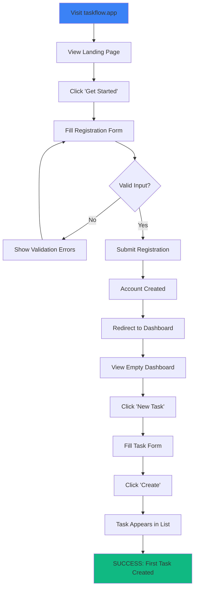
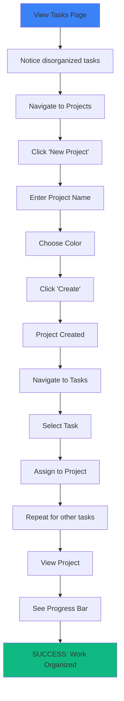
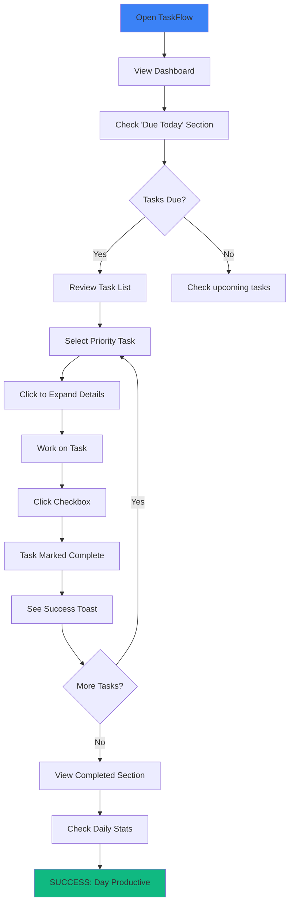
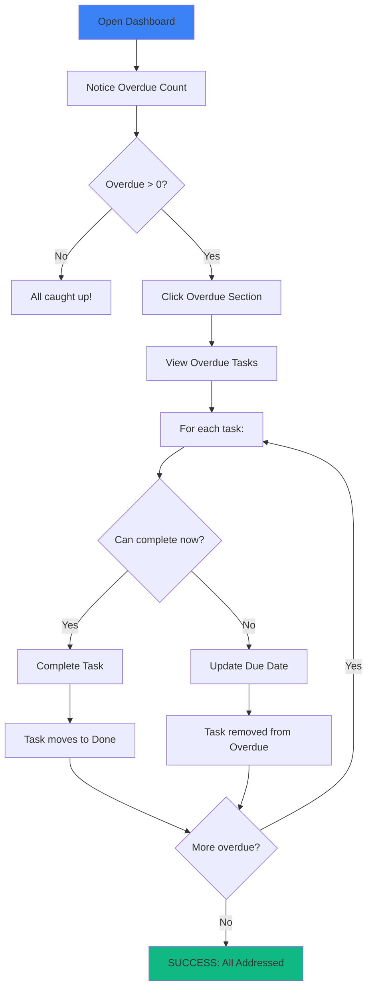
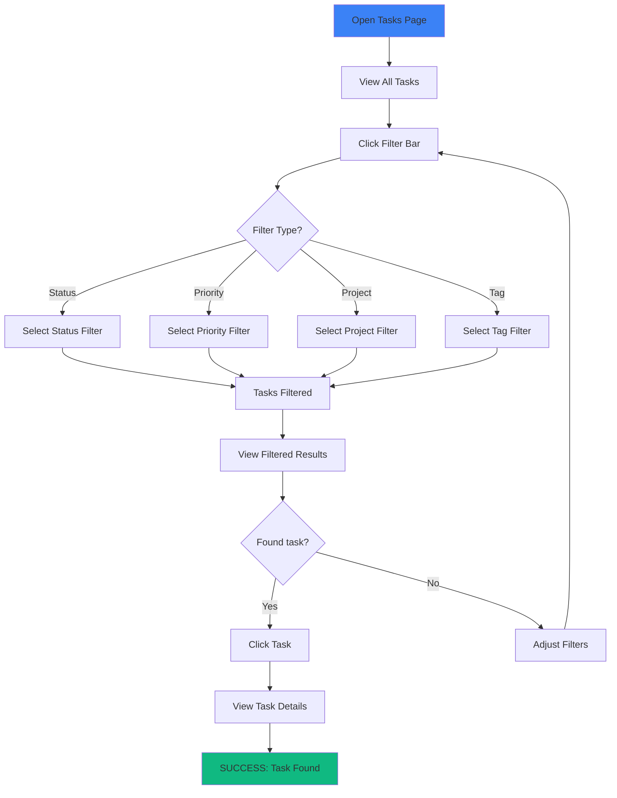
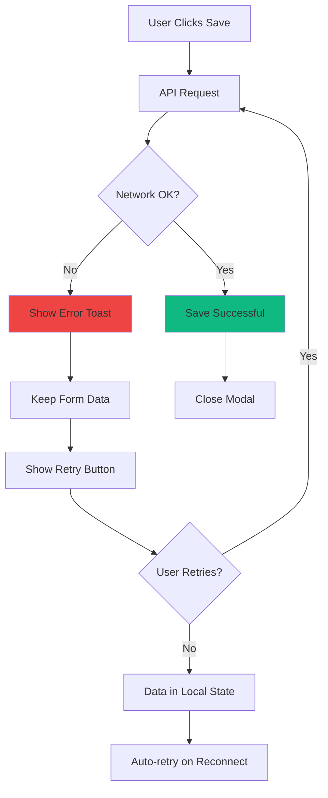
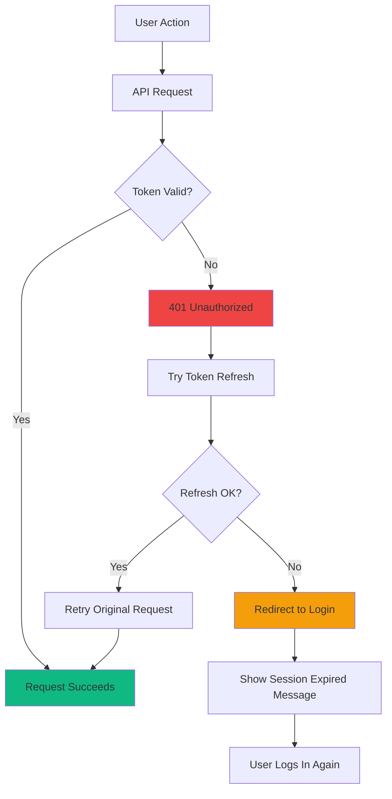

# TaskFlow User Journeys

## Overview

This document maps complete user journeys through TaskFlow, from entry to goal completion.

## Journey 1: New User Registration and First Task

### Persona: Alex the Freelancer

**Goal:** Sign up and create first task to track client work

### Journey Map

```
┌─────────────────────────────────────────────────────────────────────────────┐
│                     NEW USER REGISTRATION JOURNEY                            │
├─────────────────────────────────────────────────────────────────────────────┤
│                                                                              │
│  STAGE      AWARENESS     SIGNUP      ONBOARD     FIRST USE    VALUE        │
│  ─────      ─────────     ──────      ───────     ─────────    ─────        │
│                                                                              │
│  ACTIONS    Visit landing  Fill form   See dash   Create task  See task     │
│             page           Submit      Explore    Add details  in list      │
│             Read features  Confirm     UI         Set date                  │
│                                                                              │
│  THOUGHTS   "This looks    "Quick      "Clean     "Easy to     "I'm         │
│             simple"        signup"     design"    use"         organized"   │
│                                                                              │
│  EMOTIONS   😐 Curious     😊 Easy     😊 Pleased 😊 Confident 🎉 Success    │
│                                                                              │
│  PAIN       None           None        Where to   What fields  None         │
│  POINTS                                start?     are needed?               │
│                                                                              │
│  TOUCHPTS   Landing page   Register    Dashboard  Task modal   Task list    │
│             Hero section   form        Stats      Form fields  View         │
│                                                                              │
└─────────────────────────────────────────────────────────────────────────────┘
```

### Flow Diagram



### Step-by-Step Flow

| Step | Screen | Action | System Response |
|------|--------|--------|-----------------|
| 1 | Landing | Click "Get Started" | Navigate to /register |
| 2 | Register | Enter email | Validate format |
| 3 | Register | Enter password | Show strength indicator |
| 4 | Register | Confirm password | Validate match |
| 5 | Register | Enter name | Required field |
| 6 | Register | Click "Create Account" | Submit form |
| 7 | - | - | Create user, generate JWT |
| 8 | Dashboard | Auto-redirect | Show empty dashboard |
| 9 | Dashboard | Click "New Task" | Open task modal |
| 10 | Modal | Enter task title | Required field |
| 11 | Modal | Set due date (optional) | Date picker |
| 12 | Modal | Set priority (optional) | Dropdown |
| 13 | Modal | Click "Create" | POST /api/v1/tasks |
| 14 | Tasks | See task in list | Task card appears |

---

## Journey 2: Organize Work with Projects

### Persona: Sarah the Team Lead

**Goal:** Create a project to organize client deliverables

### Journey Map

```
┌─────────────────────────────────────────────────────────────────────────────┐
│                     PROJECT ORGANIZATION JOURNEY                             │
├─────────────────────────────────────────────────────────────────────────────┤
│                                                                              │
│  STAGE      NEED          CREATE      ASSIGN      TRACK        DELIVER      │
│  ─────      ────          ──────      ──────      ─────        ───────      │
│                                                                              │
│  ACTIONS    Have many     Create      Add tasks   View         Mark         │
│             unorganized   project     to project  progress     complete     │
│             tasks                                 bar                       │
│                                                                              │
│  THOUGHTS   "This is      "Simple     "Now it's   "I can see   "Project     │
│             chaos"        form"       grouped"    status"      done!"       │
│                                                                              │
│  EMOTIONS   😰 Stressed   😊 Easy     😌 Relief   😊 Informed  🎉 Success    │
│                                                                              │
│  PAIN       Too many      None        Existing    None         None         │
│  POINTS     loose tasks              tasks need                             │
│                                      reassign                               │
│                                                                              │
└─────────────────────────────────────────────────────────────────────────────┘
```

### Flow Diagram



---

## Journey 3: Daily Task Management

### Persona: Alex the Freelancer

**Goal:** Review and complete today's tasks

### Journey Map

```
┌─────────────────────────────────────────────────────────────────────────────┐
│                     DAILY TASK MANAGEMENT JOURNEY                            │
├─────────────────────────────────────────────────────────────────────────────┤
│                                                                              │
│  STAGE      REVIEW        PRIORITIZE   WORK        COMPLETE     END DAY     │
│  ─────      ──────        ──────────   ────        ────────     ───────     │
│                                                                              │
│  ACTIONS    Open app      Check        Start       Mark task    View        │
│             View dash     priorities   task        as done      completed   │
│             See due       Reorder      Work        Get toast    list        │
│             today         if needed                             Check stats │
│                                                                              │
│  THOUGHTS   "What's       "This one    "Let's      "One down,   "Good       │
│             due?"         first"       focus"      more to go"  progress"   │
│                                                                              │
│  EMOTIONS   😐 Focused    😊 Clear     😤 Working  🎉 Progress  😌 Satisfied │
│                                                                              │
└─────────────────────────────────────────────────────────────────────────────┘
```

### Flow Diagram



---

## Journey 4: Track Overdue Tasks

### Persona: Sarah the Team Lead

**Goal:** Identify and address overdue tasks

### Flow Diagram



---

## Journey 5: Filter and Find Tasks

### Flow Diagram



---

## Edge Cases and Error Flows

### Network Error During Save



### Session Expired



---

## Success Metrics per Journey

| Journey | Key Metric | Target |
|---------|-----------|--------|
| Registration | Completion rate | > 80% |
| First Task | Time to first task | < 2 minutes |
| Project Organization | Tasks with projects | > 60% |
| Daily Management | Daily active return | > 50% |
| Overdue Management | Overdue resolution time | < 24 hours |
| Search/Filter | Search success rate | > 90% |
