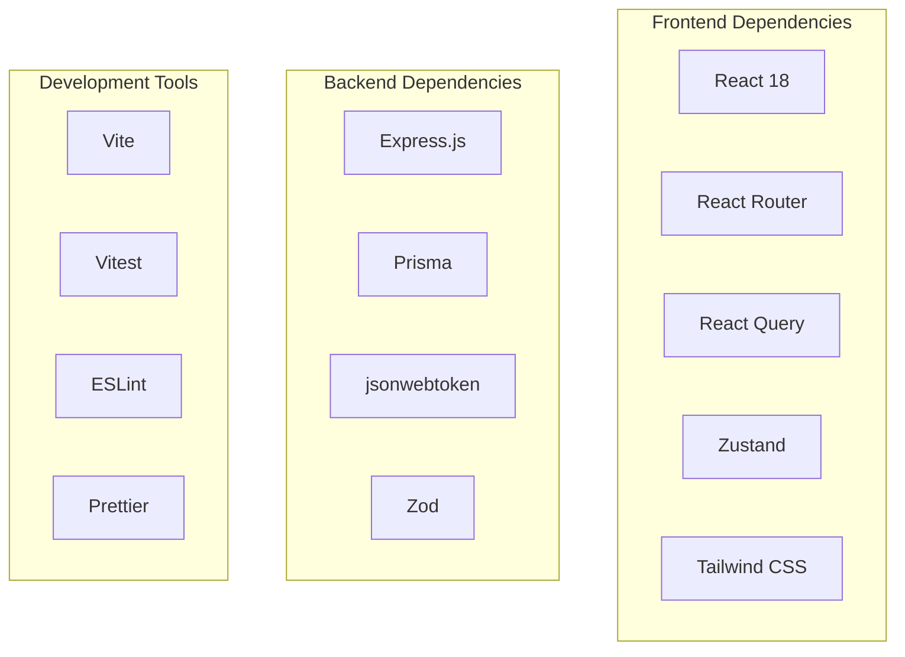

# TaskFlow Dependencies

## Overview

This document catalogs all dependencies used in TaskFlow, their purposes, and version management guidelines.

---

## Dependency Overview



---

## Production Dependencies

### Frontend

| Package | Version | Purpose | License |
|---------|---------|---------|---------|
| react | ^18.2.0 | UI library | MIT |
| react-dom | ^18.2.0 | React DOM renderer | MIT |
| react-router-dom | ^6.20.0 | Client-side routing | MIT |
| @tanstack/react-query | ^5.8.0 | Server state management | MIT |
| zustand | ^4.4.0 | Client state management | MIT |
| axios | ^1.6.0 | HTTP client | MIT |
| date-fns | ^2.30.0 | Date utilities | MIT |
| clsx | ^2.0.0 | Conditional classnames | MIT |
| lucide-react | ^0.294.0 | Icon library | ISC |
| @headlessui/react | ^1.7.0 | Unstyled UI components | MIT |

### Backend

| Package | Version | Purpose | License |
|---------|---------|---------|---------|
| express | ^4.18.0 | HTTP framework | MIT |
| @prisma/client | ^5.6.0 | Database client | Apache-2.0 |
| jsonwebtoken | ^9.0.0 | JWT handling | MIT |
| bcrypt | ^5.1.0 | Password hashing | MIT |
| zod | ^3.22.0 | Schema validation | MIT |
| cors | ^2.8.0 | CORS middleware | MIT |
| helmet | ^7.1.0 | Security headers | MIT |
| morgan | ^1.10.0 | HTTP logging | MIT |
| dotenv | ^16.3.0 | Environment variables | BSD-2 |

### Shared

| Package | Version | Purpose | License |
|---------|---------|---------|---------|
| typescript | ^5.3.0 | Type checking | Apache-2.0 |

---

## Development Dependencies

### Build Tools

| Package | Version | Purpose |
|---------|---------|---------|
| vite | ^5.0.0 | Frontend bundler |
| @vitejs/plugin-react | ^4.2.0 | React plugin for Vite |
| tsx | ^4.6.0 | TypeScript executor |
| concurrently | ^8.2.0 | Run multiple commands |
| nodemon | ^3.0.0 | Auto-restart server |

### Testing

| Package | Version | Purpose |
|---------|---------|---------|
| vitest | ^1.0.0 | Test runner |
| @testing-library/react | ^14.1.0 | React testing utilities |
| @testing-library/jest-dom | ^6.1.0 | DOM matchers |
| @playwright/test | ^1.40.0 | E2E testing |
| supertest | ^6.3.0 | HTTP assertions |
| msw | ^2.0.0 | API mocking |
| @faker-js/faker | ^8.3.0 | Test data generation |

### Code Quality

| Package | Version | Purpose |
|---------|---------|---------|
| eslint | ^8.55.0 | Linting |
| @typescript-eslint/eslint-plugin | ^6.13.0 | TypeScript ESLint |
| @typescript-eslint/parser | ^6.13.0 | TypeScript parser |
| eslint-plugin-react | ^7.33.0 | React linting |
| eslint-plugin-react-hooks | ^4.6.0 | Hooks linting |
| prettier | ^3.1.0 | Code formatting |
| eslint-config-prettier | ^9.1.0 | Prettier integration |
| husky | ^8.0.0 | Git hooks |
| lint-staged | ^15.1.0 | Staged file linting |

### Type Definitions

| Package | Version | Purpose |
|---------|---------|---------|
| @types/node | ^20.10.0 | Node.js types |
| @types/react | ^18.2.0 | React types |
| @types/react-dom | ^18.2.0 | React DOM types |
| @types/express | ^4.17.0 | Express types |
| @types/bcrypt | ^5.0.0 | Bcrypt types |
| @types/jsonwebtoken | ^9.0.0 | JWT types |

---

## Styling Dependencies

| Package | Version | Purpose |
|---------|---------|---------|
| tailwindcss | ^3.3.0 | Utility-first CSS |
| postcss | ^8.4.0 | CSS processing |
| autoprefixer | ^10.4.0 | Vendor prefixes |
| @tailwindcss/forms | ^0.5.0 | Form styling |
| @tailwindcss/typography | ^0.5.0 | Prose styling |

---

## Database

| Package | Version | Purpose |
|---------|---------|---------|
| prisma | ^5.6.0 | ORM CLI & migrations |
| @prisma/client | ^5.6.0 | Database client |

---

## package.json

```json
{
  "name": "taskflow",
  "version": "1.0.0",
  "private": true,
  "type": "module",
  "engines": {
    "node": ">=20.0.0",
    "npm": ">=10.0.0"
  },
  "scripts": {
    "dev": "concurrently \"npm:dev:backend\" \"npm:dev:frontend\"",
    "dev:backend": "tsx watch src/backend/server.ts",
    "dev:frontend": "vite",
    "build": "npm run build:backend && npm run build:frontend",
    "build:backend": "tsc -p tsconfig.backend.json",
    "build:frontend": "vite build",
    "start": "node dist/backend/server.js",
    "test": "vitest",
    "test:coverage": "vitest run --coverage",
    "test:e2e": "playwright test",
    "lint": "eslint . --ext .ts,.tsx",
    "format": "prettier --write .",
    "typecheck": "tsc --noEmit",
    "db:migrate": "prisma migrate dev",
    "db:seed": "prisma db seed",
    "prepare": "husky install"
  },
  "dependencies": {
    "@headlessui/react": "^1.7.0",
    "@prisma/client": "^5.6.0",
    "@tanstack/react-query": "^5.8.0",
    "axios": "^1.6.0",
    "bcrypt": "^5.1.0",
    "clsx": "^2.0.0",
    "cors": "^2.8.0",
    "date-fns": "^2.30.0",
    "dotenv": "^16.3.0",
    "express": "^4.18.0",
    "helmet": "^7.1.0",
    "jsonwebtoken": "^9.0.0",
    "lucide-react": "^0.294.0",
    "morgan": "^1.10.0",
    "react": "^18.2.0",
    "react-dom": "^18.2.0",
    "react-router-dom": "^6.20.0",
    "zod": "^3.22.0",
    "zustand": "^4.4.0"
  },
  "devDependencies": {
    "@faker-js/faker": "^8.3.0",
    "@playwright/test": "^1.40.0",
    "@tailwindcss/forms": "^0.5.0",
    "@tailwindcss/typography": "^0.5.0",
    "@testing-library/jest-dom": "^6.1.0",
    "@testing-library/react": "^14.1.0",
    "@types/bcrypt": "^5.0.0",
    "@types/express": "^4.17.0",
    "@types/jsonwebtoken": "^9.0.0",
    "@types/node": "^20.10.0",
    "@types/react": "^18.2.0",
    "@types/react-dom": "^18.2.0",
    "@typescript-eslint/eslint-plugin": "^6.13.0",
    "@typescript-eslint/parser": "^6.13.0",
    "@vitejs/plugin-react": "^4.2.0",
    "autoprefixer": "^10.4.0",
    "concurrently": "^8.2.0",
    "eslint": "^8.55.0",
    "eslint-config-prettier": "^9.1.0",
    "eslint-plugin-react": "^7.33.0",
    "eslint-plugin-react-hooks": "^4.6.0",
    "husky": "^8.0.0",
    "lint-staged": "^15.1.0",
    "msw": "^2.0.0",
    "postcss": "^8.4.0",
    "prettier": "^3.1.0",
    "prisma": "^5.6.0",
    "supertest": "^6.3.0",
    "tailwindcss": "^3.3.0",
    "tsx": "^4.6.0",
    "typescript": "^5.3.0",
    "vite": "^5.0.0",
    "vitest": "^1.0.0"
  },
  "prisma": {
    "seed": "tsx prisma/seed.ts"
  },
  "lint-staged": {
    "*.{ts,tsx}": [
      "eslint --fix",
      "prettier --write"
    ],
    "*.{json,md}": [
      "prettier --write"
    ]
  }
}
```

---

## Version Management

### Update Strategy

| Type | Frequency | Automation |
|------|-----------|------------|
| Patch (x.x.X) | Weekly | Dependabot |
| Minor (x.X.x) | Monthly | Manual review |
| Major (X.x.x) | Quarterly | Planned upgrade |

### Security Updates

```bash
# Check for vulnerabilities
npm audit

# Fix automatically
npm audit fix

# Fix with breaking changes (review first)
npm audit fix --force
```

### Dependabot Configuration

```yaml
# .github/dependabot.yml
version: 2
updates:
  - package-ecosystem: "npm"
    directory: "/"
    schedule:
      interval: "weekly"
    groups:
      production:
        patterns:
          - "*"
        exclude-patterns:
          - "@types/*"
          - "eslint*"
          - "prettier"
      dev:
        patterns:
          - "@types/*"
          - "eslint*"
          - "prettier"
```

---

## License Compliance

All dependencies use permissive licenses compatible with commercial use:

| License | Packages | Commercial Use |
|---------|----------|----------------|
| MIT | Most packages | Yes |
| Apache-2.0 | TypeScript, Prisma | Yes |
| BSD-2 | dotenv | Yes |
| ISC | lucide-react | Yes |

---

## Related Documents

- [Project Setup](./setup.md)
- [Coding Standards](./coding-standards.md)
- [Development Environment](../environments/development.md)
