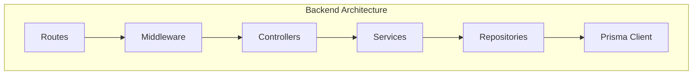
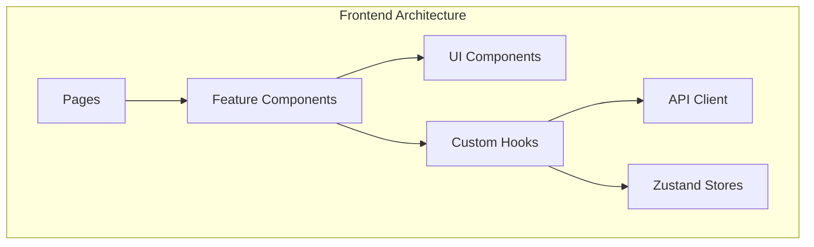

# TaskFlow Project Setup

## Overview

This document provides a comprehensive guide to the TaskFlow repository structure, build system, and project organization.

---

## Repository Structure

```
taskflow/
├── .github/                    # GitHub configuration
│   ├── workflows/              # CI/CD workflows
│   │   ├── ci.yml              # Main CI pipeline
│   │   ├── deploy-staging.yml  # Staging deployment
│   │   └── deploy-prod.yml     # Production deployment
│   ├── ISSUE_TEMPLATE/         # Issue templates
│   └── PULL_REQUEST_TEMPLATE.md
│
├── docs/                       # Documentation
│   ├── architecture/           # System architecture docs
│   ├── api/                    # API documentation
│   ├── workflows/              # Development workflows
│   └── ...
│
├── prisma/                     # Database
│   ├── schema.prisma           # Database schema
│   ├── migrations/             # Migration files
│   └── seed.ts                 # Seed data script
│
├── src/                        # Source code
│   ├── backend/                # Backend (Express.js)
│   │   ├── controllers/        # Request handlers
│   │   ├── services/           # Business logic
│   │   ├── repositories/       # Data access
│   │   ├── middleware/         # Express middleware
│   │   ├── routes/             # Route definitions
│   │   ├── types/              # TypeScript types
│   │   ├── utils/              # Utility functions
│   │   ├── config/             # Configuration
│   │   └── app.ts              # Express app setup
│   │
│   └── frontend/               # Frontend (React)
│       ├── components/         # React components
│       │   ├── ui/             # Base UI components
│       │   └── features/       # Feature components
│       ├── hooks/              # Custom React hooks
│       ├── stores/             # Zustand stores
│       ├── api/                # API client
│       ├── utils/              # Utility functions
│       ├── types/              # TypeScript types
│       ├── styles/             # Global styles
│       ├── App.tsx             # Root component
│       └── main.tsx            # Entry point
│
├── tests/                      # Test files
│   ├── unit/                   # Unit tests
│   ├── integration/            # Integration tests
│   ├── e2e/                    # E2E tests
│   ├── fixtures/               # Test fixtures
│   ├── factories/              # Test factories
│   └── setup/                  # Test setup
│
├── scripts/                    # Build/deploy scripts
│   ├── build.sh
│   ├── deploy.sh
│   └── seed-db.sh
│
├── docker/                     # Docker configuration
│   ├── Dockerfile.backend
│   ├── Dockerfile.frontend
│   └── docker-compose.yml
│
├── public/                     # Static assets
│   ├── images/
│   ├── icons/
│   └── fonts/
│
├── .env.example                # Environment template
├── .eslintrc.js                # ESLint config
├── .prettierrc                 # Prettier config
├── tsconfig.json               # TypeScript config
├── vite.config.ts              # Vite config
├── tailwind.config.js          # Tailwind config
├── package.json                # Dependencies
└── README.md                   # Project readme
```

---

## Key Files

### Configuration Files

| File | Purpose |
|------|---------|
| `package.json` | Dependencies and scripts |
| `tsconfig.json` | TypeScript configuration |
| `vite.config.ts` | Vite bundler configuration |
| `tailwind.config.js` | Tailwind CSS configuration |
| `.eslintrc.js` | Linting rules |
| `.prettierrc` | Code formatting rules |
| `prisma/schema.prisma` | Database schema |

### Entry Points

| File | Purpose |
|------|---------|
| `src/backend/server.ts` | Backend entry point |
| `src/frontend/main.tsx` | Frontend entry point |
| `prisma/seed.ts` | Database seeding |

---

## Build System

### Package Scripts

```json
{
  "scripts": {
    "dev": "concurrently \"npm:dev:backend\" \"npm:dev:frontend\"",
    "dev:backend": "tsx watch src/backend/server.ts",
    "dev:frontend": "vite",

    "build": "npm run build:backend && npm run build:frontend",
    "build:backend": "tsc -p tsconfig.backend.json",
    "build:frontend": "vite build",

    "start": "node dist/backend/server.js",
    "preview": "vite preview",

    "test": "vitest",
    "test:unit": "vitest run --project unit",
    "test:integration": "vitest run --project integration",
    "test:e2e": "playwright test",
    "test:coverage": "vitest run --coverage",

    "lint": "eslint . --ext .ts,.tsx",
    "lint:fix": "eslint . --ext .ts,.tsx --fix",
    "format": "prettier --write .",
    "typecheck": "tsc --noEmit",

    "db:migrate": "prisma migrate dev",
    "db:push": "prisma db push",
    "db:seed": "prisma db seed",
    "db:studio": "prisma studio"
  }
}
```

### Build Output

```
dist/
├── backend/                # Compiled backend
│   ├── server.js
│   ├── controllers/
│   ├── services/
│   └── ...
│
└── frontend/               # Built frontend
    ├── index.html
    ├── assets/
    │   ├── index-[hash].js
    │   ├── index-[hash].css
    │   └── ...
    └── ...
```

---

## TypeScript Configuration

### Base Configuration

```json
// tsconfig.json
{
  "compilerOptions": {
    "target": "ES2022",
    "lib": ["ES2022", "DOM", "DOM.Iterable"],
    "module": "ESNext",
    "moduleResolution": "bundler",
    "strict": true,
    "esModuleInterop": true,
    "skipLibCheck": true,
    "forceConsistentCasingInFileNames": true,
    "resolveJsonModule": true,
    "isolatedModules": true,
    "noEmit": true,
    "jsx": "react-jsx",
    "baseUrl": ".",
    "paths": {
      "@/*": ["src/*"],
      "@backend/*": ["src/backend/*"],
      "@frontend/*": ["src/frontend/*"],
      "@tests/*": ["tests/*"]
    }
  },
  "include": ["src/**/*", "tests/**/*"],
  "exclude": ["node_modules", "dist"]
}
```

### Backend Configuration

```json
// tsconfig.backend.json
{
  "extends": "./tsconfig.json",
  "compilerOptions": {
    "module": "CommonJS",
    "outDir": "dist/backend",
    "noEmit": false
  },
  "include": ["src/backend/**/*"]
}
```

---

## Vite Configuration

```typescript
// vite.config.ts
import { defineConfig } from 'vite';
import react from '@vitejs/plugin-react';
import path from 'path';

export default defineConfig({
  plugins: [react()],
  root: 'src/frontend',
  build: {
    outDir: '../../dist/frontend',
    emptyOutDir: true,
  },
  resolve: {
    alias: {
      '@': path.resolve(__dirname, 'src'),
      '@frontend': path.resolve(__dirname, 'src/frontend'),
    },
  },
  server: {
    port: 3000,
    proxy: {
      '/api': {
        target: 'http://localhost:3001',
        changeOrigin: true,
      },
    },
  },
});
```

---

## Quick Start

### Prerequisites

```bash
# Check Node.js version (v20+ required)
node --version

# Check npm version
npm --version

# Check PostgreSQL
psql --version
```

### Installation

```bash
# Clone repository
git clone https://github.com/your-org/taskflow.git
cd taskflow

# Install dependencies
npm install

# Setup environment
cp .env.example .env
# Edit .env with your settings

# Setup database
npm run db:migrate
npm run db:seed

# Start development
npm run dev
```

### Verify Setup

```bash
# Backend health check
curl http://localhost:3001/health

# Frontend
open http://localhost:3000
```

---

## Module Overview

### Backend Modules



| Module | Location | Purpose |
|--------|----------|---------|
| Routes | `src/backend/routes/` | HTTP route definitions |
| Middleware | `src/backend/middleware/` | Request processing |
| Controllers | `src/backend/controllers/` | Request handling |
| Services | `src/backend/services/` | Business logic |
| Repositories | `src/backend/repositories/` | Data access |

### Frontend Modules



| Module | Location | Purpose |
|--------|----------|---------|
| Pages | `src/frontend/pages/` | Page components |
| Features | `src/frontend/components/features/` | Feature-specific components |
| UI | `src/frontend/components/ui/` | Reusable UI components |
| Hooks | `src/frontend/hooks/` | Custom React hooks |
| Stores | `src/frontend/stores/` | State management |
| API | `src/frontend/api/` | API client |

---

## Related Documents

- [Development Environment](../environments/development.md)
- [Coding Standards](./coding-standards.md)
- [Dependencies](./dependencies.md)
