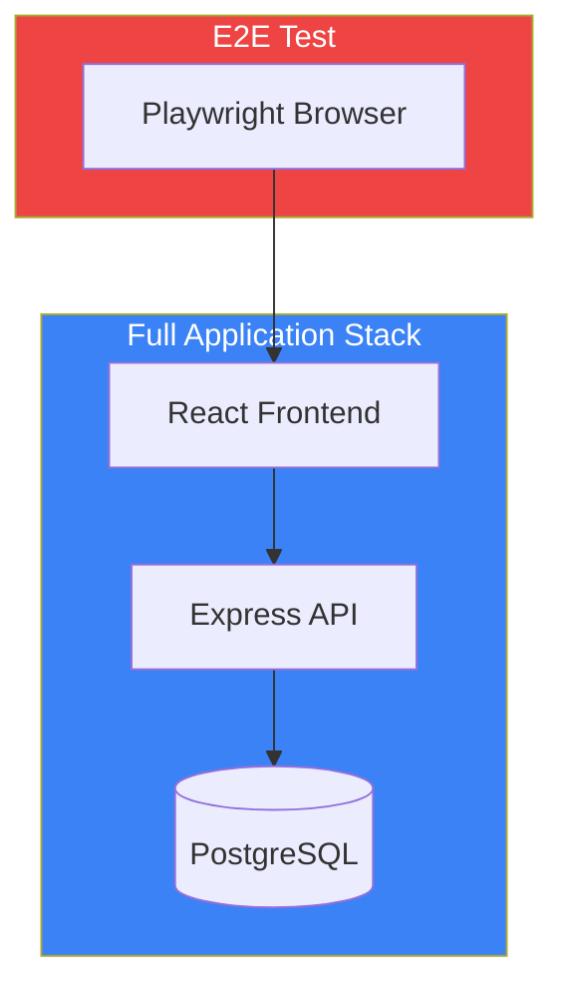

# TaskFlow E2E Testing Guide

## Overview

End-to-end (E2E) tests verify complete user workflows through the application, simulating real user interactions from the browser.

---

## E2E Test Architecture



---

## Setup

### Playwright Configuration

```typescript
// playwright.config.ts
import { defineConfig, devices } from '@playwright/test';

export default defineConfig({
  testDir: './tests/e2e',
  fullyParallel: true,
  forbidOnly: !!process.env.CI,
  retries: process.env.CI ? 2 : 0,
  workers: process.env.CI ? 1 : undefined,
  reporter: [
    ['html', { open: 'never' }],
    ['json', { outputFile: 'test-results/results.json' }],
  ],
  use: {
    baseURL: process.env.E2E_BASE_URL || 'http://localhost:3000',
    trace: 'on-first-retry',
    screenshot: 'only-on-failure',
  },
  projects: [
    {
      name: 'chromium',
      use: { ...devices['Desktop Chrome'] },
    },
    {
      name: 'firefox',
      use: { ...devices['Desktop Firefox'] },
    },
    {
      name: 'webkit',
      use: { ...devices['Desktop Safari'] },
    },
    {
      name: 'mobile',
      use: { ...devices['iPhone 13'] },
    },
  ],
  webServer: {
    command: 'npm run dev',
    url: 'http://localhost:3000',
    reuseExistingServer: !process.env.CI,
  },
});
```

### Test Fixtures

```typescript
// tests/e2e/fixtures/auth.ts
import { test as base, expect } from '@playwright/test';

interface TestUser {
  email: string;
  password: string;
  name: string;
}

type AuthFixtures = {
  testUser: TestUser;
  authenticatedPage: void;
};

export const test = base.extend<AuthFixtures>({
  testUser: async ({}, use) => {
    const user = {
      email: `test-${Date.now()}@example.com`,
      password: 'TestPassword123!',
      name: 'E2E Test User',
    };
    await use(user);
  },

  authenticatedPage: async ({ page, testUser }, use) => {
    // Register user
    await page.goto('/register');
    await page.fill('[data-testid="email"]', testUser.email);
    await page.fill('[data-testid="password"]', testUser.password);
    await page.fill('[data-testid="name"]', testUser.name);
    await page.click('[data-testid="submit"]');

    // Wait for redirect to dashboard
    await expect(page).toHaveURL('/dashboard');

    await use();
  },
});

export { expect } from '@playwright/test';
```

---

## Authentication Tests

```typescript
// tests/e2e/auth.spec.ts
import { test, expect } from './fixtures/auth';

test.describe('Authentication', () => {
  test.describe('Registration', () => {
    test('should register a new user', async ({ page, testUser }) => {
      // Navigate to registration
      await page.goto('/register');

      // Fill in form
      await page.fill('[data-testid="name"]', testUser.name);
      await page.fill('[data-testid="email"]', testUser.email);
      await page.fill('[data-testid="password"]', testUser.password);
      await page.fill('[data-testid="confirm-password"]', testUser.password);

      // Submit
      await page.click('[data-testid="submit"]');

      // Verify redirect and welcome message
      await expect(page).toHaveURL('/dashboard');
      await expect(page.getByText(`Welcome, ${testUser.name}`)).toBeVisible();
    });

    test('should show validation errors for invalid input', async ({ page }) => {
      await page.goto('/register');

      // Submit empty form
      await page.click('[data-testid="submit"]');

      // Check for validation errors
      await expect(page.getByText('Name is required')).toBeVisible();
      await expect(page.getByText('Email is required')).toBeVisible();
      await expect(page.getByText('Password is required')).toBeVisible();
    });

    test('should show error for duplicate email', async ({ page }) => {
      // First registration
      await page.goto('/register');
      await page.fill('[data-testid="name"]', 'First User');
      await page.fill('[data-testid="email"]', 'duplicate@example.com');
      await page.fill('[data-testid="password"]', 'Password123!');
      await page.fill('[data-testid="confirm-password"]', 'Password123!');
      await page.click('[data-testid="submit"]');
      await expect(page).toHaveURL('/dashboard');

      // Logout
      await page.click('[data-testid="logout"]');

      // Second registration with same email
      await page.goto('/register');
      await page.fill('[data-testid="name"]', 'Second User');
      await page.fill('[data-testid="email"]', 'duplicate@example.com');
      await page.fill('[data-testid="password"]', 'Password123!');
      await page.fill('[data-testid="confirm-password"]', 'Password123!');
      await page.click('[data-testid="submit"]');

      await expect(page.getByText('Email already exists')).toBeVisible();
    });
  });

  test.describe('Login', () => {
    test('should login with valid credentials', async ({ page, authenticatedPage }) => {
      // authenticatedPage fixture handles login
      await expect(page).toHaveURL('/dashboard');
    });

    test('should show error for invalid credentials', async ({ page }) => {
      await page.goto('/login');

      await page.fill('[data-testid="email"]', 'wrong@example.com');
      await page.fill('[data-testid="password"]', 'wrongpassword');
      await page.click('[data-testid="submit"]');

      await expect(page.getByText('Invalid email or password')).toBeVisible();
    });

    test('should redirect to requested page after login', async ({ page, testUser }) => {
      // Try to access protected page
      await page.goto('/tasks/new');

      // Should redirect to login
      await expect(page).toHaveURL('/login?redirect=/tasks/new');

      // Login
      await page.fill('[data-testid="email"]', testUser.email);
      await page.fill('[data-testid="password"]', testUser.password);
      await page.click('[data-testid="submit"]');

      // Should redirect to originally requested page
      await expect(page).toHaveURL('/tasks/new');
    });
  });

  test.describe('Logout', () => {
    test('should logout successfully', async ({ page, authenticatedPage }) => {
      await page.click('[data-testid="user-menu"]');
      await page.click('[data-testid="logout"]');

      await expect(page).toHaveURL('/login');

      // Verify cannot access protected route
      await page.goto('/dashboard');
      await expect(page).toHaveURL('/login');
    });
  });
});
```

---

## Task Management Tests

```typescript
// tests/e2e/tasks.spec.ts
import { test, expect } from './fixtures/auth';

test.describe('Task Management', () => {
  test.beforeEach(async ({ authenticatedPage }) => {
    // Ensures user is logged in
  });

  test.describe('Create Task', () => {
    test('should create a new task', async ({ page }) => {
      // Navigate to new task page
      await page.click('[data-testid="create-task-btn"]');
      await expect(page).toHaveURL('/tasks/new');

      // Fill in task details
      await page.fill('[data-testid="task-title"]', 'E2E Test Task');
      await page.fill('[data-testid="task-description"]', 'This is a test task');
      await page.selectOption('[data-testid="task-priority"]', 'high');

      // Set due date
      await page.fill('[data-testid="task-due-date"]', '2024-01-20');

      // Submit
      await page.click('[data-testid="submit-task"]');

      // Verify task was created
      await expect(page).toHaveURL('/tasks');
      await expect(page.getByText('E2E Test Task')).toBeVisible();
      await expect(page.getByText('High')).toBeVisible();
    });

    test('should show validation error for empty title', async ({ page }) => {
      await page.goto('/tasks/new');
      await page.click('[data-testid="submit-task"]');

      await expect(page.getByText('Title is required')).toBeVisible();
    });
  });

  test.describe('Task List', () => {
    test('should display tasks in list', async ({ page }) => {
      // Create some tasks first
      for (const title of ['Task 1', 'Task 2', 'Task 3']) {
        await page.goto('/tasks/new');
        await page.fill('[data-testid="task-title"]', title);
        await page.click('[data-testid="submit-task"]');
      }

      // Navigate to task list
      await page.goto('/tasks');

      // Verify all tasks are visible
      await expect(page.getByText('Task 1')).toBeVisible();
      await expect(page.getByText('Task 2')).toBeVisible();
      await expect(page.getByText('Task 3')).toBeVisible();
    });

    test('should filter tasks by status', async ({ page }) => {
      // Create tasks with different statuses
      await page.goto('/tasks/new');
      await page.fill('[data-testid="task-title"]', 'Pending Task');
      await page.click('[data-testid="submit-task"]');

      await page.goto('/tasks/new');
      await page.fill('[data-testid="task-title"]', 'Completed Task');
      await page.click('[data-testid="submit-task"]');

      // Mark second task as complete
      await page.goto('/tasks');
      const completedTask = page.locator('[data-testid="task-card"]', {
        hasText: 'Completed Task',
      });
      await completedTask.locator('[data-testid="complete-checkbox"]').click();

      // Filter by pending
      await page.click('[data-testid="filter-status"]');
      await page.click('[data-testid="status-pending"]');

      // Verify only pending task is visible
      await expect(page.getByText('Pending Task')).toBeVisible();
      await expect(page.getByText('Completed Task')).not.toBeVisible();
    });

    test('should search tasks', async ({ page }) => {
      // Create tasks
      await page.goto('/tasks/new');
      await page.fill('[data-testid="task-title"]', 'Buy groceries');
      await page.click('[data-testid="submit-task"]');

      await page.goto('/tasks/new');
      await page.fill('[data-testid="task-title"]', 'Call dentist');
      await page.click('[data-testid="submit-task"]');

      // Search
      await page.goto('/tasks');
      await page.fill('[data-testid="search-input"]', 'groceries');

      // Verify search results
      await expect(page.getByText('Buy groceries')).toBeVisible();
      await expect(page.getByText('Call dentist')).not.toBeVisible();
    });
  });

  test.describe('Edit Task', () => {
    test('should edit an existing task', async ({ page }) => {
      // Create a task
      await page.goto('/tasks/new');
      await page.fill('[data-testid="task-title"]', 'Original Title');
      await page.click('[data-testid="submit-task"]');

      // Open task for editing
      await page.click('[data-testid="task-card"]');
      await page.click('[data-testid="edit-task"]');

      // Update task
      await page.fill('[data-testid="task-title"]', 'Updated Title');
      await page.selectOption('[data-testid="task-priority"]', 'low');
      await page.click('[data-testid="submit-task"]');

      // Verify updates
      await expect(page.getByText('Updated Title')).toBeVisible();
      await expect(page.getByText('Low')).toBeVisible();
    });
  });

  test.describe('Delete Task', () => {
    test('should delete a task with confirmation', async ({ page }) => {
      // Create a task
      await page.goto('/tasks/new');
      await page.fill('[data-testid="task-title"]', 'Task to Delete');
      await page.click('[data-testid="submit-task"]');

      // Delete task
      await page.goto('/tasks');
      const taskCard = page.locator('[data-testid="task-card"]', {
        hasText: 'Task to Delete',
      });
      await taskCard.locator('[data-testid="delete-task"]').click();

      // Confirm deletion
      await page.click('[data-testid="confirm-delete"]');

      // Verify task is removed
      await expect(page.getByText('Task to Delete')).not.toBeVisible();
      await expect(page.getByText('Task deleted')).toBeVisible();
    });

    test('should cancel deletion', async ({ page }) => {
      // Create a task
      await page.goto('/tasks/new');
      await page.fill('[data-testid="task-title"]', 'Keep This Task');
      await page.click('[data-testid="submit-task"]');

      // Attempt delete
      await page.goto('/tasks');
      const taskCard = page.locator('[data-testid="task-card"]', {
        hasText: 'Keep This Task',
      });
      await taskCard.locator('[data-testid="delete-task"]').click();

      // Cancel
      await page.click('[data-testid="cancel-delete"]');

      // Task should still exist
      await expect(page.getByText('Keep This Task')).toBeVisible();
    });
  });

  test.describe('Complete Task', () => {
    test('should mark task as complete', async ({ page }) => {
      // Create a task
      await page.goto('/tasks/new');
      await page.fill('[data-testid="task-title"]', 'Task to Complete');
      await page.click('[data-testid="submit-task"]');

      // Complete task
      await page.goto('/tasks');
      const taskCard = page.locator('[data-testid="task-card"]', {
        hasText: 'Task to Complete',
      });
      await taskCard.locator('[data-testid="complete-checkbox"]').click();

      // Verify completion
      await expect(taskCard).toHaveClass(/completed/);
      await expect(page.getByText('Task completed')).toBeVisible();
    });
  });
});
```

---

## Page Object Model

```typescript
// tests/e2e/pages/TasksPage.ts
import { Page, Locator, expect } from '@playwright/test';

export class TasksPage {
  readonly page: Page;
  readonly createTaskBtn: Locator;
  readonly taskList: Locator;
  readonly searchInput: Locator;
  readonly filterStatus: Locator;

  constructor(page: Page) {
    this.page = page;
    this.createTaskBtn = page.getByTestId('create-task-btn');
    this.taskList = page.getByTestId('task-list');
    this.searchInput = page.getByTestId('search-input');
    this.filterStatus = page.getByTestId('filter-status');
  }

  async goto() {
    await this.page.goto('/tasks');
  }

  async createTask(title: string, options: { priority?: string; description?: string } = {}) {
    await this.createTaskBtn.click();
    await this.page.fill('[data-testid="task-title"]', title);

    if (options.description) {
      await this.page.fill('[data-testid="task-description"]', options.description);
    }

    if (options.priority) {
      await this.page.selectOption('[data-testid="task-priority"]', options.priority);
    }

    await this.page.click('[data-testid="submit-task"]');
  }

  async search(query: string) {
    await this.searchInput.fill(query);
  }

  async filterByStatus(status: 'all' | 'pending' | 'completed') {
    await this.filterStatus.click();
    await this.page.click(`[data-testid="status-${status}"]`);
  }

  getTaskCard(title: string): Locator {
    return this.page.locator('[data-testid="task-card"]', { hasText: title });
  }

  async completeTask(title: string) {
    const card = this.getTaskCard(title);
    await card.locator('[data-testid="complete-checkbox"]').click();
  }

  async deleteTask(title: string) {
    const card = this.getTaskCard(title);
    await card.locator('[data-testid="delete-task"]').click();
    await this.page.click('[data-testid="confirm-delete"]');
  }
}
```

---

## Running E2E Tests

```bash
# Run all E2E tests
npm run test:e2e

# Run specific browser
npm run test:e2e -- --project=chromium

# Run specific test file
npm run test:e2e -- tests/e2e/auth.spec.ts

# Run in headed mode (visible browser)
npm run test:e2e -- --headed

# Run in debug mode
npm run test:e2e -- --debug

# Generate report
npm run test:e2e -- --reporter=html

# Update snapshots
npm run test:e2e -- --update-snapshots
```

---

## Related Documents

- [Testing Strategy](./strategy.md)
- [Unit Tests](./unit-tests.md)
- [Integration Tests](./integration-tests.md)
