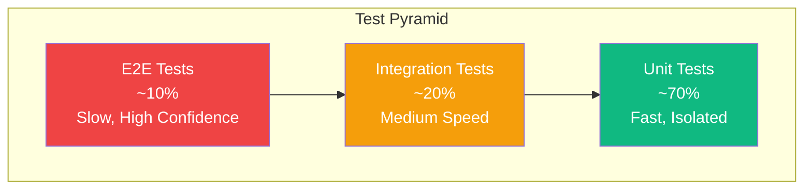
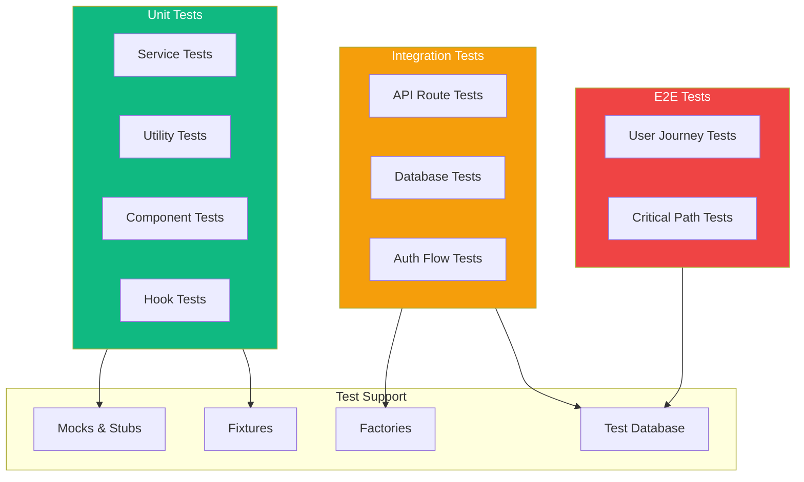
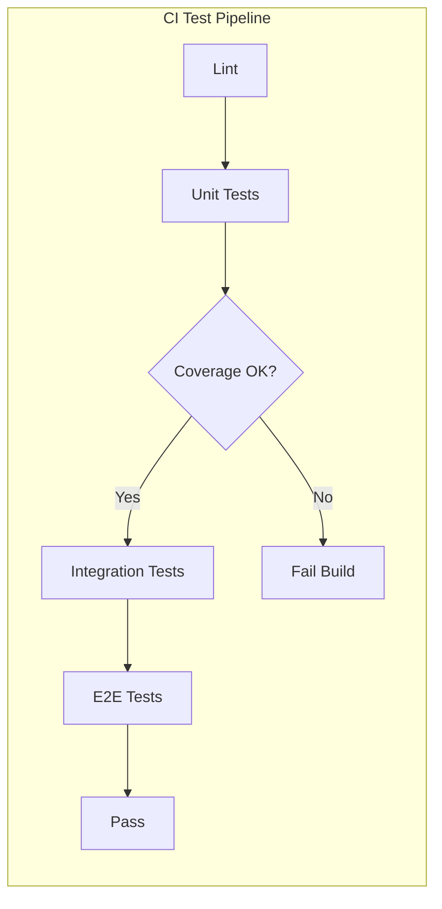
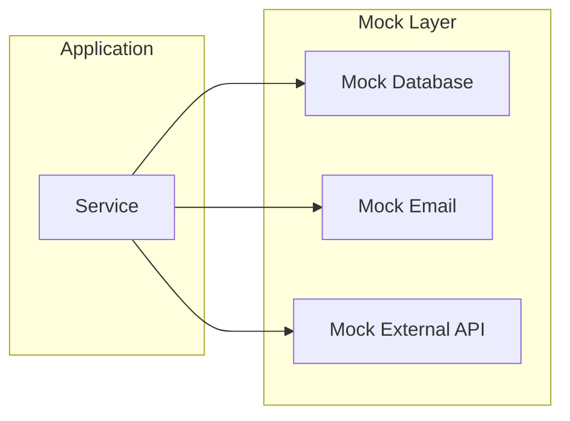

# TaskFlow Testing Strategy

## Overview

This document outlines the comprehensive testing strategy for TaskFlow, including the test pyramid, coverage goals, and testing responsibilities.

---

## Test Pyramid



---

## Testing Levels

### Level 1: Unit Tests (70%)

```
Purpose: Test individual functions and components in isolation
Speed: Fast (< 5 seconds per test)
Isolation: Mocked dependencies
Runner: Vitest

Coverage Targets:
├── Services: 90%
├── Utils: 95%
├── Hooks: 80%
├── Components: 70%
└── Overall: 80%
```

### Level 2: Integration Tests (20%)

```
Purpose: Test API endpoints and component interactions
Speed: Medium (< 30 seconds per test)
Isolation: Real database (test container)
Runner: Vitest + Supertest

Coverage Targets:
├── API Routes: 100%
├── Middleware: 90%
├── Database Operations: 85%
└── Component Integration: 70%
```

### Level 3: E2E Tests (10%)

```
Purpose: Test complete user workflows
Speed: Slow (< 2 minutes per test)
Isolation: Full stack (staging or local)
Runner: Playwright

Coverage Targets:
├── Critical Paths: 100%
├── Happy Paths: 90%
├── Error Paths: 50%
└── Edge Cases: 30%
```

---

## Test Architecture



---

## Coverage Requirements

### By Component

| Component | Minimum | Target | Critical |
|-----------|---------|--------|----------|
| Backend Services | 80% | 90% | Yes |
| Backend Controllers | 70% | 85% | Yes |
| Backend Repositories | 85% | 95% | Yes |
| Frontend Components | 60% | 75% | No |
| Frontend Hooks | 75% | 85% | Yes |
| Utilities | 90% | 95% | Yes |

### By Type

| Metric | Minimum |
|--------|---------|
| Line Coverage | 70% |
| Branch Coverage | 65% |
| Function Coverage | 75% |
| Statement Coverage | 70% |

---

## Testing Tools

### Backend

| Tool | Purpose | Version |
|------|---------|---------|
| Vitest | Test runner | 1.x |
| Supertest | HTTP assertions | 6.x |
| Prisma | Test database | 5.x |
| Faker | Test data | 8.x |
| MSW | API mocking | 2.x |

### Frontend

| Tool | Purpose | Version |
|------|---------|---------|
| Vitest | Test runner | 1.x |
| React Testing Library | Component testing | 14.x |
| MSW | API mocking | 2.x |
| Playwright | E2E testing | 1.x |
| Storybook | Component development | 7.x |

---

## Test Organization

### Directory Structure

```
tests/
├── unit/
│   ├── backend/
│   │   ├── services/
│   │   │   └── taskService.test.ts
│   │   ├── controllers/
│   │   │   └── taskController.test.ts
│   │   └── utils/
│   │       └── validation.test.ts
│   └── frontend/
│       ├── components/
│       │   └── TaskCard.test.tsx
│       └── hooks/
│           └── useTask.test.ts
├── integration/
│   ├── api/
│   │   ├── auth.test.ts
│   │   ├── tasks.test.ts
│   │   └── projects.test.ts
│   └── database/
│       └── taskRepository.test.ts
├── e2e/
│   ├── auth.spec.ts
│   ├── tasks.spec.ts
│   └── projects.spec.ts
├── fixtures/
│   ├── users.ts
│   ├── tasks.ts
│   └── projects.ts
├── factories/
│   ├── userFactory.ts
│   └── taskFactory.ts
└── setup/
    ├── vitest.setup.ts
    ├── playwright.config.ts
    └── testDatabase.ts
```

---

## Test Execution

### Running Tests

```bash
# All tests
npm test

# Unit tests only
npm run test:unit

# Integration tests only
npm run test:integration

# E2E tests only
npm run test:e2e

# With coverage
npm run test:coverage

# Watch mode
npm run test:watch

# Specific file
npm test -- taskService.test.ts
```

### CI Pipeline



---

## Test Data Management

### Fixtures

```typescript
// tests/fixtures/tasks.ts
export const taskFixtures = {
  pendingTask: {
    id: 'task_pending_001',
    title: 'Pending Task',
    status: 'pending',
    priority: 'medium',
  },
  completedTask: {
    id: 'task_completed_001',
    title: 'Completed Task',
    status: 'completed',
    priority: 'low',
  },
  urgentTask: {
    id: 'task_urgent_001',
    title: 'Urgent Task',
    status: 'pending',
    priority: 'high',
    dueDate: new Date(Date.now() + 86400000), // Tomorrow
  },
};
```

### Factories

```typescript
// tests/factories/taskFactory.ts
import { faker } from '@faker-js/faker';

export function createTask(overrides = {}) {
  return {
    id: `task_${faker.string.alphanumeric(8)}`,
    title: faker.lorem.sentence(),
    description: faker.lorem.paragraph(),
    status: faker.helpers.arrayElement(['pending', 'in_progress', 'completed']),
    priority: faker.helpers.arrayElement(['low', 'medium', 'high']),
    dueDate: faker.date.future(),
    createdAt: faker.date.past(),
    updatedAt: new Date(),
    ...overrides,
  };
}

export function createTasks(count: number, overrides = {}) {
  return Array.from({ length: count }, () => createTask(overrides));
}
```

---

## Mocking Strategy

### External Services



### MSW Handlers

```typescript
// tests/mocks/handlers.ts
import { http, HttpResponse } from 'msw';

export const handlers = [
  http.get('/api/v1/tasks', () => {
    return HttpResponse.json({
      success: true,
      data: {
        tasks: [
          { id: 'task_1', title: 'Test Task 1' },
          { id: 'task_2', title: 'Test Task 2' },
        ],
      },
    });
  }),

  http.post('/api/v1/tasks', async ({ request }) => {
    const body = await request.json();
    return HttpResponse.json({
      success: true,
      data: {
        id: 'task_new',
        ...body,
      },
    }, { status: 201 });
  }),
];
```

---

## Quality Gates

### Pre-Commit

```yaml
# .husky/pre-commit
#!/bin/sh
npm run lint-staged
npm run typecheck
npm run test:unit -- --changed
```

### Pull Request

```yaml
requirements:
  - lint: pass
  - typecheck: pass
  - unit_tests: pass
  - integration_tests: pass
  - coverage: >= 70%
```

### Release

```yaml
requirements:
  - all_tests: pass
  - e2e_tests: pass
  - coverage: >= 75%
  - no_critical_bugs: true
```

---

## Test Reporting

### Coverage Report

```
┌─────────────────────────────────────────────────────────────────┐
│                    TEST COVERAGE REPORT                          │
├─────────────────────────────────────────────────────────────────┤
│                                                                  │
│  Overall Coverage: 78.5% ████████████████░░░░                   │
│                                                                  │
│  By Category:                                                    │
│  ├── Statements:  79.2% ████████████████░░░░                    │
│  ├── Branches:    72.1% ██████████████░░░░░░                    │
│  ├── Functions:   81.4% ████████████████░░░░                    │
│  └── Lines:       78.9% ████████████████░░░░                    │
│                                                                  │
│  By Module:                                                      │
│  ├── services/    92.1% ██████████████████░░                    │
│  ├── controllers/ 85.3% █████████████████░░░                    │
│  ├── components/  71.2% ██████████████░░░░░░                    │
│  ├── hooks/       78.4% ████████████████░░░░                    │
│  └── utils/       95.0% ███████████████████░                    │
│                                                                  │
│  Tests: 245 passed, 0 failed                                    │
│  Duration: 12.4s                                                 │
│                                                                  │
└─────────────────────────────────────────────────────────────────┘
```

---

## Best Practices

### Writing Tests

```markdown
1. **Arrange-Act-Assert** (AAA) pattern
2. **One assertion per test** when possible
3. **Descriptive test names** that explain behavior
4. **Test behavior, not implementation**
5. **Keep tests independent** and isolated
6. **Use meaningful test data**
```

### Test Naming

```typescript
// Good: Describes behavior
it('should return 404 when task does not exist', () => {});
it('should create task with valid data', () => {});
it('should reject empty title', () => {});

// Bad: Vague or implementation-focused
it('should work', () => {});
it('test createTask function', () => {});
it('should call repository.save', () => {});
```

---

## Related Documents

- [Unit Tests](./unit-tests.md)
- [Integration Tests](./integration-tests.md)
- [E2E Tests](./e2e-tests.md)
- [Test Data](./test-data.md)
