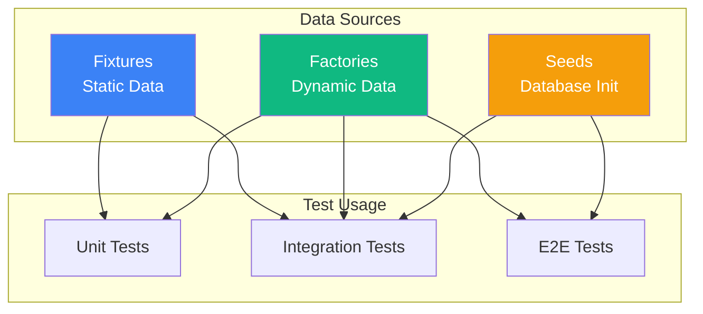

# TaskFlow Test Data Management

## Overview

This document covers strategies for creating, managing, and maintaining test data including fixtures, factories, and seed data.

---

## Test Data Architecture



---

## Fixtures

### User Fixtures

```typescript
// tests/fixtures/users.ts
import { User } from '@prisma/client';

export const userFixtures = {
  // Standard test user
  testUser: {
    id: 'user_test_001',
    email: 'test@example.com',
    name: 'Test User',
    password: '$2b$10$hashhashhash', // "password123"
    createdAt: new Date('2024-01-01'),
    updatedAt: new Date('2024-01-01'),
  } as User,

  // Admin user
  adminUser: {
    id: 'user_admin_001',
    email: 'admin@example.com',
    name: 'Admin User',
    password: '$2b$10$hashhashhash',
    role: 'admin',
    createdAt: new Date('2024-01-01'),
    updatedAt: new Date('2024-01-01'),
  } as User,

  // Unverified user
  unverifiedUser: {
    id: 'user_unverified_001',
    email: 'unverified@example.com',
    name: 'Unverified User',
    password: '$2b$10$hashhashhash',
    emailVerified: false,
    createdAt: new Date('2024-01-01'),
    updatedAt: new Date('2024-01-01'),
  } as User,
};

// Pre-hashed passwords for testing
export const testPasswords = {
  default: 'TestPassword123!',
  admin: 'AdminPassword123!',
};
```

### Task Fixtures

```typescript
// tests/fixtures/tasks.ts
import { Task, TaskStatus, TaskPriority } from '@prisma/client';
import { userFixtures } from './users';

export const taskFixtures = {
  // Basic pending task
  pendingTask: {
    id: 'task_pending_001',
    title: 'Pending Task',
    description: 'A task that is pending',
    status: 'pending' as TaskStatus,
    priority: 'medium' as TaskPriority,
    userId: userFixtures.testUser.id,
    createdAt: new Date('2024-01-15'),
    updatedAt: new Date('2024-01-15'),
  } as Task,

  // In progress task
  inProgressTask: {
    id: 'task_progress_001',
    title: 'In Progress Task',
    description: 'A task being worked on',
    status: 'in_progress' as TaskStatus,
    priority: 'high' as TaskPriority,
    userId: userFixtures.testUser.id,
    createdAt: new Date('2024-01-10'),
    updatedAt: new Date('2024-01-15'),
  } as Task,

  // Completed task
  completedTask: {
    id: 'task_completed_001',
    title: 'Completed Task',
    description: 'A finished task',
    status: 'completed' as TaskStatus,
    priority: 'low' as TaskPriority,
    userId: userFixtures.testUser.id,
    completedAt: new Date('2024-01-14'),
    createdAt: new Date('2024-01-01'),
    updatedAt: new Date('2024-01-14'),
  } as Task,

  // Overdue task
  overdueTask: {
    id: 'task_overdue_001',
    title: 'Overdue Task',
    description: 'A task past its due date',
    status: 'pending' as TaskStatus,
    priority: 'high' as TaskPriority,
    dueDate: new Date(Date.now() - 86400000), // Yesterday
    userId: userFixtures.testUser.id,
    createdAt: new Date('2024-01-01'),
    updatedAt: new Date('2024-01-01'),
  } as Task,

  // Task with labels
  labeledTask: {
    id: 'task_labeled_001',
    title: 'Labeled Task',
    description: 'A task with labels',
    status: 'pending' as TaskStatus,
    priority: 'medium' as TaskPriority,
    userId: userFixtures.testUser.id,
    labels: ['urgent', 'feature'],
    createdAt: new Date('2024-01-15'),
    updatedAt: new Date('2024-01-15'),
  } as Task,
};
```

### Project Fixtures

```typescript
// tests/fixtures/projects.ts
import { Project } from '@prisma/client';
import { userFixtures } from './users';

export const projectFixtures = {
  defaultProject: {
    id: 'proj_default_001',
    name: 'Default Project',
    description: 'The default project for testing',
    color: '#3b82f6',
    userId: userFixtures.testUser.id,
    createdAt: new Date('2024-01-01'),
    updatedAt: new Date('2024-01-01'),
  } as Project,

  workProject: {
    id: 'proj_work_001',
    name: 'Work',
    description: 'Work-related tasks',
    color: '#10b981',
    userId: userFixtures.testUser.id,
    createdAt: new Date('2024-01-01'),
    updatedAt: new Date('2024-01-01'),
  } as Project,

  personalProject: {
    id: 'proj_personal_001',
    name: 'Personal',
    description: 'Personal tasks',
    color: '#f59e0b',
    userId: userFixtures.testUser.id,
    createdAt: new Date('2024-01-01'),
    updatedAt: new Date('2024-01-01'),
  } as Project,
};
```

---

## Factories

### Base Factory

```typescript
// tests/factories/baseFactory.ts
import { faker } from '@faker-js/faker';

export function generateId(prefix: string): string {
  return `${prefix}_${faker.string.alphanumeric(8)}`;
}

export function generateTimestamps() {
  const createdAt = faker.date.past();
  return {
    createdAt,
    updatedAt: faker.date.between({ from: createdAt, to: new Date() }),
  };
}
```

### User Factory

```typescript
// tests/factories/userFactory.ts
import { faker } from '@faker-js/faker';
import { User } from '@prisma/client';
import { generateId, generateTimestamps } from './baseFactory';
import bcrypt from 'bcrypt';

interface CreateUserOptions {
  id?: string;
  email?: string;
  name?: string;
  password?: string;
  role?: 'user' | 'admin';
  emailVerified?: boolean;
}

export function createUser(options: CreateUserOptions = {}): User {
  const timestamps = generateTimestamps();

  return {
    id: options.id || generateId('user'),
    email: options.email || faker.internet.email(),
    name: options.name || faker.person.fullName(),
    password: options.password || '$2b$10$defaulthash',
    role: options.role || 'user',
    emailVerified: options.emailVerified ?? true,
    avatar: faker.image.avatar(),
    ...timestamps,
  } as User;
}

export async function createUserWithHashedPassword(
  options: CreateUserOptions = {}
): Promise<User> {
  const plainPassword = options.password || 'TestPassword123!';
  const hashedPassword = await bcrypt.hash(plainPassword, 10);

  return createUser({
    ...options,
    password: hashedPassword,
  });
}

export function createUsers(count: number, options: CreateUserOptions = {}): User[] {
  return Array.from({ length: count }, () => createUser(options));
}
```

### Task Factory

```typescript
// tests/factories/taskFactory.ts
import { faker } from '@faker-js/faker';
import { Task, TaskStatus, TaskPriority } from '@prisma/client';
import { generateId, generateTimestamps } from './baseFactory';

interface CreateTaskOptions {
  id?: string;
  title?: string;
  description?: string;
  status?: TaskStatus;
  priority?: TaskPriority;
  dueDate?: Date | null;
  userId?: string;
  projectId?: string | null;
  completedAt?: Date | null;
}

export function createTask(options: CreateTaskOptions = {}): Task {
  const timestamps = generateTimestamps();
  const status = options.status || faker.helpers.arrayElement(['pending', 'in_progress', 'completed']);

  return {
    id: options.id || generateId('task'),
    title: options.title || faker.lorem.sentence({ min: 3, max: 8 }),
    description: options.description ?? faker.lorem.paragraph(),
    status: status as TaskStatus,
    priority: options.priority || faker.helpers.arrayElement(['low', 'medium', 'high']),
    dueDate: options.dueDate ?? (Math.random() > 0.5 ? faker.date.future() : null),
    userId: options.userId || generateId('user'),
    projectId: options.projectId ?? null,
    completedAt: status === 'completed' ? (options.completedAt || faker.date.recent()) : null,
    ...timestamps,
  } as Task;
}

export function createTasks(count: number, options: CreateTaskOptions = {}): Task[] {
  return Array.from({ length: count }, () => createTask(options));
}

// Specialized task creators
export function createPendingTask(options: CreateTaskOptions = {}): Task {
  return createTask({ ...options, status: 'pending' });
}

export function createCompletedTask(options: CreateTaskOptions = {}): Task {
  return createTask({
    ...options,
    status: 'completed',
    completedAt: options.completedAt || new Date(),
  });
}

export function createOverdueTask(options: CreateTaskOptions = {}): Task {
  return createTask({
    ...options,
    status: 'pending',
    dueDate: faker.date.past(),
  });
}

export function createUrgentTask(options: CreateTaskOptions = {}): Task {
  return createTask({
    ...options,
    priority: 'high',
    dueDate: faker.date.soon({ days: 2 }),
  });
}
```

### Project Factory

```typescript
// tests/factories/projectFactory.ts
import { faker } from '@faker-js/faker';
import { Project } from '@prisma/client';
import { generateId, generateTimestamps } from './baseFactory';

interface CreateProjectOptions {
  id?: string;
  name?: string;
  description?: string;
  color?: string;
  userId?: string;
}

const projectColors = [
  '#3b82f6', '#10b981', '#f59e0b', '#ef4444',
  '#8b5cf6', '#06b6d4', '#ec4899', '#84cc16',
];

export function createProject(options: CreateProjectOptions = {}): Project {
  const timestamps = generateTimestamps();

  return {
    id: options.id || generateId('proj'),
    name: options.name || faker.commerce.department(),
    description: options.description ?? faker.lorem.sentence(),
    color: options.color || faker.helpers.arrayElement(projectColors),
    userId: options.userId || generateId('user'),
    ...timestamps,
  } as Project;
}

export function createProjects(count: number, options: CreateProjectOptions = {}): Project[] {
  return Array.from({ length: count }, () => createProject(options));
}
```

---

## Database Seeds

### Seed Script

```typescript
// prisma/seed.ts
import { PrismaClient } from '@prisma/client';
import bcrypt from 'bcrypt';
import { createTasks } from '../tests/factories/taskFactory';
import { createProjects } from '../tests/factories/projectFactory';

const prisma = new PrismaClient();

async function main() {
  console.log('Seeding database...');

  // Create test users
  const password = await bcrypt.hash('TestPassword123!', 10);

  const testUser = await prisma.user.upsert({
    where: { email: 'test@taskflow.app' },
    update: {},
    create: {
      email: 'test@taskflow.app',
      name: 'Test User',
      password,
    },
  });

  const demoUser = await prisma.user.upsert({
    where: { email: 'demo@taskflow.app' },
    update: {},
    create: {
      email: 'demo@taskflow.app',
      name: 'Demo User',
      password,
    },
  });

  console.log('Created users:', testUser.id, demoUser.id);

  // Create projects for test user
  const projects = await Promise.all([
    prisma.project.create({
      data: {
        name: 'Work',
        description: 'Work-related tasks',
        color: '#3b82f6',
        userId: testUser.id,
      },
    }),
    prisma.project.create({
      data: {
        name: 'Personal',
        description: 'Personal tasks',
        color: '#10b981',
        userId: testUser.id,
      },
    }),
    prisma.project.create({
      data: {
        name: 'Learning',
        description: 'Learning and development',
        color: '#f59e0b',
        userId: testUser.id,
      },
    }),
  ]);

  console.log('Created projects:', projects.length);

  // Create labels
  const labels = await Promise.all([
    prisma.label.create({
      data: { name: 'urgent', color: '#ef4444', userId: testUser.id },
    }),
    prisma.label.create({
      data: { name: 'feature', color: '#3b82f6', userId: testUser.id },
    }),
    prisma.label.create({
      data: { name: 'bug', color: '#f97316', userId: testUser.id },
    }),
    prisma.label.create({
      data: { name: 'documentation', color: '#8b5cf6', userId: testUser.id },
    }),
  ]);

  console.log('Created labels:', labels.length);

  // Create sample tasks
  const taskData = [
    { title: 'Complete project proposal', status: 'completed', priority: 'high', projectId: projects[0].id },
    { title: 'Review pull requests', status: 'in_progress', priority: 'high', projectId: projects[0].id },
    { title: 'Update documentation', status: 'pending', priority: 'medium', projectId: projects[0].id },
    { title: 'Fix login bug', status: 'in_progress', priority: 'high', projectId: projects[0].id },
    { title: 'Buy groceries', status: 'pending', priority: 'low', projectId: projects[1].id },
    { title: 'Schedule dentist appointment', status: 'pending', priority: 'medium', projectId: projects[1].id },
    { title: 'Learn TypeScript generics', status: 'in_progress', priority: 'medium', projectId: projects[2].id },
    { title: 'Complete React course', status: 'pending', priority: 'low', projectId: projects[2].id },
  ];

  for (const task of taskData) {
    await prisma.task.create({
      data: {
        ...task,
        userId: testUser.id,
        dueDate: new Date(Date.now() + Math.random() * 14 * 24 * 60 * 60 * 1000),
      },
    });
  }

  console.log('Created tasks:', taskData.length);
  console.log('Seeding complete!');
}

main()
  .catch((e) => {
    console.error(e);
    process.exit(1);
  })
  .finally(async () => {
    await prisma.$disconnect();
  });
```

### Running Seeds

```bash
# Run seed script
npx prisma db seed

# Reset and seed
npx prisma migrate reset

# Seed specific environment
DATABASE_URL=$TEST_DATABASE_URL npx prisma db seed
```

---

## Test Helpers

### Database Helpers

```typescript
// tests/helpers/database.ts
import { PrismaClient } from '@prisma/client';

const prisma = new PrismaClient();

export async function clearAllData() {
  const tables = ['task_labels', 'tasks', 'labels', 'projects', 'users'];

  for (const table of tables) {
    await prisma.$executeRawUnsafe(`TRUNCATE TABLE "${table}" CASCADE`);
  }
}

export async function seedTestUser() {
  return prisma.user.create({
    data: {
      email: `test-${Date.now()}@example.com`,
      name: 'Test User',
      password: '$2b$10$hashedpassword',
    },
  });
}

export async function seedWithTasks(userId: string, count: number) {
  const tasks = Array.from({ length: count }, (_, i) => ({
    title: `Task ${i + 1}`,
    status: 'pending',
    priority: 'medium',
    userId,
  }));

  return prisma.task.createMany({ data: tasks });
}
```

### Auth Helpers

```typescript
// tests/helpers/auth.ts
import jwt from 'jsonwebtoken';
import { User } from '@prisma/client';
import { createUser } from '@tests/factories/userFactory';
import { prisma } from '@tests/setup/testDatabase';
import bcrypt from 'bcrypt';

export async function createTestUser(overrides = {}) {
  const password = await bcrypt.hash('TestPassword123!', 10);

  return prisma.user.create({
    data: {
      ...createUser(),
      password,
      ...overrides,
    },
  });
}

export function getAuthToken(user: User): string {
  return jwt.sign(
    { userId: user.id, email: user.email },
    process.env.JWT_SECRET || 'test-secret',
    { expiresIn: '1h' }
  );
}

export function getAuthHeader(user: User): { Authorization: string } {
  return { Authorization: `Bearer ${getAuthToken(user)}` };
}
```

---

## Best Practices

### Do

```markdown
1. Use fixtures for static, well-known test data
2. Use factories for dynamic, randomized data
3. Keep test data realistic but minimal
4. Clean up data between tests
5. Use descriptive names for test data
6. Version control fixture files
```

### Don't

```markdown
1. Use production data in tests
2. Hardcode IDs that might conflict
3. Create more data than needed
4. Share mutable state between tests
5. Rely on database auto-increment IDs
```

---

## Related Documents

- [Testing Strategy](./strategy.md)
- [Unit Tests](./unit-tests.md)
- [Integration Tests](./integration-tests.md)
