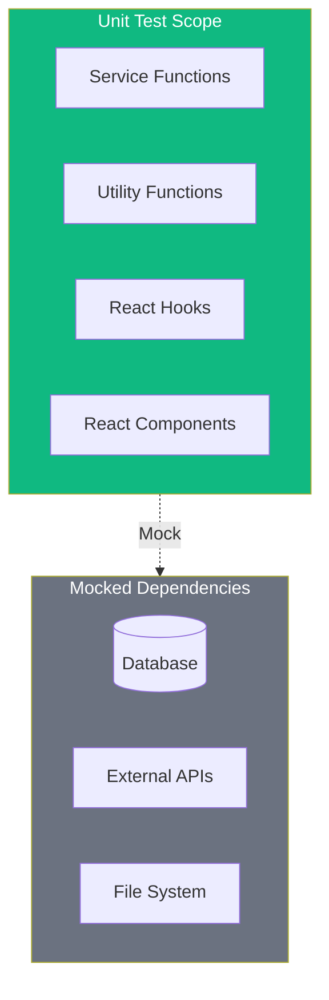

# TaskFlow Unit Testing Guide

## Overview

Unit tests verify individual functions, methods, and components in isolation. This guide covers patterns, examples, and best practices for unit testing in TaskFlow.

---

## Unit Test Architecture



---

## Backend Unit Tests

### Service Layer Tests

```typescript
// tests/unit/backend/services/taskService.test.ts
import { describe, it, expect, vi, beforeEach } from 'vitest';
import { taskService } from '@/services/taskService';
import { taskRepository } from '@/repositories/taskRepository';
import { createTask } from '@tests/factories/taskFactory';

// Mock the repository
vi.mock('@/repositories/taskRepository');

describe('TaskService', () => {
  beforeEach(() => {
    vi.clearAllMocks();
  });

  describe('createTask', () => {
    it('should create a task with valid data', async () => {
      // Arrange
      const userId = 'user_123';
      const taskData = {
        title: 'New Task',
        description: 'Task description',
        priority: 'high',
      };
      const expectedTask = createTask({ ...taskData, userId });

      vi.mocked(taskRepository.create).mockResolvedValue(expectedTask);

      // Act
      const result = await taskService.createTask(userId, taskData);

      // Assert
      expect(result).toEqual(expectedTask);
      expect(taskRepository.create).toHaveBeenCalledWith({
        ...taskData,
        userId,
        status: 'pending',
      });
    });

    it('should throw error when title is empty', async () => {
      // Arrange
      const userId = 'user_123';
      const taskData = { title: '' };

      // Act & Assert
      await expect(
        taskService.createTask(userId, taskData)
      ).rejects.toThrow('Title is required');

      expect(taskRepository.create).not.toHaveBeenCalled();
    });

    it('should throw error when title exceeds max length', async () => {
      // Arrange
      const userId = 'user_123';
      const taskData = { title: 'a'.repeat(256) };

      // Act & Assert
      await expect(
        taskService.createTask(userId, taskData)
      ).rejects.toThrow('Title must be 255 characters or less');
    });
  });

  describe('updateTaskStatus', () => {
    it('should update task status', async () => {
      // Arrange
      const taskId = 'task_123';
      const userId = 'user_123';
      const existingTask = createTask({ id: taskId, userId, status: 'pending' });
      const updatedTask = { ...existingTask, status: 'completed' };

      vi.mocked(taskRepository.findById).mockResolvedValue(existingTask);
      vi.mocked(taskRepository.update).mockResolvedValue(updatedTask);

      // Act
      const result = await taskService.updateStatus(taskId, userId, 'completed');

      // Assert
      expect(result.status).toBe('completed');
      expect(taskRepository.update).toHaveBeenCalledWith(taskId, {
        status: 'completed',
      });
    });

    it('should throw error when task not found', async () => {
      // Arrange
      vi.mocked(taskRepository.findById).mockResolvedValue(null);

      // Act & Assert
      await expect(
        taskService.updateStatus('invalid_id', 'user_123', 'completed')
      ).rejects.toThrow('Task not found');
    });

    it('should throw error when user does not own task', async () => {
      // Arrange
      const task = createTask({ userId: 'other_user' });
      vi.mocked(taskRepository.findById).mockResolvedValue(task);

      // Act & Assert
      await expect(
        taskService.updateStatus(task.id, 'user_123', 'completed')
      ).rejects.toThrow('Not authorized');
    });
  });

  describe('getTasks', () => {
    it('should return paginated tasks', async () => {
      // Arrange
      const userId = 'user_123';
      const tasks = [createTask(), createTask(), createTask()];

      vi.mocked(taskRepository.findByUser).mockResolvedValue({
        tasks,
        total: 10,
      });

      // Act
      const result = await taskService.getTasks(userId, { page: 1, limit: 3 });

      // Assert
      expect(result.tasks).toHaveLength(3);
      expect(result.pagination.total).toBe(10);
      expect(result.pagination.totalPages).toBe(4);
    });

    it('should apply filters correctly', async () => {
      // Arrange
      const userId = 'user_123';
      const filters = { status: 'pending', priority: 'high' };

      vi.mocked(taskRepository.findByUser).mockResolvedValue({
        tasks: [],
        total: 0,
      });

      // Act
      await taskService.getTasks(userId, { ...filters, page: 1, limit: 10 });

      // Assert
      expect(taskRepository.findByUser).toHaveBeenCalledWith(
        userId,
        expect.objectContaining(filters)
      );
    });
  });
});
```

### Utility Function Tests

```typescript
// tests/unit/backend/utils/validation.test.ts
import { describe, it, expect } from 'vitest';
import {
  validateEmail,
  validatePassword,
  sanitizeInput,
} from '@/utils/validation';

describe('Validation Utils', () => {
  describe('validateEmail', () => {
    it.each([
      ['user@example.com', true],
      ['user.name@example.co.uk', true],
      ['user+tag@example.com', true],
      ['invalid-email', false],
      ['@example.com', false],
      ['user@', false],
      ['', false],
    ])('validateEmail("%s") should return %s', (email, expected) => {
      expect(validateEmail(email)).toBe(expected);
    });
  });

  describe('validatePassword', () => {
    it('should accept valid password', () => {
      const result = validatePassword('SecurePassword123!');
      expect(result.valid).toBe(true);
      expect(result.errors).toHaveLength(0);
    });

    it('should reject short password', () => {
      const result = validatePassword('Short1!');
      expect(result.valid).toBe(false);
      expect(result.errors).toContain('Password must be at least 8 characters');
    });

    it('should reject password without uppercase', () => {
      const result = validatePassword('lowercase123!');
      expect(result.valid).toBe(false);
      expect(result.errors).toContain('Password must contain uppercase letter');
    });

    it('should reject password without special character', () => {
      const result = validatePassword('NoSpecialChar123');
      expect(result.valid).toBe(false);
      expect(result.errors).toContain('Password must contain special character');
    });
  });

  describe('sanitizeInput', () => {
    it('should trim whitespace', () => {
      expect(sanitizeInput('  hello  ')).toBe('hello');
    });

    it('should escape HTML entities', () => {
      expect(sanitizeInput('<script>alert("xss")</script>')).toBe(
        '&lt;script&gt;alert(&quot;xss&quot;)&lt;/script&gt;'
      );
    });

    it('should handle null/undefined', () => {
      expect(sanitizeInput(null)).toBe('');
      expect(sanitizeInput(undefined)).toBe('');
    });
  });
});
```

---

## Frontend Unit Tests

### Component Tests

```typescript
// tests/unit/frontend/components/TaskCard.test.tsx
import { describe, it, expect, vi } from 'vitest';
import { render, screen, fireEvent } from '@testing-library/react';
import { TaskCard } from '@/components/TaskCard';
import { createTask } from '@tests/factories/taskFactory';

describe('TaskCard', () => {
  it('should render task title and description', () => {
    // Arrange
    const task = createTask({
      title: 'Test Task',
      description: 'Test Description',
    });

    // Act
    render(<TaskCard task={task} />);

    // Assert
    expect(screen.getByText('Test Task')).toBeInTheDocument();
    expect(screen.getByText('Test Description')).toBeInTheDocument();
  });

  it('should display priority badge', () => {
    // Arrange
    const task = createTask({ priority: 'high' });

    // Act
    render(<TaskCard task={task} />);

    // Assert
    expect(screen.getByText('High')).toBeInTheDocument();
    expect(screen.getByText('High')).toHaveClass('bg-red-100');
  });

  it('should display due date when present', () => {
    // Arrange
    const dueDate = new Date('2024-01-20');
    const task = createTask({ dueDate });

    // Act
    render(<TaskCard task={task} />);

    // Assert
    expect(screen.getByText('Jan 20, 2024')).toBeInTheDocument();
  });

  it('should call onStatusChange when checkbox clicked', () => {
    // Arrange
    const task = createTask({ status: 'pending' });
    const onStatusChange = vi.fn();

    // Act
    render(<TaskCard task={task} onStatusChange={onStatusChange} />);
    fireEvent.click(screen.getByRole('checkbox'));

    // Assert
    expect(onStatusChange).toHaveBeenCalledWith(task.id, 'completed');
  });

  it('should show overdue indicator for past due tasks', () => {
    // Arrange
    const pastDate = new Date(Date.now() - 86400000); // Yesterday
    const task = createTask({ dueDate: pastDate, status: 'pending' });

    // Act
    render(<TaskCard task={task} />);

    // Assert
    expect(screen.getByText('Overdue')).toBeInTheDocument();
  });

  it('should not show overdue for completed tasks', () => {
    // Arrange
    const pastDate = new Date(Date.now() - 86400000);
    const task = createTask({ dueDate: pastDate, status: 'completed' });

    // Act
    render(<TaskCard task={task} />);

    // Assert
    expect(screen.queryByText('Overdue')).not.toBeInTheDocument();
  });
});
```

### Hook Tests

```typescript
// tests/unit/frontend/hooks/useTasks.test.ts
import { describe, it, expect, vi, beforeEach } from 'vitest';
import { renderHook, waitFor } from '@testing-library/react';
import { QueryClient, QueryClientProvider } from '@tanstack/react-query';
import { useTasks } from '@/hooks/useTasks';
import { taskApi } from '@/api/tasks';
import { createTask } from '@tests/factories/taskFactory';

vi.mock('@/api/tasks');

function createWrapper() {
  const queryClient = new QueryClient({
    defaultOptions: {
      queries: {
        retry: false,
      },
    },
  });

  return ({ children }) => (
    <QueryClientProvider client={queryClient}>
      {children}
    </QueryClientProvider>
  );
}

describe('useTasks', () => {
  beforeEach(() => {
    vi.clearAllMocks();
  });

  it('should fetch tasks successfully', async () => {
    // Arrange
    const tasks = [createTask(), createTask()];
    vi.mocked(taskApi.getTasks).mockResolvedValue({
      tasks,
      pagination: { page: 1, limit: 20, total: 2, totalPages: 1 },
    });

    // Act
    const { result } = renderHook(() => useTasks(), {
      wrapper: createWrapper(),
    });

    // Assert
    await waitFor(() => {
      expect(result.current.isSuccess).toBe(true);
    });

    expect(result.current.data?.tasks).toHaveLength(2);
  });

  it('should handle error state', async () => {
    // Arrange
    vi.mocked(taskApi.getTasks).mockRejectedValue(new Error('Network error'));

    // Act
    const { result } = renderHook(() => useTasks(), {
      wrapper: createWrapper(),
    });

    // Assert
    await waitFor(() => {
      expect(result.current.isError).toBe(true);
    });

    expect(result.current.error?.message).toBe('Network error');
  });

  it('should pass filters to API', async () => {
    // Arrange
    vi.mocked(taskApi.getTasks).mockResolvedValue({
      tasks: [],
      pagination: { page: 1, limit: 20, total: 0, totalPages: 0 },
    });

    const filters = { status: 'pending', priority: 'high' };

    // Act
    renderHook(() => useTasks(filters), {
      wrapper: createWrapper(),
    });

    // Assert
    await waitFor(() => {
      expect(taskApi.getTasks).toHaveBeenCalledWith(
        expect.objectContaining(filters)
      );
    });
  });
});
```

### Store Tests (Zustand)

```typescript
// tests/unit/frontend/stores/taskStore.test.ts
import { describe, it, expect, beforeEach } from 'vitest';
import { useTaskStore } from '@/stores/taskStore';
import { createTask } from '@tests/factories/taskFactory';

describe('TaskStore', () => {
  beforeEach(() => {
    useTaskStore.setState({
      selectedTaskId: null,
      filters: {},
      viewMode: 'list',
    });
  });

  describe('setSelectedTask', () => {
    it('should set selected task ID', () => {
      // Act
      useTaskStore.getState().setSelectedTask('task_123');

      // Assert
      expect(useTaskStore.getState().selectedTaskId).toBe('task_123');
    });

    it('should clear selected task when null', () => {
      // Arrange
      useTaskStore.getState().setSelectedTask('task_123');

      // Act
      useTaskStore.getState().setSelectedTask(null);

      // Assert
      expect(useTaskStore.getState().selectedTaskId).toBeNull();
    });
  });

  describe('setFilters', () => {
    it('should update filters', () => {
      // Act
      useTaskStore.getState().setFilters({ status: 'pending' });

      // Assert
      expect(useTaskStore.getState().filters).toEqual({ status: 'pending' });
    });

    it('should merge with existing filters', () => {
      // Arrange
      useTaskStore.getState().setFilters({ status: 'pending' });

      // Act
      useTaskStore.getState().setFilters({ priority: 'high' });

      // Assert
      expect(useTaskStore.getState().filters).toEqual({
        status: 'pending',
        priority: 'high',
      });
    });

    it('should clear filters with empty object', () => {
      // Arrange
      useTaskStore.getState().setFilters({ status: 'pending' });

      // Act
      useTaskStore.getState().clearFilters();

      // Assert
      expect(useTaskStore.getState().filters).toEqual({});
    });
  });

  describe('viewMode', () => {
    it('should toggle view mode', () => {
      // Initial state
      expect(useTaskStore.getState().viewMode).toBe('list');

      // Toggle to board
      useTaskStore.getState().setViewMode('board');
      expect(useTaskStore.getState().viewMode).toBe('board');

      // Toggle back to list
      useTaskStore.getState().setViewMode('list');
      expect(useTaskStore.getState().viewMode).toBe('list');
    });
  });
});
```

---

## Test Patterns

### Testing Async Functions

```typescript
describe('Async Patterns', () => {
  it('should handle async success', async () => {
    const result = await asyncFunction();
    expect(result).toBeDefined();
  });

  it('should handle async error', async () => {
    await expect(asyncFunction()).rejects.toThrow('Error message');
  });

  it('should handle async with act', async () => {
    await act(async () => {
      await userEvent.click(button);
    });
    expect(screen.getByText('Updated')).toBeInTheDocument();
  });
});
```

### Snapshot Testing

```typescript
describe('Snapshot Tests', () => {
  it('should match snapshot', () => {
    const { container } = render(<TaskCard task={task} />);
    expect(container).toMatchSnapshot();
  });

  it('should match inline snapshot', () => {
    const result = formatDate(new Date('2024-01-15'));
    expect(result).toMatchInlineSnapshot(`"Jan 15, 2024"`);
  });
});
```

---

## Running Unit Tests

```bash
# Run all unit tests
npm run test:unit

# Run with coverage
npm run test:unit -- --coverage

# Run specific file
npm run test:unit -- taskService.test.ts

# Run in watch mode
npm run test:unit -- --watch

# Run with verbose output
npm run test:unit -- --verbose
```

---

## Related Documents

- [Testing Strategy](./strategy.md)
- [Integration Tests](./integration-tests.md)
- [Test Data](./test-data.md)
