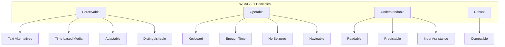

# TaskFlow Accessibility Guidelines

## Overview

TaskFlow is committed to WCAG 2.1 Level AA compliance. This document outlines accessibility requirements, guidelines, and implementation patterns.

---

## Accessibility Standards



---

## Color & Contrast

### Contrast Requirements

| Element | Minimum Ratio | Target |
|---------|---------------|--------|
| Normal text | 4.5:1 | 7:1 |
| Large text (18px+) | 3:1 | 4.5:1 |
| UI components | 3:1 | 4.5:1 |
| Focus indicators | 3:1 | 4.5:1 |

### Color Combinations

```css
/* Accessible Text Colors */
--text-on-white: #1f2937;      /* Ratio: 12.6:1 */
--text-secondary: #4b5563;     /* Ratio: 7.5:1 */
--text-on-primary: #ffffff;    /* On #3b82f6: 4.5:1 */
--text-on-danger: #ffffff;     /* On #ef4444: 4.6:1 */
```

### Color Blind Safe Palette

```css
/* Use patterns/icons in addition to color */
.status-pending { border-left: 4px solid #6b7280; }
.status-in-progress { border-left: 4px dashed #3b82f6; }
.status-completed { border-left: 4px double #22c55e; }
```

### Don't Rely on Color Alone

```tsx
// Bad: Color-only indication
<span className="text-red-500">Error</span>

// Good: Color + icon + text
<span className="text-red-500 flex items-center gap-1">
  <ExclamationIcon aria-hidden="true" />
  <span>Error: Invalid email</span>
</span>
```

---

## Keyboard Navigation

### Focus Management

```css
/* Visible focus indicator */
:focus-visible {
  outline: 2px solid var(--color-primary-500);
  outline-offset: 2px;
}

/* Remove default outline when using mouse */
:focus:not(:focus-visible) {
  outline: none;
}

/* Custom focus ring */
.focus-ring {
  @apply focus:ring-2 focus:ring-primary-500 focus:ring-offset-2;
}
```

### Tab Order

```tsx
// Logical tab order
<form>
  <Input name="title" tabIndex={1} />     {/* First */}
  <Input name="description" tabIndex={2} /> {/* Second */}
  <Button type="submit" tabIndex={3}>    {/* Third */}
    Submit
  </Button>
</form>

// Skip links
<a href="#main-content" className="skip-link">
  Skip to main content
</a>
```

### Keyboard Shortcuts

| Action | Shortcut | Scope |
|--------|----------|-------|
| Create task | `c` | Global |
| Search | `/` or `Cmd+K` | Global |
| Save | `Cmd+S` | Forms |
| Cancel | `Esc` | Modals |
| Navigate list | `↑` / `↓` | Lists |
| Select item | `Enter` | Lists |

### Focus Trapping

```tsx
// Modal focus trap
function Modal({ isOpen, onClose, children }) {
  const firstFocusRef = useRef();
  const lastFocusRef = useRef();

  useEffect(() => {
    if (isOpen) {
      firstFocusRef.current?.focus();
    }
  }, [isOpen]);

  const handleKeyDown = (e) => {
    if (e.key === 'Tab') {
      if (e.shiftKey && document.activeElement === firstFocusRef.current) {
        e.preventDefault();
        lastFocusRef.current?.focus();
      } else if (!e.shiftKey && document.activeElement === lastFocusRef.current) {
        e.preventDefault();
        firstFocusRef.current?.focus();
      }
    }
    if (e.key === 'Escape') {
      onClose();
    }
  };

  return (
    <div role="dialog" aria-modal="true" onKeyDown={handleKeyDown}>
      <button ref={firstFocusRef}>Close</button>
      {children}
      <button ref={lastFocusRef}>Save</button>
    </div>
  );
}
```

---

## ARIA Attributes

### Common ARIA Patterns

```tsx
// Button with loading state
<button
  aria-busy={isLoading}
  aria-disabled={isLoading}
  aria-label={isLoading ? 'Saving...' : 'Save task'}
>
  {isLoading ? <Spinner /> : 'Save'}
</button>

// Expandable section
<button
  aria-expanded={isOpen}
  aria-controls="section-content"
>
  Section Title
</button>
<div id="section-content" hidden={!isOpen}>
  Content
</div>

// Form with errors
<input
  aria-invalid={hasError}
  aria-describedby={hasError ? 'error-message' : undefined}
/>
{hasError && (
  <span id="error-message" role="alert">
    {errorMessage}
  </span>
)}
```

### Live Regions

```tsx
// Status announcements
<div
  role="status"
  aria-live="polite"
  aria-atomic="true"
  className="sr-only"
>
  {statusMessage}
</div>

// Alert announcements
<div
  role="alert"
  aria-live="assertive"
>
  {alertMessage}
</div>
```

### Navigation Landmarks

```tsx
<header role="banner">
  <nav role="navigation" aria-label="Main navigation">
    {/* Navigation items */}
  </nav>
</header>

<main role="main" id="main-content">
  {/* Page content */}
</main>

<aside role="complementary" aria-label="Sidebar">
  {/* Sidebar content */}
</aside>

<footer role="contentinfo">
  {/* Footer content */}
</footer>
```

---

## Form Accessibility

### Labels and Instructions

```tsx
// Always use labels
<label htmlFor="task-title" className="required">
  Task Title
</label>
<input
  id="task-title"
  name="title"
  aria-required="true"
  aria-describedby="title-hint"
/>
<span id="title-hint" className="hint">
  Enter a descriptive title for your task
</span>
```

### Error Handling

```tsx
// Accessible form validation
<form onSubmit={handleSubmit} noValidate>
  <div className="form-field">
    <label htmlFor="email">Email</label>
    <input
      id="email"
      type="email"
      aria-invalid={errors.email ? 'true' : 'false'}
      aria-describedby={errors.email ? 'email-error' : undefined}
    />
    {errors.email && (
      <span id="email-error" className="error" role="alert">
        {errors.email}
      </span>
    )}
  </div>

  {/* Error summary for screen readers */}
  {Object.keys(errors).length > 0 && (
    <div role="alert" aria-live="polite">
      <h2>Please correct the following errors:</h2>
      <ul>
        {Object.entries(errors).map(([field, message]) => (
          <li key={field}>
            <a href={`#${field}`}>{message}</a>
          </li>
        ))}
      </ul>
    </div>
  )}
</form>
```

---

## Component Checklist

### Button Checklist

- [ ] Has visible focus indicator
- [ ] Has accessible name (text or aria-label)
- [ ] Disabled state communicated (aria-disabled)
- [ ] Loading state announced (aria-busy)
- [ ] Works with Enter and Space keys

### Input Checklist

- [ ] Has associated label
- [ ] Error state indicated (aria-invalid)
- [ ] Error message linked (aria-describedby)
- [ ] Required state indicated
- [ ] Placeholder not used as label

### Modal Checklist

- [ ] Has role="dialog"
- [ ] Has aria-modal="true"
- [ ] Has accessible title (aria-labelledby)
- [ ] Focus trapped inside
- [ ] Closes with Escape
- [ ] Returns focus on close

### List Checklist

- [ ] Uses semantic markup (ul/ol + li)
- [ ] Interactive items are focusable
- [ ] Arrow key navigation works
- [ ] Current item indicated (aria-current)

---

## Testing Accessibility

### Automated Testing

```bash
# Run axe-core tests
npm run test:a11y

# Lighthouse accessibility audit
npx lighthouse http://localhost:3000 --only-categories=accessibility
```

### Manual Testing Checklist

```markdown
## Manual A11y Testing

### Keyboard Navigation
- [ ] Can tab through all interactive elements
- [ ] Tab order is logical
- [ ] Focus indicator is visible
- [ ] Can operate all controls with keyboard
- [ ] No keyboard traps

### Screen Reader
- [ ] Page title is descriptive
- [ ] Headings are hierarchical
- [ ] Images have alt text
- [ ] Links have descriptive text
- [ ] Forms have labels
- [ ] Errors are announced

### Visual
- [ ] Text meets contrast requirements
- [ ] Text resizes up to 200%
- [ ] No horizontal scroll at 320px
- [ ] Color is not only indicator
- [ ] Focus visible in all states

### Motion
- [ ] Animations can be disabled
- [ ] No auto-playing media
- [ ] No flashing content
```

### Screen Reader Testing

| Screen Reader | Browser | Platform |
|---------------|---------|----------|
| VoiceOver | Safari | macOS, iOS |
| NVDA | Firefox | Windows |
| JAWS | Chrome | Windows |
| TalkBack | Chrome | Android |

---

## Utility Classes

```css
/* Screen reader only text */
.sr-only {
  position: absolute;
  width: 1px;
  height: 1px;
  padding: 0;
  margin: -1px;
  overflow: hidden;
  clip: rect(0, 0, 0, 0);
  white-space: nowrap;
  border: 0;
}

/* Skip to content link */
.skip-link {
  position: absolute;
  left: -10000px;
  top: auto;
  width: 1px;
  height: 1px;
  overflow: hidden;
}

.skip-link:focus {
  position: fixed;
  top: 0;
  left: 0;
  width: auto;
  height: auto;
  padding: 1rem;
  background: white;
  z-index: 9999;
}
```

---

## Related Documents

- [Design Tokens](./tokens.md)
- [Components](./components.md)
- [Testing Strategy](../testing/strategy.md)
