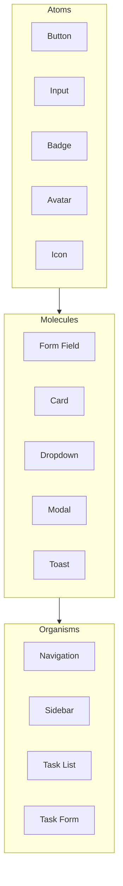

# TaskFlow Component Library

## Overview

This document catalogs all reusable UI components in TaskFlow, including their variants, props, and usage guidelines.

---

## Component Hierarchy



---

## Buttons

### Variants

| Variant | Use Case | Style |
|---------|----------|-------|
| Primary | Main actions | Blue fill |
| Secondary | Secondary actions | Gray fill |
| Outline | Tertiary actions | Border only |
| Ghost | Subtle actions | No border |
| Danger | Destructive actions | Red fill |

### Sizes

| Size | Padding | Font Size | Height |
|------|---------|-----------|--------|
| sm | 8px 12px | 14px | 32px |
| md | 10px 16px | 14px | 40px |
| lg | 12px 20px | 16px | 48px |

### Component API

```typescript
interface ButtonProps {
  variant?: 'primary' | 'secondary' | 'outline' | 'ghost' | 'danger';
  size?: 'sm' | 'md' | 'lg';
  disabled?: boolean;
  loading?: boolean;
  leftIcon?: ReactNode;
  rightIcon?: ReactNode;
  fullWidth?: boolean;
  onClick?: () => void;
  children: ReactNode;
}
```

### Examples

```tsx
// Primary Button
<Button variant="primary">Create Task</Button>

// With Icon
<Button variant="primary" leftIcon={<PlusIcon />}>
  Add Task
</Button>

// Loading State
<Button variant="primary" loading>
  Saving...
</Button>

// Danger Button
<Button variant="danger" leftIcon={<TrashIcon />}>
  Delete
</Button>
```

---

## Inputs

### Text Input

```typescript
interface InputProps {
  label?: string;
  placeholder?: string;
  type?: 'text' | 'email' | 'password' | 'number';
  error?: string;
  disabled?: boolean;
  required?: boolean;
  leftIcon?: ReactNode;
  rightIcon?: ReactNode;
  helperText?: string;
}
```

### Input States

| State | Border | Background | Label |
|-------|--------|------------|-------|
| Default | gray-300 | white | gray-700 |
| Focus | primary-500 | white | primary-500 |
| Error | error-500 | error-50 | error-500 |
| Disabled | gray-200 | gray-100 | gray-400 |

### Examples

```tsx
// Basic Input
<Input
  label="Task Title"
  placeholder="Enter task title"
  required
/>

// With Error
<Input
  label="Email"
  type="email"
  error="Invalid email address"
/>

// With Icon
<Input
  label="Search"
  placeholder="Search tasks..."
  leftIcon={<SearchIcon />}
/>
```

### Select

```typescript
interface SelectProps {
  label?: string;
  options: Array<{ value: string; label: string }>;
  placeholder?: string;
  error?: string;
  disabled?: boolean;
}
```

### Textarea

```typescript
interface TextareaProps {
  label?: string;
  placeholder?: string;
  rows?: number;
  maxLength?: number;
  error?: string;
}
```

---

## Cards

### Card Variants

| Variant | Use Case | Style |
|---------|----------|-------|
| Default | Content containers | White bg, shadow |
| Bordered | Less emphasis | Border, no shadow |
| Interactive | Clickable items | Hover effect |

### Card API

```typescript
interface CardProps {
  variant?: 'default' | 'bordered' | 'interactive';
  padding?: 'none' | 'sm' | 'md' | 'lg';
  children: ReactNode;
  onClick?: () => void;
}

interface CardHeaderProps {
  title: string;
  subtitle?: string;
  action?: ReactNode;
}
```

### Examples

```tsx
<Card>
  <CardHeader
    title="Project Tasks"
    subtitle="5 tasks remaining"
    action={<Button size="sm">Add</Button>}
  />
  <CardContent>
    {/* Content */}
  </CardContent>
  <CardFooter>
    {/* Footer */}
  </CardFooter>
</Card>
```

---

## Badges

### Badge Variants

| Variant | Color | Use Case |
|---------|-------|----------|
| default | gray | Neutral info |
| primary | blue | Primary status |
| success | green | Success/complete |
| warning | amber | Warnings |
| error | red | Errors/urgent |

### Badge API

```typescript
interface BadgeProps {
  variant?: 'default' | 'primary' | 'success' | 'warning' | 'error';
  size?: 'sm' | 'md';
  dot?: boolean;
  children: ReactNode;
}
```

### Examples

```tsx
// Status Badges
<Badge variant="success">Completed</Badge>
<Badge variant="warning">In Progress</Badge>
<Badge variant="default">Pending</Badge>

// Priority Badges
<Badge variant="error">High</Badge>
<Badge variant="warning">Medium</Badge>
<Badge variant="success">Low</Badge>
```

---

## Modal/Dialog

### Modal API

```typescript
interface ModalProps {
  isOpen: boolean;
  onClose: () => void;
  title: string;
  description?: string;
  size?: 'sm' | 'md' | 'lg' | 'xl';
  children: ReactNode;
}
```

### Modal Sizes

| Size | Width | Use Case |
|------|-------|----------|
| sm | 400px | Confirmations |
| md | 500px | Forms |
| lg | 640px | Complex forms |
| xl | 800px | Data views |

### Examples

```tsx
<Modal
  isOpen={isOpen}
  onClose={handleClose}
  title="Create Task"
  size="md"
>
  <TaskForm onSubmit={handleSubmit} />
  <ModalFooter>
    <Button variant="ghost" onClick={handleClose}>
      Cancel
    </Button>
    <Button variant="primary" onClick={handleSubmit}>
      Create
    </Button>
  </ModalFooter>
</Modal>
```

---

## Dropdown Menu

### Dropdown API

```typescript
interface DropdownProps {
  trigger: ReactNode;
  children: ReactNode;
  align?: 'start' | 'center' | 'end';
}

interface DropdownItemProps {
  icon?: ReactNode;
  disabled?: boolean;
  danger?: boolean;
  onClick?: () => void;
  children: ReactNode;
}
```

### Examples

```tsx
<Dropdown trigger={<Button variant="ghost"><MoreIcon /></Button>}>
  <DropdownItem icon={<EditIcon />}>Edit</DropdownItem>
  <DropdownItem icon={<DuplicateIcon />}>Duplicate</DropdownItem>
  <DropdownSeparator />
  <DropdownItem icon={<TrashIcon />} danger>
    Delete
  </DropdownItem>
</Dropdown>
```

---

## Toast/Notifications

### Toast API

```typescript
interface ToastProps {
  title: string;
  description?: string;
  variant?: 'default' | 'success' | 'warning' | 'error';
  duration?: number;
  action?: ReactNode;
}
```

### Toast Usage

```tsx
// Success Toast
toast.success('Task created successfully');

// Error Toast
toast.error('Failed to save task');

// With Action
toast({
  title: 'Task deleted',
  description: 'The task has been removed',
  action: <Button size="sm">Undo</Button>,
});
```

---

## Avatar

### Avatar API

```typescript
interface AvatarProps {
  src?: string;
  alt: string;
  name?: string;
  size?: 'xs' | 'sm' | 'md' | 'lg' | 'xl';
  status?: 'online' | 'offline' | 'busy';
}
```

### Avatar Sizes

| Size | Dimension | Font Size |
|------|-----------|-----------|
| xs | 24px | 10px |
| sm | 32px | 12px |
| md | 40px | 14px |
| lg | 48px | 16px |
| xl | 64px | 20px |

---

## Task-Specific Components

### TaskCard

```typescript
interface TaskCardProps {
  task: Task;
  onStatusChange?: (id: string, status: TaskStatus) => void;
  onEdit?: (id: string) => void;
  onDelete?: (id: string) => void;
  showProject?: boolean;
  showLabels?: boolean;
}
```

### TaskList

```typescript
interface TaskListProps {
  tasks: Task[];
  loading?: boolean;
  emptyMessage?: string;
  onTaskClick?: (task: Task) => void;
  groupBy?: 'status' | 'priority' | 'project' | 'none';
}
```

### PrioritySelect

```typescript
interface PrioritySelectProps {
  value: TaskPriority;
  onChange: (priority: TaskPriority) => void;
  disabled?: boolean;
}
```

### StatusSelect

```typescript
interface StatusSelectProps {
  value: TaskStatus;
  onChange: (status: TaskStatus) => void;
  disabled?: boolean;
}
```

### LabelPicker

```typescript
interface LabelPickerProps {
  selectedLabels: string[];
  onChange: (labelIds: string[]) => void;
  maxLabels?: number;
}
```

---

## Component Status

| Component | Status | Storybook | Tests |
|-----------|--------|-----------|-------|
| Button | Complete | Yes | Yes |
| Input | Complete | Yes | Yes |
| Select | Complete | Yes | Yes |
| Textarea | Complete | Yes | Yes |
| Card | Complete | Yes | Yes |
| Badge | Complete | Yes | Yes |
| Modal | Complete | Yes | Yes |
| Dropdown | Complete | Yes | Yes |
| Toast | Complete | Yes | Yes |
| Avatar | Complete | Yes | Yes |
| TaskCard | Complete | Yes | Yes |
| TaskList | Complete | Yes | Yes |

---

## Related Documents

- [Design Tokens](./tokens.md)
- [Layouts](./layouts.md)
- [Accessibility](./accessibility.md)
