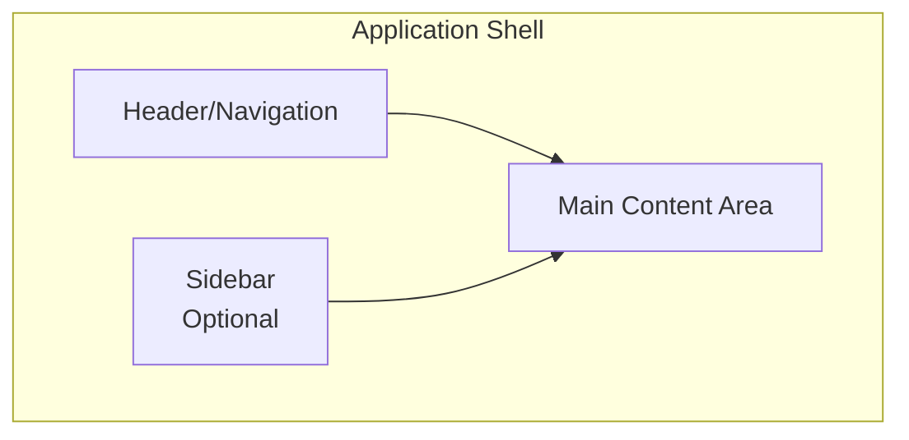
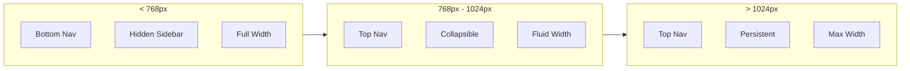

# TaskFlow Layouts

## Overview

This document describes the layout system, page templates, and responsive grid used throughout TaskFlow.

---

## Layout Architecture



---

## Application Shell

### Desktop Layout

```
┌─────────────────────────────────────────────────────────────────────┐
│  ┌─────────────────────────────────────────────────────────────────┐│
│  │                        Header (64px)                            ││
│  │  Logo    Navigation              Search        User Menu        ││
│  └─────────────────────────────────────────────────────────────────┘│
│  ┌──────────────┐  ┌───────────────────────────────────────────────┐│
│  │              │  │                                               ││
│  │   Sidebar    │  │                                               ││
│  │   (256px)    │  │              Main Content                     ││
│  │              │  │                                               ││
│  │  - Projects  │  │                                               ││
│  │  - Labels    │  │                                               ││
│  │  - Filters   │  │                                               ││
│  │              │  │                                               ││
│  │              │  │                                               ││
│  └──────────────┘  └───────────────────────────────────────────────┘│
└─────────────────────────────────────────────────────────────────────┘
```

### Mobile Layout

```
┌─────────────────────────┐
│  ┌─────────────────────┐│
│  │ Header (56px)       ││
│  │ ☰  Logo    User     ││
│  └─────────────────────┘│
│  ┌─────────────────────┐│
│  │                     ││
│  │                     ││
│  │   Main Content      ││
│  │   (Full Width)      ││
│  │                     ││
│  │                     ││
│  │                     ││
│  │                     ││
│  └─────────────────────┘│
│  ┌─────────────────────┐│
│  │ Bottom Nav (64px)   ││
│  │ Tasks Projects More ││
│  └─────────────────────┘│
└─────────────────────────┘
```

---

## Layout Components

### AppLayout

```typescript
interface AppLayoutProps {
  children: ReactNode;
  sidebar?: ReactNode;
  showSidebar?: boolean;
}
```

```tsx
// Usage
<AppLayout sidebar={<Sidebar />}>
  <PageContent />
</AppLayout>
```

### Header

```typescript
interface HeaderProps {
  logo?: ReactNode;
  navigation?: ReactNode;
  search?: ReactNode;
  userMenu?: ReactNode;
}
```

### Sidebar

```typescript
interface SidebarProps {
  items: SidebarItem[];
  collapsed?: boolean;
  onCollapse?: (collapsed: boolean) => void;
}

interface SidebarItem {
  icon: ReactNode;
  label: string;
  href: string;
  badge?: number;
  children?: SidebarItem[];
}
```

---

## Grid System

### CSS Grid Configuration

```css
/* Container */
.container {
  width: 100%;
  max-width: 1280px;
  margin: 0 auto;
  padding: 0 16px;
}

/* Responsive Grid */
.grid {
  display: grid;
  gap: 16px;
}

/* Grid Columns */
.grid-cols-1 { grid-template-columns: repeat(1, 1fr); }
.grid-cols-2 { grid-template-columns: repeat(2, 1fr); }
.grid-cols-3 { grid-template-columns: repeat(3, 1fr); }
.grid-cols-4 { grid-template-columns: repeat(4, 1fr); }

/* Responsive */
@media (min-width: 640px) {
  .sm\:grid-cols-2 { grid-template-columns: repeat(2, 1fr); }
}

@media (min-width: 768px) {
  .md\:grid-cols-3 { grid-template-columns: repeat(3, 1fr); }
}

@media (min-width: 1024px) {
  .lg\:grid-cols-4 { grid-template-columns: repeat(4, 1fr); }
}
```

### Grid Examples

```tsx
// Task Grid
<div className="grid grid-cols-1 md:grid-cols-2 lg:grid-cols-3 gap-4">
  {tasks.map(task => (
    <TaskCard key={task.id} task={task} />
  ))}
</div>

// Dashboard Stats
<div className="grid grid-cols-2 lg:grid-cols-4 gap-4">
  <StatCard title="Total Tasks" value={45} />
  <StatCard title="Completed" value={32} />
  <StatCard title="In Progress" value={8} />
  <StatCard title="Pending" value={5} />
</div>
```

---

## Breakpoints

| Breakpoint | Min Width | Description |
|------------|-----------|-------------|
| xs | 0px | Mobile portrait |
| sm | 640px | Mobile landscape |
| md | 768px | Tablet |
| lg | 1024px | Desktop |
| xl | 1280px | Large desktop |
| 2xl | 1536px | Wide screen |

### Responsive Behavior



---

## Page Templates

### List Page Template

```
┌─────────────────────────────────────────────────────────────────┐
│  Page Header                                                     │
│  ┌─────────────────────────────────────────────────────────────┐│
│  │  Title                                    [+ Create Button] ││
│  │  Description/Breadcrumb                                     ││
│  └─────────────────────────────────────────────────────────────┘│
│                                                                  │
│  Toolbar                                                         │
│  ┌─────────────────────────────────────────────────────────────┐│
│  │  [Search........]  [Filter ▼]  [Sort ▼]    View: ≡ ⊞       ││
│  └─────────────────────────────────────────────────────────────┘│
│                                                                  │
│  Content Area                                                    │
│  ┌─────────────────────────────────────────────────────────────┐│
│  │                                                              ││
│  │  ┌──────────┐  ┌──────────┐  ┌──────────┐                  ││
│  │  │  Item 1  │  │  Item 2  │  │  Item 3  │                  ││
│  │  └──────────┘  └──────────┘  └──────────┘                  ││
│  │                                                              ││
│  │  ┌──────────┐  ┌──────────┐  ┌──────────┐                  ││
│  │  │  Item 4  │  │  Item 5  │  │  Item 6  │                  ││
│  │  └──────────┘  └──────────┘  └──────────┘                  ││
│  │                                                              ││
│  └─────────────────────────────────────────────────────────────┘│
│                                                                  │
│  Pagination                                                      │
│  ┌─────────────────────────────────────────────────────────────┐│
│  │  ◄ Prev    1  2  [3]  4  5    Next ►       Showing 21-30   ││
│  └─────────────────────────────────────────────────────────────┘│
└─────────────────────────────────────────────────────────────────┘
```

### Detail Page Template

```
┌─────────────────────────────────────────────────────────────────┐
│  Page Header                                                     │
│  ┌─────────────────────────────────────────────────────────────┐│
│  │  ← Back    Task Title                  [Edit] [Delete]      ││
│  └─────────────────────────────────────────────────────────────┘│
│                                                                  │
│  ┌────────────────────────────────────┐  ┌────────────────────┐│
│  │                                     │  │   Sidebar          ││
│  │  Main Content                       │  │                    ││
│  │                                     │  │   Status: ●        ││
│  │  Description                        │  │   Priority: High   ││
│  │  ─────────────────                  │  │   Due: Jan 20      ││
│  │  Lorem ipsum dolor sit amet...      │  │   Project: Work    ││
│  │                                     │  │                    ││
│  │                                     │  │   Labels:          ││
│  │                                     │  │   [urgent] [bug]   ││
│  │                                     │  │                    ││
│  │  Activity                           │  │   Created:         ││
│  │  ─────────────────                  │  │   Jan 15, 2024     ││
│  │  • Created by John                  │  │                    ││
│  │  • Status changed to In Progress    │  │                    ││
│  │                                     │  │                    ││
│  └────────────────────────────────────┘  └────────────────────┘│
└─────────────────────────────────────────────────────────────────┘
```

### Form Page Template

```
┌─────────────────────────────────────────────────────────────────┐
│  Page Header                                                     │
│  ┌─────────────────────────────────────────────────────────────┐│
│  │  ← Back    Create Task                                      ││
│  └─────────────────────────────────────────────────────────────┘│
│                                                                  │
│  Form Container (max-width: 600px, centered)                     │
│  ┌─────────────────────────────────────────────────────────────┐│
│  │                                                              ││
│  │  Title *                                                     ││
│  │  ┌─────────────────────────────────────────────────────┐    ││
│  │  │                                                      │    ││
│  │  └─────────────────────────────────────────────────────┘    ││
│  │                                                              ││
│  │  Description                                                 ││
│  │  ┌─────────────────────────────────────────────────────┐    ││
│  │  │                                                      │    ││
│  │  │                                                      │    ││
│  │  └─────────────────────────────────────────────────────┘    ││
│  │                                                              ││
│  │  Priority              Due Date                              ││
│  │  ┌────────────┐        ┌────────────────────────┐           ││
│  │  │ Medium   ▼ │        │ Select date...         │           ││
│  │  └────────────┘        └────────────────────────┘           ││
│  │                                                              ││
│  │  ─────────────────────────────────────────────────          ││
│  │                                                              ││
│  │                                [Cancel]  [Create Task]       ││
│  │                                                              ││
│  └─────────────────────────────────────────────────────────────┘│
└─────────────────────────────────────────────────────────────────┘
```

---

## Spacing Guidelines

### Page Spacing

| Element | Spacing |
|---------|---------|
| Page padding | 24px (desktop), 16px (mobile) |
| Section gap | 32px |
| Card gap | 16px |
| Component gap | 12px |

### Component Internal Spacing

| Element | Padding |
|---------|---------|
| Card | 16px |
| Modal | 24px |
| Form section | 16px 0 |
| Button group gap | 8px |

---

## Related Documents

- [Design Tokens](./tokens.md)
- [Components](./components.md)
- [Screens](./screens.md)
