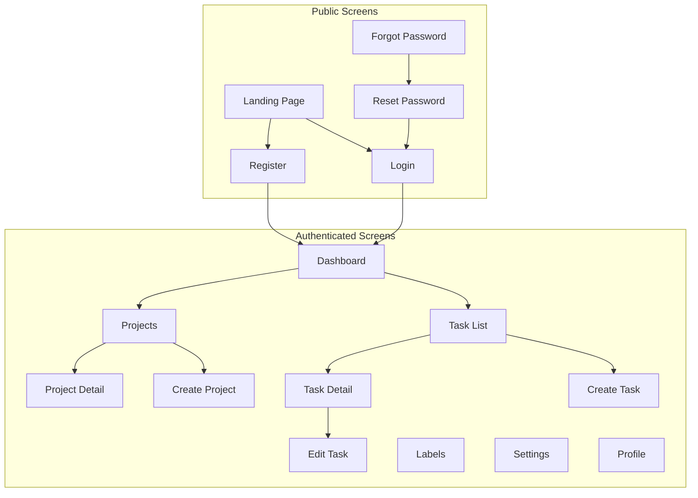

# TaskFlow Screen Inventory

## Overview

This document catalogs all screens in the TaskFlow application, including their purpose, components, and user flows.

---

## Screen Map



---

## Public Screens

### Landing Page

```
Path: /
Auth: None
Purpose: Marketing and conversion
```

**Components:**
- Hero section with CTA
- Feature highlights
- Pricing (if applicable)
- Footer with links

**States:**
- Default
- User logged in (redirect to dashboard)

---

### Login

```
Path: /login
Auth: None
Purpose: User authentication
```

**Components:**
- Email input
- Password input
- Remember me checkbox
- Login button
- Forgot password link
- Register link
- Social login options

**States:**
- Default
- Loading (submitting)
- Error (invalid credentials)
- Success (redirect to dashboard)

**Wireframe:**
```
┌─────────────────────────────────┐
│          TaskFlow               │
│                                 │
│  ┌───────────────────────────┐  │
│  │                           │  │
│  │     Welcome Back          │  │
│  │                           │  │
│  │  Email                    │  │
│  │  [____________________]   │  │
│  │                           │  │
│  │  Password                 │  │
│  │  [____________________]   │  │
│  │                           │  │
│  │  [ ] Remember me          │  │
│  │        Forgot password?   │  │
│  │                           │  │
│  │  [      Log In        ]   │  │
│  │                           │  │
│  │  ─── Or continue with ─── │  │
│  │                           │  │
│  │  [ Google ] [ GitHub ]    │  │
│  │                           │  │
│  │  Don't have an account?   │  │
│  │  Sign up                  │  │
│  │                           │  │
│  └───────────────────────────┘  │
└─────────────────────────────────┘
```

---

### Register

```
Path: /register
Auth: None
Purpose: New user signup
```

**Components:**
- Name input
- Email input
- Password input
- Confirm password input
- Terms acceptance checkbox
- Register button
- Login link

**Validation:**
- Name: Required, 2-50 chars
- Email: Valid format
- Password: Min 8 chars, uppercase, number, special
- Confirm: Must match password

---

## Authenticated Screens

### Dashboard

```
Path: /dashboard
Auth: Required
Purpose: Overview and quick actions
```

**Components:**
- Welcome message
- Quick stats cards
  - Total tasks
  - Completed today
  - Overdue tasks
  - In progress
- Recent tasks list
- Upcoming deadlines
- Quick add task button

**Wireframe:**
```
┌─────────────────────────────────────────────────────────────────┐
│  Header                                          [+ New Task]   │
├─────────────────────────────────────────────────────────────────┤
│                                                                 │
│  Good morning, John!                                            │
│                                                                 │
│  ┌──────────┐ ┌──────────┐ ┌──────────┐ ┌──────────┐          │
│  │ Total    │ │ Today    │ │ Overdue  │ │ Progress │          │
│  │   45     │ │    3     │ │    2     │ │    8     │          │
│  │  tasks   │ │ completed│ │  tasks   │ │ ongoing  │          │
│  └──────────┘ └──────────┘ └──────────┘ └──────────┘          │
│                                                                 │
│  Recent Tasks                              Upcoming             │
│  ┌────────────────────────────────────┐   ┌──────────────────┐│
│  │ □ Complete API documentation       │   │ Jan 18 - Meeting ││
│  │ ■ Review pull requests            │   │ Jan 20 - Deadline ││
│  │ □ Fix login bug                    │   │ Jan 22 - Review   ││
│  │ □ Update dependencies              │   │                   ││
│  └────────────────────────────────────┘   └──────────────────┘│
│                                                                 │
└─────────────────────────────────────────────────────────────────┘
```

---

### Task List

```
Path: /tasks
Auth: Required
Purpose: View and manage all tasks
```

**Components:**
- Page header with title and create button
- Search input
- Filter dropdowns (status, priority, project, label)
- Sort dropdown
- View toggle (list/grid/board)
- Task cards/rows
- Pagination

**View Modes:**
- List view: Compact rows
- Grid view: Cards in grid
- Board view: Kanban columns

**Filters:**
- Status: All, Pending, In Progress, Completed
- Priority: All, High, Medium, Low
- Project: All, [Project list]
- Labels: Multi-select

---

### Task Detail

```
Path: /tasks/:id
Auth: Required
Purpose: View full task information
```

**Components:**
- Back navigation
- Task title (editable)
- Status badge and changer
- Priority indicator
- Description (markdown supported)
- Due date with calendar
- Project assignment
- Labels (add/remove)
- Activity timeline
- Edit/Delete actions

**Layout:**
- Two-column on desktop
- Single column on mobile
- Main content left, metadata right

---

### Create/Edit Task

```
Path: /tasks/new or /tasks/:id/edit
Auth: Required
Purpose: Create or modify tasks
```

**Components:**
- Form header
- Title input (required)
- Description textarea
- Status select
- Priority select
- Due date picker
- Project select
- Label multi-select
- Cancel and Submit buttons

**Validation:**
- Title: Required, 1-255 chars
- Description: Optional, max 5000 chars
- Due date: Must be valid date

---

### Projects

```
Path: /projects
Auth: Required
Purpose: Manage projects
```

**Components:**
- Project cards with:
  - Name and color
  - Description
  - Task count
  - Progress indicator
- Create project button

---

### Project Detail

```
Path: /projects/:id
Auth: Required
Purpose: View project and its tasks
```

**Components:**
- Project header with name, color, description
- Edit/Delete actions
- Task list filtered to project
- Project statistics

---

### Settings

```
Path: /settings
Auth: Required
Purpose: App configuration
```

**Sections:**
- Profile settings
- Account settings
- Preferences
  - Theme (light/dark)
  - Email notifications
  - Timezone
- Security
  - Change password
  - Two-factor auth
- Data
  - Export data
  - Delete account

---

### Profile

```
Path: /profile
Auth: Required
Purpose: User profile management
```

**Components:**
- Avatar upload
- Name edit
- Email display
- Account statistics
- Activity history

---

## Modal Screens

### Quick Task Create

```
Trigger: Keyboard shortcut 'c' or FAB
Purpose: Fast task creation
```

**Components:**
- Title input (auto-focus)
- Quick priority select
- Quick project select
- Create button
- Expand to full form option

---

### Confirm Delete

```
Trigger: Delete action on any item
Purpose: Confirm destructive actions
```

**Components:**
- Warning icon
- Confirmation message
- Item name reference
- Cancel button
- Confirm delete button (danger)

---

### Search Modal

```
Trigger: Keyboard shortcut '/' or search icon
Purpose: Global search
```

**Components:**
- Search input (auto-focus)
- Recent searches
- Search results grouped by type
- Keyboard navigation
- Result preview

---

## Error Screens

### 404 Not Found

```
Path: /404 or any invalid route
Purpose: Handle missing pages
```

**Components:**
- Error illustration
- "Page not found" message
- Link to dashboard
- Link to tasks

### 500 Server Error

```
Path: /500 or server error
Purpose: Handle server errors
```

**Components:**
- Error illustration
- "Something went wrong" message
- Retry button
- Report issue link

---

## Screen State Matrix

| Screen | Loading | Empty | Error | Success |
|--------|---------|-------|-------|---------|
| Dashboard | Skeletons | Welcome + Quick Start | Error banner | Normal |
| Task List | Skeleton cards | Empty state + CTA | Error state | Task cards |
| Task Detail | Full skeleton | - | 404 or error | Task data |
| Projects | Skeleton cards | Empty state + CTA | Error state | Project cards |
| Settings | Form skeleton | - | Save error | Save success |

---

## Related Documents

- [Layouts](./layouts.md)
- [Components](./components.md)
- [Accessibility](./accessibility.md)
